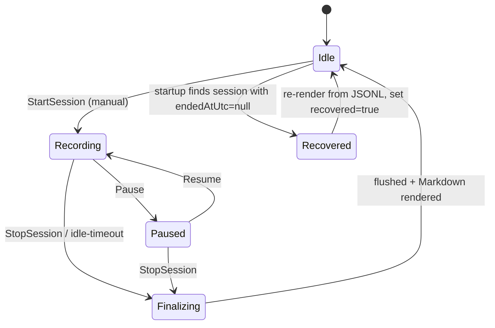
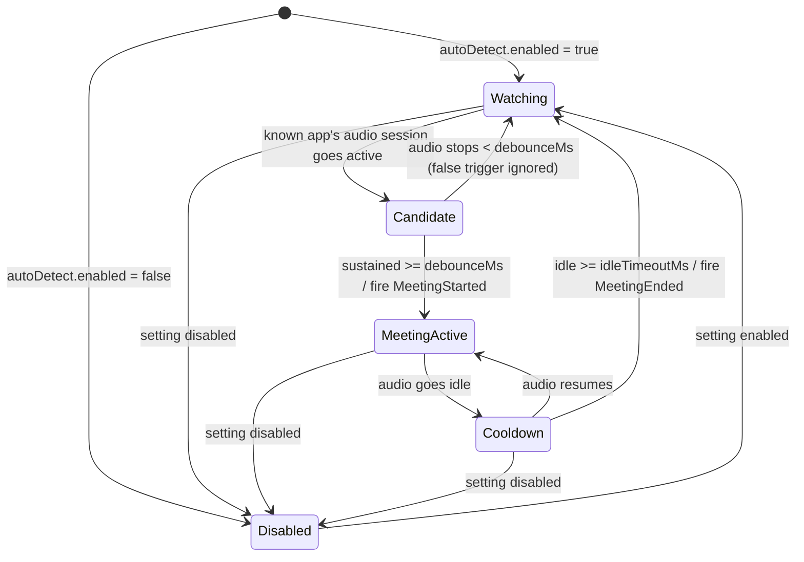

# LocalScribe — Cross-Cutting Specifications

- **Status:** Living reference (v1). Hardware-independent; consulted by all implementation
  stages. **Rev: 2026-07-02 design session** — folds in the Matter/Participants data model,
  user-owned `meta.json`, correction-only `edits.json`, custom vocabulary, `.zip`/`.docx`
  export, device-config (remote mode picker + mic pin), the recording overlay, keep-audio
  retention default, and manual-primary triggering (auto-detect deferred to a seam). Supersedes
  the 2026-06-30 design-review revision.
- **Companion to:** `docs/plans/2026-06-30-localscribe-design.md`
- **Scope note:** VAD thresholds and the model-selection defaults are *starting points* to
  validate against real meeting audio in Stage 2; everything else is contractual.

## Schema-version policy

- Every persisted JSON file carries an integer `schemaVersion` (starts at `1`). Each file
  versions **independently** — `session.json`, `meta.json`, `matter.json`, the matters index,
  `edits.json`, `speakers.json`, and `settings.json` do not share a version counter.
- Readers **reject** a file whose `schemaVersion` is higher than they understand
  (forward-incompatible) and **migrate** lower versions on load.
- JSONL lines tolerate unknown fields (forward-compatible); consumers ignore fields they
  don't recognise rather than failing.
- All 2026-07-02 and 2026-07-03 schema changes are **additive** and migrate-on-load; no field
  is repurposed or removed destructively.
- **`session.json` v1→v2 migration:** `audioRetained:true` ⇒ `retainedAudioSources` =
  the session's `sources`; `audioRetained:false` ⇒ `[]`.
- **`session.json` v2→v3 migration:** the user-owned fields move out to a synthesised
  `meta.json` (§1.4): `title` copies across (then drops from `session.json`),
  `participants = []`, `description = ""`, `medium = app`, `matterIds = []`,
  `summaryRef = null`. Migration **never fabricates identity** (2026-07-03 refinement,
  supersedes the earlier "self from settings, if any"): every Stage 4 read path passes
  `selfForMigration: null`, because who was on an old call is not something today's
  `settings.self` knows — the self participant is injected only at recording time by
  SessionBootstrap. `session.json` keeps only system-derived fields and
  gains a `devices` snapshot (§1.2/§12) defaulted to `unknown/legacy` for pre-v3 records.
- **`settings.json` v1→v2 migration:** add `self`, `overlay`, `remote`, `mic`, `audioFormat`,
  and `vocabulary` at their v2 defaults (§7); flip `autoDetect.enabled` to `false`. An
  explicitly-stored `audioRetention` is preserved as-is; only fresh installs take the new
  `keep` default (§7).
- **2026-07-03 additive bumps (Stage 4):** `meta.json` v1→v2, `matter.json` v1→v2, and the
  matters index v1→v2 each add `archived: false`; `settings.json` v2→v3 adds `privacy`
  at its default (`excludeWindowsFromCapture: true`) — `consentNotice` stays absent until
  the user accepts the first-run notice (§7). Nothing else changes.

---

## 1. Data schemas

### 1.1 `transcript.jsonl` — source of truth (append-only, immutable)

One JSON object per line, one record, in **finalization order** (not time order). Two
record kinds, discriminated by `kind`:

**Segment** (a transcribed utterance):
```json
{"seq":17,"kind":"segment","source":"Remote","startMs":85320,"endMs":89110,"text":"I pushed the auth changes last night.","speakerLabel":"Them","lang":"en","noSpeechProb":0.02}
```

**Marker** (a system event in the timeline — see §8):
```json
{"seq":40,"kind":"marker","source":"System","startMs":91000,"endMs":91000,"text":"audio device changed"}
```

| Field | Type | Notes |
|---|---|---|
| `seq` | int | 0-based, monotonic **write-order** key. Stable & immutable — diarisation keys off this. |
| `kind` | string | `segment` \| `marker`. Absent ⇒ `segment` (back-compat). |
| `source` | string | `Local` \| `Remote` (segments) \| `System` (markers). |
| `startMs`/`endMs` | int | Session-relative clock (ms). For markers, equal. |
| `text` | string | Transcribed text (trimmed) or marker message. |
| `speakerLabel` | string | Baseline display label: `Me` (Local) / `Them` (Remote). Refinable via `speakers.json`. |
| `lang` | string? | Session-locked language code (resolved once per session — §3), if available. |
| `noSpeechProb` | float? | Whisper no-speech probability, for QA/filtering. |
| `rmsDb` | float? | Segment RMS energy in dBFS at transcription time (QA field; feeds the render-layer phantom-bleed dedup — §5). Null for markers and pre-2b lines. |

> **Key design point:** `seq` is write-order (the order streams *finished* transcribing),
> **not** time order. Display order is computed from `startMs` (see §5). Keeping `seq`
> stable is what makes diarisation/renaming/corrections non-destructive.

> **Evidentiary invariant (2026-07-02):** `transcript.jsonl` is **never** rewritten,
> tombstoned, redacted, or reordered. There are **no** delete/hide/redact records anywhere
> in the model. All user changes are additive overlays (`speakers.json`, `edits.json`) keyed
> by `seq`; the machine-original text and timing are always recoverable. This preserves the
> chain-of-custody value of a privileged-call record. Records management for an accidental or
> test recording is the coarse **whole-session delete** only (never per-segment).

> **Torn-tail durability (2026-07-02):** a crash mid-append can leave a partial JSON object as
> the file's final line. Readers **tolerate** this: a line that fails to parse is skipped and
> surfaced as a malformed-line count (it is *never* rewritten or deleted — the torn bytes stay
> on disk as part of the record). Appends **self-heal line termination**: if the file does not
> end with `\n`, the writer emits a leading `\n` first, so a new record never lands on the same
> physical line as a torn tail. Recovery (§2.1) must therefore always succeed on a torn file.

### 1.2 `session.json` — system-owned metadata (mutable; rewritten on finalize and relabel)

`session.json` holds **machine-measured, system-derived** truth only. All user-asserted
metadata lives in the sibling `meta.json` (§1.4). Splitting the two removes the
background-writer-vs-user-edit race (finalize, relabel, and retention cleanup all touch
`session.json`; the user only ever edits `meta.json`) and keeps the machine-vs-human boundary
clean for evidentiary purposes.

```json
{
  "schemaVersion": 3,
  "id": "2026-07-02_1432_Webex_doe-intake",
  "app": "Webex",
  "startedAtUtc": "2026-07-02T06:32:05Z",
  "endedAtUtc": "2026-07-02T07:09:11Z",
  "timeZoneId": "Singapore Standard Time",
  "utcOffsetMinutes": 480,
  "durationMs": 2226000,
  "sources": ["Local", "Remote"],
  "model": "small.en",
  "backend": "CUDA",
  "language": "auto",
  "retainedAudioSources": ["Local", "Remote"],
  "diarised": false,
  "segmentCount": 312,
  "markerCount": 6,
  "recovered": false,
  "appVersion": "0.1.0",
  "devices": {
    "mic":    { "mode": "followDefault", "id": "{0.0.1.00000000}.{guid}", "name": "Shure MV7" },
    "remote": { "mode": "perProcess", "app": "CiscoCollabHost.exe", "fellBackToSystemMix": false }
  }
}
```

- `app` ∈ `Teams` \| `Zoom` \| `Webex` \| `Manual` \| `Browser` — the **closed system enum**;
  it is the capture-path truth that recovery/(deferred) detection key on. It is **never**
  collapsed by the user-facing `medium` field (§1.4); Webex-in-browser, phone-on-speaker, and
  in-person captures set `medium` without touching `app`.
- `endedAtUtc == null` ⇒ session is running **or crashed** — drives recovery (§2).
- `timeZoneId` (Windows time-zone ID) and `utcOffsetMinutes` (offset in force at Start,
  DST-resolved) are captured at Start so the session records **where in local time it
  happened**. The UTC instants stay authoritative; renderers derive "local" via
  `startedAtUtc + utcOffsetMinutes` (falling back to the machine's current zone only for
  pre-v3 records, where both fields are absent/null). The session **folder id** is derived
  from this local wall-clock time (§9) — in the example above, `06:32Z` at `+480` ⇒ `1432`.
- **Timestamp precision:** `*AtUtc` timestamps serialize as whole-second ISO-8601 (`...Z`);
  sub-second precision is **intentionally truncated on write**. Millisecond precision lives
  only in `durationMs` and the JSONL `startMs`/`endMs`, so `endedAtUtc − startedAtUtc` may
  disagree with `durationMs` by up to one second. Consumers must not rely on fractional
  seconds in any `*AtUtc` field.
- **`title` has moved** to `meta.json` (§1.4). It is no longer a `session.json` field.
- `devices` is the **resolved-actuals snapshot** captured at Start (§12): the mic and remote
  modes/IDs/names actually used, so a session is self-describing and reproducible. `remote`
  records whether the all-zeros/browser guard forced a system-mix fallback
  (`fellBackToSystemMix`).
- `segmentCount`/`markerCount` are system counts. Per-side **participant** counts
  (`localCount`/`remoteCount`, the 1-vs-many Split gate) are user-declared and live in
  `meta.json` (§1.4/§10).

### 1.3 `speakers.json` — diarisation + name overrides (non-destructive; absent until used)

```json
{
  "schemaVersion": 1,
  "names": { "Local:1": "Sam", "Remote:1": "Alice", "Remote:2": "Bob" },
  "assignments": {
    "Remote": { "17": "Remote:2", "19": "Remote:1" },
    "Local":  { "18": "Local:1" }
  },
  "pinned": { "Remote": ["17"] },
  "diarisedSources": ["Remote"],
  "method": "sherpa-onnx:segmentation+embedding",
  "diarisedAtUtc": "2026-06-30T15:20:00Z",
  "confidence": { "Remote:1": 0.92, "Remote:2": 0.61 }
}
```

- **Cluster key** = `"<Source>:<clusterId>"` (e.g. `Remote:2`). Clusters are numbered
  per-source, independently (Local and Remote are diarised separately — §1 of design).
- `assignments[source][seq]` maps a segment's `seq` → cluster key.
- `names[clusterKey]` maps a cluster → display name. Unnamed clusters render with the
  delivered per-side default label `{Source} Speaker N` — **1-based**, e.g. `Remote:2` defaults
  to "Remote Speaker 2" (2026-07-04, `DefaultSpeakerLabels`; supersedes the earlier generic
  `Speaker N` wording).
- **Manual pinned assignments (2026-07-02):** a per-segment "this line was actually Bob"
  reassignment writes `assignments[source][seq]` and records the `seq` under
  `pinned[source]`. Re-diarisation **preserves** pinned entries verbatim and only rewrites
  unpinned ones — one authority per field, no second speaker-resolution path. `speakers.json`
  remains the sole diarisation/speaker-name authority; **text** corrections never land here
  (they go in `edits.json`, §1.6).
- **Delivered re-diarise merge (2026-07-04, `SpeakersMerge`):** re-running diarisation on a
  source resets **every non-pinned** assignment and name for that source — pinned seqs and the
  names of the clusterKeys they point to are the only survivors; there is **no name rebinding**
  for anything else. Because a fresh run's cluster ids always restart at `0`, a fresh clusterKey
  that **collides** with a surviving pinned clusterKey is remapped to a new, unused id *before*
  the merge applies — a different speaker can therefore never inherit a pinned speaker's key or
  name. `clusterCount` (on the diarisation result, not persisted here) is simply the count of
  distinct speaker ids the fresh run produced.
- **Split-speakers dialog gating (delivered, 2026-07-04):** the dialog offers a source only
  when its declared participant count (`meta.localCount`/`remoteCount`, §1.4) is **> 1**, that
  source is in the session's `retainedAudioSources` (§1.2), **and** the session is
  finalized/recovered (a live `Recording`/`Paused` session offers nothing regardless of counts).
  A run tries the soft-prior auto cluster count first; on a count mismatch the dialog offers an
  explicit **"Use N speakers"** forced re-run to the declared count. Forcing is **suppressed**
  (a system-mix banner shows instead) when the source's leg is system-mix
  (`devices.remote.mode==systemMix` or `fellBackToSystemMix`, §1.2/§12) — forcing a cluster
  count on non-meeting/background audio could merge it into a real named speaker. Confirming
  builds one `DiarisationCommit` and persists it atomically through the single write gate
  (`MaintenanceService`).
- **Out-of-process architecture (delivered, 2026-07-04):** diarisation runs **out-of-process** —
  `LocalScribe.Diarizer.exe` owns `sherpa-onnx` and its own ONNX Runtime **1.24.4** build; the
  app's own Silero VAD stays on `Microsoft.ML.OnnxRuntime` **1.22.0**. This process isolation
  *is* the architecture, not an optimization — a same-folder copy of the two runtimes' native
  DLLs collides (identically-named `onnxruntime.dll`, incompatible versions). The app-side seam
  is `IDiarisationEngine.DiariseAsync(DiarisationRequest, IProgress<double>, CancellationToken)
  -> DiarisationResult`; this **supersedes** the master design's earlier in-process
  `DiariseAsync(segments, options)`/`SherpaOnnxDiariser` sketch. Cancellation means killing the
  helper process (and its whole process tree) — `sherpa-onnx` has no cooperative cancel.
  **Models:** `pyannote-segmentation-3.0` (MIT) for segmentation + 3D-Speaker CAM++ zh+en common
  (Apache-2.0, non-VoxCeleb) for embedding, both SHA-pinned and fetched by
  `tools/fetch-models.ps1`.
- **Diarisation error taxonomy (delivered):** a missing/unfetched model surfaces as
  `MODEL_DOWNLOAD_FAILED`; corrupt/undecodable audio as `BAD_AUDIO` (the helper's
  `FlacPcmReader` wraps decode failures); any other non-zero helper exit or unusable output as
  `HELPER_CRASH`. See §8.2 for the full error-code table.
- **No-delete firewall (delivered):** confirming a diarisation commit **never** deletes audio,
  for **any** `audioRetention` value (§7) — the `afterDiarisation` per-source delete-on-confirm
  behaviour described in §7 is specified but **not wired** in the Stage 5 delivery; Split-
  speakers stays available indefinitely regardless of the retention setting.
- **Display-name resolution** for a segment (2026-07-02, single-participant clause added):
  1. `assignments[source][seq]` → `names[clusterKey]` (or `Speaker {clusterId}`); **else**
  2. if the segment's `source` has **exactly one** declared participant in `meta.json`
     (§1.4/§10), that participant's name (no no-op diarise pass required); **else**
  3. the baseline `speakerLabel` from the JSONL line (`Me`/`Them`) — terminal fallback.
- `confidence[clusterKey]` (optional, `0.0`–`1.0`) — per-cluster diarisation confidence.
  Low confidence drives a UI "low-confidence" warning **only**; it never hard-gates — the
  structural Me/Them baseline (`speakerLabel`) is always recoverable.

### 1.4 `meta.json` — user-owned metadata (mutable; user-edited only)

New in the 2026-07-02 rev. Sibling to `session.json`; the **only** file a user's metadata
edits touch. Owns its own `schemaVersion`.

```json
{
  "schemaVersion": 2,
  "title": "Doe intake — Webex",
  "description": "Initial client interview; custody status.",
  "medium": "Webex",
  "matterIds": ["M-2026-014"],
  "participants": [
    { "id": "p-self",  "name": "Sam",         "side": "Local",  "role": "Attorney", "isSelf": true,  "clusterKey": null },
    { "id": "p-alice", "name": "Alice Client", "side": "Remote", "role": "Client",   "isSelf": false, "clusterKey": null }
  ],
  "localCount": 1,
  "remoteCount": 1,
  "archived": false,
  "summaryRef": null,
  "summaryGeneratedAtUtc": null,
  "summaryModel": null,
  "edited": false,
  "lastEditedAtUtc": null
}
```

- `title` — user-editable session name (relocated out of `session.json`). Default =
  `{app} — {startedAt local}`.
- `description` — free text.
- `medium` — **separate user-editable field**, enum
  `{Webex|Zoom|Teams|Phone|In-person|Other}`, defaulted from `session.app` at start,
  overridable. Never overwrites the closed system `app` enum (§1.2). If device-config
  resolves a remote mode, the default may derive as e.g. "Webex (per-process)", still
  overridable.
- `matterIds[]` — the many-to-many Session↔Matter tags (§1.5/§10). Empty until the user
  classifies. Recording is matter-agnostic (record first, classify later); nothing is
  required before recording.
- `participants[]` — the session participant roster, **snapshotted** into the session for
  portability (readable names survive even if a Matter roster later changes). Each entry:
  `{ id, name, side:Local|Remote, role?, isSelf?, clusterKey?:null }`. Populated by picking
  from the union of the session's Matters' rosters, or by free text; `clusterKey` is reserved
  for a later participant↔cluster link and is `null` in v1. `isSelf:true` marks the Local
  "Me", auto-filled from `settings.self` at start (§7).
- `localCount`/`remoteCount` — declared participants-per-side (default `1`/`1`, lawyer +
  client). Gate/seed **Split-speakers** only; they never drive VAD (§4/§10). `1` on a side ⇒
  Split hidden/disabled + the single declared participant used as the display label (§1.3);
  many ⇒ Split enabled, count seeds cluster-K as a soft prior. The delivered gate additionally
  requires the source's audio to be retained and the session finalized before Split is offered
  (§1.3).
- `summaryRef`/`summaryGeneratedAtUtc`/`summaryModel` — nullable pointer stub for a future
  `summary.md`. AI summarisation is a **locked Non-goal** in v1: reserve the pointer and the
  filename, generate nothing.
- `edited`/`lastEditedAtUtc` — flag that a **transcript-content edit** — a text correction
  (§1.6) or a pinned speaker reassignment (§1.3) — has occurred, for UI/audit display.
  (2026-07-03 refinement, supersedes "any user edit": plain metadata edits — title,
  description, medium, matter tags, participants, counts, archived — do **not** flip these
  flags; `EditStore.MarkEditedAsync` remains their only writer.)
- `archived` — v2 (2026-07-03, additive): hides the session from default list views behind a
  "show archived" toggle. Organizational only — nothing leaves disk, no content is affected.

### 1.5 `matter.json` + matters index — the Matter entity

New in the 2026-07-02 rev. A **Matter** is the legal-case grouping. Session↔Matter is
**many-to-many** via `meta.matterIds[]` (a session can be tagged with several matters; a
matter aggregates many sessions). Assignment is post-hoc and editable.

`matters/<matterId>/matter.json`:
```json
{
  "schemaVersion": 2,
  "id": "M-2026-014",
  "name": "Doe v. State",
  "reference": "CR-2026-014",
  "description": "Custody / bail proceedings.",
  "dateCreatedUtc": "2026-07-01T09:00:00Z",
  "archived": false,
  "roster": [
    { "id": "p-self",  "name": "Sam",          "role": "Attorney" },
    { "id": "p-alice", "name": "Alice Client",  "role": "Client" }
  ],
  "vocabulary": { "terms": [], "corrections": {} }
}
```

- `roster[]` — the **Matter-scoped reusable participant roster** (source of truth for names).
  Session participants are picked from the union of the session's Matters' rosters; adding a
  participant inline during a session creates the person in the Matter roster. This is
  **name-metadata reuse**, not acoustic cross-session voiceprinting (still a Non-goal) — no
  audio embeddings are shared across sessions.
- `vocabulary` — the per-Matter term list + heard→correct map (§10). Ties custom vocabulary
  to the Matter (client / opposing-counsel names, case jargon).
- `archived` (matter.json v2 + index v2, 2026-07-03, additive): archived matters leave the
  default matter list and pickers behind a "show archived" toggle; archiving a matter never
  cascades to its sessions, and existing tags keep rendering normally.

Matters index — `matters/matters.json` (for listing without opening every folder):
```json
{
  "schemaVersion": 2,
  "matters": [
    { "id": "M-2026-014", "name": "Doe v. State", "reference": "CR-2026-014", "sessionCount": 3, "archived": false }
  ]
}
```

### 1.6 `edits.json` — text corrections + splits overlay (non-destructive; absent until used)

New in the 2026-07-02 rev; extended 2026-07-07 (transcript editor overhaul) with the `splits`
overlay. A structural twin of `speakers.json`, keyed by the immutable `seq`. Owns its own
`schemaVersion`. Editing is permitted only on **finalized/recovered** sessions, never a live
`Recording`/`Paused` one.

```json
{
  "schemaVersion": 1,
  "corrections": {
    "17": { "text": "I pushed the OAuth changes last night.", "editedAtUtc": "2026-07-02T15:20:00Z" },
    "23": { "text": "The arraignment is on Thursday.",         "editedAtUtc": "2026-07-02T15:21:40Z" }
  },
  "splits": {
    "31": {
      "source": "Remote",
      "editedAtUtc": "2026-07-07T09:12:00Z",
      "parts": [
        { "text": "I pushed the OAuth changes last night.", "startMs": 118400, "derivedStart": false },
        { "text": "Can we review them before standup?", "startMs": 121100, "derivedStart": true,
          "speakerClusterKey": "Remote:2" }
      ]
    }
  }
}
```

- **Corrections.** `edits.json.corrections` records **in-place text corrections** of
  mis-transcriptions, keyed by `seq`. There are **no** tombstone / hide / delete / redact
  records — none exist anywhere in the model (§1.1 evidentiary invariant). Correcting text
  never mutates the JSONL; the machine-original stays recoverable as the audit trail.
- **Speaker** corrections for a whole section do not live here — a per-segment speaker
  reassignment writes a pinned assignment in `speakers.json` (§1.3). One authority per field.
  A split child's speaker is the one exception (below).
- **Edit-survival:** because corrections and splits key off `seq`, they survive re-diarise /
  relabel / cluster-count change / crash-recovery for free. A **full re-transcription** (which
  renumbers `seq`) warns-and-confirms before discarding text corrections and splits; fuzzy
  carry-over across re-transcription is YAGNI.

**`splits` overlay (2026-07-07, transcript editor overhaul).** A split **partitions** one
machine JSONL segment into `>= 2` human-authored children, keyed by the original `seq`. It
never mutates or removes the JSONL line — the original stays the recoverable revert floor.
Cross-segment/cross-speaker **merge**, **insert**, and **reorder** stay out of scope (they
fight `seq` immutability and the per-source structural model); the only merge is a split
revert (below), which is not a general merge operation.

- **Schema.** `splits[seq] = { source, editedAtUtc, parts: [{ text, startMs, derivedStart,
  speakerParticipantId?, speakerClusterKey? }, ...] }`. `parts` is in display order.
- **`parts.length >= 2`** — a 1-part "split" is meaningless and rejected.
- **First part inherits the machine start:** `parts[0].startMs == originalLine.StartMs` and
  `parts[0].derivedStart == false`; only later boundaries are human-derived.
- **Monotonic, in-range boundaries:** `parts[i>=1].startMs` is strictly increasing and falls
  within `(originalLine.StartMs, originalLine.EndMs]`, with `parts[i>=1].derivedStart == true`.
  Stored as full milliseconds; the editor UI constrains new/edited boundaries to 10 ms steps
  (§1.7).
- **Non-blank children.** Every `part.text` is non-empty/non-whitespace — the same "a
  correction must correct, never blank content" rule as plain corrections. Content is
  partitioned, never removed.
- **Split-child speaker (optional).** At most one of `speakerParticipantId` /
  `speakerClusterKey` is set per part; `null` on both means the child inherits the seq's
  normally-resolved speaker. This is the **one** exception to "speaker lives in
  `speakers.json`" (above) — keeping it here avoids composite `"<seq>.1"` keys rippling
  through `speakers.json`'s `Pinned`/`Assignments`/`NameResolver` tiers. Whole-section speaker
  changes still route through the `speakers.json` pin path unchanged.
- **Split target** must be an existing JSONL **segment** of the named `source` (not a marker),
  same existence/source check as a text correction.
- **Correction/split precedence.** A split **supersedes** a plain correction on the same
  `seq`: creating a split **removes** any `corrections[seq]` entry (its text is absorbed into
  `parts`) so display text has one source of truth.
- **Revert.** Removing `splits[seq]` restores the single original machine segment. Revert does
  **not** resurrect a prior correction — the machine floor (JSONL) is the sole revert target,
  never a stale overlay.
- **Derived-timestamp flagging.** Every `part.derivedStart == true` boundary is a **human
  estimate**, not a machine timestamp; it is visibly flagged wherever shown (editor field,
  badges) and never presented as if it came from the transcription/VAD pipeline.

### 1.7 Edit mode — Read⇄Edit toggle in the read view (UI)

New in the 2026-07-07 rev (transcript editor overhaul). Edit mode is a **mode of the existing
read-view window**, not a new window — it reuses the window's playback transport, placement/
registry lifecycle, and scroll-preserving reload. A `Read ⇄ Edit` toggle in the header swaps the
read-only list for an editable table; leaving Edit (or Save/Cancel) returns to the read list at
the same scroll offset. The Stage 6.1 row context menu ("Correct text…", "Reassign speaker…",
"Remove speaker pin…") stays the quick single-row path in Read mode — both write the same
overlays, so they compose. The toggle is disabled when the session is not finalized/recovered
(§1.6's editing gate).

- **Table.** Columns **Speaker \| Time \| Text**; rows are merged sections by default, matching
  the read view.
- **Expand-on-edit.** Clicking a row expands it to its constituent JSONL segments as atomic
  sub-rows, each with an editable text box, an assign-only speaker dropdown, and its own start
  stamp. All edit state (which section is expanded, each child's in-progress text/speaker)
  lives on the row/segment view-models, not the visual container, so virtualized-list container
  recycling simply re-binds `DataContext` and the correct state follows the item. Child
  sub-row view-models are materialized only while a section is being edited, so an idle
  multi-hour transcript pays nothing extra.
- **Mid-segment split.** With the caret inside a segment sub-row's text box, **Enter** splits at
  the caret: the text partitions there, the first child keeps the machine start, and the new
  child's start is estimated from the caret's character offset across the segment's
  `[start, end]`, rounded to 10 ms (`derivedStart = true`, §1.6). Enter at the very start or end
  of the text (which would produce an empty child) is a no-op — the non-blank-child invariant
  forbids it. Splitting an already-split child partitions that part further. The derived time
  renders in a field **editable in 10 ms steps**, visibly flagged as estimated; the user may
  nudge it directly or scrub the window's playback transport to the moment and set it there.
  Full milliseconds are stored. A split child offers "merge back", which removes the split
  overlay and restores the single machine segment (§1.6 revert) — the only merge; there is no
  cross-segment or cross-speaker manual merge.
- **Speaker assignment.** The per-row dropdown is **assign-only** (no roster CRUD), populated
  from the current roster. Choosing a name for a whole section pins/reassigns via the existing
  `speakers.json` pin path (§1.3); choosing a name for a split child writes
  `part.speakerParticipantId`/`speakerClusterKey` (§1.6) instead — two channels by design, never
  merged. A **"Manage speakers…"** button opens Session Details for full roster edits.
- **Live roster sync.** A roster-changed notification, raised when Session Details saves a
  roster change for the open session, re-populates the dropdown and re-resolves displayed names
  in place — no reopen, no manual refresh required.
- **Save / cancel.** Edit mode accumulates a batch (text corrections on unsplit segments, split
  overlays with their parts and any child speakers, whole-section pins) and commits it in one
  pass, then does one projection regen and a scroll-preserving reload. Cancel discards the
  in-memory batch — nothing is written. A no-op batch writes nothing and does not flip
  `meta.Edited` (same rule as plain corrections, §1.6).
- **Long sessions.** Timestamps render `h:mm:ss` past an hour (§ Markdown render spec, §6). The
  edit table stays UI-virtualized; because edit state lives on the view-model (not the visual
  tree), recycling is safe and a multi-hour, few-thousand-segment session realizes only the
  on-screen rows plus child view-models for the one actively-edited section.
- **Out of scope (unchanged):** a standalone editor window; rich text/formatting; always-flat
  one-segment-per-row display (read view still merges); cross-segment/cross-speaker merge;
  segment insert/reorder; per-word timestamps/forced alignment; full roster CRUD in the editor;
  per-keystroke disk writes.

### 1.8 Custom-vocabulary store

New in the 2026-07-02 rev. Two layers, both `{ terms:[], corrections:{} }`:

- **Global** legal dictionary — lives in `settings.json` under `vocabulary` (§7).
- **Per-Matter** term list — lives in `matter.json` under `vocabulary` (§1.5).

The effective vocabulary for a session = **global ∪ matters(session)**. See §10 for the two
consumption paths (whisper.cpp initial-prompt bias + deterministic projection-layer
heard→correct pass) and the projection ordering (§6).

---

## 2. State machines

### 2.1 Session lifecycle



- **Finalizing → "flushed"** means the VAD residual is drained (the in-progress padded
  utterance force-emitted — §4) **and** the write queue is drained.
- The session clock keeps ticking through **Pause**/sleep: `durationMs = endedAt −
  startedAt`; the `paused`/`resumed`/`sleep` markers annotate the gap. (Because Pause stops
  capture, a lawyer can pause for a privileged sidebar and nothing is transcribed — the model
  already protects privilege.)
- **Recording overlay show/hide (2026-07-02):** the always-on-top overlay (§ overlay in
  design; content per below) is **visible only in `Recording`/`Paused`** and hidden in
  `Idle`/`Finalizing`/`Recovered`. It supplements — never replaces — the tray icon, which
  stays the load-bearing consent indicator. All three surfaces (tray, overlay, live view) bind
  one `SessionViewModel` and route Pause/Stop to the same `SessionManager`. Overlay content is
  a minimal pill: state dot + elapsed timer + Local/Remote "audio present" two-bar indicator +
  Pause/Stop; **session name/participants are suppressed by default** (opt-in, tooltip-only)
  so privileged matter never renders on a shared/always-on-top surface. Start stays on
  tray/main/hotkey. Screen-share visibility is governed by `overlay.excludeFromCapture`
  (§7/§12): default **excluded** from capture (`WDA_EXCLUDEFROMCAPTURE`) for a clean share.

### 2.2 Meeting detector — DEFERRED in v1 (interface seam only)

**Status (2026-07-02): DEFERRED out of the v1 contract.** Manual Start/Stop/Pause is the
**primary and only** v1 trigger. v1 ships an `IMeetingDetector` interface **seam** only — no
detector implementation is on the critical path, and `settings.autoDetect.enabled` defaults to
**`false`** (§7). Auto-detection is a fast-follow (Teams all-zeros and browser shared-Chromium
make it unreliable enough to keep off the v1 consent path). The state machine below is retained
as the **design of the deferred feature**, not a v1 deliverable.



Detector timing defaults: `debounceMs = 2000`, `idleTimeoutMs = 15000`. Manual
Start/Stop bypass the detector entirely and drive the session machine directly. In v1 the
machine starts in **`Disabled`** (default `autoDetect.enabled = false`).

- **Single-session (v1):** a second known app going active while `MeetingActive` does
  **not** start a concurrent session — the second `MeetingStarted` is ignored (surface a
  tray hint). The `session.json` `app` enum stays closed (§1.2).
- **User-suppressed edge:** a manual Stop wins for the rest of a continuous-audio
  session — the detector won't auto-retrigger `MeetingStarted` until the audio idles past
  `idleTimeoutMs`.

---

## 3. Model-selection table

Probe backends in order **CUDA → Vulkan → CPU**; pick the model for the matched tier;
honour an explicit user override. Two streams run concurrently against near-real-time.

| Detected hardware | Backend | Default model | Adaptation |
|---|---|---|---|
| NVIDIA ≥ 8 GB VRAM | CUDA | `small.en` (opt-in `large-v3`) | comfortable on both streams |
| NVIDIA 4–6 GB VRAM | CUDA | `small.en` | `medium` if headroom; VRAM-OOM → `base.en` |
| AMD/Intel iGPU | Vulkan | `base.en` → `small.en` | measure RTF; downgrade if sustained > 1 |
| CPU only | CPU | `base.en` (`small.en` if ≥ 8 fast cores) | quantized; expect lag on two streams |
| NPU (future) | DirectML/QNN | `base`/`small` | optional backend, post-v1 |

- **Quantization:** `q5_1`/`q8_0` ggml weights on CPU/iGPU; `fp16` on CUDA.
- **`.en` models** default whenever `language` is `en` or `auto` resolves to English;
  multilingual weights otherwise.
- **Auto-downgrade triggers:** `VRAM_OOM`, or sustained `RTF > 1` (growing queue) → drop
  one model step and write a `transcription lagging` marker + log.
- **Language resolution (auto):** probe-then-commit **per session** — transcribe the first
  ~2–3 utterances on a multilingual model, detect and **lock** the session language, then
  switch to matching `.en` weights only if detected == `en`; persist the resolved code to
  `session.json`. Each segment's `lang` records the session-locked language (no per-chunk
  re-detection); mid-meeting language switching is unsupported in v1 (Non-goal).
- **Initial-prompt bias:** the curated custom-vocabulary shortlist (§10) is fed to whisper.cpp
  as an initial prompt at model start, bounded to ~200 tokens.

---

## 4. VAD parameters (Silero) — *starting defaults, tune in Stage 2*

| Param | Default | Rationale |
|---|---|---|
| `threshold` | 0.5 | Silero default speech probability; raise in noisy rooms. |
| `minSpeechMs` | 250 | Drop blips shorter than this. |
| `minSilenceMs` | 500 | Trailing silence that *ends* an utterance (latency vs over-segmentation). |
| `speechPadMs` | 150 | Pad both sides so words aren't clipped. |
| `maxSegmentMs` | 15000 | Force-cut long monologues to keep latency + memory bounded. |
| `windowSizeSamples` | 512 | Silero frame @ 16 kHz. |
| `sampleRate` | 16000 | Matches the capture target. |

Behaviour: runs **per source, independently**, and is **speaker-count-agnostic** — the
declared 1-vs-many participant counts (§1.4/§10) never touch VAD. Emits an `AudioSegment
{source, startMs, endMs, pcm}` when `minSilenceMs` of sub-threshold audio follows speech,
**or** `maxSegmentMs` is reached (cut at the last dip if possible, else hard cut), **or** the
in-progress padded utterance is **force-emitted (flushed)** on Stop / Pause / idle-timeout
/ end-of-stream (EOF). `startMs`/`endMs` come from the session clock at padded speech
onset/offset.

---

## 5. Merge spec

- **Display order:** sort all segments by `startMs` ascending; tie-break `source`
  (`Local` before `Remote`), then `seq`.
- **Markers** sort into the timeline by their `startMs` like any record.
- **Live view:** an observable ordered collection; each finalized record is inserted at
  its sorted position (it may land *behind* the newest, because the other stream's
  earlier utterance can finalize later — expected and fine).
- **Overlap:** simultaneous speech produces two segments with overlapping `[startMs,
  endMs]` on different sources. **Both are kept**, rendered in start-time order — this is
  the desired behaviour (both halves transcribed). No overlap merging/dropping. A
  non-destructive **render-layer dedup** MAY hide a `Local` segment that closely matches a
  near-simultaneous lower-energy `Remote` segment (phantom bleed) while the JSONL keeps
  both; genuine overlap (distinct words, comparable energy) is never suppressed.
- **Source of truth vs view:** `transcript.jsonl` stays in write/`seq` order; the merge
  is a *render-time* computation from `startMs`. External consumers sort by `startMs`.
- **`startMs` derivation:** sample-counted from a per-stream start anchor on the shared
  session clock plus one calibrated mic↔loopback offset constant (measured once); the
  `AudioFrame`/JSONL contract is unchanged.

---

## 6. Markdown render spec (`transcript.md`, a projection)

```markdown
# Weekly Sync — Microsoft Teams
Teams · 2026-06-30 14:32 · 37 min · small.en/CUDA

**[00:01] Sam:** Morning everyone — shall we start with the roadmap? Quick recap first.
**[00:21] Alice:** Sure. I pushed the auth changes last night.
_[audio device changed]_
**[00:38] Bob:** Question on the token refresh…
```

- **Header:** `# {title}` then `{app} · {startedAt local} · {durationMin} min · {model}/{backend}`.
  `{title}` reads from `meta.json` (§1.4).
- **Segment line:** `**[ts] {DisplayName}:** {text}` where `ts` = `mm:ss` (or `h:mm:ss`
  ≥ 1 h) from `startMs`; `DisplayName` resolved per §1.3 (including the single-declared-
  participant clause); `{text}` is the **projected** text (§ apply-order below), not raw JSONL.
- **Speaker grouping:** consecutive segments with the **same** `DisplayName` merge into one
  paragraph — first line keeps the `[ts] Name:` prefix, following same-speaker lines are
  space-joined as continuation — until the speaker changes.
- **Markers:** italic standalone line `_[message]_`.
- **Timestamps:** relative to session start by default (`settings.timestamps`).

### 6.1 Projection apply-order (canonical)

Every projection — live view, `transcript.md`, `transcript.txt`, and the `.docx` export
(§11) — renders from `jsonl + speakers.json + edits.json + vocabulary` in this fixed order.
There are no tombstones to drop (none exist — §1.1/§1.6):

1. **Load** `transcript.jsonl` (segments + markers) into `seq` order.
2. **Vocabulary heard→correct pass** — apply the deterministic effective-vocabulary
   `corrections` map (§1.8/§10) to each segment's text.
3. **Text corrections / split expansion** — if `splits[seq]` exists (§1.6), emit **one
   segment per part** instead of one for the line (`Text = part.text`, `StartMs = part.startMs`,
   `EndMs = nextPart.startMs ?? originalLine.EndMs`), each carrying the shared machine
   original for reference/revert; a split **supersedes** a plain correction on the same `seq`
   (§1.6). Otherwise, overlay `edits.json[seq].text` for any corrected segment, using it
   **verbatim** and superseding the vocabulary result (a human correction always wins over the
   automatic pass; user intent wins).
4. **Render-layer dedup** — optionally hide phantom-bleed segments (§5). A human
   correction/keep **or a split child** beats the auto dedup-hide — split children are always
   exempt from dedup-hide (they are explicit human structure, never a phantom duplicate).
5. **Name resolution** — resolve each segment's `DisplayName` via §1.3
   (assignment→names → single-declared-participant → baseline Me/Them); a split child with a
   `speakerParticipantId`/`speakerClusterKey` override (§1.6) resolves that first, else falls
   back to the seq's normal resolution tiers.
6. **Grouping** — merge consecutive same-`DisplayName` segments into paragraphs. Split
   children of the same speaker with a sub-`gapMs` boundary can re-merge into one paragraph
   here in read-only projections — expected and harmless; the Edit-mode table (§1.7) always
   shows them expanded regardless of grouping.

QA fields (`noSpeechProb`, diarisation confidence) are never surfaced in any projection.
Diarisation (§1.3, delivered Stage 5) writes speaker names/assignments into `speakers.json`
only — it introduces no new projection step; a diarised session renders through this same
apply-order, step 5 just resolving to diarised names instead of the Me/Them baseline.

Every rendered segment carries `IsSplitChild`/`PartIndex` flags (set only for split parts) so
downstream consumers can address, badge, or re-split a child; a grouped display row exposes
`HasSplit` (any constituent segment is a split child) alongside the existing
`HasCorrection`/`HasPin`. Renderers that don't know about splits ignore the new fields —
un-split sessions render byte-identical to before this overlay existed. Everything downstream
of step 3 (dedup, grouping, sort, and export via the shared projection loader) consumes the
same segment/row shape unchanged, so split children section, render, jump, and export with no
per-consumer changes.

### 6.2 Neutral readable projection (`session.txt`)

Every session folder **always** also contains a plain-text `session.txt` so the folder opens
in Notepad + a media player with no LocalScribe app present (portability / evidentiary
hand-off). It carries the human-readable metadata block — session name, matter(s), participants,
date/time, medium, description, and summary (if present). **Participant names render from
the session's own `meta.json` snapshot** (§1.4/§10) — never resolved live from Matter
rosters — so a later roster rename cannot silently alter an old privileged record
(2026-07-03 refinement; supersedes the earlier "resolved live from the current rosters"
wording, and applies to every projection: list, read view, `session.txt`). Matter
**names/references** are the one live resolution: `session.txt` renders "Name (Reference)"
from the matter store at render time, and a Matter rename triggers a background projection
re-render of that matter's tagged sessions. The precise JSON layers
(`session.json`/`meta.json`/`edits.json`/`speakers.json`) remain the app's internal truth;
`session.txt` and `transcript.md`/`.txt` are the neutral projections. See §9 for the folder
layout.

---

## 7. Settings schema (`settings.json`, in `%APPDATA%/LocalScribe`)

```json
{
  "schemaVersion": 3,
  "storageRoot": "%USERPROFILE%/LocalScribe",
  "audioRetention": "keep",
  "audioFormat": "flac",
  "self": { "name": "", "role": null },
  "model": "auto",
  "backend": "auto",
  "language": "auto",
  "remote": { "mode": "auto", "app": null },
  "mic": { "mode": "followDefault", "id": null, "name": null },
  "autoDetect": { "enabled": false, "apps": ["Teams", "Zoom", "Webex"] },
  "overlay": { "enabled": true, "showSessionName": false, "showLevelMeter": true, "excludeFromCapture": true },
  "vocabulary": { "terms": [], "corrections": {} },
  "hotkeys": { "startStop": "Ctrl+Alt+R", "pause": "Ctrl+Alt+P" },
  "timestamps": "relative",
  "docxFooterText": "PRIVILEGED & CONFIDENTIAL",
  "recordingIndicator": true,
  "launchAtLogin": true,
  "logging": { "level": "info", "includeTranscriptText": false },
  "privacy": { "excludeWindowsFromCapture": true },
  "consentNotice": null
}
```

| Key | Values |
|---|---|
| `storageRoot` | absolute path; default `%USERPROFILE%/LocalScribe`. Warn if it resolves under a known sync provider (OneDrive/Dropbox/Google Drive). |
| `audioRetention` | `keep` \| `afterDiarisation` \| `days:N` \| `forever` \| `never` (default **`keep`** — never auto-delete). `keep` is the canonical never-auto-delete value (`forever` retained as a legacy synonym). Auto-delete is now an explicit opt-in. `afterDiarisation` is **per-source**, triggered on speaker-map confirm/lock — deletes only that source's audio; Split-speakers stays available indefinitely under `keep`. **Not wired as of Stage 5 (2026-07-04):** the delivered diarise-commit path (`MaintenanceService.SaveDiarisationAsync`, §1.3) performs **no** audio deletion for **any** retention value, including `afterDiarisation` — that seam remains unimplemented; a confirmed split never removes audio regardless of this setting. The Stage 4 settings UI shows the effective policy **read-only** ("Keep everything" by default; a migrated `never`/`days:N`/`afterDiarisation` value renders as its own text); the auto-delete opt-ins are deliberately not exposed in any UI (never-propose-audio-auto-deletion decision, 2026-07-03). |
| `audioFormat` | `flac` \| `wav` (default **`flac`** — neutral, ~half the size of WAV). `wav` for max compatibility. |
| `self` | `{ name, role? }` — the user's self-identity; **snapshotted** into each session's Local `isSelf` participant at Start (not a live reference), editable per session. |
| `model` | `auto` \| `tiny` \| `base` \| `small` \| `medium` \| `large-v3` (+ `.en` variants) |
| `backend` | `auto` \| `cuda` \| `vulkan` \| `cpu` |
| `language` | `auto` \| ISO code (`en`, …) |
| `remote` | `{ mode: auto\|perProcess\|systemMix, app? }` — the Remote **app/mode picker** (one logical stream), see §12. `auto` = the Stage-1 policy (scan → per-process → all-zeros/browser auto-fallback to system-mix, warned). |
| `mic` | `{ mode: followDefault\|pinned, id?, name? }` — follow the Communications default, or pin a device by ID (+ friendly name), see §12. |
| `autoDetect` | `{ enabled: bool, apps: [...] }` — **default `enabled:false`**; auto-detect is deferred to a seam (§2.2). |
| `overlay` | `{ enabled, showSessionName, showLevelMeter, excludeFromCapture }` — recording overlay prefs. Defaults `enabled:true`, `showSessionName:false`, `showLevelMeter:true`, `excludeFromCapture:true` (excluded from screen-share). Volatile x/y + monitor id live in a throwaway `window-state.json`, clamped into the virtual screen on load. |
| `vocabulary` | `{ terms:[], corrections:{} }` — the **global** custom vocabulary (bias terms + heard→correct map), see §10. |
| `timestamps` | `relative` \| `wallclock` |
| `docxFooterText` | string; default **`"PRIVILEGED & CONFIDENTIAL"`** — per-page footer stamped into exported `.docx` transcripts (§11.2). v3, additive (no schema bump — the `sectionGapMs` precedent). |
| `recordingIndicator` | `true` \| `false` — governs the **tray** consent indicator (not the overlay). |
| `launchAtLogin` | `true` \| `false` (default `true`) — run LocalScribe at user login. |
| `logging` | `{ level: error\|warn\|info\|debug, includeTranscriptText: bool }` — defaults `info` / `false`. |
| `hotkeys` | Retained in the schema but **unwired and not exposed in any UI** — global hotkeys dropped 2026-07-03 (defaults collide with Webex's global Ctrl+Alt+P and Teams/Webex in-app Ctrl+Alt+R; see Stage 4 design 1.1). |
| `privacy` | `{ excludeWindowsFromCapture: bool }` (default `true`) — v3, additive. Applies `WDA_EXCLUDEFROMCAPTURE` to all transcript-bearing windows (main window, read views, live view); the overlay keeps its own `overlay.excludeFromCapture`. |
| `consentNotice` | `null`/absent \| `{ acknowledgedAtUtc, appVersion }` — v3, additive. First-run consent acknowledgment; absent means the consent notice shows at next launch. Acceptance never re-gates Record (manual-only start remains the consent posture). |

- **v1→v2 migration** (also §Schema-version policy): add `self`/`overlay`/`remote`/`mic`/
  `audioFormat`/`vocabulary` at the defaults above and set `autoDetect.enabled:false`. A
  previously stored explicit `audioRetention` value is **preserved**; only fresh installs take
  the new `keep` default (an existing `days:30` from v1 is not silently flipped).
- **v2→v3 migration (2026-07-03):** additive only — add `privacy` at its default
  (`excludeWindowsFromCapture: true`); `consentNotice` stays absent until the user accepts
  the first-run notice. An explicitly stored `audioRetention` value remains preserved as-is.

---

## 8. Error & marker taxonomy

### 8.1 In-transcript markers (JSONL `kind:"marker"`, `source:"System"`)

| Message | Emitted when |
|---|---|
| `audio device changed` | Default device hot-swapped mid-session (rebind, follow-default mode only). |
| `paused: system sleep` / `resumed` | System sleep/resume during a live session. |
| `paused by user` / `resumed` | Manual pause/resume. |
| `degraded: system-audio loopback` | Per-process loopback unavailable **or** the all-zeros/browser guard fired → full-system-mix fallback (§12). Never a silent-empty remote. |
| `pinned microphone unavailable → default` | A pinned mic vanished; fell back to the Communications default (never a silent rebind of a pin — §12). |
| `transcription lagging` | Sustained RTF > 1 (queue growing); paired with auto-downgrade. |
| `recovered session` | Transcript reconstructed after a crash. |

### 8.2 Error codes (logged + surfaced in UI; not in the transcript)

| Code | Severity | Recovery |
|---|---|---|
| `MIC_PERMISSION_DENIED` | error | Prompt to enable mic in Windows Settings. |
| `LOOPBACK_ACTIVATION_FAILED` | error | Retry; else fall back to system loopback (marker). |
| `MODEL_DOWNLOAD_FAILED` | error | Retry with backoff; offer manual model path. |
| `SILENT_SOURCE` | warn | Pre-flight peak probe near-zero on a source (§12) → warn + suggest fix before committing to record. |
| `VRAM_OOM` | warn | Auto-downgrade one model step; continue. |
| `DISK_FULL` | warn | Stop retaining audio; keep transcript; warn. |
| `DEVICE_LOST` | warn | Follow-default: rebind to new default device (marker). **Pinned:** do not rebind — fall back to default + `pinned microphone unavailable → default` marker (§12). |
| `BACKEND_INIT_FAILED` | warn | Cascade CUDA → Vulkan → CPU. |
| `BAD_AUDIO` | error | Diarisation-specific (delivered Stage 5, §1.3): the helper's `FlacPcmReader` could not decode the selected leg. Surface the error; the source's leg and transcript are untouched (no-delete firewall, §1.3). |
| `HELPER_CRASH` | error | Diarisation-specific (delivered Stage 5, §1.3): `LocalScribe.Diarizer.exe` exited non-zero or produced no usable result (including a missing/not-yet-published exe, §12/README). Nothing is written; retry after fixing the cause. |

Each error carries `{ code, severity, userMessage, recoveryAction }`.

---

## 9. Storage folder layout

`storageRoot` (default `%USERPROFILE%/LocalScribe`) holds sessions and matters. A **session
folder is self-contained** — audio + precise JSON truth + neutral readable projections — so it
zips and hands off cleanly and opens in Notepad + a media player with no app installed.

```
LocalScribe/
├─ sessions/
│  └─ 2026-07-02_1432_Webex_doe-intake/
│     ├─ session.json          # system-owned truth (§1.2)
│     ├─ meta.json             # user-owned metadata (§1.4)
│     ├─ transcript.jsonl      # immutable source of truth (§1.1)
│     ├─ edits.json            # text corrections + splits overlay (§1.6; absent until used)
│     ├─ speakers.json         # diarisation + names + pins (§1.3; absent until used)
│     ├─ summary.md            # reserved; absent until generated (Non-goal in v1)
│     ├─ session.txt           # neutral readable metadata projection (§6.2)
│     ├─ transcript.md         # readable transcript projection (§6)
│     ├─ transcript.txt        # plain-text transcript projection (§6)
│     ├─ local.flac            # retained Local audio (format per settings.audioFormat)
│     └─ remote.flac           # retained Remote audio (one logical remote stream)
└─ matters/
   ├─ matters.json             # matters index for listing (§1.5)
   └─ M-2026-014/
      └─ matter.json           # Matter entity + roster + per-Matter vocabulary (§1.5)
```

- **Session folder id** = `yyyy-MM-dd_HHmm_{App}_{slug}`, formatted with the **invariant
  culture** from the **local wall-clock start time** (the session's `utcOffsetMinutes` applied
  to `startedAtUtc` — §1.2), so folder names match how the user remembers the meeting. The
  slug is lowercase ASCII, runs of non-alphanumerics collapsed to single `-`, `session` when
  empty. **Collisions** (same minute, app, and slug — e.g. stop/re-start within a minute) get
  a numeric suffix: `…doe-intake`, `…doe-intake-2`, `…doe-intake-3`.
- Audio files use the `settings.audioFormat` extension (`flac` default, `wav` optional).
- `session.txt`, `transcript.md`, and `transcript.txt` are **always** written on finalize (and
  re-rendered on relabel/diarise/correct/recover) so a folder is readable without the app.
- Matters live under `matters/`; Session↔Matter linkage is the many-to-many `meta.matterIds[]`
  (§1.4). A session folder never physically nests under a matter (a session may belong to
  several matters).

---

## 10. Participants & Matter data model

The name/identity model has three cooperating layers; each owns exactly one concern:

- **Matter roster** (`matter.json.roster`, §1.5) — the durable, reusable **source of truth for
  names**, scoped to a legal case. Reuse is metadata only (not acoustic).
- **Session participants** (`meta.json.participants`, §1.4) — a **snapshot** of who was on a
  given session, tagged `Local`/`Remote`, taken from the union of the session's Matters'
  rosters or free text. Snapshotting keeps old privileged records stable if a roster later
  changes.
- **`speakers.json` clusters** (§1.3) — the **diarisation** name authority. A participant may
  later link to a cluster via the reserved `clusterKey` (null in v1).

Behaviour:

- **Matter↔Session is many-to-many (tagging).** Recording is matter-agnostic — record first,
  classify later; nothing is required before Start. Assignment (`meta.matterIds[]`) is post-hoc
  and editable.
- **Session participant entry** = `{ id, name, side:Local|Remote, role?, isSelf?,
  clusterKey?:null }`. Pick from the roster union (dropdown) or free-type an unknown caller
  (rename later). Adding a participant inline creates the person in the Matter roster. The
  Local `isSelf` participant auto-fills from `settings.self` (§7), snapshotted per session.
- **1-vs-many gates/seeds Split-speakers only** (`localCount`/`remoteCount`, §1.4). It never
  drives VAD (§4). `1` on a side ⇒ Split hidden/disabled + the single declared participant is
  used as the display label with **no no-op diarise pass** (§1.3); `many` ⇒ Split enabled and
  the declared count seeds the diarisation cluster-K as a soft prior. Defaults `Local=1`,
  `Remote=1` (lawyer + client), both switchable.
- **Diarisation stays strictly on-demand** — the count flag only surfaces the Split affordance
  (optionally a one-time post-session "diarise now?" nudge); a multi-person side never
  auto-runs diarisation (honours the batch-diarisation decision + the live-diarisation
  Non-goal).
- **Per-segment speaker reassignment** is a pinned `speakers.json` assignment (§1.3), not an
  `edits.json` record.

### 10.1 Custom vocabulary

Two layers (§1.8): a **global** legal dictionary (`settings.json.vocabulary`) layered with a
**per-Matter** term list (`matter.json.vocabulary` — client / opposing-counsel names, jargon).
Effective vocabulary = global ∪ matters(session). Two independent consumption paths:

1. **Bias (transcription-time):** a bounded, curated ~200-token shortlist of `terms` is fed to
   whisper.cpp as an **initial-prompt bias** at model start (§3), nudging recognition toward
   in-domain spellings.
2. **Correction (projection-time):** the deterministic `corrections` (heard→correct) map is
   applied as a **post-transcription pass** in the projection apply-order (§6.1, step 2),
   **before** the `edits.json` human corrections so a manual edit always wins.

Vocabulary ties to the Matter entity; it never mutates `transcript.jsonl` (corrections are a
projection concern, like `edits.json`).

---

## 11. Export

Two export types are reached through **context-driven entry points**, not a shared
Session/Matter picker: the Sessions page action bar + row context menu ("Export…", same
command on both surfaces) for per-session export, and the Matters page detail pane
("Export matter archive…") for per-matter export. Both are pure **projections** (§6.1) of
the canonical files — never a tracked round-trippable source, never raw JSONL.

### 11.1 `.zip` archive (v1)

- **Session zip:** bundles the **self-contained session folder** (§9) — audio +
  `transcript.md`/`.txt` + `session.txt` + the JSON metadata layers — into a single zip.
  Archives whatever files actually exist (audio may be absent under retention, or
  flac/wav per session; edits/speakers/summary layers are absent until used). Audio
  entries are stored uncompressed (FLAC/WAV are already compressed); text/JSON entries
  use normal compression.
- **Matter zip:** one folder per tagged session (all sessions currently tagged with that
  matter) plus a **root `matter.json` snapshot** (roster/vocabulary context at export
  time). Sessions that are **live-recording or pending-recovery are skipped and reported**
  in the completion message rather than failing the archive or blocking export of the
  rest. Determinate progress with Cancel; a cancelled or failed export deletes the
  half-written **output** file only — never anything under `storageRoot`.
- Audio is exported in `settings.audioFormat` (**FLAC** default, ~half of WAV; **WAV**
  option for max compatibility).
- Purpose: portable, app-independent hand-off / evidentiary archive.

### 11.2 `.docx` transcript (v1)

- A formatted **document projection** (not a tracked file): metadata header (from `meta.json`
  — name, participants, medium, date, description, summary if present), timestamped speaker
  turns, and system markers (italic, per §6). Body renders the **resolved, edited** text
  (§6.1), never raw JSONL. QA fields are never surfaced.
- **Participants in the header = the user-curated roster**, NOT diarised `speakers.json`
  clusters (a silent attendee produces no cluster; a shared mic produces unnamed clusters —
  conflating them would misrepresent who was on a filed legal document).
- **Library:** `DocumentFormat.OpenXml` (MIT) — no COM/Word dependency, ARM64/headless-safe;
  wrap behind a thin `IDocxExporter`. One shared `ITranscriptProjection` render-model, two
  serializers (`.md` + `.docx`); **export-only, no `.docx` round-trip import**.
- **Legal chrome:** hardcoded legal-safe default — a per-page "PRIVILEGED & CONFIDENTIAL"
  footer (exactly one settings override, `docxFooterText`, §7) and a **non-optional**
  machine-generated-accuracy disclaimer that cannot be turned off. No case fields,
  letterhead, or user templates in v1.
- **Page size is the one deliberate machine-locale dependence:** A4/Letter is chosen from
  the machine's region (`RegionInfo`) at export time, by design. Every other piece of
  rendered text — dates, numbers, disclaimer copy — stays invariant-culture, matching the
  invariant-culture rendering used everywhere else in the app (§9's folder-id timestamp,
  markdown/text projections in §6).
- **Output:** Save-As to a user-chosen path, default filename `{title}.docx`, remember last
  directory. At most two toggles: timestamps on/off, markers on/off; honour
  `settings.timestamps`.

---

## 12. Device configuration

Governs the mic and Remote capture endpoints. **Persistence scope:** a **global default** in
`settings.json` + an **optional per-session override** at the manual-Start affordance (which
does **not** mutate the global) + the **resolved actuals snapshotted** into `session.json`
(`devices`, §1.2) so a session is self-describing and reproducible.

### 12.1 Remote = app/mode picker (one logical stream)

- Single setting `remote:{ mode: auto|perProcess|systemMix, app? }`. Remote is **not** a device
  picker — it is inherently ONE logical stream (PID-based per-process INCLUDE or system-wide
  EXCLUDE-self mix). Multiple remote *people* = diarisation; multiple remote *apps* =
  system-mix. No endpoint-scoped WASAPI loopback (redundant, reintroduces bleed).
- `auto` = the Stage-1 policy: scan → per-process → **always** auto-fall-back to system-mix for
  the known all-zeros set (Teams/`ms-teams.exe`) and browsers (shared Chromium), with a visible
  warning + `degraded: system-audio loopback` marker.
- **System-wide full-mix loopback is an accepted capture path** for Teams and browsers;
  per-process stays the default/cleaner path for Webex/Zoom. An explicit `perProcess:app`
  **still** auto-falls-back to system-mix (warned + marker) for the known all-zeros set — a
  legal recording must **never** silently produce an empty `remote.flac`.
- Canonical per-process exemplar: **Webex / `CiscoCollabHost.exe`** (Teams' real shipping path
  is system-mix EXCLUDE-self).

### 12.2 Mic = follow-default + optional pin

- Default `mic:{ mode: followDefault }` follows the Windows **Communications** default and
  auto-follows hot-swap (existing `audio device changed` marker, §8.1).
- Optional explicit **pin** (`mode: pinned`, storing both device **ID** for rebind/identity and
  **friendly name** for display) for multi-mic power users. A pinned device that **vanishes**
  falls back to the default and writes a `pinned microphone unavailable → default` marker — it
  is **never** silently rebound (carve-out from `DEVICE_LOST`, §8.2). Hot-swap "rebind to new
  default" applies **only** in follow-default mode.

### 12.3 Pre-flight probe at Start

- At Start, capture ~1s per source and assert a non-zero peak (reuses the SpikeRunner
  `localPeak`/`remotePeak` path). A near-zero source → `SILENT_SOURCE` warn (§8.2) + suggested
  fix **before** committing to record. A live low-energy watchdog is a fast-follow.
