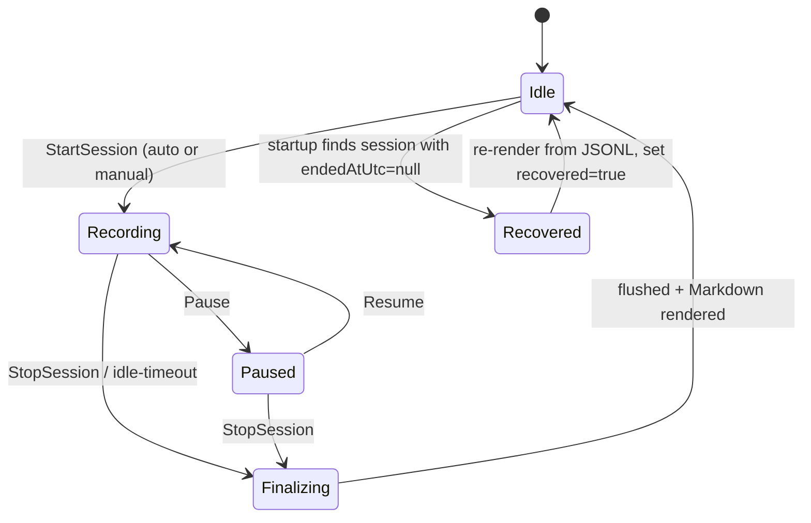
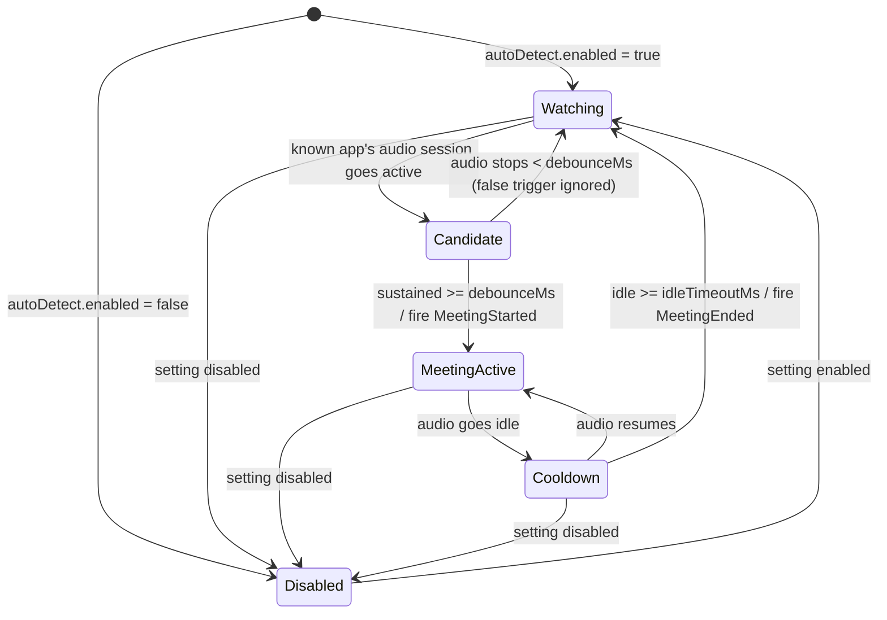

# LocalScribe — Cross-Cutting Specifications

- **Status:** Living reference (v1). Hardware-independent; consulted by all implementation
  stages. Rev incorporates the 2026-06-30 design-review decisions.
- **Companion to:** `docs/plans/2026-06-30-localscribe-design.md`
- **Scope note:** VAD thresholds and the model-selection defaults are *starting points* to
  validate against real meeting audio in Stage 2; everything else is contractual.

## Schema-version policy

- Every persisted JSON file carries an integer `schemaVersion` (starts at `1`).
- Readers **reject** a file whose `schemaVersion` is higher than they understand
  (forward-incompatible) and **migrate** lower versions on load.
- JSONL lines tolerate unknown fields (forward-compatible); consumers ignore fields they
  don't recognise rather than failing.
- **`session.json` v1→v2 migration:** `audioRetained:true` ⇒ `retainedAudioSources` =
  the session's `sources`; `audioRetained:false` ⇒ `[]`.

---

## 1. Data schemas

### 1.1 `transcript.jsonl` — source of truth (append-only, immutable)

One JSON object per line, one record, in **finalization order** (not time order). Two
record kinds, discriminated by `kind`:

**Segment** (a transcribed utterance):
```json
{"seq":17,"kind":"segment","source":"Remote","startMs":85320,"endMs":89110,"text":"I pushed the auth changes last night.","speakerLabel":"Them","lang":"en","noSpeechProb":0.02}
```

**Marker** (a system event in the timeline — see §8):
```json
{"seq":40,"kind":"marker","source":"System","startMs":91000,"endMs":91000,"text":"audio device changed"}
```

| Field | Type | Notes |
|---|---|---|
| `seq` | int | 0-based, monotonic **write-order** key. Stable & immutable — diarisation keys off this. |
| `kind` | string | `segment` \| `marker`. Absent ⇒ `segment` (back-compat). |
| `source` | string | `Local` \| `Remote` (segments) \| `System` (markers). |
| `startMs`/`endMs` | int | Session-relative clock (ms). For markers, equal. |
| `text` | string | Transcribed text (trimmed) or marker message. |
| `speakerLabel` | string | Baseline display label: `Me` (Local) / `Them` (Remote). Refinable via `speakers.json`. |
| `lang` | string? | Session-locked language code (resolved once per session — §3), if available. |
| `noSpeechProb` | float? | Whisper no-speech probability, for QA/filtering. |

> **Key design point:** `seq` is write-order (the order streams *finished* transcribing),
> **not** time order. Display order is computed from `startMs` (see §5). Keeping `seq`
> stable is what makes diarisation/renaming non-destructive.

### 1.2 `session.json` — metadata (mutable; rewritten on finalize and relabel)

```json
{
  "schemaVersion": 2,
  "id": "2026-06-30_1432_Teams_weekly-sync",
  "title": "Teams — 2026-06-30 14:32",
  "app": "Teams",
  "startedAtUtc": "2026-06-30T14:32:05Z",
  "endedAtUtc": "2026-06-30T15:09:11Z",
  "durationMs": 2226000,
  "sources": ["Local", "Remote"],
  "model": "small.en",
  "backend": "CUDA",
  "language": "auto",
  "retainedAudioSources": ["Local", "Remote"],
  "diarised": false,
  "segmentCount": 312,
  "recovered": false,
  "appVersion": "0.1.0"
}
```

- `app` ∈ `Teams` \| `Zoom` \| `Webex` \| `Manual` \| `Browser`.
- `endedAtUtc == null` ⇒ session is running **or crashed** — drives recovery (§2).
- `title` is user-editable; default = `{app} — {startedAt local}`.

### 1.3 `speakers.json` — diarisation + name overrides (non-destructive; absent until used)

```json
{
  "schemaVersion": 1,
  "names": { "Local:1": "Sam", "Remote:1": "Alice", "Remote:2": "Bob" },
  "assignments": {
    "Remote": { "17": "Remote:2", "19": "Remote:1" },
    "Local":  { "18": "Local:1" }
  },
  "diarisedSources": ["Remote"],
  "method": "sherpa-onnx:segmentation+embedding",
  "diarisedAtUtc": "2026-06-30T15:20:00Z",
  "confidence": { "Remote:1": 0.92, "Remote:2": 0.61 }
}
```

- **Cluster key** = `"<Source>:<clusterId>"` (e.g. `Remote:2`). Clusters are numbered
  per-source, independently (Local and Remote are diarised separately — §1 of design).
- `assignments[source][seq]` maps a segment's `seq` → cluster key.
- `names[clusterKey]` maps a cluster → display name. Unnamed clusters render as
  `Speaker N` (N = clusterId).
- **Display-name resolution** for a segment: `assignments[source][seq]` →
  `names[clusterKey]` (or `Speaker {clusterId}`); **else** the baseline `speakerLabel`
  from the JSONL line.
- `confidence[clusterKey]` (optional, `0.0`–`1.0`) — per-cluster diarisation confidence.
  Low confidence drives a UI "low-confidence" warning **only**; it never hard-gates — the
  structural Me/Them baseline (`speakerLabel`) is always recoverable.

---

## 2. State machines

### 2.1 Session lifecycle



- **Finalizing → "flushed"** means the VAD residual is drained (the in-progress padded
  utterance force-emitted — §4) **and** the write queue is drained.
- The session clock keeps ticking through **Pause**/sleep: `durationMs = endedAt −
  startedAt`; the `paused`/`resumed`/`sleep` markers annotate the gap.

### 2.2 Meeting detector



Detector timing defaults: `debounceMs = 2000`, `idleTimeoutMs = 15000`. Manual
Start/Stop bypass the detector entirely and drive the session machine directly.

- **Single-session (v1):** a second known app going active while `MeetingActive` does
  **not** start a concurrent session — the second `MeetingStarted` is ignored (surface a
  tray hint). The `session.json` `app` enum stays closed (§1.2).
- **User-suppressed edge:** a manual Stop wins for the rest of a continuous-audio
  session — the detector won't auto-retrigger `MeetingStarted` until the audio idles past
  `idleTimeoutMs`.

---

## 3. Model-selection table

Probe backends in order **CUDA → Vulkan → CPU**; pick the model for the matched tier;
honour an explicit user override. Two streams run concurrently against near-real-time.

| Detected hardware | Backend | Default model | Adaptation |
|---|---|---|---|
| NVIDIA ≥ 8 GB VRAM | CUDA | `small.en` (opt-in `large-v3`) | comfortable on both streams |
| NVIDIA 4–6 GB VRAM | CUDA | `small.en` | `medium` if headroom; VRAM-OOM → `base.en` |
| AMD/Intel iGPU | Vulkan | `base.en` → `small.en` | measure RTF; downgrade if sustained > 1 |
| CPU only | CPU | `base.en` (`small.en` if ≥ 8 fast cores) | quantized; expect lag on two streams |
| NPU (future) | DirectML/QNN | `base`/`small` | optional backend, post-v1 |

- **Quantization:** `q5_1`/`q8_0` ggml weights on CPU/iGPU; `fp16` on CUDA.
- **`.en` models** default whenever `language` is `en` or `auto` resolves to English;
  multilingual weights otherwise.
- **Auto-downgrade triggers:** `VRAM_OOM`, or sustained `RTF > 1` (growing queue) → drop
  one model step and write a `transcription lagging` marker + log.
- **Language resolution (auto):** probe-then-commit **per session** — transcribe the first
  ~2–3 utterances on a multilingual model, detect and **lock** the session language, then
  switch to matching `.en` weights only if detected == `en`; persist the resolved code to
  `session.json`. Each segment's `lang` records the session-locked language (no per-chunk
  re-detection); mid-meeting language switching is unsupported in v1 (Non-goal).

---

## 4. VAD parameters (Silero) — *starting defaults, tune in Stage 2*

| Param | Default | Rationale |
|---|---|---|
| `threshold` | 0.5 | Silero default speech probability; raise in noisy rooms. |
| `minSpeechMs` | 250 | Drop blips shorter than this. |
| `minSilenceMs` | 500 | Trailing silence that *ends* an utterance (latency vs over-segmentation). |
| `speechPadMs` | 150 | Pad both sides so words aren't clipped. |
| `maxSegmentMs` | 15000 | Force-cut long monologues to keep latency + memory bounded. |
| `windowSizeSamples` | 512 | Silero frame @ 16 kHz. |
| `sampleRate` | 16000 | Matches the capture target. |

Behaviour: runs **per source, independently**. Emits an `AudioSegment {source, startMs,
endMs, pcm}` when `minSilenceMs` of sub-threshold audio follows speech, **or**
`maxSegmentMs` is reached (cut at the last dip if possible, else hard cut), **or** the
in-progress padded utterance is **force-emitted (flushed)** on Stop / Pause / idle-timeout
/ end-of-stream (EOF). `startMs`/`endMs` come from the session clock at padded speech
onset/offset.

---

## 5. Merge spec

- **Display order:** sort all segments by `startMs` ascending; tie-break `source`
  (`Local` before `Remote`), then `seq`.
- **Markers** sort into the timeline by their `startMs` like any record.
- **Live view:** an observable ordered collection; each finalized record is inserted at
  its sorted position (it may land *behind* the newest, because the other stream's
  earlier utterance can finalize later — expected and fine).
- **Overlap:** simultaneous speech produces two segments with overlapping `[startMs,
  endMs]` on different sources. **Both are kept**, rendered in start-time order — this is
  the desired behaviour (both halves transcribed). No overlap merging/dropping. A
  non-destructive **render-layer dedup** MAY hide a `Local` segment that closely matches a
  near-simultaneous lower-energy `Remote` segment (phantom bleed) while the JSONL keeps
  both; genuine overlap (distinct words, comparable energy) is never suppressed.
- **Source of truth vs view:** `transcript.jsonl` stays in write/`seq` order; the merge
  is a *render-time* computation from `startMs`. External consumers sort by `startMs`.
- **`startMs` derivation:** sample-counted from a per-stream start anchor on the shared
  session clock plus one calibrated mic↔loopback offset constant (measured once); the
  `AudioFrame`/JSONL contract is unchanged.

---

## 6. Markdown render spec (`transcript.md`, a projection)

```markdown
# Weekly Sync — Microsoft Teams
Teams · 2026-06-30 14:32 · 37 min · small.en/CUDA

**[00:01] Sam:** Morning everyone — shall we start with the roadmap? Quick recap first.
**[00:21] Alice:** Sure. I pushed the auth changes last night.
_[audio device changed]_
**[00:38] Bob:** Question on the token refresh…
```

- **Header:** `# {title}` then `{app} · {startedAt local} · {durationMin} min · {model}/{backend}`.
- **Segment line:** `**[ts] {DisplayName}:** {text}` where `ts` = `mm:ss` (or `h:mm:ss`
  ≥ 1 h) from `startMs`; `DisplayName` resolved per §1.3.
- **Speaker grouping:** consecutive segments with the **same** `DisplayName` merge into one
  paragraph — first line keeps the `[ts] Name:` prefix, following same-speaker lines are
  space-joined as continuation — until the speaker changes.
- **Markers:** italic standalone line `_[message]_`.
- **Timestamps:** relative to session start by default (`settings.timestamps`).

---

## 7. Settings schema (`settings.json`, in `%APPDATA%/LocalScribe`)

```json
{
  "schemaVersion": 1,
  "storageRoot": "%USERPROFILE%/LocalScribe",
  "audioRetention": "days:30",
  "model": "auto",
  "backend": "auto",
  "language": "auto",
  "autoDetect": { "enabled": true, "apps": ["Teams", "Zoom", "Webex"] },
  "hotkeys": { "startStop": "Ctrl+Alt+R", "pause": "Ctrl+Alt+P" },
  "timestamps": "relative",
  "recordingIndicator": true,
  "launchAtLogin": true,
  "logging": { "level": "info", "includeTranscriptText": false }
}
```

| Key | Values |
|---|---|
| `storageRoot` | absolute path; default `%USERPROFILE%/LocalScribe`. Warn if it resolves under a known sync provider (OneDrive/Dropbox/Google Drive). |
| `audioRetention` | `afterDiarisation` \| `days:N` \| `forever` \| `never` (default `days:30`). `afterDiarisation` is **per-source**, triggered on speaker-map confirm/lock — deletes only that source's audio. |
| `model` | `auto` \| `tiny` \| `base` \| `small` \| `medium` \| `large-v3` (+ `.en` variants) |
| `backend` | `auto` \| `cuda` \| `vulkan` \| `cpu` |
| `language` | `auto` \| ISO code (`en`, …) |
| `timestamps` | `relative` \| `wallclock` |
| `launchAtLogin` | `true` \| `false` (default `true`) — run LocalScribe at user login. |
| `logging` | `{ level: error\|warn\|info\|debug, includeTranscriptText: bool }` — defaults `info` / `false`. |

---

## 8. Error & marker taxonomy

### 8.1 In-transcript markers (JSONL `kind:"marker"`, `source:"System"`)

| Message | Emitted when |
|---|---|
| `audio device changed` | Default device hot-swapped mid-session (rebind). |
| `paused: system sleep` / `resumed` | System sleep/resume during a live session. |
| `paused by user` / `resumed` | Manual pause/resume. |
| `degraded: system-audio loopback` | Per-process loopback unavailable → full-system fallback. |
| `transcription lagging` | Sustained RTF > 1 (queue growing); paired with auto-downgrade. |
| `recovered session` | Transcript reconstructed after a crash. |

### 8.2 Error codes (logged + surfaced in UI; not in the transcript)

| Code | Severity | Recovery |
|---|---|---|
| `MIC_PERMISSION_DENIED` | error | Prompt to enable mic in Windows Settings. |
| `LOOPBACK_ACTIVATION_FAILED` | error | Retry; else fall back to system loopback (marker). |
| `MODEL_DOWNLOAD_FAILED` | error | Retry with backoff; offer manual model path. |
| `VRAM_OOM` | warn | Auto-downgrade one model step; continue. |
| `DISK_FULL` | warn | Stop retaining audio; keep transcript; warn. |
| `DEVICE_LOST` | warn | Rebind to new default device (marker). |
| `BACKEND_INIT_FAILED` | warn | Cascade CUDA → Vulkan → CPU. |

Each error carries `{ code, severity, userMessage, recoveryAction }`.
