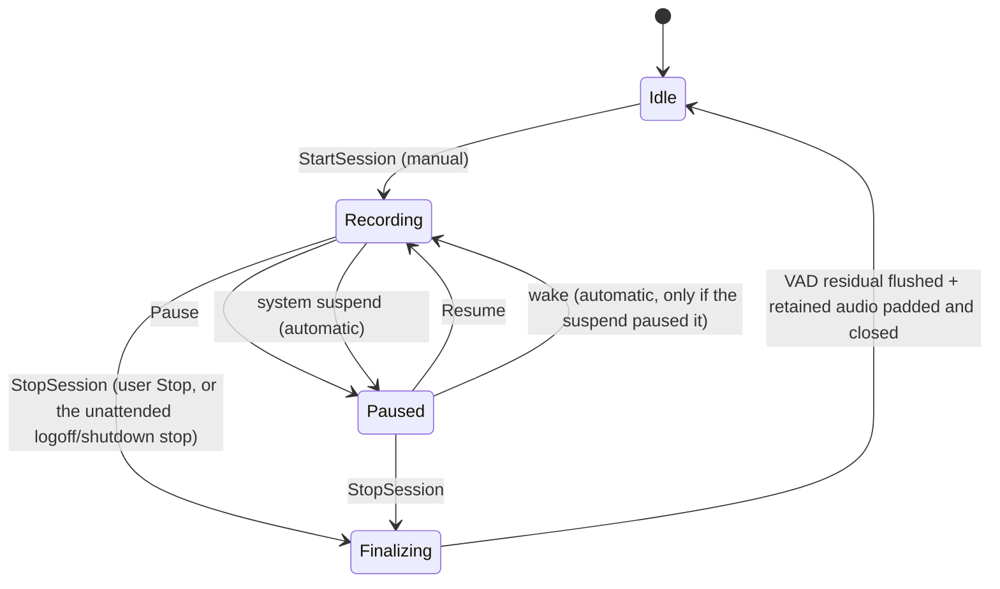
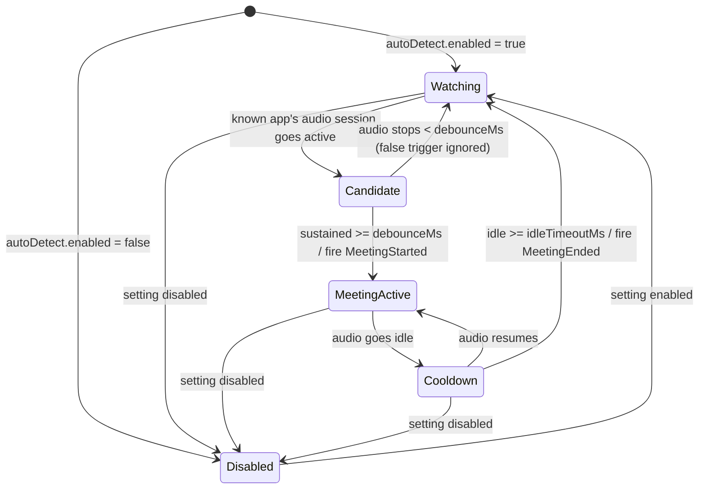

# LocalScribe — Cross-Cutting Specifications

- **Status:** Living reference (v1). Hardware-independent; consulted by all implementation
  stages. **Rev: 2026-08-07 full audit against shipped code.** Every section was re-verified
  line by line against the implementation; 142 drift findings were applied (47 where the spec was
  factually wrong about shipped behaviour, 56 incomplete, 23 stale wording, 16 documenting work
  that never shipped). Sections 1.9, 1.10, 2.3, 8.4, 13, 14 and 15 are new — they document
  subsystems that shipped after the original build sequence and had no home here. Sections 1.11,
  10.2, 12.4, 16 and 17 are **stubs**: the subsystems ship but are still unspecified, and are
  listed rather than omitted. Where the spec previously recorded something as a Non-goal that has
  since shipped, the claim is retracted in place with a dated amendment rather than quietly
  deleted. Supersedes the 2026-07-02 design-session revision, which superseded
  the 2026-06-30 design-review revision.
- **Companion to:** `docs/plans/2026-06-30-localscribe-design.md`
- **Scope note:** VAD thresholds and the model-selection defaults are *starting points* to
  validate against real meeting audio in Stage 2; everything else is contractual.

## Schema-version policy

- Every persisted JSON file carries an integer `schemaVersion` (starts at `1`). Each file
  versions **independently** — `session.json`, `meta.json`, `matter.json`, the matters index,
  `edits.json`, `speakers.json`, and `settings.json` do not share a version counter.
  **Amended 2026-08-07:** that seven-file list was the whole set when it was written and has
  not been a closed list for some time. Also independently versioned today:
  `assistant/chats.json` (v2, per-session and per-matter), `assistant/summaries.json` (v1),
  `manifest.json` (v1), `embeddings.json` (v1), `people/people.json` (v1),
  `index/search-index.json` (v1), `mcp/consent.json` (v1), and the installed-models
  `assistant-manifest.json` (v1, under the models root rather than the storage root). Treat the
  rule as covering **every** persisted JSON file, not the enumeration.
- **Exception (2026-08-07):** `window-state.json` (volatile window geometry) deliberately
  carries **no** `schemaVersion` — it is never truth, any parse failure is silently ignored, and
  the legacy pre-Stage-4 bare `{x,y}` root is **shape-detected** on read instead of versioned.
- Readers **reject** a file whose `schemaVersion` is higher than they understand
  (forward-incompatible) and **migrate** lower versions on load.
- **Amended 2026-08-07 — the reject rule is for *truth* files only.** Readers of the evidentiary
  and user-owned files (`session.json`, `meta.json`, `matter.json`, the matters index,
  `edits.json`, `speakers.json`, `settings.json`, `manifest.json`, `people.json`, the assistant
  chat/summary stores, `assistant-manifest.json`) throw on a newer version — a hard error, because
  guessing at a file you do not understand is how truth gets corrupted. Readers of **derived
  caches** (`index/search-index.json`, `embeddings.json`, the semantic sidecars) instead treat a
  newer version exactly as they treat a missing or corrupt one: return nothing and rebuild or
  degrade the feature. A cache written by a newer build must never block the app.
- JSONL lines tolerate unknown fields (forward-compatible); consumers ignore fields they
  don't recognise rather than failing.
- All 2026-07-02 and 2026-07-03 schema changes are **additive** and migrate-on-load; no field
  is repurposed or removed destructively.
- **`session.json` v1→v2 migration:** `audioRetained:true` ⇒ `retainedAudioSources` =
  the session's `sources`; `audioRetained:false` ⇒ `[]`.
- **`session.json` v2→v3 migration:** the user-owned fields move out to a synthesised
  `meta.json` (§1.4): `title` copies across (then drops from `session.json`),
  `participants = []`, `description = ""`, `medium` = the `Medium` member whose name matches
  `app` when one exists (`Webex`/`Zoom`/`Teams`), otherwise `Other` — `app` values `Manual` and
  `Browser` have **no** `Medium` counterpart, so those sessions migrate to `Other` rather than
  to their `app` value (corrected 2026-08-07; the rule was previously written as "`medium = app`") —
  `matterIds = []`, `summaryRef = null`. Migration **never fabricates identity** (2026-07-03 refinement,
  supersedes the earlier "self from settings, if any"): every Stage 4 read path passes
  `selfForMigration: null`, because who was on an old call is not something today's
  `settings.self` knows — the self participant is injected only at recording time by
  SessionBootstrap. `session.json` keeps only system-derived fields and
  gains a `devices` snapshot (§1.2/§12) defaulted to `unknown/legacy` for pre-v3 records.
- **`session.json` v3→v4 migration (2026-07-13, versioned re-transcription):** adds
  `activeVersion: "v1"` and `versions: []` — the typed defaults, written **explicitly** so a v4
  file is self-describing rather than relying on absence. Nothing else changes: an old session
  reads as "the session-root transcript is the active one, and no re-transcription has run".
- **`settings.json` v1→v2 migration:** add `self`, `overlay`, `remote`, `mic`, `audioFormat`,
  and `vocabulary` at their v2 defaults (§7); flip `autoDetect.enabled` to `false`. An
  explicitly-stored `audioRetention` is preserved as-is; only fresh installs take the new
  `keep` default (§7).
- **2026-07-03 additive bumps (Stage 4):** `meta.json` v1→v2, `matter.json` v1→v2, and the
  matters index v1→v2 each add `archived: false`; `settings.json` v2→v3 adds `privacy`
  at its default (`excludeWindowsFromCapture: true`) — `consentNotice` stays absent until
  the user accepts the first-run notice (§7). Nothing else changes.

---

## 1. Data schemas

### 1.1 `transcript.jsonl` — source of truth (append-only, immutable)

One JSON object per line, one record, in **finalization order** (not time order). Two
record kinds, discriminated by `kind`:

**Segment** (a transcribed utterance):
```json
{"seq":17,"kind":"segment","source":"Remote","startMs":85320,"endMs":89110,"text":"I pushed the auth changes last night.","speakerLabel":"Them","lang":"en","noSpeechProb":0.02}
```

**Marker** (a system event in the timeline — see §8):
```json
{"seq":40,"kind":"marker","source":"System","startMs":91000,"endMs":91000,"text":"audio device changed"}
```

| Field | Type | Notes |
|---|---|---|
| `seq` | int | 0-based, monotonic **write-order** key. Stable & immutable — diarisation keys off this. |
| `kind` | string | `segment` \| `marker`. Absent ⇒ `segment` (back-compat). |
| `source` | string | `Local` \| `Remote` (segments) \| `System` (markers). |
| `startMs`/`endMs` | int | Session-relative clock (ms). For markers, equal. |
| `text` | string | Transcribed text (trimmed) or marker message. |
| `speakerLabel` | string | Baseline display label: `Me` (Local) / `Them` (Remote). Refinable via `speakers.json`. |
| `lang` | string? | The language Whisper reported **for this segment**, written verbatim. **Not** the session lock (corrected 2026-08-07): pre-lock probe segments may disagree with each other and with the eventual lock, and lines are never rewritten when the lock commits. An English-only (`.en`) model has no multilingual head, so its value is untrustworthy — the language resolver deliberately refuses to observe it, yet the raw value is still what lands here. Session-level truth is `session.json.language` (§1.2/§3). |
| `noSpeechProb` | float? | Whisper no-speech probability, for QA/filtering. |
| `rmsDb` | float? | Segment RMS energy in dBFS at transcription time, **rounded to 1 decimal place** on write (QA field; feeds the render-layer phantom-bleed dedup — §5.1). Null for markers and pre-2b lines. |

> **Key design point:** `seq` is write-order (the order streams *finished* transcribing),
> **not** time order. Display order is computed from `startMs` (see §5). Keeping `seq`
> stable is what makes diarisation/renaming/corrections non-destructive.

> **Evidentiary invariant (2026-07-02):** `transcript.jsonl` is **never** rewritten,
> tombstoned, redacted, or reordered. There are **no** delete/hide/redact records anywhere
> in the model. All user changes are additive overlays (`speakers.json`, `edits.json`) keyed
> by `seq`; the machine-original text and timing are always recoverable. This preserves the
> chain-of-custody value of a privileged-call record. Records management for an accidental or
> test recording is the coarse **whole-session delete** only (never per-segment).

> **More than one transcript per session (2026-07-13, versioned re-transcription):** a session
> may now hold several `transcript.jsonl` files. The session-root file is version **`v1`** and
> stays byte-identical forever; each completed re-transcription writes
> `versions\<versionId>\transcript.jsonl` with its **own** overlays and rendered projections
> (`edits.json`, `speakers.json`, `embeddings.json`, `transcript.md`/`.txt` and the integrity
> manifest are all version-scoped the same way). `session.json.activeVersion` names the one the
> app reads, edits and exports; the pseudo-version `v1` resolves to the session root, so a
> pre-versioning session needs no special case. **The immutability invariant above is
> per-version** — a re-transcription never touches an existing version's files, it adds a new
> folder beside them.

> **Torn-tail durability (2026-07-02):** a crash mid-append can leave a partial JSON object as
> the file's final line. Readers **tolerate** this: a line that fails to parse is skipped and
> surfaced as a malformed-line count (it is *never* rewritten or deleted — the torn bytes stay
> on disk as part of the record). Appends **self-heal line termination**: if the file does not
> end with `\n`, the writer emits a leading `\n` first, so a new record never lands on the same
> physical line as a torn tail. Recovery (§2.1) must therefore always succeed on a torn file.

> **Live-read durability (2026-08-03):** every read of `transcript.jsonl` opens the file with
> `FileShare.ReadWrite`, never the framework's read-all helpers (which open `FileShare.Read`).
> A `FileShare.Read` handle locks out the capture pipeline's append, so an export or a read view
> opened against a **recording** session would drop an evidentiary line. Same class of rule as
> the torn tail: a reader must never be able to cost the record a segment.

### 1.2 `session.json` — system-owned metadata (mutable; rewritten on finalize and relabel)

`session.json` holds **machine-measured, system-derived** truth only. All user-asserted
metadata lives in the sibling `meta.json` (§1.4). Splitting the two removes the
background-writer-vs-user-edit race (finalize, relabel, and retention cleanup all touch
`session.json`; the user only ever edits `meta.json`) and keeps the machine-vs-human boundary
clean for evidentiary purposes.

```json
{
  "schemaVersion": 4,
  "id": "2026-07-02_1432_Webex_doe-intake",
  "app": "Webex",
  "startedAtUtc": "2026-07-02T06:32:05Z",
  "endedAtUtc": "2026-07-02T07:09:11Z",
  "timeZoneId": "Singapore Standard Time",
  "utcOffsetMinutes": 480,
  "durationMs": 2226000,
  "sources": ["Local", "Remote"],
  "model": "small.en",
  "weightsFile": "ggml-small.en.bin",
  "backend": "CUDA",
  "language": "auto",
  "retainedAudioSources": ["Local", "Remote"],
  "diarised": false,
  "segmentCount": 312,
  "markerCount": 6,
  "recovered": false,
  "appVersion": "0.1.0",
  "devices": {
    "mic":    { "mode": "followDefault", "id": "{0.0.1.00000000}.{guid}", "name": "Shure MV7", "fellBackToDefault": false },
    "remote": { "mode": "perProcess", "app": "CiscoCollabHost.exe", "fellBackToSystemMix": false }
  },
  "activeVersion": "v1",
  "versions": [],
  "origin": "recorded"
}
```

- `app` ∈ `Teams` \| `Zoom` \| `Webex` \| `Manual` \| `Browser` — the **closed system enum**;
  it is the capture-path truth that recovery/(deferred) detection key on. It is **never**
  collapsed by the user-facing `medium` field (§1.4); Webex-in-browser, phone-on-speaker, and
  in-person captures set `medium` without touching `app`.
- **Where `app` comes from (2026-08-07):** a non-`Manual` choice is honoured verbatim. A
  **`Manual`** start is *derived* at Start from the planner-resolved remote process image —
  but only when remote capture actually matched a process (a per-process plan, or a full-mix
  fallback that still exposes the matched image). An explicitly pinned system-mix is never
  derived. Unknown/unmatched images resolve back to `Manual`. The mapping is locked and
  contains one deliberate surprise: **`msedgewebview2` maps to `Browser`, not `Teams`** — a
  Teams webview render session is characteristically a browser capture, and the dedicated
  `ms-teams` image is what identifies real Teams. Deriving before bootstrap is what keeps
  `app`, the folder id (§9) and the default `meta` title/medium in agreement.
- `endedAtUtc == null` ⇒ session is running **or crashed** — drives recovery (§2).
- `timeZoneId` (Windows time-zone ID) and `utcOffsetMinutes` (offset in force at Start,
  DST-resolved) are captured at Start so the session records **where in local time it
  happened**. The UTC instants stay authoritative; renderers derive "local" via
  `startedAtUtc + utcOffsetMinutes` (falling back to the machine's current zone only for
  pre-v3 records, where both fields are absent/null). The session **folder id** is derived
  from this local wall-clock time (§9) — in the example above, `06:32Z` at `+480` ⇒ `1432`.
- **Timestamp precision:** `*AtUtc` timestamps serialize as whole-second ISO-8601 (`...Z`);
  sub-second precision is **intentionally truncated on write**. Millisecond precision lives
  only in `durationMs` and the JSONL `startMs`/`endMs`, so `endedAtUtc − startedAtUtc` may
  disagree with `durationMs` by up to one second. Consumers must not rely on fractional
  seconds in any `*AtUtc` field.
- **`title` has moved** to `meta.json` (§1.4). It is no longer a `session.json` field.
- `devices` is the **resolved-actuals snapshot** captured at Start (§12): the mic and remote
  modes/IDs/names actually used, so a session is self-describing and reproducible. `remote`
  records whether the all-zeros/browser guard forced a system-mix fallback
  (`fellBackToSystemMix`). **Exception (2026-08-07):** an **imported** session captured no
  devices, so it records the typed defaults (`mic: followDefault`, `remote: auto`) with no ids
  or names — for `origin: "imported"` the snapshot is "nothing was captured", not "these devices
  were used".
- `segmentCount`/`markerCount` are system counts. Per-side **participant** counts
  (`localCount`/`remoteCount`) live in `meta.json` (§1.4/§10). ~~user-declared~~
  **Amended 2026-08-07:** they are *derived* from the participant slot lists at Save, and
  import-time speaker detection is a second, non-user writer of `localCount` — see the
  `localCount`/`remoteCount` bullet in §1.4 for the shipped rule. They are also no longer a
  Split gate: Session Details offers Split with no count condition.
- `weightsFile` (2026-07-13) is the **exact ggml file** that produced the transcription —
  `model` alone no longer determines it, because the resolver picks a quantized variant per
  backend (fp16 on CUDA, `q8_0`-first on CPU/Vulkan). `null` means **unknown or none**: a
  pre-existing record, a session that never transcribed a segment, or a **crash-recovered**
  session (the value is only persisted at finalize, so a crash loses it even when segments
  exist). A mid-session change additionally leaves a "transcription weights changed" marker in
  the transcript.
- `activeVersion` / `versions` (2026-07-13) are the versioned-re-transcription pair described in
  §1.1. `activeVersion` is `"v1"` (the immutable session root) or a `versions[].id`;
  `versions` lists **completed** re-transcriptions oldest-first (`v2`, `v3`, …) and has **no**
  entry for the root. An entry is written in the *same* `session.json` save that flips
  `activeVersion` — that save is the run's single commit point, so a listed version is always a
  complete folder. Each entry is
  `{ id, model, weightsFile, backend, language, createdAtUtc, vocabularyApplied }`, where `id`
  is the full folder name under `versions\` (e.g. `"v2-base.en-2026-07-13"`) and
  `vocabularyApplied` records whether the run's Whisper initial prompt carried global/matter
  vocabulary terms. **Read the split carefully:** the root-level truth fields
  (`model`/`weightsFile`/`backend`/`language`/`segmentCount`/`markerCount`) always describe the
  **original v1 run**; per-version actuals live only in the `versions` entries.
- `origin` (2026-07-13) is `"recorded"` (the default — and absent from every pre-existing
  `session.json`, so old files load unchanged) or `"imported"` (created by the audio importer
  from a received file). Additive with no schema bump, on the `fellBackToDefault` precedent.
- `importedSource` is the **chain-of-custody record for an imported original**; it is `null`
  and omitted on disk for recorded sessions. The original bytes are archived unmodified at
  `source\{fileName}` and `sha256` is computed over those bytes at copy time. The field's whole
  point is the **container-claim vs decoded-truth split** — never trust a container header:

```json
"importedSource": {
  "fileName": "intake-call.mp3",
  "sha256": "9f2c…",
  "fileSizeBytes": 41238912,
  "containerFormat": "mp3",
  "fileCreatedUtc": "2026-07-11T02:14:08Z",
  "fileModifiedUtc": "2026-07-11T02:51:33Z",
  "mediaCreatedUtc": null,
  "claimedDurationMs": 2231000,
  "decodedDurationMs": 2226400,
  "decodedSampleRate": 44100,
  "decodedChannels": 2,
  "channelMapping": "split",
  "durationMismatch": false
}
```

  `claimed*` fields are what the container asserted (ffprobe / WAV header) and may be `null`
  when it asserts nothing; `decoded*` fields are decoded-stream truth. `channelMapping` ∈
  `mono` \| `split` \| `split-swapped` \| `downmix` \| `downmix-multichannel`.
  `durationMismatch: true` records that the >1 % claimed-vs-decoded gate fired **and the user
  chose Continue** — the transcript carries the matching marker too (§8). Declining the gate is
  a cancel, and the partial session folder is deleted.
- **Writers (2026-08-07).** The heading's "finalize and relabel" is the original pair, not the
  current set. Six paths rewrite `session.json` today: live **finalize** (end time, duration,
  counts, resolved model/weights/backend/language, retained audio); **crash recovery** (sets
  `recovered`, `endedAtUtc`, `durationMs`, the recounted totals, and re-derives
  `retainedAudioSources` from the legs actually on disk — union, never replace); **load-time
  schema migration** (the write-migrate; the MCP read-only path deliberately opts out);
  **diarisation completion** (`diarised: true`); **audio import** (twice — once to stamp
  `origin`/`importedSource` before decoding, once at Save for decoded-truth duration, recounts
  and the completed provenance); and the **active-version flip**.
- The session folder also carries `manifest.json`, the per-version integrity seal, which hashes
  `session.json` and `transcript.jsonl` themselves along with the other evidentiary files. Two
  consequences belong here: any writer in the list above must re-seal, and the seal records the
  ranges of **fabricated silence** the audio writer inserted (clock gaps and end padding) —
  because a hash that certifies synthetic silence as recorded audio is worse than no hash. The
  seal's own schema is specified in its own section elsewhere in this document.

### 1.3 `speakers.json` — diarisation + name overrides (non-destructive; absent until used)

**Per transcript version (2026-07-13, `StoragePaths`):** `speakers.json` — like `edits.json`,
`transcript.jsonl` and the derived `embeddings.json` — is a **per-version** file. Version `v1`
resolves to the session root, so a pre-versioning session keeps the flat layout and every
version-aware caller degenerates to it; any other version lives under `versions\<versionId>\`.
Every current writer goes through the version-aware path, and a caller must **pin the `versionId`
it authored against** rather than re-resolving the active version at write time
(`MaintenanceService.EnsureKnownVersion`) — a re-transcription landing while the Split-speakers
dialog is open would otherwise commit the user's speaker work to a version they never saw.

```json
{
  "schemaVersion": 1,
  "names": { "Local:1": "Sam", "Remote:1": "Alice", "Remote:2": "Bob" },
  "assignments": {
    "Remote": { "17": "Remote:2", "19": "Remote:1" },
    "Local":  { "18": "Local:1" }
  },
  "pinned": { "Remote": ["17"] },
  "diarisedSources": ["Remote"],
  "method": "localscribe-cluster-v1:pyannote-seg-3.0+campplus-zh-en",
  "diarisedAtUtc": "2026-06-30T15:20:00Z",
  "suggestionProvenance": {
    "Remote:1": { "personId": "p-7f3a", "score": 0.81, "acceptedAtUtc": "2026-07-25T09:11:00Z" }
  }
}
```

- **Cluster key** = `"<Source>:<clusterId>"` (e.g. `Remote:2`). Clusters are numbered
  per-source, independently (Local and Remote are diarised separately — §1 of design).
- `assignments[source][seq]` maps a segment's `seq` → cluster key.
- `names[clusterKey]` maps a cluster → display name. **Two different default strings exist, and
  the divergence is deliberate:**
  - **Written at commit time:** `DefaultSpeakerLabels.For` stamps the per-side, **1-based** label
    `{Source} Speaker N` into `names` for every fresh cluster (2026-07-04) — cluster id `1` on
    Remote is written as "Remote Speaker 2". This supersedes the earlier generic `Speaker N`
    wording.
  - **Derived at read time:** when a clusterKey has **no** `names` entry at all, `NameResolver`
    falls back to the raw **0-based** `Speaker {clusterId}` — `Remote:2` renders "Speaker 2", not
    "Remote Speaker 3". This is a last-resort projection only; it is never written to disk.
- **Manual pinned assignments (2026-07-02):** a per-segment "this line was actually Bob"
  reassignment writes `assignments[source][seq]` and records the `seq` under
  `pinned[source]`. Re-diarisation **preserves** pinned entries verbatim and only rewrites
  unpinned ones — one authority per field, no second speaker-resolution path. `speakers.json`
  remains the sole diarisation/speaker-name authority; **text** corrections never land here
  (they go in `edits.json`, §1.6).
  - **Two pin targets (delivered):** the target is either an **existing cluster** or a
    **participant**. Pinning to a participant that already owns a cluster reuses that key; pinning
    to one that owns none **mints a brand-new clusterKey** `"{Source}:{maxId+1}"` that no
    diarisation run ever produced — the id clears every key in `names`, every clusterKey the
    source assigns, and every participant-owned key (the same allocation ceiling the re-diarise
    merge uses) — and then stamps it as that participant's `meta.participants[].clusterKey`
    (§1.4). Cluster ids in `speakers.json` are therefore **not** exclusively diarisation output.
  - **Qualification to "sole authority":** a **split child** may carry its own speaker override
    (`speakerParticipantId` / `speakerClusterKey`), which lives in the split entry in `edits.json`
    (§1.6), not here — so `speakers.json` stays integer-`seq` keyed. That override is resolved
    **ahead** of everything in this file; see the resolution order below.
- **Unpin (delivered):** clearing a manual assignment removes the `pinned[source]` entry **and**
  its `assignments[source][seq]` entry, so the line falls back through the resolution tiers and a
  later re-diarisation can re-cover it. A seq that is *assigned but not pinned* is deliberately
  untouched — unpin must never delete diarisation output. Quiet no-op when `speakers.json` is
  absent or nothing was pinned; when it does change something it flips `meta.edited` (§1.4).
- **Delivered re-diarise merge (2026-07-04, `SpeakersMerge`):** re-running diarisation on a
  source resets **every non-pinned** assignment and name for that source — pinned seqs and the
  names of the clusterKeys they point to are the only survivors; there is **no name rebinding**
  for anything else. Because a fresh run's cluster ids always restart at `0`, a fresh clusterKey
  that **collides** with a surviving pinned clusterKey is remapped to a new, unused id *before*
  the merge applies — a different speaker can therefore never inherit a pinned speaker's key or
  name. `clusterCount` (on the diarisation result, not persisted here) is simply the count of
  distinct speaker ids the fresh run produced.
  - **Participant-owned keys are a second protected class (Stage 5.4):** the clusterKeys named in
    `meta.participants[].clusterKey` (§1.4) are passed into the merge and protected **exactly
    like** pinned keys, so a colliding fresh key is remapped away and a different voice can never
    be re-bound under a key a named identity owns.
  - **The merge returns its remap.** `SpeakersMergeResult` carries both the merged overlay and the
    fresh-key remap that was applied (old fresh key → new key; empty when nothing collided). A
    caller that stamps participant ownership from **pre-merge** fresh keys **must** translate them
    through it, or an identity ends up bound to a protected key belonging to a different voice.
    The merge itself is pure — no IO, `meta.json` neither read nor written: owners go in, the remap
    comes out.
- **Split-speakers dialog gating (delivered 2026-07-04; amended 2026-07-28 and 2026-07-30):** the
  dialog offers a source when the session is **finalized/recovered** (`endedAtUtc` set — a live
  `Recording`/`Paused` session offers nothing) **and** that source's audio leg is retained and
  actually probes on disk (§1.2).
  - ~~its declared participant count (`meta.localCount`/`remoteCount`, §1.4) is **> 1**~~
    **Amended 2026-07-28:** the declared count is **no longer a gate**. Requiring `> 1` made this
    dialog open **empty on every imported session**, because `localCount`/`remoteCount` default to
    `1` and the importer never raises them. The count survives only as the number the force button
    forces.
  - ~~A run tries the soft-prior auto cluster count first~~ **Amended 2026-08-07: there is no soft
    prior.** An Auto run passes **no** cluster count at all (see the in-house clustering bullet
    below); the declared count never influences it. The count is compared against the result purely
    to raise the count-mismatch panel, which then offers an explicit **"Use N speakers"** forced
    re-run to the declared count.
  - **Two force paths, one suppression.** The declared-count force is **suppressed** (a system-mix
    banner shows instead) when the source's leg is system-mix (`devices.remote.mode==systemMix` or
    `fellBackToSystemMix`, §1.2/§12) — forcing a cluster count on non-meeting/background audio
    could merge it into a real named speaker. The separate **"Run with count"** escape hatch
    (2026-07-30), which accepts any typed `N >= 2`, does **not** consult the system-mix flag: it
    exists precisely for the imported session whose declared count is `1` (or whose auto-committed
    count was wrong), so a user *can* still force an arbitrary cluster count on a system-mix leg
    through it. Forcing exactly `1` is refused on both paths as meaningless.
  - **The entry points diverge.** The read-view *Split speakers* button still applies the older
    `count > 1` **and** retained-leg **and** finalized test, while the Session Details button gates
    only on "a row is attached, it is not pending recovery, and the editor is not dirty". The read
    view can therefore hide an entry the dialog itself would happily serve.
  - Confirming builds one `DiarisationCommit` and persists it atomically through the single write
    gate (`MaintenanceService`).
- **Out-of-process architecture (delivered, 2026-07-04):** diarisation runs **out-of-process** —
  `LocalScribe.Diarizer.exe` owns `sherpa-onnx` and its own ONNX Runtime **1.24.4** build; the
  app's own Silero VAD stays on `Microsoft.ML.OnnxRuntime` **1.22.0**. This process isolation
  *is* the architecture, not an optimization — a same-folder copy of the two runtimes' native
  DLLs collides (identically-named `onnxruntime.dll`, incompatible versions). The app-side seam
  is `IDiarisationEngine.DiariseAsync(DiarisationRequest, IProgress<double>, CancellationToken)
  -> DiarisationResult`; this **supersedes** the master design's earlier in-process
  `DiariseAsync(segments, options)`/`SherpaOnnxDiariser` sketch. Cancellation means killing the
  helper process (and its whole process tree) — `sherpa-onnx` has no cooperative cancel.
  **Models:** `pyannote-segmentation-3.0` (MIT) for segmentation + 3D-Speaker CAM++ zh+en common
  (Apache-2.0, non-VoxCeleb) for embedding, both SHA-pinned and fetched by
  `tools/fetch-models.ps1`.
- **In-house clustering (delivered, 2026-08-02 — supersedes sherpa's own clustering):** the helper
  no longer decides who is who. It **harvests** `pyannote-segmentation-3.0` speech boundaries
  (sherpa's own cluster labels are discarded), **re-embeds every segment** with CAM++, and hands
  back timed embeddings; `SpeakerClustering` in **Core** does the speaker assignment — weighted
  k-means over L2-normalised embeddings, duration-weighted, with a weighted **cosine silhouette**
  scan for the automatic count. sherpa's `FastClustering` was replaced because it collapsed
  separable embeddings. Tunables (`ClusteringOptions`; defaults come from an offline tuning grid
  against the gold reference, and tests pass explicit values so re-tuning never breaks them):
  `ReliableMinMs = 1000` — shorter segments are duration-starved "bridge" segments that attach to
  the nearest centroid *after* clustering instead of forming one; `SilhouetteFloor = 0.20` — a best
  score below it falls back to **k=1** (one voice); `MaxAutoClusters = 6` — the auto scan runs
  k ∈ [2, 6], ties resolving to the smaller k. The clusterer is **deterministic** (no RNG, every
  tie-break defined) and renumbers cluster ids contiguous **0-based by first temporal appearance**.
  This layer is what `method` records: `localscribe-cluster-v1:pyannote-seg-3.0+campplus-zh-en`
  (`DiarisationMethods.InHouseV1`), stamped by the helper on every result and carried into
  `speakers.json` verbatim.
- **Diarisation error taxonomy (delivered):** a missing/unfetched model surfaces as
  `MODEL_DOWNLOAD_FAILED`; corrupt/undecodable audio as `BAD_AUDIO` (the helper's
  `FlacPcmReader` wraps decode failures); any other non-zero helper exit or unusable output as
  `HELPER_CRASH`. See §8.2 for the full error-code table. Note the wire/enum mismatch: the helper
  actually emits the code **`MODEL_MISSING`** on stdout; `MODEL_DOWNLOAD_FAILED` is the app-side
  `DiarisationErrorCode` it maps to.
- **No-delete firewall (delivered):** confirming a diarisation commit **never** deletes audio,
  for **any** `audioRetention` value (§7) — the `afterDiarisation` per-source delete-on-confirm
  behaviour described in §7 is specified but **not wired** in the Stage 5 delivery; Split-
  speakers stays available indefinitely regardless of the retention setting.
- **Display-name resolution** for a segment (2026-07-02; corrected 2026-08-07 to the delivered
  `NameResolver` tiers):
  0. a **split child's own override** wins outright — `speakerParticipantId` resolves to that
     participant's name, `speakerClusterKey` resolves through tier 1's cluster rules below (both
     live in `edits.json`, §1.6); **else**
  1. `assignments[source][seq]` → clusterKey, which then resolves **owner-then-overlay**:
     (a) a **Named** participant with a non-empty name whose `meta.participants[].clusterKey`
     equals it — the slot's `meta.json` name beats `speakers.names` **entirely**, so renaming the
     slot relabels its lines without rewriting `speakers.json`; else (b) `names[clusterKey]`; else
     (c) the derived 0-based `Speaker {clusterId}`; **else**
  2. if the segment's `source` has a declared count of **1** *and* **exactly one** participant on
     that side that is `Named` with a non-empty name (§1.4/§10), that participant's name (no no-op
     diarise pass required). Unnamed slots are ignored by the "exactly one" test, so an
     Unnamed-only side stays on the baseline; two Named slots on a side declaring `1` is an
     inconsistent/transitional state and deliberately falls through rather than picking one
     arbitrarily — no speculative attribution; **else**
  3. the baseline `speakerLabel` from the JSONL line (`Me`/`Them`) — terminal fallback, deriving
     `Me`/`Them` from the source if even that is blank.
- `suggestionProvenance[clusterKey]` → `{ personId, score, acceptedAtUtc }` (voiceprint design
  2026-07-25) — recorded **only when a voiceprint suggestion is accepted**, so an accepted match is
  never indistinguishable from a hand-typed name. Additive: `schemaVersion` deliberately stayed
  `1`. It merges under the **same pinned exemption as `names`** — a pinned clusterKey's entry
  survives re-diarisation verbatim (a fresh run does not re-assert that pin's identity, and nothing
  about those lines changed), while a non-pinned key's entry is dropped when its source is
  re-diarised. It also participates in fresh-key **collision detection** exactly like `names`: a
  provenance-only key (one that names and assigns nothing but still records an accept) would
  otherwise be invisible to the remap and could stamp one voice's accept event onto a protected
  key. The global voiceprint purge clears every `suggestionProvenance` map — speaker **names**,
  transcripts and audio are never touched by it.
- **`embeddings.json` — derived sidecar beside `speakers.json` (voiceprint design 2026-07-25):**
  a commit that carries run results also writes the per-cluster **mean CAM++ vector**, in the same
  per-version folder, keyed by the **same post-remap clusterKeys** — so the two files can never
  disagree about which key names which voice. Sources absent from the commit keep their existing
  entries; a re-diarised source's stale entries are **always** dropped even when no fresh vector
  replaces them, because an un-re-asserted stale entry would name a different voice than
  `speakers.json` now does. When nothing survives, the file is **deleted** rather than persisted
  empty. It is derived biometric data, never evidence: absent/corrupt/forward-versioned all read as
  "no suggestion chips", and the purge deletes it outright (root version *and* every
  `versions\*` copy).
- **A second `speakers.json` writer: import-time detection (delivered, 2026-07-28):** an import can
  run diarisation automatically, on the **Local** leg only, committing through the same gate. A
  collapse to a single cluster commits **nothing** — labelling a genuinely one-voice recording
  "Local Speaker 1" is no improvement on "Me" — and writes a `SpeakerDetectionOneVoice` marker
  instead, so the run is still recorded even though `session.diarised` stays `false`. It also
  writes `meta.localCount` itself (§1.4): the user's declared *n* when they declared one, otherwise
  the truthful committed cluster count.
- **How a pin is actually authored (Edit mode, `SpeakerChoices`):** the per-line speaker dropdown
  offers, in order, "Automatic (Me / Them)", then the same-side **Named** participants, then every
  named cluster on that side that **no participant owns** (rendered "`{name}` (detected voice)").
  It is pre-selected to the line's current attribution, so leaving it alone *is* "unchanged";
  choosing "Automatic (Me / Them)" on an already-pinned whole segment is what **removes** the pin.
- `confidence[clusterKey]` (optional, `0.0`–`1.0`) — per-cluster diarisation confidence.
  **Never shipped** (as of 2026-08-07): the property exists on the `Speakers` model and nothing
  else in the product references it — no run writes it, no reader consumes it, so it never appears
  in a `speakers.json` on disk (the example above omits it for that reason). No
  `DiarisationResult`/`DiarisationCommit` carries a confidence at all, and the low-confidence UI
  warning it was reserved for **does not exist**. The rationale stands unchanged if it is ever
  built: low confidence drives a warning **only**, it never hard-gates — the structural Me/Them
  baseline (`speakerLabel`) is always recoverable.

### 1.4 `meta.json` — user-owned metadata (mutable; user-edited only)

New in the 2026-07-02 rev. Sibling to `session.json`; the **only** file a user's metadata
edits touch. Owns its own `schemaVersion`.

```json
{
  "schemaVersion": 2,
  "title": "Doe intake — Webex",
  "description": "Initial client interview; custody status.",
  "medium": "Webex",
  "matterIds": ["M-20260807-001"],
  "participants": [
    { "id": "p-self",  "name": "Sam",          "side": "Local",  "role": "Attorney", "isSelf": true,  "kind": "Named" },
    { "id": "p-alice", "name": "Alice Client", "side": "Remote", "role": "Client",   "isSelf": false, "kind": "Named", "clusterKey": "Remote:0" },
    { "id": "p-u1",    "name": "",             "side": "Remote", "isSelf": false, "kind": "Unnamed" }
  ],
  "localCount": 1,
  "remoteCount": 2,
  "archived": false,
  "edited": false,
  "lastEditedAtUtc": null
}
```

- `title` — user-editable session name (relocated out of `session.json`). Default =
  `{app} — {startedAt local}`.
- `description` — free text.
- `medium` — **separate user-editable field**, enum
  `{Webex|Zoom|Teams|Phone|In-person|Other}`, defaulted from `session.app` at start,
  overridable. Never overwrites the closed system `app` enum (§1.2). The default is a straight
  **name match**: the `AppKind` name when it is also a `Medium` member, else `Other` (so `Manual`
  and `Browser` both start as `Other`). ~~If device-config resolves a remote mode, the default may
  derive as e.g. "Webex (per-process)", still overridable.~~ **Amended 2026-08-07:** that never
  shipped and cannot — `medium` is a **closed enum** serialised as a string, so it can hold no
  free text, and the resolved remote mode is never consulted when defaulting it.
- `matterIds[]` — the many-to-many Session↔Matter tags (§1.5/§10). Empty until the user
  classifies. Recording is matter-agnostic (record first, classify later); nothing is
  required before recording.
- `participants[]` — the session participant roster, **snapshotted** into the session for
  portability (readable names survive even if a Matter roster later changes). Each entry:
  `{ id, name, side:Local|Remote, role?, isSelf?, kind:Named|Unnamed, clusterKey? }`. Populated by
  picking from the union of the session's Matters' rosters, or by free text. `isSelf:true` marks
  the Local "Me", auto-filled from `settings.self` at start (§7).
- `participants[].kind` (`Named`|`Unnamed`; defaults to `Named` and is always written) — an
  **Unnamed** slot is an explicit placeholder voice: stable `id`, empty `name`, rendered
  "Speaker N". Unnamed slots exist so that a side's declared voice count equals its **slot** count.
  They are ignored by the single-declared-participant resolution tier (§1.3), and excluded from the
  Edit-mode speaker dropdown and from Split-speakers' identity candidates. They are absent on the
  wire in pre-Stage-5.4 files; the model default keeps every legacy participant `Named`. Opening
  the Session Details editor **lazily synthesises** Unnamed slots up to a legacy declared count
  *in memory only* — it never marks the editor dirty and never writes, so a reopen-without-Save
  leaves `meta.json` byte-identical; the synthesised rows persist only on the next explicit Save.
- `participants[].clusterKey` — ~~reserved for a later participant↔cluster link and `null` in
  v1~~ **Amended 2026-08-07:** this shipped and is **live** (Stage 5.4). When set, the slot
  durably **owns** that diarised cluster. It is stamped by a Split-speakers confirm, by a rename
  confirm, and by a read-view pin to a participant (which mints a fresh key when that participant
  owns none, §1.3). Two consequences: the slot's `name` in `meta.json` **wins over**
  `speakers.names` for that cluster in display-name resolution (§1.3), and the key is **protected
  in the re-diarise merge** exactly like a pin, so a fresh run's colliding key is remapped away
  rather than inheriting the identity — a writer stamping ownership from a *pre-merge* fresh key
  must translate it through the merge's returned remap. Ownership is **cleared to `null`** when a
  source the key belongs to is re-diarised (or re-confirmed by rename) without re-asserting that
  owner; the clear is scoped to the re-asserted sources, so the other side's ownership passes
  through untouched.
- `localCount`/`remoteCount` — declared voices per side (default `1`/`1`, lawyer + client).
  ~~user-declared~~ **Amended 2026-08-07 — derived, and not only user-authored.** The Session
  Details editor no longer exposes integers: on commit it writes
  `max(1, <participant slots on that side>)` (Named **and** Unnamed), so one slot is one voice and
  an empty side still declares one. Import-time speaker detection is a **second, non-user writer**
  of `localCount` (§1.3). Their consumers are pipeline-facing, not Split-only: (a) the number the
  Split-speakers **force-N** button forces — they no longer gate whether the dialog offers a source
  at all (§1.3); and (b) the single-declared-participant display-name tier, which can label a whole
  side (§1.3). They never drive VAD (§4/§10). ~~many ⇒ Split enabled, count seeds cluster-K as a
  soft prior~~ **Amended 2026-08-07:** there is **no soft prior** — an Auto run is an unseeded
  silhouette scan and the declared count is only compared against its result to raise the
  count-mismatch panel. Unmigrated pre-Stage-5.4 sessions may carry a count larger than their named
  rows with no unnamed rows on disk; consumers keep reading the integer and must never require
  unnamed rows to exist.
- `summaryRef`/`summaryGeneratedAtUtc`/`summaryModel` — ~~nullable pointer stub for a future
  `summary.md`. AI summarisation is a **locked Non-goal** in v1: reserve the pointer and the
  filename, generate nothing.~~ **Amended 2026-08-07 (design 2026-08-04, "correction of record"):**
  AI summarisation **shipped**, and these three fields are **dead on arrival** — written by nobody
  (the only remaining reference sets `summaryRef` to `null` during migration). They are kept in
  place solely because removing them would change `meta.json`'s written shape for no benefit; do
  **not** wire an export or any other consumer to them. The real summary lives in the per-session
  assistant sidecar `assistant\summaries.json` behind `SummaryStore` — versioned, append-only, and
  carrying its own stale flag, source transcript version and model reference. The reserved
  `summary.md` filename is likewise not where the shipped summary lands: a path helper for it
  exists and nothing uses it.
- `edited`/`lastEditedAtUtc` — flag that a **transcript-content edit** — a text correction
  (§1.6) or a pinned speaker reassignment (§1.3) — has occurred, for UI/audit display.
  (2026-07-03 refinement, supersedes "any user edit": plain metadata edits — title,
  description, medium, matter tags, participants, counts, archived — do **not** flip these
  flags; `EditStore.MarkEditedAsync` remains their only writer.)
- `archived` — v2 (2026-07-03, additive): hides the session from default list views behind a
  "show archived" toggle. Organizational only — nothing leaves disk, no content is affected.

### 1.5 `matter.json` + matters index — the Matter entity

New in the 2026-07-02 rev. A **Matter** is the legal-case grouping. Session↔Matter is
**many-to-many** via `meta.matterIds[]` (a session can be tagged with several matters; a
matter aggregates many sessions). Assignment is post-hoc and editable.

`matters/<matterId>/matter.json`:
```json
{
  "schemaVersion": 2,
  "id": "M-20260701-001",
  "name": "Doe v. State",
  "reference": "CR-2026-014",
  "description": "Custody / bail proceedings.",
  "dateCreatedUtc": "2026-07-01T09:00:00Z",
  "archived": false,
  "roster": [
    { "id": "p-self",  "name": "Sam",          "role": "Attorney" },
    { "id": "p-alice", "name": "Alice Client",  "role": "Client",
      "personId": "3f7a1c2e9b4d4a1e8c5f0d2b7e6a1c94" }
  ],
  "vocabulary": { "terms": [], "corrections": {} }
}
```

- `id` — minted as `M-{yyyyMMdd}-{NNN}`, sequential within the day, and **doubles as the folder
  name**: minting increments `NNN` until *both* the index id and the `matters\<id>\` folder are
  free, so an orphan folder outside the index (the crash window below) can never be reissued.
  Invariant culture, so ids are stable across machine calendars. Legacy `M-{yyyy}-{NNN}` ids
  minted before this change are never renamed and never reissued — the day-scoped prefix always
  carries 8 digits before its `-`, so the two shapes cannot collide.
- `roster[]` — the **Matter-scoped reusable participant roster** (source of truth for names).
  Session participants are picked from the union of the session's Matters' rosters; ~~adding a
  participant inline during a session creates the person in the Matter roster~~ **Amended
  2026-08-07:** that never shipped, and the shipped shape is deliberately one-way. A roster pick
  **copies** the member (id, name, role) into the session's own participant list for the chosen
  side; a name typed free-text in the session's metadata editor mints a **session-scoped**
  participant id against that session's own ids and is written to `meta.json` only. Adding,
  renaming and removing a durable roster member is a **Matters-page** action — nothing in the
  session editor writes `matter.json`.
- `roster[].personId` (nullable, additive, 2026-07-25) — optional link from a roster member to a
  **global Person** in `people\people.json`, the identity that voiceprint enrollments hang off.
  ~~This is **name-metadata reuse**, not acoustic cross-session voiceprinting (still a Non-goal)
  — no audio embeddings are shared across sessions.~~ **Amended 2026-08-07:** cross-session
  voiceprinting shipped (2026-07-25) and is anchored to this roster. A `Person` holds
  enrollments whose embedding vectors are **copied out of** a session's `embeddings.json` at
  enrollment time (so a per-session purge or re-diarise never invalidates them), and a later
  session cosine-matches its cluster embeddings against the pool of Persons this Matter's roster
  points at. Because no UI writes a `personId` yet, a roster member without one is resolved by
  **exact-ordinal name match** on the Person's name — that fallback is what makes the feature
  reachable today; an explicit link simply takes precedence when one is written. What survives of
  the Non-goal is the part that matters: matching is **advisory only**. At most one suggestion per
  cluster, suppressed entirely unless the best score clears `0.55` and beats the runner-up by
  `0.05`, and the app **never auto-assigns** from it — a human confirms or nothing happens.
- `vocabulary` — the per-Matter term list + heard→correct map (§10). Ties custom vocabulary
  to the Matter (client / opposing-counsel names, case jargon).
- `archived` (matter.json v2 + index v2, 2026-07-03, additive): archived matters leave the
  default matter list and pickers behind a "show archived" toggle; archiving a matter never
  cascades to its sessions, and existing tags keep rendering normally.
- **Load-time write-migration.** `matter.json` migrates v1→v2 on load and is rewritten at the
  current version (which also re-upserts its index entry). The read-only MCP path loads with
  `persistMigration:false`: it computes the same in-memory migration but writes nothing, because
  a read must never rewrite a corpus file — nor the shared `matters.json` index it does not own.
- **Delete** is **blocked** while any session's `meta.matterIds` still references the matter; the
  attempt throws naming the reference count and the dialog suggests archiving instead. An
  unreferenced delete recycles `matters\<id>\` and drops the index entry. This is organizational
  data only — blocked-while-referenced guarantees no session content points at it, so the
  evidentiary invariant (§1.1) is untouched.
- The `matters/<matterId>/` folder also holds `assistant/chats.json` — the per-matter assistant
  threads (derived work product, stored separately from any transcript file).

Matters index — `matters/matters.json` (for listing without opening every folder):
```json
{
  "schemaVersion": 2,
  "matters": [
    { "id": "M-20260701-001", "name": "Doe v. State", "reference": "CR-2026-014", "sessionCount": 3, "archived": false }
  ]
}
```

`matter.json` and the index are two atomic writes with a crash window between them, so a matter
can be missing from a listing until its next save. **The index is therefore self-healing, not
authoritative.** A rebuild makes `matters.json` exactly the set of loadable `matter.json` files —
orphan folders adopted, vanished folders dropped, an unreadable `matter.json` skipped for this
pass and re-added by its next save — recomputes every `sessionCount` from all session metas'
`matterIds`, takes `archived` from `matter.json`, and sorts entries by id so the file is
deterministic. Between rebuilds a tag/untag applies an incremental ±1 to `sessionCount` (floored
at 0; ids absent from the index are ignored, since the rebuild is the repair). Reads deliberately
do **not** write-migrate the index: a v1 index reads as `archived:false` and is rewritten at v2 by
the next upsert or rebuild.

### 1.6 `edits.json` — text corrections + splits overlay (non-destructive; absent until used)

New in the 2026-07-02 rev; extended 2026-07-07 (transcript editor overhaul) with the `splits`
overlay. A structural twin of `speakers.json`, keyed by the immutable `seq`. Owns its own
`schemaVersion`. Editing is permitted only on **finalized/recovered** sessions, never a live
`Recording`/`Paused` one.

**Per-version location (2026-07-13 amendment).** `edits.json` lives in the *active transcript
version's* content directory, beside that version's `transcript.jsonl`, `speakers.json` and
`manifest.json` — the session root for `v1`, `versions\<versionId>\` for every later version (the
path helper degenerates `v1` to the session root, so the session-root layout is simply the `v1`
case and every pre-versioning call site keeps its exact behaviour). Every editor write is threaded
the `versionId` captured when the transcript was **loaded**, never a version re-resolved at write
time, so a version switch — or a background re-transcription completing mid-edit — can never
redirect a correction or a pin into another version's overlay.

```json
{
  "schemaVersion": 1,
  "corrections": {
    "17": { "text": "I pushed the OAuth changes last night.", "editedAtUtc": "2026-07-02T15:20:00Z" },
    "23": { "text": "The arraignment is on Thursday.",         "editedAtUtc": "2026-07-02T15:21:40Z" }
  },
  "splits": {
    "31": {
      "source": "Remote",
      "editedAtUtc": "2026-07-07T09:12:00Z",
      "parts": [
        { "text": "I pushed the OAuth changes last night.", "startMs": 118400, "derivedStart": false },
        { "text": "Can we review them before standup?", "startMs": 121100, "derivedStart": true,
          "speakerClusterKey": "Remote:2" }
      ]
    }
  }
}
```

- **Corrections.** `edits.json.corrections` records **in-place text corrections** of
  mis-transcriptions, keyed by `seq`. There are **no** tombstone / hide / delete / redact
  records — none exist anywhere in the model (§1.1 evidentiary invariant). Correcting text
  never mutates the JSONL; the machine-original stays recoverable as the audit trail.
- **Speaker** corrections for a whole section do not live here — a per-segment speaker
  reassignment writes a pinned assignment in `speakers.json` (§1.3). One authority per field.
  A split child's speaker is the one exception (below).
- **Edit-survival:** because corrections and splits key off `seq`, they survive re-diarise /
  relabel / cluster-count change / crash-recovery for free. ~~A **full re-transcription** (which
  renumbers `seq`) warns-and-confirms before discarding text corrections and splits~~ **Amended
  2026-08-07:** superseded by versioned re-transcription and never shipped in that form. A
  re-transcription mints a **new version** under `versions\<versionId>\` with its own
  `transcript.jsonl` / `edits.json` / `speakers.json`, and makes it the active transcript; the
  previous version's corrections and splits are untouched and remain reachable through the read
  view's version switcher. There is no discard prompt because nothing is discarded — the only
  "discard" in this flow is a **cancelled** run throwing away its own partial version folder.
  Fuzzy carry-over of corrections across versions remains YAGNI.

**`splits` overlay (2026-07-07, transcript editor overhaul).** A split **partitions** one
machine JSONL segment into `>= 2` human-authored children, keyed by the original `seq`. It
never mutates or removes the JSONL line — the original stays the recoverable revert floor.
Cross-segment/cross-speaker **merge**, **insert**, and **reorder** stay out of scope (they
fight `seq` immutability and the per-source structural model); the only merge is a split
revert (below), which is not a general merge operation.

- **Schema.** `splits[seq] = { source, editedAtUtc, parts: [{ text, startMs, derivedStart,
  speakerParticipantId?, speakerClusterKey? }, ...] }`. `parts` is in display order.
- **`parts.length >= 2`** — a 1-part "split" is meaningless and rejected.
- **First part inherits the machine start:** `parts[0].startMs == originalLine.StartMs` and
  `parts[0].derivedStart == false`; only later boundaries are human-derived.
- **Monotonic, in-range boundaries:** `parts[i>=1].startMs` is strictly increasing and falls
  within `(originalLine.StartMs, originalLine.EndMs]`, with `parts[i>=1].derivedStart == true`.
  Stored as full milliseconds; the editor UI constrains new/edited boundaries to 10 ms steps
  (§1.7).
- **No stored end.** A part's end is **derived at projection time** as the next part's `startMs`,
  with the last part inheriting the machine segment's `EndMs`. Nothing writes a part end, so the
  children can never drift out of tiling with the original line.
- **Non-blank children.** Every `part.text` is non-empty/non-whitespace — the same "a
  correction must correct, never blank content" rule as plain corrections. Content is
  partitioned, never removed.
- **Split-child speaker (optional).** At most one of `speakerParticipantId` /
  `speakerClusterKey` is set per part; `null` on both means the child inherits the seq's
  normally-resolved speaker. This is the **one** exception to "speaker lives in
  `speakers.json`" (above) — keeping it here avoids composite `"<seq>.1"` keys rippling
  through `speakers.json`'s `Pinned`/`Assignments`/`NameResolver` tiers. Whole-section speaker
  changes still route through the `speakers.json` pin path unchanged.
  **Amendment 2026-08-07 — the exclusivity is a UI-construction invariant, not a store-enforced
  one.** The split validator checks part count, non-blank text, the machine-start anchor,
  monotonicity and the range; it does **not** check the two speaker fields, and the model permits
  both. Nothing shipped can violate it (an editor choice carries a participant id *xor* a cluster
  key), and a file that somehow carried both would resolve deterministically anyway: the name
  resolver tries `speakerParticipantId` first and only then `speakerClusterKey`.
- **Split target** must be an existing JSONL **segment** of the named `source` (not a marker),
  same existence/source check as a text correction.
- **Correction/split precedence.** A split **supersedes** a plain correction on the same
  `seq`: creating a split **removes** any `corrections[seq]` entry (its text is absorbed into
  `parts`) so display text has one source of truth.
  **Amendment 2026-08-07 — this is enforced in one direction only.** Writing a split clears the
  correction, but nothing rejects a correction written for a seq that is *already* split: the
  correction paths validate finalized-ness, segment existence, kind and source, and the read-mode
  "Correct text…" dialog is offered on split rows (every split child carries the *same* parent
  `seq`). Rendering stays correct — the projection takes the splits branch and never looks at
  `corrections[seq]` — so the outcome is a **dead overlay record** plus a spurious `meta.Edited`
  flip, not wrong displayed text. Recorded here as a known defect: the store should reject a
  correction for a split seq, and the dialog should be suppressed on split rows.
- **Split children bypass the vocabulary pass.** The projection uses `part.text` **verbatim** and
  stamps a split child as *not corrected*, so a split child never renders the "(edited)" badge and
  never receives the deterministic heard→correct pass (§10). This follows from human-verbatim-wins
  — the text in a part is what a human typed — but it means a heard→correct rule fixed after a
  split does not reach that seq's children.
- **Revert.** Removing `splits[seq]` restores the single original machine segment. Revert does
  **not** resurrect a prior correction — the machine floor (JSONL) is the sole revert target,
  never a stale overlay.
- **Derived-timestamp flagging.** Every `part.derivedStart == true` boundary is a **human
  estimate**, not a machine timestamp; it is visibly flagged wherever shown (editor field,
  badges) and never presented as if it came from the transcription/VAD pipeline.

### 1.7 Edit mode — Read⇄Edit toggle in the read view (UI)

New in the 2026-07-07 rev (transcript editor overhaul). Edit mode is a **mode of the existing
read-view window**, not a new window — it reuses the window's playback transport, placement/
registry lifecycle, and scroll-preserving reload. A `Read ⇄ Edit` toggle in the header swaps the
read-only list for an editable table; leaving Edit (or Save/Cancel) returns to the read list at
the same scroll offset. The Stage 6.1 row context menu stays the quick single-row path in Read
mode — it and Edit mode write the same overlays, so they compose. The toggle is disabled when the
session is not finalized/recovered (§1.6's editing gate).

- **Row context menu (Read mode), six items** — "Correct text…", "Reassign speaker…", "Reassign
  all of this speaker…", then "Copy text" (Ctrl+C) and "Copy with citation" (Ctrl+Shift+C), then
  "Remove speaker pin…". The three editing items gate on the row having per-segment overlay
  identity and the unpin on the row actually being pinned; the two copy items deliberately do
  **not** gate — copying a row that has no overlay yet is perfectly meaningful, and the menu is
  suppressed wholesale over marker rows anyway. "Reassign all of this speaker…" is the bulk path:
  for an **assigned** row (diarisation cluster or manual pin — both write the same assignment) it
  gathers every seq on that side mapped to the same `clusterKey`; for an **unassigned** row (e.g.
  an import that detected "one voice", so every line renders under the default Me/Them with no
  overlay entry) there is no key to gather by, so it falls back to the **displayed label** — every
  line currently shown under that name on that side. That fallback is what makes an all-"one
  voice" import triageable: reopen per speaker, tick their lines, assign.
- **Copy affordances carry an evidentiary ordering rule.** WPF does not move the selection on a
  right-click, so a copy acts on the **clicked** row unless that row is part of the selection (a
  keyboard copy falls back to the selection outright) — copying an invisible selection would be a
  silent surprise. The result is always re-ordered by `startMs`, never by click order: a quotation
  block that reorders the record is exactly what an evidentiary product must not emit.
- **Table.** Columns **Speaker \| Time \| Text**; rows are merged sections by default, matching
  the read view.
- **Expand-on-edit.** Clicking a row expands it to its constituent JSONL segments as atomic
  sub-rows, each with an editable text box, an assign-only speaker dropdown, and its own start
  stamp. All edit state (which section is expanded, each child's in-progress text/speaker)
  lives on the row/segment view-models, not the visual container, so virtualized-list container
  recycling simply re-binds `DataContext` and the correct state follows the item. Child
  sub-row view-models are materialized only while a section is being edited, so an idle
  multi-hour transcript pays nothing extra.
- **Mid-segment split.** With the caret inside a segment sub-row's text box, **Enter** splits at
  the caret: the text partitions there, the first child keeps the machine start, and the new
  child's start is estimated from the caret's character offset across the segment's
  `[start, end]`, rounded to 10 ms (`derivedStart = true`, §1.6). Enter at the very start or end
  of the text (which would produce an empty child) is a no-op — the non-blank-child invariant
  forbids it. Splitting an already-split child partitions that part further. The derived time
  renders in a field **editable in 10 ms steps**, visibly flagged "(estimated)"; the field commits
  on blur rather than per keystroke, so a half-typed stamp never round-trips through the
  converter, and it is gated on `derivedStart` — **not** on "is a split child" — so part 0's
  machine start stays a read-only stamp and cannot be edited into violating the machine-start
  anchor. The user may nudge it directly; ~~or scrub the window's playback transport to the moment
  and set it there~~ **Never shipped** (as of 2026-08-07): there is no set-from-playhead control,
  and nothing outside the transport reads the playhead to write a segment start.
  Full milliseconds are stored. A split child offers "Merge", which removes the split
  overlay and restores the single machine segment (§1.6 revert) — the only merge; there is no
  cross-segment or cross-speaker manual merge. Any part's button reverts the **whole** seq.
- **Speaker assignment.** The dropdown is **per segment sub-row** (2026-08-07 correction: there is
  no section-level dropdown — a merged section is re-attributed by setting each of its segments,
  and Save issues one pin/unpin per changed `seq`). It is **assign-only** — no roster CRUD — and
  its candidates are **not** the Matter roster: a leading **"Automatic (Me / Them)"** entry, then
  this session's **named** `meta.json` participants on that segment's side, then named clusters
  from `speakers.json` that no participant owns (shown as "<name> (detected voice)"). Every row is
  pre-selected to its current attribution, so leaving it alone *is* "unchanged". Choosing a named
  candidate pins/reassigns via the existing `speakers.json` pin path (§1.3); choosing "Automatic
  (Me / Them)" **removes** an existing pin so the line falls back through the resolution tiers;
  choosing a name for a split child writes `part.speakerParticipantId`/`speakerClusterKey` (§1.6)
  instead — two channels by design, never merged. A split child with no override shows the overlay
  text "(inherits parent's speaker)" rather than a blank box, since null there deliberately means
  inherit. A **"Manage speakers…"** button — visible **only in Edit mode** — opens Session Details
  for full roster edits.
- **Live roster sync.** A roster-changed notification, raised when Session Details saves a
  roster change for the open session, re-populates the dropdown and re-resolves displayed names
  in place — no reopen, no manual refresh required.
- **Version badge + switcher.** The header carries the active transcript version and a switcher,
  **disabled for the whole of Edit mode**. That is not cosmetic: it closes a deterministic
  version-bleed path (edit v2, switch the dropdown to v1, and Save would write v2's corrections
  into v1's overlay), and it is what lets Save rely on the single `versionId` snapshotted at load
  (§1.6, per-version location).
- **Find (Ctrl+F).** A find bar operates in **both** read and edit mode over the *visible*
  corrected text of the loaded version — projected text: vocabulary + edits overlay + splits —
  never the machine raw text (that is the cross-session index's job, with its own original-text
  labelling); marker rows are searched too, because this is find-on-page over what the reader can
  see. In Edit mode it searches each expanded section's **live** in-progress text, recomputed on a
  debounce as the user types. Enter / Shift+Enter step matches, auto-expanding the matching
  section and stamping a one-shot caret selection into it. Match indices never transfer across a
  Read⇄Edit switch — the rows are different objects — and are re-mapped by row identity instead.
- **Unsaved-edits close guard.** Closing the window with pending work prompts. The flag is derived
  from the four things Save actually writes — a split revert, a part-count delta against the loaded
  row (i.e. a split made in *this* session, so merely re-opening a session split last week does not
  read as dirty), a per-segment text diff compared `Trim()`-to-`Trim()` so a whitespace-only retype
  stays clean, and a changed speaker target (a pure re-attribution changes no text and creates no
  split, and missing it would let a whole session's re-attribution close silently).
- **Save / cancel.** Edit mode accumulates a batch and commits it in **two phases** (2026-08-07
  correction — it is not one pass for everything): first the `edits.json` batch — text corrections
  on unsplit segments plus split overlays with their parts and any child speakers — as a single
  write followed by **one** projection regen; then, per changed segment, the whole-segment
  pin/unpin, each of which is its own `speakers.json` write **and its own** projection regen (so
  re-attributing N segments costs N+1 regens, not one); then one scroll-preserving reload. A pin is
  written only when the dropdown actually changed from the pre-selected current speaker, so
  pre-selection never causes a redundant re-pin. Cancel discards the in-memory batch — nothing is
  written. A no-op batch writes nothing and does not flip `meta.Edited` (same rule as plain
  corrections, §1.6).
- **Multi-speaker splits are reassembled at save.** One split's parts can be grouped into
  *different* display sections (they are grouped by speaker), so collecting per section yields a
  partial slice — and a slice of only tail parts starts past the machine start, which the store
  rejects, trapping the whole save. Save therefore merges each edited seq's parts over that seq's
  **persisted** split by `startMs`, re-anchors so the first part is the non-derived machine start,
  and writes the whole seq. (Found by the 2026-08-02 gold-edit smoke, seq 69.)
- **Failures surface in this window.** A save failure sets a dedicated read-view error bar
  ("Couldn't save your transcript edits…") and **leaves Edit mode exactly as it was**, so nothing
  is lost; a separate general status bar carries everything else that must be visible from here.
  The child dialogs are handed a **teeing** reporter: their failures render on this window *and*
  still reach the shell's queue and the diagnostic log. Before this, the only report went to the
  main window's bar — a window the user is not looking at and may not even have open — so a failed
  evidentiary write looked silent.
- **Long sessions.** Timestamps render `h:mm:ss` past an hour (§ Markdown render spec, §6). The
  edit table stays UI-virtualized; because edit state lives on the view-model (not the visual
  tree), recycling is safe and a multi-hour, few-thousand-segment session realizes only the
  on-screen rows plus child view-models for the one actively-edited section.
- **Out of scope (unchanged):** a standalone editor window; rich text/formatting; always-flat
  one-segment-per-row display (read view still merges); cross-segment/cross-speaker merge;
  segment insert/reorder; per-word timestamps/forced alignment; full roster CRUD in the editor;
  per-keystroke disk writes.

### 1.8 Custom-vocabulary store

New in the 2026-07-02 rev. Two layers, both `{ terms:[], corrections:{} }`:

- **Global** legal dictionary — lives in `settings.json` under `vocabulary` (§7).
- **Per-Matter** term list — lives in `matter.json` under `vocabulary` (§1.5).

The effective vocabulary for a session = **global ∪ matters(session)**. See §10 for the two
consumption paths (whisper.cpp initial-prompt bias + deterministic projection-layer
heard→correct pass) and the projection ordering (§6). Three properties of that union are
load-bearing and were previously unstated:

- **Both layers are case-insensitive** (ordinal-ignore-case), for term de-duplication and for
  heard→correct keys alike.
- **Matter overrides global** on a heard→correct key collision: the global map is laid down
  first and each tagged matter's map is applied over it, so a Matter can correct a case-specific
  spelling the global dictionary gets wrong. Terms de-duplicate the other way round — global
  first, matters appended — since order there only decides prompt priority.
- **The initial-prompt build is truncated to a token budget** (200 by default), whole terms only:
  terms are taken in effective order until the next one would overflow, and the tail is silently
  dropped from the bias prompt. A large union therefore biases on its head, not all of it. The
  heard→correct pass has no such budget — it applies every rule, longest key first.

The editor for both layers is one shared component, hosted twice (Settings for global, the
Matters page for per-matter). It is **add/remove only** — editing a term or a key is remove +
re-add, which sidesteps row-identity churn — and empty or case-insensitively duplicate input is
rejected with a message and **no save**, matching the case-insensitive collapse above.

---

### 1.9 `versions/` + `activeVersion` — versioned re-transcription

New in the 2026-07-13 rev. A **re-transcription** re-runs the VAD → Whisper → merger pipeline over
the session's **retained audio legs** and writes the result into a **new sibling transcript**, never
over the old one. The session root remains the original run for the life of the session; every later
run lands in `versions/{versionId}/`. This is the evidentiary core of the feature: a better model
producing a better transcript must never be able to destroy the transcript that was already relied
on, and the two must be side-by-side comparable rather than one being a claim about the other.

```
2026-07-02_1432_Webex_doe-intake/
├─ session.json            # session-wide; carries activeVersion + versions[]
├─ meta.json               # session-wide (§1.4)
├─ session.txt             # session-wide — ALWAYS at the root, never per-version
├─ local.flac / remote.flac  # session-wide — the SAME bytes every version was made from
├─ transcript.jsonl        # v1's content (the root pseudo-version)
├─ edits.json              # v1's overlay (§1.6; absent until used)
├─ speakers.json           # v1's overlay (§1.3; absent until used)
├─ embeddings.json         # v1's derived cluster vectors (absent until Split runs)
├─ manifest.json           # v1's integrity seal
├─ transcript.md / .txt    # v1's projections (§6)
└─ versions/
   └─ v2-large-v3-turbo-2026-07-13/
      ├─ transcript.jsonl  ├─ edits.json     ├─ speakers.json
      ├─ embeddings.json   ├─ manifest.json  ├─ transcript.md   └─ transcript.txt
```

**`session.json` (schemaVersion 4) gains two fields.** No other `session.json` field changes
meaning, and that is the counter-intuitive part — see the root-truth rule below.

```json
{
  "schemaVersion": 4,
  "activeVersion": "v2-large-v3-turbo-2026-07-13",
  "versions": [
    {
      "id": "v2-large-v3-turbo-2026-07-13",
      "model": "large-v3-turbo",
      "weightsFile": "ggml-large-v3-turbo-q8_0.bin",
      "backend": "CUDA",
      "language": "en",
      "createdAtUtc": "2026-07-13T04:11:52Z",
      "vocabularyApplied": true
    }
  ]
}
```

| Field | Type | Default | Meaning |
|---|---|---|---|
| `activeVersion` | string | `"v1"` | Which transcript the app **reads, edits, exports, indexes and summarises**. `"v1"` = the session root; any other value is a `versions[].id`. |
| `versions` | array | `[]` | Completed re-transcriptions, **oldest first** (append order). The root `v1` deliberately has **no** entry here — it is a pseudo-version, not a row. |

`versions[]` entry (`TranscriptVersion`) — the per-version actuals:

| Field | Type | Default | Meaning |
|---|---|---|---|
| `id` | string | `""` | The **full folder name** under `versions/` and simultaneously the `activeVersion` value, so path resolution stays a pure join with no lookup table. |
| `model` | string | `""` | Canonical model name taken from the **last segment actually transcribed** (`TranscribedSegment.ModelName`), falling back to the selected plan's model when nothing transcribed. |
| `weightsFile` | string? | `null` (omitted on disk) | The exact ggml file that ran, e.g. `ggml-large-v3-turbo-q8_0.bin`. `model` alone does **not** determine it — the per-backend resolver picks quantized variants. `null` ⇒ **no segment was ever transcribed** (e.g. silent audio), not "unknown default". |
| `backend` | string | `""` | Selected backend, upper-cased (`CUDA`/`CPU`). The **planned** backend, not a post-hoc measurement of what the engine fell back to. |
| `language` | string | `""` | The **locked** language resolved during the run, falling back to the requested code (`auto` when nothing locked). |
| `createdAtUtc` | ISO-8601 `…Z` | — | Commit instant, whole-second (the shared converter truncates sub-second everywhere — §1.2). |
| `vocabularyApplied` | bool | `false` | True when the run's Whisper initial prompt carried global ∪ matter vocabulary terms (§1.8). Recorded because the vocabulary read is the **current** one at run time, not the one in force when the session was recorded — a reader comparing v1 to v2 must be able to see that the bias differed. |

`versions[]` carries **no** `schemaVersion` of its own; it is part of `session.json`'s v4 schema. Every
per-version file keeps the schema version it already had: `transcript.jsonl` is schema-less JSONL
(§1.1), `edits.json` is v1 (§1.6), `speakers.json` is v1 (§1.3), `manifest.json` is v1.

**Root truth describes v1, forever.** `session.json`'s `model` / `weightsFile` / `backend` /
`language` / `segmentCount` / `markerCount` always describe the **original** run and are **never**
rewritten by a re-transcription. This is load-bearing and it surprises people: with `v2` active,
`session.json.segmentCount` will not equal the number of lines the app is displaying. The reason is
that those fields are the recording's own machine truth; re-writing them would erase the record of
what the recording actually produced. Per-version actuals live in the `versions[]` entry, and every
surface that shows a model/backend (read-view footer, `.docx` provenance block, the Re-transcribe
dialog's "Current transcript:" line) resolves the active entry first and falls back to the root
fields only for `v1`.

#### Version id grammar and numbering

```
versionId := "v" <number> "-" <canonical model name> "-" <yyyy-MM-dd local date>
```

e.g. `v2-base.en-2026-07-13`, `v3-large-v3-turbo-2026-07-14`.

- **`v1` is reserved** for the root pseudo-version. It never has a folder and never has a
  `versions[]` entry. Every version-aware path getter degenerates to the pre-versioning layout when
  handed `"v1"`, which is why a session recorded before this feature needs no special case anywhere.
- **`<number>` alone carries uniqueness.** The model and date suffixes are display sugar (they make
  a folder listing self-describing). Two runs of the same model on the same day differ only by
  number — there is no collision-suffix mechanism as there is for session folder ids (§9), and none
  is needed.
- **Numbering is `max + 1` over the union of** (a) the numbers parsed out of the recorded
  `versions[]` ids and (b) the numbers parsed out of **every directory name already present under
  `versions/`**, starting from a floor of `1`. Consulting the directory listing — not just
  `session.json` — is the load-bearing half: an **orphan** folder left by a crash between
  `Directory.CreateDirectory` and the commit is unreferenced junk, but reusing its number would let
  a fresh run write into a directory that already holds another run's partial transcript.
- **An orphan is skipped past, never reused and never deleted.** The app does not clean up
  `versions/` — an orphan is not evidence, but deleting anything under a session folder
  automatically is a posture this product does not take (§1.1). It is left for the user.
- **Unparseable folder names read as number `1`.** `ShortId` takes the text before the first `-`;
  a name that is not `v<int>` yields `1`. So a stray folder (`tmp`, `backup`) can never inflate or
  block numbering — deliberately fail-open on numbering rather than fail-closed on the run.
- **No sanitisation of the model name into the folder name is performed.** The picker only ever
  offers canonical names of ggml files found on disk, which are path-safe in practice; a model name
  containing a path-invalid character would fault the run at directory creation. Accepted hazard,
  unverified against any hostile input.

#### The resolution rule every reader must apply

```
resolved := explicitVersionId ?? session.activeVersion
if resolved == "v1"  → the session ROOT directory
else                 → versions/{resolved}/   AND resolved MUST appear in session.versions[]
```

An explicitly-named version that is **not** in `versions[]` is a **hard failure** — the loader
throws rather than falling back to the root, and the maintenance layer's write path validates the
same way (under the same per-session gate hold as the write itself, so the validation cannot go
stale mid-call).

> **Why failing loud matters here.** `v1` and every `vN` number their `seq` from `0`. An overlay
> write that silently redirected to the wrong version's `edits.json`/`speakers.json` would find a
> segment at that `seq` in the wrong transcript, pass every existence check, and corrupt a different
> transcript with no error anywhere. That is why callers that *authored* an edit against a loaded
> version (read view, Correct text, Reassign speaker, Split speakers) pass **that** version id
> explicitly into the write rather than letting the write re-resolve `activeVersion` from disk: a
> version switch, or a background re-transcription committing mid-edit, otherwise lands the edit on
> the wrong transcript.

#### Per-version vs session-wide

| File | Scope | Reason |
|---|---|---|
| `transcript.jsonl` | per-version | It **is** the version. |
| `edits.json`, `speakers.json` (§1.6/§1.3) | per-version | Both key off `seq`, which a re-transcription renumbers. Carrying them across would silently reattach a human correction to unrelated words. |
| `embeddings.json` | per-version | Derived cluster vectors belong to the transcript's clusters. Derived + purge-deletable, never evidence. |
| `transcript.md`, `transcript.txt` (§6) | per-version | Projections of that version's content. An **inactive** version's rendered files are never touched, so the v1 originals stay byte-stable while v2 is active. |
| `manifest.json` | per-version | The seal covers that version's transcript + overlays — see the reseal rule below. |
| `session.json`, `meta.json` | session-wide | System truth and user-owned metadata are properties of the *recording*, not of a transcription of it. |
| `session.txt` (§6.2) | session-wide, **always at the root** | It renders session **metadata** (title, matters, participants, times, medium), not transcript content. Regenerating projections writes `transcript.md`/`.txt` into the active version's folder and `session.txt` at the root, every time. |
| `local.flac` / `remote.flac`, `source/` | session-wide | The audio is the same bytes every version was produced from; versions are re-readings of it. |
| `assistant/` (`summaries.json`, `chats.json`) | session-wide | Assistant work product is stored session-level; a summary records the `sourceTranscriptVersion` it was generated from instead of being filed under it. |

> **Manifest reseal is the awkward consequence.** `manifest.json` is *per-version* but it seals two
> *session-wide* files (`session.json`, `meta.json`). So any write to a session-wide file must
> rewrite **every** version's manifest, not just the active one — otherwise an edit made while `v2`
> is active leaves `v1`'s manifest stale and "Verify integrity" reports `meta.json CHANGED` on a
> session nobody tampered with. A **false tamper verdict** is the one outcome the integrity report
> must never produce, so the reseal walks the root plus every recorded version. Cost is text-only:
> audio hashes are carried forward on a size+mtime match, and a version folder with no audio entry
> of its own inherits the **root** manifest's audio entry (which is why the root is resealed first).

#### The commit protocol

A run is a sequence of writes into `versions/{id}/` followed by **exactly one** write to the session
root. Order is contractual:

1. **Guards** (below). Any refusal returns without creating anything.
2. Compute `versionId`, `Directory.CreateDirectory(versions/{id})`, raise `RetranscriptionStarted`
   (this is when the Sessions-row "Re-transcribing…" chip appears).
3. Build the initial prompt from the **current** global ∪ matter vocabulary; run VAD → worker →
   merger, appending into `versions/{id}/transcript.jsonl`. Legs feed **sequentially**, Local then
   Remote, matching the live pipeline's order.
4. Write a **fresh, empty `edits.json`** into the new folder (see below).
5. **COMMIT** — one `session.json` save that *appends the `versions[]` entry and flips
   `activeVersion` together*. Read-append-flip runs under the **same per-session gate** every
   app-side `session.json` writer uses, and is deliberately **non-cancellable**: the folder is
   complete and about to become evidence, so the commit itself must not be abandoned half-done.
6. Regenerate projections (which now resolve to the new active version) and reseal manifests.
   Post-commit and non-cancellable; a crash here costs only derived `.md`/`.txt`, rebuilt on the
   next edit or "Regenerate all".

> **The commit is the evidence boundary.** *Before* step 5 the version folder is a partial derived
> output: a cancel or fault deletes it recursively and the session root was never touched. *After*
> step 5 the version is evidence and there is **no delete path** — not in the runner, not in
> maintenance, not in the UI. The single-save commit is what makes this a clean line: a crash can
> never leave a listed version pointing at an incomplete folder, nor a complete folder unlisted and
> invisible. (The pre-commit `Directory.Delete` is best-effort and swallows failures; a folder that
> could not be deleted becomes an orphan and is handled by the numbering rule above.)

**A brand-new version folder gets an empty `edits.json` written immediately** — not "absent until
used" as §1.6 otherwise specifies. The file is written at step 4, before the commit, and
`speakers.json` is left **absent** until Split Speakers is run against that version. The empty file
is the explicit statement that **no correction, split, pin or name carries across a
re-transcription, ever**: the new run renumbered `seq`, so every overlay key from the old transcript
is meaningless against it. There is no fuzzy carry-over and none is planned.

> This **supersedes** §1.6's earlier line that a full re-transcription "warns-and-confirms before
> discarding text corrections and splits". Under versioning nothing is discarded and there is no
> confirmation prompt: `v1` keeps its own `edits.json`/`speakers.json` intact and switching back
> restores the corrected transcript exactly. The dialog states the invariant instead of asking
> permission — *"The original transcript is never modified."*

**A completed version becomes active automatically** when the run commits; the user is not asked.
The rationale is that the user chose a model and pressed Start, and the switch is free to undo from
the read view's version dropdown. Records-management for a session remains the coarse whole-session
delete (§1.1) — deleting the session folder takes its versions with it, which is the only way a
committed version is ever removed.

#### Guards — the single-runner busy gate

One engine at a time, across all three engine owners. The gate is wired in **both** directions
because neither party can be constructed before the other:

- **Only one re-transcription at a time, process-wide.** Entry is a compare-and-swap on the running
  session id; a second Start is refused ("A re-transcription is already running — wait for it to
  finish."). Note the scope: it is *one run globally*, not one per session.
- **Refused while the live engine is busy** — recording state is not `Idle`, or the previous
  recording's finalize has not completed. Two distinct refusal messages, because "stop the
  recording" and "wait a moment" are different user actions.
- **Recording is refused while a re-transcription is running** (the reverse direction), with the
  running session id **redaction-marked** in the message before it reaches the durable diagnostic
  log — a session id embeds the matter/client slug (§9).
- **Assistant jobs share the same `recordingBusy` probe** and additionally hold a single-job lease,
  and are *queued with a visible waiting state* rather than refused. The relationship is deliberately
  one-directional: the assistant gate does **not** chain into the recording-start gate, so assistant
  work never blocks a recording.
- **Not finalized ⇒ refused.** `endedAtUtc == null` on disk (recording, finalizing, or awaiting
  recovery) is refused, mirroring §1.6's editing gate.
- **Also refused:** session missing from disk; the selected model is not downloaded; **no retained
  audio leg exists** (legs are probed FLAC-first, WAV-fallback, so pre-format-change sessions still
  resolve). All refusals return "no version created" and surface the reason on the **dialog's own**
  InfoBar — the shared main-window reporter is not visible from a modal.

The UI pre-gates the same conditions on the Sessions row (this session is recording; still
recovering; already re-transcribing) so the common cases never reach the runner.

The run **outlives the dialog**: cancellation lives on the shared runner, so closing the dialog
leaves the run going with progress and a Cancel button on the session row, and a later dialog can
cancel it. Cancel has **no session scoping** — it cancels whatever is currently running — which is
why each dialog and row compares the running session id against its own before enabling Cancel or
painting progress.

**Progress** is 0..1 over the whole run. Denominator = the sum of each retained leg's **actually
decoded** duration (read from the audio header — *not* `session.durationMs`, which drifts for
recovered and imported sessions); numerator = the sum of per-source max transcribed end. Summing is
correct here and would be wrong in recovery: this measures transcription **work** across two
sequentially-fed legs, whereas recovery measures a wall-clock span both legs share. Progress is
driven by **transcription completion, not the VAD feed** — the feed races ahead to fill the bounded
worker queue in seconds and then blocks on backpressure, which previously froze the bar at
queue-depth and produced a wildly optimistic ETA. ETA is `null` (rendered as "") until >2% done and
>1s elapsed. Ticks are throttled to ~1% steps and fire on a background thread.

#### Reading, switching, and export

- The read view lists `v1 · {root model}` plus one option per recorded version and switches by
  persisting `activeVersion`. A switch **does not regenerate projections** — each version keeps the
  rendered files written when it was created or last edited — but it *does* reseal manifests
  (`session.json` changed) and *does* re-derive the search index, since the active version
  determines what is searchable.
- Switching to the already-active version is a **valid no-op**: it reports success, writes nothing,
  and raises no content-changed notification.
- `.docx`/`.md`/`.txt` export renders the **active** version and stamps its id into the provenance
  block along with that version's model/backend/weights file.
- The `.zip` archive walks the session folder recursively, so `versions/` rides along in full — the
  export contains every version, each with its own manifest. `embeddings.json` is excluded at any
  depth (derived biometric data must not outlive a voiceprint purge by riding in an export).

#### Known gaps and accepted hazards

- **A version folder deleted outside the app is not detected.** The `versions[]` entry still
  resolves, `transcript.jsonl` is simply missing, and the tolerant JSONL reader returns an **empty**
  transcript — the app shows an empty version rather than reporting a missing one. The manifest
  builder skips files that do not exist, so integrity verification does not currently flag the
  absence either. Not a code path anyone exercised; recorded as a gap, not a design.
- **Orphan `versions/` folders accumulate silently.** By design nothing under a session folder is
  auto-deleted, and there is no UI that lists or explains orphans.
- **Per-run VAD/worker options are the defaults.** The request carries `VadOptions`/
  `TranscriptionWorkerOptions` but the dialog never populates them, so a re-transcription runs the
  same starting defaults as every other pipeline (§4). There is no per-run VAD tuning surface.
- **`backend` in a `versions[]` entry is the *planned* backend.** A CUDA plan that fell back to CPU
  mid-run is not reflected in the entry the way the live path records a backend fall on
  `session.json`. Unverified against a real fallback.

#### Schema-version policy — `session.json` v3→v4

- **`session.json` v3→v4 migration (2026-07-13, versioned re-transcription):** additive and
  migrate-on-load. The migration sets `activeVersion: "v1"` and `versions: []` — exactly the typed
  defaults, written **explicitly** so that a v4 file on disk is self-describing rather than relying
  on a reader's defaulting behaviour. No pre-existing field is read, moved, or removed, and no
  sibling file is synthesised (unlike v2→v3). A pre-versioning session therefore migrates to "the
  root is the one and only transcript", which is precisely what it was.
- Two other 2026-07-13 `session.json` additions ride at v4 without a further bump, on the additive
  `fellBackToDefault` precedent: `origin` (`"recorded"` default — absent in every pre-existing file,
  so old records load unchanged — or `"imported"`) and `importedSource` (null and omitted on disk
  for recorded sessions).

### 1.10 `manifest.json` — the integrity seal

New in the Tier 1 (2026-08-05) trustworthy-output round. One manifest **per transcript version**,
written beside the transcript it seals: `manifest.json` at the session root for the root version
(`v1`), and `versions/<versionId>/manifest.json` for each later version (`StoragePaths.ManifestJson`,
§9 layout). Owns its own `schemaVersion` (currently **1**, `ManifestStore.Version`); a manifest whose
version is higher than the reader understands is **rejected** by `SchemaGuard.RejectIfNewer`, never
silently mangled. Written through `AtomicFile`, so a crash mid-refresh leaves the previous seal
intact rather than a truncated one.

```json
{
  "schemaVersion": 1,
  "sessionId": "2026-07-02_1432_Webex_doe-intake",
  "versionId": "v1",
  "writtenAtUtc": "2026-08-05T10:22:00Z",
  "files": [
    { "name": "local.flac",
      "sha256": "3f1c…", "sizeBytes": 41287344,
      "modifiedUtc": "2026-08-05T10:21:58Z",
      "sampleRate": 16000,
      "fabricatedSilenceKnown": true,
      "fabricatedSilence": [
        { "startSample": 1928000, "endSample": 1960000, "reason": "clock-gap" },
        { "startSample": 20643520, "endSample": 20659200, "reason": "end-pad" }
      ] },
    { "name": "meta.json",
      "sha256": "9ab0…", "sizeBytes": 412,
      "modifiedUtc": "2026-08-05T10:21:59Z",
      "sampleRate": 0, "fabricatedSilenceKnown": false, "fabricatedSilence": [] }
  ]
}
```

| Field | Type | Default | Meaning |
|---|---|---|---|
| `schemaVersion` | int | `1` | Stamped **on write** by `ManifestStore.SaveAsync`; independent of every other file's counter. |
| `sessionId` | string | `""` | The session folder id (§9). |
| `versionId` | string | `"v1"` | The transcript version this seal covers. `v1` = the session root (`TranscriptVersions.Root`), which has no folder of its own. |
| `writtenAtUtc` | datetime | — | When the seal was written, from the caller's injected `TimeProvider` — **never** `DateTime.UtcNow`. Whole-second ISO-8601 `…Z` like every other `*AtUtc` (§1.2 timestamp precision). |
| `files[]` | `ManifestFile[]` | `[]` | The sealed set, **Ordinal-sorted by `name`**. An empty list is a legal manifest (a session folder with nothing sealable). |

**`ManifestFile`:**

| Field | Type | Default | Meaning |
|---|---|---|---|
| `name` | string | `""` | Session-folder-relative, **`/`-separated** — deliberately the same naming `SessionArchiver` gives its zip entries, so `versions/v2-…/transcript.jsonl` reads identically in the manifest and in an exported `.zip`. The verifier translates back to the platform separator on read. |
| `sha256` | string | `""` | **Lowercase hex** (`Convert.ToHexStringLower`), matching `session.json`'s `importedSource.sha256` contract so the two are comparable by eye. Streamed in 64 KiB blocks, so a multi-GB FLAC never lands in memory. |
| `sizeBytes` | long | — | File length at seal time. |
| `modifiedUtc` | datetime | — | `FileInfo.LastWriteTimeUtc` at seal time, as UTC. |
| `sampleRate` | int | `0` | Retained audio legs only; `0` for text files. The divisor that turns `fabricatedSilence`'s sample offsets into a readable time. |
| `fabricatedSilenceKnown` | bool | `false` | **Tri-state discriminator** — see the load-bearing rule below. `true` only when the writer that *produced* these bytes reported its ranges, or when such an entry was carried forward. |
| `fabricatedSilence[]` | `FabricatedSpan[]` | `[]` | Runs of machine-generated samples inside this file. Meaningful **only** when `fabricatedSilenceKnown` is `true`. |

**`FabricatedSpan`:** `{ "startSample": long, "endSample": long, "reason": string }`, half-open
`[startSample, endSample)` in **samples, not milliseconds** — `AlignedAudioWriter`'s arithmetic is
exact in samples and a rounded ms range would not identify the bytes it claims to describe.
`reason` ∈ `clock-gap` (`AlignedAudioWriter.Write` filled a capture gap — a pause, a dropout, clock
jitter) \| `end-pad` (`PadToMs` appended zeros out to the stop instant so the leg spans the whole
session). The two are **never merged into one bucket**: a trailing pad and a mid-call dropout mean
very different things to a reader. Spans are recorded in write order and **coalesced per run** — one
2-second dropout is one span, not twenty 100 ms ones.

> **Load-bearing rule — `fabricatedSilenceKnown` is a deliberate tri-state.** "This leg contains no
> fabricated silence" and "we do not know what this leg contains" are **different claims**, and an
> evidentiary artefact must never conflate them. An empty `fabricatedSilence` with
> `fabricatedSilenceKnown:false` means *unknown*; only `fabricatedSilenceKnown:true` with an empty
> list asserts *none*. `ManifestBuilder` therefore never synthesises an empty list to stand in for a
> missing report — where no writer reported ranges it carries the prior claim if there was one and
> otherwise writes `false`/`[]`. The reason the flag exists at all: `AlignedAudioWriter` zero-fills
> every clock gap and pads to the session end, so a SHA-256 that seals the resulting file **without**
> the span list certifies synthetic silence as original recorded audio — worse than no hash, because
> it converts an absence of evidence into a false positive assertion. Consumers of the manifest
> (export provenance) render *nothing* rather than "0 spans" when the flag is `false`.

**Which paths know.** Only the live finalize does: `SessionController.PersistFinalAsync` is the one
moment the ranges exist in memory, and it hands them to `SessionWriter.RegenerateProjectionsAsync`
keyed by `AlignedAudioWriter.Source` (by source, not by position in the writer list, so the map
cannot silently invert). **Imported sessions and crash-recovered sessions are therefore always
unknown** — nobody was holding a writer that could report — as is anything sealed by a build older
than this feature.

**When the manifest is written.**

- **At finalize**, as the last step of `PersistFinalAsync` — after `session.json` is saved, so the
  file it hashes is the final one.
- **After every overlay write**, because the reseal is hooked at the end of
  `SessionWriter.RegenerateProjectionsAsync`, the choke point that every correction/split/rename,
  recovery, import and re-transcription already calls (seventeen call sites covered at once, rather
  than seventeen chances to forget one). It is **not sufficient alone**: two writers deliberately
  skip projections and call `SessionWriter.ResealAsync` directly — `MaintenanceService`'s
  set-active-version and voiceprint-purge paths, and `SpeakerDetectionStep`'s post-import writes.
  Without those, the next verify reports `session.json CHANGED` on a session nobody touched.
- **Per version, every time.** `ResealAsync` rewrites the root manifest **first** and then every
  other version's, because `session.json` and `meta.json` are *session*-level files sealed into a
  *per-version* manifest — a v1 manifest would otherwise go stale the moment any v2-era edit landed
  and produce a **false tamper verdict**, the one outcome this feature must never produce.

**What is sealed.** `session.json`, `meta.json`, and the version's `transcript.jsonl`, `edits.json`
and `speakers.json` (the last two are absent-until-used and simply skipped when absent), plus every
retained audio leg **that exists on disk** — matched by file existence, deliberately *not* gated on
`session.json.retainedAudioSources`, because a leg on disk that no manifest mentions is precisely
the gap this feature closes. The rendered projections (`transcript.md`, `transcript.txt`,
`session.txt`) and the derived sidecars (`embeddings.json`, the search index) are **not** sealed;
they are regenerable from the sealed truth. The imported `source/` copy is not sealed here either —
its own SHA-256 lives in `session.json.importedSource.sha256`.

> **COST RULING (Tier 1).** Recorded audio is hashed **once, at finalize**, and carried forward
> afterwards; it is never hashed retroactively. `ManifestBuilder.BuildAsync` takes an explicit,
> **non-defaulted** `sealAudio` gate, and *only* the live finalize passes `true`. The launch-time
> recovery scan, "Regenerate all", and every overlay write pass `false`, so installing this build
> does not retro-hash the library — such a pass would be unbounded, un-cancellable and unconsented.
> A parameter with a silent default is exactly how the recovery scan would end up hashing gigabytes
> nobody asked it to. Text truth is always re-hashed (it is kilobytes, and an overlay write is
> exactly the event a stale hash would hide). This does not re-open the 2026-08-04 ruling that audio
> is never hashed **at export time** — the export path only reads the stored number.

> **An unsealed leg is left OUT, never sealed with an inherited hash.** When a leg has no prior
> entry and `sealAudio` is `false`, `ManifestBuilder` **skips the file entirely** rather than
> emitting an entry with an empty or borrowed hash. Certifying bytes nobody read would be a lie;
> omitting them means verify simply makes *no claim* about that file. Direct consequence, recorded
> honestly: an **imported** session's converted legs, a **crash-recovered** session's legs, and any
> leg produced by the offline pipeline runner are never hashed at all — those manifests are
> text-only, and no later path ever upgrades them, because nothing but a live finalize passes
> `sealAudio:true`.

**Version inheritance.** Audio is *session*-level: `local.flac` is the same bytes whichever version
is being sealed. A version created by re-transcription starts with no manifest of its own and
**inherits the root manifest's audio entry** (hash, sample rate and spans together) instead of
re-hashing. Rejected: hashing per version, which multiplies the one affordable hash by the version
count for zero new information and would leave a v2 export with no audio hashes at all under the
cost gate.

**Carry-forward.** On refresh, a leg whose `sizeBytes` **and** `modifiedUtc` still match the prior
entry is reused whole — hash and fabricated ranges together. A leg whose bytes *moved* is re-hashed,
because that is precisely the event a seal exists to catch and it is rare.

> **Accepted hazards in the carry-forward path** (both real in the code as it stands, 2026-08-07):
> 1. **The seal follows the file.** A reseal is triggered by any overlay write, and it re-hashes a
>    changed leg and stores the *new* hash. A modified audio file that is resealed before the user
>    runs Verify integrity therefore verifies **OK** — the manifest records tamper only if verify
>    runs before the next reseal. This is a detection window, not a guarantee.
> 2. **Stale spans after a byte change.** When a leg is re-hashed with no fabricated map in hand
>    (every non-finalize path), `fabricatedSilenceKnown` and `fabricatedSilence` are carried from the
>    prior entry — so spans measured against the *old* bytes can end up attached to the new hash.
> 3. **`modifiedUtc` is written whole-second** (the shared `UtcIso8601Converter` truncates sub-second
>    precision), while the comparison is against a full-precision `FileInfo.LastWriteTimeUtc`. Once a
>    manifest has been round-tripped through disk the equality test therefore almost never holds, so
>    the size+mtime carry-forward that makes a per-overlay refresh affordable does not in practice
>    fire, and each overlay write re-hashes the leg per version. Correctness is unaffected (the same
>    bytes hash the same); the *cost* ruling above is currently not delivered. The regression test
>    for carry-forward cannot see this — an unchanged file re-hashes to the identical value and the
>    ranges are carried in either branch, so it passes with the defect present.

**Verify integrity.** `IntegrityVerifier.VerifyAsync` walks the **sealed list** and re-reads each
named file through `ManifestBuilder.HashAsync` — one hashing implementation, so a verifier bug can
never disagree with the sealer about how a file is read. Rejected: rebuilding a manifest and diffing
the two, which would carry forward any audio entry whose size+mtime still match and hand back the
sealed hash without reading a byte — a verifier that trusts the seal it is checking verifies
nothing. Size is compared first: a length that already disagrees is a certain `Changed` that skips
hashing a multi-GB leg. Per file the verdict is:

| Verdict | Meaning |
|---|---|
| `Ok` | Present, same length, same SHA-256. |
| `Changed` | Present but the length or the hash disagrees with the seal. |
| `Missing` | Named in the seal, absent on disk. Outranks `Changed` in the summary ordering — a deleted evidentiary file is the graver finding. |
| *unsealed* | No `manifest.json` at all. `IntegrityReport.SealedAtUtc == null`, `Passed == false`. |

> **Absence means unsealed, never tampered.** A missing `manifest.json` is the normal state for
> every session recorded before this feature, and it is reported as its own outcome — *"has no
> integrity seal … Nothing can be verified."* — never as a pass and never as a failure. `Passed` is
> defined as *sealed **and** all checks Ok*, so "nothing to check" can never render as "everything
> checks out"; a false assurance is the one thing this command must not produce. The manifest is
> derived in the sense that it can be recomputed, but it is **never deleted as housekeeping**:
> its absence is exactly what distinguishes an unsealed session from a tampered one.

- **Only files the seal NAMES are checked.** A file added to the folder after sealing is invisible to
  verify, as is any file in the unsealed set above. Verify answers "does what I sealed still match",
  not "is this folder pristine".
- The verifier takes **no clock**: the report states when the *seal* was written; the moment the
  check ran is not persisted anywhere.
- The check runs under the per-session gate and reads `session.json` with **`persistMigration:false`**
  (the standing MCP read-only precedent). A migrating read would rewrite `session.json` — and could
  synthesise `meta.json` — before the comparison, and the verifier would then report its own write as
  `session.json CHANGED`. A verifier that writes what it is about to hash verifies nothing.
- The active version is read from `session.json`, not assumed to be `v1`: a re-transcribed session's
  evidence lives in the version the user is actually reading.
- **Surfacing:** a *"Verify integrity"* action-bar button and row context-menu item on the Sessions
  page, whose one-line result goes through the informational InfoBar. **A failed verification is not
  an exception — it is the answer**, and it is reported the same way a pass is; only a genuine fault
  (deleted session, unreadable manifest) reports as an error. The summary names failures rather than
  counting them ("*2 files changed*" tells a solicitor nothing about whether the transcript or a
  stray projection moved), `Missing` first, then `Changed`, each Ordinal-sorted, invariant culture.
- **Forward-version asymmetry (recorded, not resolved):** a manifest written by a newer build makes
  `SchemaGuard` throw. The **export** path deliberately degrades that to "no seal" and hands the user
  their document anyway (the manifest is a derived sidecar; the transcript is the evidence). The
  **verify** path does not catch it, so it surfaces as an error InfoBar rather than as the *unsealed*
  outcome. Different behaviours by design on the export side; the verify side is simply untested
  against a future manifest.

> **The honest limit.** This is a **seal, not a signature**. It detects change; it does not prevent
> it, and it proves nothing about *who* changed a file or when. Anyone who can edit a session file
> can also recompute `manifest.json` — nothing here is keyed, notarised, or countersigned, and the
> hazards above give a reseal window in which a change can be absorbed silently. The value it
> delivers is narrow and real: a transcript folder that has been copied, archived, or handed over can
> be checked against the state it was in when LocalScribe finalized it, and any drift is named file
> by file. Any stronger claim (tamper-*proof*, non-repudiation, court-admissible signature) is one
> this artefact does not support and must not be marketed as supporting.

### 1.11 Imported-session provenance (`origin` + `importedSource`)

A session can come into existence two ways: **recorded** by the capture pipeline, or **imported**
from a file the user already had (§15). An imported session is a first-class session — same folder,
same `transcript.jsonl`, same overlays — but several `session.json` fields describe a capture that
never happened, and the chain of custody for the received bytes has to live somewhere. That is what
these two fields are for.

```json
{
  "origin": "imported",
  "importedSource": {
    "fileName": "2026-07-30 client call.m4a",
    "sha256": "9f2c…",
    "fileSizeBytes": 41288301,
    "containerFormat": "mov,mp4,m4a,3gp,3g2,mj2",
    "fileCreatedUtc": "2026-07-30T09:14:22Z",
    "fileModifiedUtc": "2026-07-30T10:02:51Z",
    "mediaCreatedUtc": "2026-07-30T09:14:20Z",
    "claimedDurationMs": 2847000,
    "decodedDurationMs": 2847013,
    "decodedSampleRate": 44100,
    "decodedChannels": 2,
    "channelMapping": "split",
    "durationMismatch": false
  }
}
```

| Field | Type | Meaning |
|---|---|---|
| `origin` | `"recorded"` \| `"imported"` | **Default `"recorded"`, and absent from every pre-existing `session.json`**, so old files load unchanged. Additive with no schema bump (the `MicSnapshot.FellBackToDefault` precedent). |
| `importedSource` | object \| absent | Null for recorded sessions, and omitted on disk (`WhenWritingNull`). |
| `fileName` | string | The original file's name. The bytes themselves live unmodified at `source/{fileName}` (§9). |
| `sha256` | lowercase hex | Computed over the **original bytes at copy time**, streamed alongside the copy. This is the import chain-of-custody anchor and is never recomputed later. |
| `fileSizeBytes` | long | Size of the original. |
| `containerFormat` | string | ffprobe `format_name` verbatim (e.g. `"mp3"`, `"mov,mp4,m4a,3gp,3g2,mj2"`) — a container label, not a claim about the stream. |
| `fileCreatedUtc` / `fileModifiedUtc` | timestamp? | Filesystem timestamps of the original, mirrored onto the archived copy. |
| `mediaCreatedUtc` | timestamp? | The container's media-creation tag when it has one. Null when absent. |
| `claimedDurationMs` | long? | What the **container** says. Null when the container states none. |
| `decodedDurationMs` / `decodedSampleRate` / `decodedChannels` | long / int / int | What the **decoded stream** actually contains. |
| `channelMapping` | string | `mono` \| `split` \| `split-swapped` \| `downmix` \| `downmix-multichannel`. |
| `durationMismatch` | bool | True when the >1 % claimed-vs-decoded gate fired **and the user chose Continue**. |

- **Claimed is not decoded, and decoded wins.** `claimed*` fields are container assertions
  (ffprobe output, or a WAV header); `decoded*` fields are decoded-stream truth. They are stored
  side by side deliberately: a container that lies is a documented failure class, and the record
  has to show both numbers rather than silently preferring one. Everything downstream — duration,
  the session clock, the transcript — is built from the decoded values.
- **`durationMismatch` is a disclosure, not an error code.** When the decoded duration differs from
  the container claim by more than 1 %, the import stops and asks. Cancelling deletes the
  half-built folder; continuing sets this flag **and** writes an in-transcript
  `imported audio duration mismatch` marker naming both figures (§8.1). One is the machine-readable
  fact, the other is the thing a reader of the transcript will actually see.
- **A native-WAV import cannot trip that gate**, because for a WAV the data chunk *is* the decoder's
  stream — there is no independent claim to compare against. A WAV whose header overstates its
  content is caught by a separate read-tally cross-check instead, which aborts the import loudly.
  A truncated recording and a still-being-written one are byte-indistinguishable at header level,
  so this is deliberately a refusal rather than a repair.
- **`channelMapping` records what was done to the audio, not what was offered.** The decoded channel
  count always wins over the user's answer: a file declared "one party per channel" that decodes to
  mono is still one mono leg. `downmix` and `downmix-multichannel` both mean the source was averaged
  into a single Local leg — the first from a 2-channel source the user did not declare as split, the
  second from any source with more than two channels — and both raise the
  `imported audio downmixed to mono` marker, because losing the structural me/them separation is
  exactly the kind of degradation this product does not do silently.

**Fields of §1.2 that do not mean what they usually mean for an import.** Nothing here is a
special case in the reader; they simply describe a capture that did not occur:

- `devices` records the *typed defaults* (`mic: followDefault`, `remote: auto`) with no ids or
  names. Read it as "nothing was captured", not "these devices were used".
- `retainedAudioSources` reflects the legs the import produced (one, or two for a channel split) —
  not what a recording would have retained.
- `recovered` is always false; there was no interrupted capture to recover.
- **`fabricatedSilenceKnown` is permanently `false` for every imported leg** (§1.10). No importer
  ever synthesises silence, but the manifest must still say *unknown* rather than *none*, because
  "we did not create any" and "we did not track it" are different claims and the seal must not
  certify the weaker one as the stronger.

**Identity.** An imported session's folder id is stamped from the **user-declared recorded date and
time** (a pinned clock), not the moment of import, so it files alongside the meeting it came from
rather than the day it was ingested; its `{App}` component is always `Manual` (§9).


## 2. State machines

### 2.1 Session lifecycle


```mermaid
stateDiagram-v2
    [*] --> Idle
    Idle --> Recording: StartSession (manual)
    Recording --> Paused: Pause
    Paused --> Recording: Resume
    Recording --> Paused: system suspend (automatic)
    Paused --> Recording: wake (automatic, only if the suspend paused it)
    Recording --> Finalizing: StopSession (user Stop, or the unattended logoff/shutdown stop)
    Paused --> Finalizing: StopSession
    Finalizing --> Idle: VAD residual flushed + retained audio padded and closed
```

**Amended 2026-08-07 — the four shipped states.** `SessionState` is exactly
`{ Idle, Recording, Paused, Finalizing }`. The earlier diagram's `Recovered` node was never a
controller state and is retired from the machine: recovery is a **session-record outcome**
(`session.json.recovered = true`), written by a launch-time scan that never touches the live
machine — see the crash-recovery bullet below. The earlier `idle-timeout` edge out of `Recording`
also never shipped: it belonged to the deferred auto-detector (§2.2), and nothing in the product
ends a session on inactivity.

- **Finalizing → Idle** ~~means the VAD residual is drained **and** the write queue is drained~~
  **Amended 2026-08-07 (the 2026-07-08 halt-then-finalize change):** only the *audio* half is
  synchronous. `StopAsync` snapshots the true stop instant off the session clock **before any
  drain**, halts both legs' capture at that same instant, drains the VAD residual (the in-progress
  padded utterance force-emitted — §4), pads every retained leg to the stop instant and closes
  every sink — then returns **Idle immediately**. The transcription tail, the write-queue drain,
  the `session.json` end-record (`endedAtUtc`/`durationMs`) and the Markdown/`.txt` projections all
  run **after** the Idle transition, on a background finalize task. Audio is complete and closed
  before that task runs, so a slow or failed drain can never affect the raw recording.
- **The background finalize surface (2026-07-08):** `PendingFinalize` is the task (a completed task
  when nothing is in flight); `FinalizingSessionId` names the session still draining; and
  `SessionFinalizeCompleted(id)` fires **exactly once on both outcomes** — the success path (the
  end-record was written) and the failure path (`FINALIZE_FAILED`, no `endedAtUtc`) — so the
  sessions list re-reads disk truth on one event either way. The live view's `View` falls back to
  the still-draining session's merger, so segments transcribed after Stop **backfill** the
  transcript instead of blanking it. A new `StartAsync` **awaits the previous finalize first**
  ("Finishing the previous recording's transcript…") so two whisper engines are never resident at
  once. If the process dies mid-drain the session is simply an unended record and the launch-time
  recovery scan finishes it.
- **The Idle → Recording edge is refusable (added 2026-08-07).** Four checks refuse before anything
  is created — each leaves `State = Idle`, returns null, and writes **no session folder**: (a)
  already recording; (b) another engine owner is busy (an offline re-transcription — the
  one-engine-at-a-time rule); (c) free space below the 2 GiB start floor (`LOW_DISK_SPACE` +
  notice); (d) the fail-fast model-presence check (§3). The model check deliberately runs **before**
  the session bootstrap so a refusal never leaves an empty session folder behind.
- The session clock keeps ticking through **Pause**: `durationMs` is the **monotonic** session
  clock (QPC) read at the stop instant, and Pause does not stop it. **Amended 2026-08-07 — it does
  *not* keep ticking through sleep.** A monotonic clock does not advance while the machine is
  suspended, so for a session that slept, `durationMs < endedAt − startedAt` by the whole suspend
  gap; the two are equal only for a session that never slept. The wall-clock gap is recorded
  instead, in the resume marker (below). The `paused`/`resumed`/`sleep` markers annotate the gap.
  (Because Pause stops capture, a lawyer can pause for a privileged sidebar and nothing is
  transcribed — the model already protects privilege.) Note that the console/overlay **elapsed
  timer is wall-clock**, so after a wake it reads ahead of the persisted `durationMs`; that is
  expected, and the marker is what reconciles them.
- **System suspend/resume (2026-08-05):** a machine suspending while `Recording` is **auto-paused**
  (same leg teardown as a user Pause — the correct response to a suspend is exactly the correct
  response to a Pause: stop capturing rather than record into a suspended audio stack), marked
  `"paused: system sleep"`. On wake the session is **auto-resumed only if the suspend itself
  performed the pause** — a user who paused for a privileged aside and then closed the lid must
  never come back to a live recording — and the resume marker carries the measured wall-clock hole:
  `"resumed after system sleep: {h:mm:ss} was not recorded"` (a negative gap, e.g. from an NTP
  correction, clamps to zero). A plain user Resume keeps the plain `"resumed"` marker. Suspend is
  awaited inside the OS's shutdown window; resume is fire-and-forget; battery/AC transitions are
  ignored.
- **Logoff/shutdown stop (2026-08-05):** Windows ending the session runs the **same** exit sequence
  the tray Exit item runs, but **unattended** — never the attended path's modal confirm, because
  nobody can answer a dialog during logoff and the wait would expire with a live evidentiary
  session orphaned. It runs inside a bounded budget and **never cancels the shutdown**: the drain
  either completes inside the budget, or the launch-time recovery scan finishes the session on the
  next launch.
- **Local-leg mute — "Mute my side" (2026-07-10):** `SetLocalMuteAsync(bool)` extends the
  Pause precedent to one leg: **muted = the local leg is not captured at all** (a one-sided
  Pause; privileged asides never enter the record). Valid while `Recording` or `Paused`;
  idempotent (re-asserting the current state writes no duplicate marker). Muting stops the
  local leg the same way Pause does (clean flush of the trailing utterance); the muted span
  is retained as **silence** in `local.flac` (padded at finalize), **never truncated**. The
  Remote leg and the session state are unaffected — a mute never pauses or stops the session.
  Markers bracket the gap: `"microphone muted by user"` at mute, `"microphone unmuted"` at
  unmute. Unmuting **while Recording** starts a fresh local leg (device re-resolved, exactly
  like Resume's local half); unmuting **while Paused** only flips state and writes the marker —
  Resume is what starts the leg.
- **Known gap (2026-08-07) — the pinned-mic fallback marker is Start-only.** The
  `"pinned microphone unavailable → default"` marker and its notice have exactly **one** writer in
  the product: `StartAsync`. Every other local-leg build — Resume, unmute, and the capture-health
  watchdog restart — discards the mic snapshot, so a pinned microphone that vanished during a mute
  or a pause rebinds to the Communications default **silently**. The contract above is the intended
  one and is unchanged; the implementation does not yet honour it outside Start.
- **Resume honors mute (2026-07-10):** a local leg that was muted before a Pause **stays
  muted** across Resume — only an explicit unmute restarts it. Resume must never silently
  unmute: a user who muted for a privileged aside and then paused would otherwise leak audio
  back in on resume. The Remote leg always restarts on Resume regardless of local-mute state.
- **Device-level mic mute awareness (2026-07-10):** the local leg's capture device's
  endpoint (hardware/OS) mute is observed independently of the app-level mute above and
  surfaces **instantly** — not after the `SILENT_LEG_DETECTED` grace (§8.2). Markers:
  `"microphone device muted"` / `"microphone device unmuted"`, paired with a console event
  (§8.3). A device already muted at leg start surfaces immediately, at **every** local-leg
  start — Start, Resume (including a device muted while the session was paused), unmute, and
  (added 2026-08-05) a **watchdog-restarted** local leg, each fresh endpoint getting its own mute
  hook — not only on a live change. Suppressed while the user is deliberately LocalScribe-muted
  (no warning needed — nothing is being captured either way) and outside `Recording`.
  Markers are written only from these two **exact** signals (LocalScribe's own mute, the
  observed device mute — §8.1). The advisory call-app mute signal (tier 3, §8.3) never writes
  a transcript marker or gates recording; its banner's one-click action routes through the
  user's own mute click, so any resulting marker comes from that click — an exact signal — not
  from the advisory reading.
- **Per-leg capture health while `Recording` (2026-08-05):** each leg carries a frame-arrival
  watchdog with an **8 s** stall grace (chosen to sit well above the loopback capture's own
  internal recovery loop, and below the 15 s silent-leg grace so "the device died" is reported
  before the vaguer "no speech detected"). A stalled leg is always reported (`CaptureStalled`,
  plus a notice) and rebuilt up to **3 times**, each attempt marked `"audio device changed"` —
  the first writer that marker has ever had. Attempts are spaced **structurally**, not by a timer:
  a restart re-arms the watchdog, so consecutive attempts are always ≥ 8 s apart. On budget
  exhaustion the leg is left flagged and **one** terminal marker is written —
  `"capture did not come back for the {leg} stream after {n} reconnection attempts…"` — and nothing
  further is marked for that leg, because a leg re-marked every 8 s for a 40-minute call buries the
  evidence under ~300 identical lines. The health tick is driven from the App's existing 150 ms
  timer; Core never owns a timer. A **deliberately muted** local leg is re-armed rather than
  restarted — the watchdog must never silently un-mute a user who muted for a privileged aside.
- **Mid-session low disk (2026-08-05):** free space is polled every **30 s of session time**
  (throttled off the 150 ms health tick, because the free-space call is a syscall). On the first
  crossing of the warn floor a `"low disk space while recording"` marker is written once, with a
  notice; the guard re-arms if the user frees space and it drops again.
- **A transcription-engine failure no longer aborts the session (2026-07-08):** if the
  transcription worker faults while `Recording` (e.g. a backend crash after Start already
  succeeded), raw audio capture and writing **keep going** — capture and VAD→worker feeding
  cancel on separate tokens, and only the feed side stops on a worker fault. The session
  stays `Recording`, a `transcription failed` marker is written and a `TRANSCRIPTION_FAILED`
  notice surfaces (§8), and `StopSession` **finalizes normally**: `EndedAtUtc`/`DurationMs`
  set, full audio retained, the segments that did land kept, `recovered` stays **`false`**
  (this is a clean Stop, not the crash-recovery path above). The session can be
  re-transcribed offline later. (This is distinct from §3's fail-fast: that refuses **before**
  Start when the model is missing; this handles a fault **after** Start has already
  succeeded.) The marker is written **exactly once** whichever site observes the fault — the
  mid-session path or the background finalizer's late catch.
- **Two more "the session stays `Recording`" fault families (2026-08-05).** (a) A leg's *audio
  write* loop faults (disk full, device removed mid-write): marked once per leg with
  `"audio recording stopped for the {leg} stream…"`, `AUDIO_WRITE_FAILED` + notice, transcript
  keeps running. It is marked because it leaves no other trace — the file simply stops growing, and
  a clean Stop then silence-pads it to full length, so it looks exactly the right size. (b) The
  *transcript writer* loop faults: `TRANSCRIPT_WRITE_FAILED` + notice, audio keeps recording, and
  **deliberately no marker** — the marker writer is what died, so a marker write would land in a
  completed channel and vanish. The outbox is completed so producers stop accumulating.
- **Mid-recording remote-target hot-swap (2026-07-12) — a `Recording` self-transition.**
  `SetRemoteCaptureAsync(target)` retargets the remote leg live without leaving `Recording`. A
  value-equal request is a no-op (nothing is built or torn down). The old leg is flushed (trailing
  words kept) and the new one started on the same pipeline; a fresh leg re-seeds the silent monitor
  and the frame watchdog and resets that leg's restart budget. If the new target's activation fails
  — which happens **after** the old leg is already gone — it degrades to full system mix so the
  counterparty is never silently dropped (a locked evidentiary invariant), recorded as the
  involuntary `"degraded: system-audio loopback"`; if system mix **also** fails to start, the loss
  itself is recorded (`"remote capture stopped: the new target and the system-mix fallback both
  failed to start"`) and the call throws so the picker reverts. Deliberate changes are marked as
  such — `"remote capture changed to full system mix by user…"` / `"remote capture changed to
  per-app by user: {app}"` — precisely so they read differently from the involuntary degrade.
- **Every session's transcript opens with its engine (2026-08-05).** A
  `"transcription engine: {model (backend), accuracy}"` marker is written at an explicit **0 ms**
  as the transcript's first line. `session.json`'s model/backend are *last-wins* summaries of how
  the session **ended**, so a session that downgraded mid-call names the model it finished on; this
  marker is the only record of the engine it **began** on, and it lives in the transcript so the
  evidence travels with the document.
- **The faulted Stop is a different path (added 2026-08-07).** Everything above describes the clean
  Stop. A genuine leg fault during Stop rethrows: the worker, writer loop and feed token are torn
  down synchronously so nothing leaks, retained audio is **not** padded (no fabricated tail), the
  end-record is never written, and the session becomes a **recovered** record on the next launch.
- **Crash recovery is a startup scan, not a state (added 2026-08-07).** At launch, every
  `session.json` with `endedAtUtc = null` is finalized in place: `recovered = true`, a
  `"recovered session"` marker appended, the projections re-rendered — and, since 2026-08-05, the
  record is re-derived from what is actually on disk rather than trusted. Retained audio sources
  are re-derived from the FLAC legs present and **unioned** (never replaced — a momentarily
  unreadable leg must not delete a source from evidentiary truth), because that field is written
  only by the very last step of a clean finalize; without this, real audio on disk is unreachable
  from playback, re-transcription, Split Speakers and import-time speaker detection, all four of
  which gate on it before any file check. Duration becomes **max(last transcript end, probed audio
  duration)** — the max across legs, never the sum, since both legs are aligned to the same session
  clock. When the audio genuinely outlasts the transcript a second marker records it
  (`"recovered session: retained audio runs to {x} but the transcript stops at {y} — the remainder
  was never transcribed; use Re-transcribe to recover it"`); on a clean stop the two agree by
  construction, so it is not clutter on the normal path.
- **The mute/pause gap is disclosed, not merely present (2026-08-05).** Retained audio is kept
  sample-aligned to the session clock, so every Pause, mute, stall and pad inserts machine-generated
  silence. Each such run is now **recorded per leg** and sealed into the session's integrity
  manifest at finalize (the one and only moment those ranges exist in memory), so fabricated silence
  is disclosed rather than being indistinguishable from captured audio — a hash that sealed
  fabricated silence as original audio would be worse than no hash at all.
- **Recording overlay show/hide (2026-07-02):** the always-on-top overlay (§ overlay in
  design; content per below) is **visible only in `Recording`/`Paused`** (and only when
  `overlay.enabled`), hidden in `Idle`/`Finalizing`. It supplements — never replaces — the tray
  icon, which stays the load-bearing consent indicator. All three surfaces (tray, overlay, live
  view) bind one `SessionViewModel` and route Pause/Stop to the same **`SessionController`**
  (`LocalScribe.Core.Live`). *(Corrected 2026-08-07: no `SessionManager` type exists or ever
  shipped.)* Overlay content is a minimal pill: state dot + elapsed timer + Local/Remote "audio
  present" two-bar indicator + Pause/Stop; **session name/participants are suppressed by default**
  (opt-in, tooltip-only) so privileged matter never renders on a shared/always-on-top surface.
  Start stays on tray/main/**record console**. *(Corrected 2026-08-07: the third Start surface is
  the record console, not a hotkey — global hotkeys were dropped, nothing registers one, and
  `settings.hotkeys` survives only as a dormant schema field with no consumer and no Settings UI, a
  reflection test pinning its absence.)* Screen-share visibility is governed by
  `overlay.excludeFromCapture` (§7/§12): default **excluded** from capture
  (`WDA_EXCLUDEFROMCAPTURE`) for a clean share.

### 2.2 Meeting detector — DEFERRED in v1 (interface seam only)

**Status (2026-07-02): DEFERRED out of the v1 contract.** Manual Start/Stop/Pause is the
**primary and only** v1 trigger. ~~v1 ships an `IMeetingDetector` interface **seam** only~~
**Amended 2026-08-07: the interface was never written.** No `IMeetingDetector` type exists in the
solution — the name survives only in a comment in the spike runner. What actually exists of the
seam is a **settings-only placeholder**: the dormant `autoDetect` record
(`enabled = false`, `apps = ["Teams", "Zoom", "Webex"]` — friendly names, not exe names), pinned
to `enabled = false` by the settings migration, deliberately **not** exposed on the Settings page,
and read by nothing. No detector implementation is on the critical path. Auto-detection is a
fast-follow (Teams all-zeros and browser shared-Chromium make it unreliable enough to keep off the
v1 consent path). The state machine below is retained as the **design of the deferred feature**,
not a v1 deliverable.


```mermaid
stateDiagram-v2
    [*] --> Watching: autoDetect.enabled = true
    [*] --> Disabled: autoDetect.enabled = false
    Disabled --> Watching: setting enabled
    Watching --> Disabled: setting disabled
    Watching --> Candidate: known app's audio session goes active
    Candidate --> MeetingActive: sustained >= debounceMs / fire MeetingStarted
    Candidate --> Watching: audio stops < debounceMs (false trigger ignored)
    MeetingActive --> Cooldown: audio goes idle
    Cooldown --> MeetingActive: audio resumes
    Cooldown --> Watching: idle >= idleTimeoutMs / fire MeetingEnded
    MeetingActive --> Disabled: setting disabled
    Cooldown --> Disabled: setting disabled
```

Detector timing defaults: `debounceMs = 2000`, `idleTimeoutMs = 15000`. **Never shipped** (as of
2026-08-07): neither key exists in `autoDetect` or anywhere in `settings.json` — they are
design-only values of the deferred detector above, and a reader should not go looking for them.
The debounces that *did* ship belong to different, shipped features and have different values: the
call-end quiet window is **3 s**, the per-app re-offer cooldown is **60 s**, and the app-mute
advisory banner debounce is **5 s**. Manual Start/Stop bypass the detector entirely and drive the
session machine directly. In v1 the machine starts in **`Disabled`** (default
`autoDetect.enabled = false`).

- **Single-session (v1):** a second known app going active while `MeetingActive` does
  **not** start a concurrent session — the second `MeetingStarted` is ignored (surface a
  tray hint). The `session.json` `app` enum stays closed (§1.2).
- **User-suppressed edge:** a manual Stop wins for the rest of a continuous-audio
  session — the detector won't auto-retrigger `MeetingStarted` until the audio idles past
  `idleTimeoutMs`.

**Added 2026-08-07 — what did ship instead: the ADVISORY call detector (2026-07-18).** Distinct
from the deferred auto-**start** detector above in the one way that matters: it never touches the
session machine. It is **on by default** (`settings.callDetect.enabled = true`, allowlist
`["CiscoCollabHost.exe", "webex.exe", "ms-teams.exe", "Zoom.exe"]` — real exe spellings, matched
case-insensitively with the extension stripped, because WASAPI session images arrive
extensionless; browsers are excluded by default and addable). Default-on is safe **because** of the
locked rule below, not in spite of it.

- **What it observes:** ACTIVE audio sessions on **capture** endpoints, polled and diffed on the
  App's existing 1.5 s timer — an allowlisted app opening the microphone reads as a call starting.
  Fail-open: a watcher error skips a tick and can never affect capture.
- **Two decisions, both pure.** The *offer* policy returns Offer/Ignore(reason) and touches
  nothing; it ignores anything that is not a session **start**, the master toggle being off,
  LocalScribe's own PID, non-allowlisted images, an already-active recording, an already-open
  Record console, and any app offered within the last **60 s**. The *call-end* advisor arms at
  `Idle → Recording` on the applied per-process target (or, on Auto/system mix, the allowlisted
  apps live on capture endpoints at that instant — an empty watched set means **no** advisory this
  session, honest silence over guessing), opens a quiet window when every watched app goes
  inactive, cancels the window if one returns, and fires **once per arm** after **3 s**. Disarmed
  the moment state returns to `Idle`.
- **LOCKED: nothing downstream may change state.** The offer surfaces as a toast whose
  [Start recording] runs the **same** manual-start command path as the tray/console button, with
  the normal gates and the unchanged consent flow; the call-end advisory surfaces as a toast that
  says in as many words that recording continues until you stop it, and whose [Stop recording] is a
  human click through the ordinary Stop command. Ignoring a toast does nothing, ever. The detector
  writes **no transcript markers**, starts/stops/pauses **no** capture, and gates or delays
  nothing — the coordinator holds no controller, session-VM or command reference, so it is
  advisory-only by construction and not merely by convention. Stop-confirm toasts are additionally
  bound to the recording epoch they were raised for and close the instant state returns to `Idle`,
  so a lingering toast can never stop a *later* session.

---

### 2.3 Call detection (advisory)

**Not the deferred meeting detector.** This is a *different feature* from the `IMeetingDetector`
seam in §2.2, which remains **DEFERRED** and unimplemented. §2.2 describes a detector that would
**drive the session machine** (`MeetingStarted` ⇒ `Idle → Recording`); it is off by default
(`settings.autoDetect.enabled = false`, §7) precisely because a machine-started recording is a
consent decision no heuristic is allowed to make. Call detection, delivered 2026-07-18, never
touches the session machine at all: it observes capture-endpoint audio sessions and **offers a
toast**. The two share no code, no setting, and no state; `settings.autoDetect` is *not* this
feature's toggle and is deliberately left untouched by it (see the explicit non-relationship
below). A reader who conflates them will draw exactly the wrong conclusion about why one is
default-OFF and the other default-ON.

**LOCKED RULE — advisory-only, by construction.** `CallDetectionCoordinator` holds **no**
controller, session view-model, or command reference. It exposes two events
(`OfferRequested(exe)`, `CallEndAdvised`) and returns; `CallDetectionPolicy.Decide` is a pure
function; `CallEndAdvisor` is pure state plus explicit timestamps. Therefore this feature:

- never starts, stops, pauses, or resumes capture;
- never gates, delays, or degrades capture (a scanner fault skips a tick — see fail-open below);
- never writes a transcript marker. There is **no** call-detection entry in the marker table
  (§8.1) **by design**, exactly as for the tier-3 app-mute advisory (§8.3);
- never writes to `session.json`, `meta.json`, or any session artefact. A detection leaves **no
  trace on disk** anywhere.

> **Why default-ON is safe.** `callDetect.enabled` defaults to **`true`** while
> `autoDetect.enabled` defaults to **`false`**. The difference is not risk appetite, it is
> authority: the worst case of a wrong call-detection is a toast the user ignores, and *ignoring
> the offer does nothing, ever*. The toast's `[Start recording]` runs the **same manual-start
> command path** as the tray/console Start button — same consent flow, same capture planning,
> same gates — so the human click remains the only thing that starts a recording. The rule is
> enforced structurally (no reference to hold) rather than by discipline, because a future edit
> that broke it would have to *add* a dependency, not merely forget a check.

**Signal.** `CallActivityWatcher` polls **active capture-endpoint** audio sessions
(`WasapiSessionScanner` over `DataFlow.Capture`) and diffs against the previous scan: a PID
appearing ⇒ `CallAppActivityKind.Started`, a PID disappearing ⇒ `Stopped`. An allowlisted app
*opening the microphone* is the "a call is starting" signal. This is the capture-direction twin
of the render-direction scan the remote picker/planner already uses (§12.1) — one parameterized
scanner, so the two directions cannot drift.

- `CallAppActivity.Exe` is the **extensionless** process image (`Process.ProcessName` —
  `"CiscoCollabHost"`, not `"CiscoCollabHost.exe"`). This is the reason `ExeKey` exists.
- **FAIL-OPEN by locked rule:** a scanner exception traces, **skips the tick, and keeps the
  previous baseline**. It must never fabricate `Stopped` events — a transient COM hiccup would
  otherwise look like *every call ending at once* and fire a false call-end advisory.
- `Reset()` clears the diff baseline (used when the master toggle is off). Re-enabling
  re-reports the then-active sessions as fresh `Started` events rather than diffing against a
  stale world; the per-exe cooldown dedups the resulting offers.

| Timing constant | Value | Where | Meaning |
|---|---|---|---|
| Poll interval | **1500 ms** | `App.xaml.cs` `DispatcherTimer` | Drives both `CallActivityWatcher.Poll()` and `CallDetectionCoordinator.OnTick()`. Started at `ApplicationIdle`, i.e. only after the message pump is up. |
| `CallDetectionPolicy.OfferCooldown` | **60 s** | Core | Per-exe re-offer floor (Steno's `MIC_NOTIFICATION_DEBOUNCE_MS`). |
| `CallEndAdvisor.Debounce` | **3 s** | Core | Quiet window before the end advisory. Two poll ticks span it. |
| Toast auto-dismiss | **15 s** | `AdvisoryToastWindow` | Both the offer toast and the call-end toast. `<= 0` would be sticky; neither uses that. |

**Offer policy** (`CallDetectionPolicy.Decide`, pure). Gates are evaluated in this order and the
first match returns `Ignore(reason)`; the reason string is **diagnostics-only** — it is never
rendered to the user and never logged with transcript content:

| # | Gate | `Ignore` reason |
|---|---|---|
| 1 | Activity is not a session **start** | `not a session start` |
| 2 | `callDetect.enabled == false` | `call detection is off` |
| 3 | `activity.Pid == ownPid` | `own process` — LocalScribe's **own** mic capture must never self-offer |
| 4 | `ExeKey(exe)` not in `ExeKey`-mapped allowlist | `not in the allowlist` |
| 5 | A recording session is active | `a recording session is active` |
| 6 | The Record console is open | `the Record console is already open` |
| 7 | `now − lastOfferedAt[key] < 60 s` | `per-app cooldown` |

Gates 5 and 6 are the "never nag a user who is already on the job" pair. **Recording-active** is
wired as `Controller.State != Idle`, so `Paused` and `Finalizing` also suppress offers — a
mid-finalize offer would race the session it belongs to. **Console-armed** is
`tray.IsLiveViewVisible` — the console being open means the user has already made the decision
the toast would ask about, and a toast over the console is pure noise.

The cooldown ledger lives on the coordinator (`Dictionary<string, DateTimeOffset>`, `ExeKey`
keys, ordinal) and is stamped **only on an actual offer**, never on an ignored decision — so a
suppressed offer does not start a 60 s clock and a genuinely new call right after a recording
ends is still offered. The ledger is **in-memory only**: it does not survive an app restart, and
it is bounded by the allowlist (only allowlisted exes can ever be recorded in it).

**`CallDetectionPolicy.ExeKey` — the single identity function.** `trim` → strip **one** trailing
`.exe` (any case) → `ToLowerInvariant()`. It is shared by the policy's allowlist match, the
coordinator's cooldown ledger, `CallEndAdvisor`'s watched set, and the Settings-page add/dedup —
so those four can never disagree about what "the same app" means.

> **Why extension-stripping is load-bearing.** WASAPI session images arrive **extensionless**
> (`Process.ProcessName`), while the stored allowlist keeps the human-readable exe-file spelling
> (`"webex.exe"`). Without `ExeKey` the two forms would never meet and the feature would be
> silently 100 % inert — the failure mode being *no toast ever*, which looks exactly like "no
> calls detected" and would pass any test that only checks it never misfires. Matching is
> applied to **both** sides (`ExeKey(a) == ExeKey(activity.Exe)`), so a user who types `WEBEX`,
> `webex`, or `Webex.exe` into the Settings list gets one entry that matches.

**Call-end advisory** (`CallEndAdvisor`). Armed on `Idle → Recording`, disarmed on return to
`Idle` (stop, fault, or finalize — nothing pending survives).

- **Watched set:** the **applied** per-process remote target when there is one
  (`RemoteOverride.Apply(settings).Remote` with `Mode == PerProcess`), else the **allowlisted**
  apps live on capture endpoints right now (`CallActivityWatcher.ActiveExes`). An empty watched
  set means **no call-end advisory this session** — honest silence over guessing.
- A watched app's capture session going `Stopped` **while no other watched app is live** opens
  the quiet window. A `Started` inside the window **cancels** it.
- `ShouldAdvise` returns true **exactly once per arm**, when the window has lasted the full 3 s.
- `OnTick` is additionally gated on recording-active, so a stopped recording can never trail a
  late end-advisory toast.

> **Why software mute does not trip this.** Steno-verified: Zoom/Teams/Webex in-call software
> mute keeps the OS capture stream **open**, so muting never produces a `Stopped` event at all.
> The 3 s debounce is therefore not there to absorb mutes — it absorbs endpoint churn (device
> switch, a brief session teardown/rebuild). This distinction matters: if a future engine change
> made mute close the stream, the debounce would *not* save the advisory from firing on every
> mute.

The advisory renders the shared stop-confirm toast: `[Stop recording]` / `[Keep recording]`.
`[Stop recording]` invokes the normal `StopCommand` — pad-to-session-end and finalize behave
exactly as a console/tray Stop, and any resulting marker comes from that human click, not from
the reading. The toast is bound to the recording epoch it was raised for
(`StopConfirmToastGuard`, closed the instant state returns to `Idle`) so a lingering toast can
never stop a *later* session.

**Offer hand-off.** `[Start recording]` opens the console, calls
`RecordingConsoleViewModel.ApplyDetectedTarget(exe)` — which sets `SelectedRemoteTarget` through
the **same setter a manual pick uses** (no-op unless `Idle`; a live session's target is never
yanked by a background detection) — and then runs `StartCommand` with its normal gates. Nothing
in this path bypasses capture planning, consent, or the pre-flight probe (§12.3). The toast
itself is a plain `Window`, frameless, `Topmost`, and **no-activate**
(`ShowActivated`/`Focusable` false plus `WS_EX_NOACTIVATE`), bottom-right of the primary work
area — it must never steal focus from a live call. `[Dismiss]`, auto-dismiss, and ignoring it are
all the same thing: nothing.

**Settings (`settings.json` §7, `schemaVersion` 3 — additive, no bump, no migration).** Existing
v3 files without a `callDetect` member load the record defaults (field-absence semantics, the
`sectionGapMs` precedent). Wire shape is camelCase like every other section:

```json
{
  "schemaVersion": 3,
  "callDetect": {
    "enabled": true,
    "apps": ["CiscoCollabHost.exe", "webex.exe", "ms-teams.exe", "Zoom.exe"]
  },
  "autoDetect": { "enabled": false, "apps": ["Teams", "Zoom", "Webex"] }
}
```

| Key | Type | Default | Meaning |
|---|---|---|---|
| `callDetect.enabled` | bool | **`true`** | Master toggle. Read **live** on every poll tick: a disabled tick performs no scan at all and calls `Reset()`, so nothing is observed and the baseline is cleared. |
| `callDetect.apps` | string[] | **`["CiscoCollabHost.exe", "webex.exe", "ms-teams.exe", "Zoom.exe"]`** | The offer allowlist, stored in exe-file spelling for readability; matched via `ExeKey` (extension-stripped, case-insensitive). **Browsers are deliberately excluded** by default — a browser holding the mic is not evidence of a call — but are addable by the user. Editable in Settings (add / remove / reset-to-defaults, each mutation committing the whole list); adds are deduped by `ExeKey`, so the list can never hold two spellings the matcher treats as one app. |
| `autoDetect.*` | — | `enabled:false` | **Unrelated.** The dormant v1 detector seam (§2.2), pinned off by the migration tests and friendly-name-shaped (`"Teams"`, not `"ms-teams.exe"`). Call detection never reads it, never writes it, and is not enabled or disabled by it. |

No other file participates. There is no `callDetect`-owned artefact in the storage root (§9) and
no session-folder record of a detection.

**Known gaps and accepted hazards.**

- **Allowlist defaults are unverified against real Webex.** The exe that actually owns the Webex
  *capture* session is to be confirmed during hardware smoke and these defaults adjusted if it
  differs; both `CiscoCollabHost.exe` and `webex.exe` are listed to widen the chance of a hit.
  Until that smoke lands, a silent no-toast outcome is expected to be indistinguishable from
  "no calls", which is why the allowlist is user-editable in Settings.
- **The diff is keyed by PID, not (PID, image).** If Windows recycles a PID between two polls and
  the new process also holds a capture session, the watcher sees the PID in both scans and emits
  neither `Stopped` for the old image nor `Started` for the new one. Consequence is confined to a
  missed offer or a missed end-advisory — never a wrong recording action.
- **Disabling the toggle mid-recording kills a pending end advisory.** A disabled tick returns
  before `OnTick()`, so an armed advisor stops receiving both activity and clock. It re-arms only
  on the next `Idle → Recording`.
- **Console-open suppression is window-visibility, not intent.** A console left open for any
  reason suppresses every offer for as long as it is open.
- **The offer hands a capture-side image to a render-side target.** `ApplyDetectedTarget` feeds
  the image seen recording from the microphone into the per-process **remote** (render) target.
  For Webex these are the same image; for shared-audio apps (Teams webview, browsers) they may
  not be, and the planner's full-mix guard then degrades to system mix with the
  `degraded: system-audio loopback` marker (§8.1, §12.1) — honest, but the user sees a system-mix
  session where the toast named a specific app.
- **No diagnostics trail.** `CallDetectionDecision.IgnoreReason` is produced but not logged
  anywhere in the delivered path; "why did I not get a toast?" is currently answerable only by
  reasoning about the gate order above.
- The whole feature is exercised by unit tests over fakes (`CallActivityWatcherTests`,
  `CallDetectionPolicyTests`, `CallEndAdvisorTests`, `CallDetectionCoordinatorTests`); the
  WASAPI capture walk itself is a Humble Object with **no** unit coverage and is validated by
  smoke only.

## 3. Model-selection table

Probe backends in order **CUDA → Vulkan → CPU**; pick the model for the matched tier.
Two capture+VAD streams run concurrently, but they feed **one** transcription engine through a
single bounded queue (capacity 64, `FullMode.Wait`, single reader) — segments from the two
sources are decoded serially, so the Adaptation notes below describe *total* load, not a decoder
per stream.

| Detected hardware | Backend | Default model | Adaptation |
|---|---|---|---|
| NVIDIA ≥ 4 GB VRAM | CUDA | `small.en` | the `auto` ceiling; larger weights only by explicit pick. VRAM-OOM → one rung down the downgrade ladder |
| NVIDIA < 4 GB VRAM | *(no CUDA row)* | — | below `CudaVramMb >= 4096` the probe falls through to Vulkan, else CPU |
| AMD/Intel iGPU | Vulkan | `base.en` | fixed ceiling — there is **no upgrade path**; sustained RTF > 1 drops one rung |
| CPU only | CPU | `base.en` (`small.en` if ≥ 8 fast cores) | quantized; expect lag on two streams |
| NPU (future) | DirectML/QNN | `base`/`small` | **Never shipped** (as of 2026-08-07): `Backend` has exactly four members (`auto`/`cuda`/`vulkan`/`cpu`) and `HardwareInfo` carries no NPU field. Still intended, post-v1 |

- **Amended 2026-08-07 — the tiers above are `auto` ceilings only.** There is exactly one CUDA
  tier: no VRAM figure above 4096 MB is read again, and nothing measures "headroom" or promotes
  to `medium`. ~~`small.en` (opt-in `large-v3`) / `medium` if headroom~~ **never shipped**; the
  ladder `auto` walks is the three English rungs below.
- **The `Backend` setting is advisory, not a hard override (2026-08-07).** Settings does expose an
  Auto/CUDA/Vulkan/CPU picker, and the picked value is what `session.json`, the live engine chip
  and the export metadata record — but the whisper.cpp runtime order is an unconditional
  `[Cuda, Vulkan, Cpu]` set once per process by each host, never derived from the setting, and the
  plan's `Backend` reaches the engine only as *which weights file* to prefer and whether to apply
  `CpuThreads`. Picking `cpu` on a CUDA box therefore records `CPU` while whisper.cpp may still
  load the CUDA runtime. **Known divergence** — the picker reads as a hard override in the UI.
- **Quantization:** file selection is per backend over a fixed preference order — `q8_0`, `q5_1`,
  `q5_0`, `q4_1`, `q4_0`. CPU/iGPU take that order directly (q8_0 leads: near-lossless at roughly
  half the f16 memory traffic). CUDA prefers the plain `f16` file **and falls back through the
  same quantized ladder when it is absent** — the normal state for `medium`/`large` weights, which
  upstream ships quantized as `q5_0`. The shipped fetch script pulls `q8_0` for tiny/base/small
  and `q5_0` for `large-v3-turbo`/`medium.en`.
- **`.en` models** are selected whenever `language` is `en` **or `auto`** — `auto` is treated as
  English at Start (see the language bullet below); a non-English `language` strips the `.en`
  suffix to multilingual weights.
- **Auto-downgrade — VRAM-OOM branch:** a `VramOutOfMemoryException` raises the `VRAM_OOM` error
  code, drops one ladder rung and **retries the same segment** (audio is never dropped). It writes
  **no** `transcription lagging` marker; its only transcript trace is a `transcription weights
  changed` marker, and only when the resolved *file* actually changed. Capped at
  `MaxOomRetries = 5` **per segment**, after which the worker faults (capture keeps running).
- **Auto-downgrade — sustained-RTF branch:** requires `LaggingWindow = 8` consecutive tracked
  segments **all** above `LaggingRtfThreshold = 1.0`; it then writes the `transcription lagging`
  marker, raises `RTF_LAGGING`, drops one rung and clears the window. Re-armable, but at most
  `LaggingRearmLimit = 3` firings per session — uncapped, a slow machine would walk
  `small.en → base.en → tiny.en → CPU` inside one call, each step silently degrading the record.
- **Ladder floor:** "one model step" at the bottom of the ladder becomes a **backend** fall to
  CPU, not a model change.
- **The mid-session downgrade ladder is a different array from the `auto` ladder:**
  `large-v3-turbo > large-v3 > medium > small > base > tiny`, `.en` suffix preserved. Adding
  `large-v3-turbo` to the `auto` ladder was **rejected** — it would raise the *live* ceiling, which
  the 2026-08-05 owner ruling froze.
- **Language resolution (auto) — as shipped, not as first specified (amended 2026-08-07):**
  `auto` is treated as English **at Start** (English is the primary use case and the `auto` ladder
  is `.en`-only), so an `auto` session runs `.en` weights and **no language probe occurs** — an
  English-only model has no multilingual head and its detected-language field is junk (observed
  live: `az` on clean English), so the worker deliberately refuses to observe detections from a
  `.en` model. Probe-then-commit therefore applies **only when a multilingual model is running**
  (explicit pick): the first 3 observed detections are taken by majority vote and **locked** for
  the session. On lock the weights are fixed up **bidirectionally** — a multilingual model gains
  `.en` when `en` locks, an English-only model loses it when a non-English language locks — and
  only for stems that have an English variant (`tiny`/`base`/`small`/`medium`; `large-v3` has
  none). `session.json` persists the locked code, or the literal string `"auto"` when nothing ever
  locked. Mid-meeting language switching is unsupported in v1 (Non-goal).
- **The language-lock swap is create-before-dispose and failure-tolerant:** if the replacement
  engine cannot be created, the plan reverts, `MODEL_DOWNLOAD_FAILED` / `BACKEND_INIT_FAILED` is
  raised, and the session keeps transcribing on the current engine. The swap is an optimization —
  no failure in it is worth a dead live session.
- **Per-segment `lang` is the engine's own detection, not the session lock (corrected
  2026-08-07):** ~~each segment's `lang` records the session-locked language~~ — the merger writes
  whisper's per-utterance `DetectedLanguage` straight into the transcript line. After a lock the
  engine is recreated `WithLanguage(locked)` so the value stabilises, but pre-lock lines can
  differ from one another and lines produced by `.en` weights can carry junk codes.
- **Initial-prompt bias:** the curated custom-vocabulary shortlist (§10) is fed to whisper.cpp
  as an initial prompt at model start, bounded to ~200 tokens.
- **CPU thread count rides on the plan:** `clamp(max(min(4, 2 × fastCores), fastCores − 2), 2, 8)`,
  applied **only** on the CPU backend. `fastCores − 2` leaves headroom for the live call, WASAPI
  capture and the UI on big machines but never falls below whisper.cpp's own default (a bare
  `fastCores − 2` halved throughput on quad-core laptops); the cap of 8 is where whisper.cpp
  becomes memory-bandwidth bound.
- **Auto model resolution is availability-aware (2026-07-08):** `Model=auto` resolves to the
  **largest ggml model actually present on disk** at or below the hardware-tier ceiling above
  (ladder `tiny.en < base.en < small.en`), not just the tier's nominal default — a fresh box
  missing `small.en` still records, on `base.en`. Presence is computed over **canonicalized**
  names, so a quantized-only disk (`ggml-small.en-q8_0.bin`) counts as having `small.en`. If
  nothing at/below the ceiling is present, `auto` keeps the **ceiling name unchanged** and Start
  refuses with the not-downloaded Notice below — it never reaches upward or sideways for some
  other model that happens to be installed. Whenever `auto` lands below the ceiling, a downgrade
  `Notice` is emitted: *"Recording with {model}; {ceiling} is not downloaded (download it for
  better accuracy)."*
  The ladder is deliberately **English-only**: with a non-English `language`, `auto` produces a
  multilingual name (`small`) that is normally absent, and Start refuses rather than downgrading.
  A multilingual downgrade ladder is a Stage-7 concern, not a defect in this one.
- **Start refuses a missing model — no dead-air recording (2026-07-08):** whether resolved by
  `auto` or picked explicitly, if the resolved model's `.bin` is not present on disk,
  `StartSession` **refuses** before the preflight probe runs or a session folder is created:
  `Notice`: *"Model '{model}' is not downloaded. Pick an available model in Settings >
  Transcription, or run tools/fetch-models.ps1."* `State` stays `Idle` — no session, no
  audio, no husk `Recovered` entry from a fault that only surfaced at Stop.
- **The other two transcription paths gate the same way, with their own messages:** audio
  **import** throws before any copy/decode/folder work (*"The transcription model '{model}' is not
  downloaded"*), adding an English-only hint — *"'{picked}' is English-only; for {language} choose
  a multilingual model such as `large-v3-turbo`"* — when the `.en` strip is what made the model
  unavailable; **re-transcription** raises a `Notice` and returns without starting. All three
  resolve through the *same* `BackendSelector.Select`, so canonicalization and the `.en` strip
  behave identically everywhere.
- **Where model files are looked up** (packaging-critical): the `LOCALSCRIBE_MODELS` env var
  (never existence-checked — an explicit override that is wrong must surface as "models are
  missing *here*"), else `models\` **beside the binary** (the installed layout), else `models\` at
  the repo root found by walking up to `LocalScribe.slnx` (dev convenience, existence-checked),
  else the beside-the-binary path as the *name of where the files ought to go*, so the
  not-downloaded message can always point somewhere.
- **Model choice is presented from one catalog.** `WhisperModelCatalog` backs all three pickers
  (Import, Re-transcribe, Settings): canonical technical name, plain-language subtitle, accuracy
  rank, English-only flag, with an open set — an unknown name passes through as a
  worst-ranked entry so a user-dropped ggml file is always selectable. `large-v3-turbo` is Rank 0
  (*"Best accuracy at fast speed - recommended"*) and the **import default**; `large-v3` is
  slower for less. Settings offers `auto` plus only the models actually on disk, injecting a
  truthful *"(not installed)"* row for a stale saved pin rather than silently rewriting it.
- **Engine disclosure (2026-08-05 owner ruling).** The **live** model cap stays — `small.en` on
  CUDA, `base.en` on Vulkan — as a deliberate realtime-factor decision; what follows is that its
  divergence from import's `large-v3-turbo` default must be **disclosed**. One composed line
  (`"base.en (CPU), Basic accuracy"` — model, backend, accuracy tier derived from the catalog
  subtitle) is written once at 0 ms as a session-start transcript marker and reused by the
  ready-card chip and the export metadata block. `session.json`'s `Model`/`Backend` are *last-wins*
  summaries of how the session **ended**; this marker is the only record of the engine it **began**
  on, and it lives in the transcript so the evidence travels with the document.
- **Weights provenance.** Because the file is chosen per backend, the model *name* no longer
  determines the weights: `session.json` and each transcript version carry the resolved
  `WeightsFile`, every transcribed segment carries the file that produced it, and any mid-session
  file change writes a `transcription weights changed: {old} → {new}` marker — flushed on the
  correct side of the surrounding segments (before the segment when the *new* weights produced it,
  after it when the *old* ones did). A same-file reload stays silent.
- **In-app component download.** `models/component-manifest.json` (machine-derived `url` +
  `sha256` + `bytes` + `license` per component, written by `tools/fetch-models.ps1
  -WriteComponentManifest`, copied beside the binary at build) backs a Components panel that shows
  the licence terms **before** the download starts — not every weight ships under the same terms,
  and putting them on a machine that handles privileged material is a question the user is
  entitled to answer first. Absence of the manifest is not an error: the panel simply offers no
  downloads and still renders the probe-only rows. `run tools/fetch-models.ps1` remains the
  developer remedy, not the only one.

---

## 4. VAD parameters (Silero) — *starting defaults, tune in Stage 2*

**Status 2026-08-07:** these are still the untuned starting defaults. Every production
construction site is a bare `new VadOptions()` and none of the seven is exposed in `settings.json`
— "tune in Stage 2" never happened, and there is no user-facing knob.

| Param | Default | Rationale |
|---|---|---|
| `threshold` | 0.5 | Silero default speech probability; raise in noisy rooms. |
| `minSpeechMs` | 250 | Drop blips shorter than this. |
| `minSilenceMs` | 500 | Trailing silence that *ends* an utterance (latency vs over-segmentation). |
| `speechPadMs` | 150 | Pad both sides so words aren't clipped. |
| `maxSegmentMs` | 15000 | Force-cut long monologues to keep latency + memory bounded. |
| `windowSizeSamples` | 512 | Silero frame @ 16 kHz — the tensor fed to the v5 graph is **576** floats: 64 samples of carried context prepended to the window (bare 512-sample inputs score real speech near zero). |
| `sampleRate` | 16000 | Matches the capture target. |

All millisecond values are quantized to whole **32 ms** windows before use: `minSpeechMs`,
`minSilenceMs` and `speechPadMs` round **up** (250 → 256, 500 → 512, 150 → 160) and `maxSegmentMs`
rounds **down** (15000 → 468 windows = 14976 ms).

Behaviour: runs **per source, independently**, and is **speaker-count-agnostic** — the
declared 1-vs-many participant counts (§1.4/§10) never touch VAD. Emits an `AudioSegment
{source, startMs, endMs, pcm}` when `minSilenceMs` of sub-threshold audio follows speech,
**or** `maxSegmentMs` is reached (cut at the last dip if possible, else hard cut), **or** the
in-progress padded utterance is **force-emitted (flushed)** at **end-of-stream (EOF)** — which
Stop and Pause produce by completing the capture bridge, so both tear the leg down and await the
flush before returning. **There is no idle-timeout flush** (corrected 2026-08-07): `VadCore` has
no timer, and the segmenter's EOF path is the only caller of `Flush()` in the product.
`startMs`/`endMs` come from the session clock at padded speech onset/offset.

- **Force-cut remainder:** after a max-length cut the audio *after* the cut point seeds the next
  in-progress utterance, and its carried windows are conservatively counted as speech — so a
  monologue that is still going is not made to re-earn `minSpeechMs`.
- **The anchor is per leg, not per session:** each Pause/Resume leg gets a fresh VAD model and a
  fresh `VadCore`, and `Flush()` resets the anchor along with the model state.
- **Hallucination gate, immediately downstream of emission:** the worker drops a transcribed
  segment whose text is empty or whose no-speech probability is ≥ 0.6. The engine reports the
  **minimum** no-speech probability across whisper's sub-segments — conservative on purpose, so
  one confident speech sub-segment among several keeps the evidence.

---

## 5. Merge spec

- **Display order:** sort all segments by `startMs` ascending; tie-break `source`
  (`Local` < `Remote` < `System`), then `seq`. Markers carry `Source = System` and
  `startMs == endMs == atMs`, so at an identical `startMs` a marker sorts after **both**
  capture legs — that is what the `System` rank is for.
- **Markers** sort into the timeline by their `startMs` like any record.
- **Live view:** the merger keeps an observable ordered collection; each finalized record is
  inserted at its sorted position (it may land *behind* the newest, because the other stream's
  earlier utterance can finalize later — expected and fine). **Amended 2026-08-07:** the live
  UI list does not consume that insert index — on every insert it re-derives the whole list
  from a full sorted merger snapshot, and it renders the merger's **raw** lines. It does
  **not** run the shared projection apply-order: no dedup, no vocabulary pass, no edits
  overlay and no name resolution apply while recording (the live list shows the raw
  `SpeakerLabel` — "Me"/"Them"). A phantom-bleed pair therefore shows **both** copies live
  and collapses to one only once the session is reloaded through the shared projection.
- **Overlap:** simultaneous speech produces two segments with overlapping `[startMs,
  endMs]` on different sources. **Both are kept**, rendered in start-time order — this is
  the desired behaviour (both halves transcribed). No overlap merging/dropping. A
  non-destructive **render-layer dedup** (§5.1) MAY hide a phantom-bleed copy on either
  side while the JSONL keeps both; genuine overlap (distinct words, comparable energy) is
  never suppressed.
- **Source of truth vs view:** `transcript.jsonl` stays in write/`seq` order; the merge
  is a *render-time* computation from `startMs`. External consumers sort by `startMs`.
- **`startMs` derivation:** sample-counted from a per-stream start anchor on the shared
  session clock; the `AudioFrame`/JSONL contract is unchanged. Concretely: the VAD takes the
  first frame's `StartMs` as that stream's anchor and emits
  `startMs = anchor + (utterance-start window index × 32 ms)` — 512 samples @ 16 kHz — per
  source, with no wall clock anywhere in the path.
  ~~plus one calibrated mic↔loopback offset constant (measured once)~~ **Never shipped**
  (as of 2026-08-07) — DEFERRED, no implementation exists: there is no calibrated
  mic↔loopback offset constant anywhere in the product, and nothing adds an offset term to
  the expression above. The two legs are aligned only by whatever `StartMs` each capture
  source stamps on its frames. Still the intended fix if a measured cross-leg drift ever
  justifies one; it would be a new term, not a change to the anchor scheme.

### 5.1 Phantom-bleed dedup (render-layer, bidirectional)

**2026-07-10:** `PhantomBleedDedup` is **bidirectional**. Both passes are render-only —
`transcript.jsonl` always keeps both copies (§1.1 evidentiary invariant); only the shared
projection (§6.1 step 4) hides a phantom copy. **Amended 2026-08-07:** read "only the shared
projection" literally — the live recording view never constructs the projection at all, so
both copies stay visible until the session is reloaded (see the Live view bullet in §5). The
only construction site in the product is the session-projection loader, and it always builds
the dedup with the **compiled defaults**: there is no setting and no runtime knob, so a user
cannot switch the suppression off to see both copies. (`NoOpDedup` — the Stage-2a placeholder
on `IRenderDedup` — still exists but has no product construction site; it survives for tests
only.)

- **Pass 1 (classic direction, behaviour unchanged for classic pairs):** hides a quieter
  `Local` copy of a near-simultaneous `Remote` original. **"Near" is an interval-overlap test
  with slack, not a start-time delta** (this is the shape in *both* passes): the two spans must
  overlap once each is widened by `NearWindowMs` at both ends —
  `a.StartMs < b.EndMs + NearWindowMs && b.StartMs − NearWindowMs < a.EndMs`. Two segments
  whose starts are 30 s apart are still "near" if their spans overlap, and a long segment is
  near everything inside it. That matters because it is the **only** time gate on the
  whole-string path — the time-coverage guard below gates containment alone. The text gate is
  `max(NormalizedSimilarity, ContainmentSimilarity)` — containment catches an echo copy
  that picked up extra surrounding tokens (whole-string distance over-punishes the length
  mismatch); on an equal-token-count pair the two metrics degenerate to the same
  whole-string value, so classic pairs behave exactly as before. Containment may raise the
  score above whole-string **only when both containment guards hold** (2026-07-11):
  the **direction guard** — the hidden `Local` must be the container (its normalized text
  at least as long as the `Remote`'s; the designed case is a bled copy that picked up
  *extra* tokens — a shorter genuine local remark must never be swallowed by a longer
  remote, which would flip attribution) — and the **time-coverage guard** below.
- **Pass 2: a `Remote` segment that echoes an anchor `Local`.** Hidden only when the
  pair is in the near window **and** the text gate (whole-string, raised to containment
  only under the time-coverage guard below) `>= MinSimilarity` **and** RMS evidence is
  present on **both** sides with `|localRms − remoteRms| >= MinRmsGapDb`. There is **no
  text-only fallback** in this direction — a genuine remote speaker repeating the same
  words has comparable energy and must always survive; text similarity alone is never
  enough to hide a `Remote` segment.
- **Time-coverage guard on containment (both passes; 2026-07-11 user decision):** a
  containment-driven hide additionally requires the pair's **mutual time coverage** —
  `overlap / max(durationA, durationB)`, overlap clamped at 0, degenerate (`<= 0`)
  durations scoring 0 — to be at least `EchoTimeCoverageMin`. Rationale: an echo/bleed is
  the *same sound*, so the two copies occupy nearly the same time span; a different
  utterance that merely shares tokens does not. This closes a fragment-shadowing false
  positive in both directions: a short louder fragment (either side) can no longer hide a
  longer genuine line it only briefly overlaps via a containment match. **Whole-string
  similarity is never subject to this guard** — classic coextensive pairs are unaffected.
- **Short-utterance floor (both passes; Steno-round design 2026-07-18 §2):** evaluated
  **first**, ahead of the near window, the text gate and the RMS gate, on the **normalized**
  text of the segment that *would be suppressed* (the `Local` in Pass 1, the `Remote` in
  Pass 2): it must have at least `MinAutoSuppressChars` normalized characters **and** at
  least `MinAutoSuppressTokens` normalized tokens, or it is never auto-suppressed —
  regardless of similarity, RMS gap or time coverage. Strict less-than, mirroring the
  containment floor in `ContainmentSimilarity`: exactly 12 chars / 3 tokens is still
  eligible; below **either** floor exempts. Rationale (audit-confirmed defect): whole-string
  similarity had no length floor at all, so a genuine brief reply ("Yes.", "OK") coextensive
  with a similar short line on the other leg was silently hidden the moment the 3 dB gap
  held — and on the text-only path, with no energy evidence whatever. The coverage guard
  cannot reach this case: two brief coextensive lines cover each other fully. **Accepted
  cost, recorded in the design:** a real short echo now renders twice — a visible duplicate
  is evidentiarily safer than a silent hide of possibly-genuine speech.
- **Anchor rule (preserves spec 6.1 step 4):** only `Local` segments with **no** bleed-match
  to any `Remote` segment (i.e. not caught by Pass 1) may anchor a Pass-2 remote-hide. A
  `Local` kept solely by the corrected/split exemption below does **not** anchor — a human
  correction un-hides the **pair**; auto-dedup never re-hides the other copy. A corrected
  `Local` that survives Pass 1 on its own evidence (not via the exemption) still anchors —
  correcting your own line does not rescue its echo. **Amended 2026-08-07:** the
  short-utterance floor adds a third class the original two-way split did not anticipate — a
  `Local` below either floor can never bleed-match, so it is **always** an anchor. Pass 2
  compensates with its own independent floor check on the `Remote`, without which an
  identical short pair would simply trade which copy is lost.
- **Corrected/split exemption, both directions:** a segment with a human correction
  (`Corrected == true`) or that is a split child (`IsSplitChild == true`) is never hidden by
  either pass. ~~A matched bleed/echo pair can therefore never vanish entirely from the
  projection.~~ **Corrected 2026-08-07 — the guarantee is per-`Local`, not per-pair.** The
  anchor set is computed per-`Local`: it stops the *same* `Local` from being hidden by Pass 1
  and then anchoring the hide of the `Remote` it matched, so a **two-segment** pair can never
  vanish entirely. With three or more near-simultaneous segments it can. A second, *louder*
  `Local` carrying the same text is not a Pass-1 bleed of that `Remote` (the RMS direction is
  wrong), so it is an anchor — and Pass 2 then hides the `Remote` whose quieter `Local`
  counterpart Pass 1 already hid. Both members of that matched pair are gone from the
  projection. The guarding test exercises only the two-segment case; nothing in the code
  excludes a `Remote` that Pass 1 relied on as the keeper from being hidden by Pass 2.
- **Normalization — what every character and token count in this section is measured on:**
  `TextDistance.Normalize` lowercases, keeps only letters and digits, collapses every other
  run to a single **interior** space and trims the edges. So raw `"No, no, no!!!"` (13 raw
  characters, 3 whitespace-separated words) normalizes to `"no no no"` — 8 chars, 3 tokens —
  and falls below the char floor. Both the short-utterance floor and the containment guard
  below count that output, never the raw text.
- **`ContainmentSimilarity(a, b)`:** the shorter of the two normalized texts scored against
  its best same-token-count window of the longer, max taken. Guarded to `0` when the
  shorter text is under 12 normalized characters or fewer than 3 tokens (so "yeah"/"okay"
  can never containment-match everything), and likewise `0` when the char-shorter text has
  *more* tokens than the char-longer text (no same-token-count window exists — the
  whole-string metric governs alone). That 12-char/3-token containment floor is **hardcoded**
  in `TextDistance.ContainmentSimilarity`, not an option: unlike the named parameters in the
  table below it cannot be tuned without a code change. **Documented limitation:** two
  differently-garbled transcriptions of the same echo can still fall under the bar on both
  metrics and stay visible in both places — the dedup mitigates high-fidelity echoes, it does
  not promise an echo-free view.
- **The suppression is disclosed, not silent (Tier 1C):** the projection reports how many
  segments the dedup removed via a `Build(..., out int suppressedSegmentCount)` overload (the
  five-argument form every earlier caller uses is byte-identical and unchanged); the
  session-projection loader surfaces it as `SuppressedSegmentCount`; and it reaches every
  export as part of the export provenance, rendered on the **Human edits** metadata line as
  `N auto-suppressed duplicate segments` in `.docx`, `.md` and `.txt`. A reader of an exported
  document can therefore tell that hiding happened and how often, even though the hidden text
  is not in the document.
- **A suppressed segment is also uneditable:** dedup-dropped segments never reach the
  pre-row/`RowSegment` stage, so they are not addressable from the read view — you cannot
  correct, pin or reassign a copy the dedup hid, only see it in the JSONL. An accepted Stage 6
  quirk, recorded here because §5.1 otherwise promises only that the JSONL keeps both.
- **Thresholds — the four original values unchanged (golden-corpus-gated; tune ONLY
  against it, never ad hoc):**

  | Param | Value | Applies to |
  |---|---|---|
  | `NearWindowMs` | 750 | Both passes (the near-simultaneous window). Slack added at **both ends of both spans**: an overlap test, not a start-time delta. |
  | `MinSimilarity` | 0.85 | Both passes, when RMS evidence is available. |
  | `MinRmsGapDb` | 3.0 | Both passes; **required** (not optional) for Pass 2. The `rmsDb` compared is what the merger wrote — rounded to 1 decimal at merge time — so boundary claims are only meaningful to 0.1 dB. |
  | `TextOnlyMinSimilarity` | 0.975 | Pass 1 only, when a segment has no `rmsDb` at all (stricter text-only bar; no equivalent fallback exists for Pass 2). |
  | `EchoTimeCoverageMin` | 0.70 | **NEW mechanism constant (2026-07-11 user decision)**, not one of the four golden-corpus-gated values above: minimum mutual time coverage for a containment-driven hide, both passes (see the time-coverage guard bullet). |
  | `MinAutoSuppressChars` | 12 | **NEW mechanism constant (Steno-round design 2026-07-18 §2)**, not one of the four golden-corpus-gated values above: minimum normalized characters on the would-be-suppressed side, both passes (see the short-utterance floor bullet). **PROVISIONAL** until validated against the golden corpus. |
  | `MinAutoSuppressTokens` | 3 | Token half of the same floor, same provenance, both passes. Below **either** floor exempts. **PROVISIONAL** until validated against the golden corpus. |

---

## 6. Markdown render spec (`transcript.md`, a projection)

```markdown
# Weekly Sync — Microsoft Teams
Teams · 2026-06-30 14:32 · 37 min · small.en/CUDA

**[00:01] Sam:** Morning everyone — shall we start with the roadmap? Quick recap first.

**[00:21] Alice:** Sure. I pushed the auth changes last night.

_[audio device changed]_

**[00:38] Bob:** Question on the token refresh…
```

- **Header:** `# {title}` then `{app} · {startedAt local} · {durationMin} min · {model}/{backend}`.
  `{title}` reads from `meta.json` (§1.4).
- **Segment line:** `**[ts] {DisplayName}:** {text}` where `ts` = `mm:ss` (or `h:mm:ss`
  ≥ 1 h) from `startMs`; `DisplayName` resolved per §1.3 (including the single-declared-
  participant clause); `{text}` is the **projected** text (§ apply-order below), not raw JSONL.
- **Blank-line separation:** every row after the first is preceded by one blank line, so turns
  and markers are blank-line separated throughout (design 5.4 4.2). Byte-identity of this
  output is load-bearing and pinned by test.
- **Speaker grouping:** consecutive segments with the **same** `DisplayName` merge into one
  paragraph — first line keeps the `[ts] Name:` prefix, following same-speaker lines are
  space-joined as continuation — until the speaker changes, a marker intervenes, or the
  same-speaker silence gap (`next.startMs` − the section's running end) reaches
  `settings.sectionGapMs` (default 5000 ms). A gap **at or above** the threshold breaks the
  section; strictly below merges, so a late out-of-order/overlapping insert (non-positive gap)
  merges safely and the running end takes the max.
- **Markers:** italic standalone line `_[message]_`.
- **Timestamps:** relative to session start by default (`settings.timestamps`). In
  `"wallclock"` mode the stamp is `HH:mm:ss` of `startedAtLocal + startMs` instead — the
  `mm:ss` / `h:mm:ss` forms above are the relative mode only. Invariant culture in both modes.
- **`transcript.txt` is the same document without the Markdown decoration:** no `# ` before the
  title, no `**`, turn lines are `[ts] Name: text`, markers are `[message]` with no italics.
  Same header, same grouping, same blank-line separation, same timestamp modes.
- **Where the files live:** `transcript.md`/`transcript.txt` are written **inside the active
  version's folder** (`v1` resolves to the session root, preserving the pre-versioning layout);
  an inactive version's rendered files are never rewritten, so the v1 originals stay immutable
  once v2+ is active. `session.txt` (§6.2) is session-level metadata, not transcript content, and
  always stays at the session root. See §9 for the folder layout.
- **The saved `transcript.md` and an EXPORTED `.md` are two different documents.** The renderer
  above is the save-time dialect only. The export dialect adds an H1 title plus a bulleted
  metadata/provenance block (App, Date, Matter(s), Participants, Medium, Description, Session ID,
  Exported, Transcript version, Weights file, Model accuracy, Audio + per-leg audio SHA-256 with
  the fabricated-silence clause, Transcript SHA-256, Speakers heard, Human edits, Excerpt),
  in-progress and excerpt notices, an optional Summary section, a non-optional
  machine-generated disclaimer, and turns gated by the export options (include markers, include
  timestamps, timestamp-cadence `(cont'd)` continuation paragraphs, mark corrected turns). The
  exported `.txt` mirrors it in CRLF. Both reuse the same projected rows — see the export section.

### 6.1 Projection apply-order (canonical)

Every projection that reads a session off disk — `transcript.md`, `transcript.txt`,
`session.txt`, the read view, the `.docx`/`.md`/`.txt` exports (§11), the search index, the
assistant's summarisation input and the MCP corpus — renders from
`jsonl + speakers.json + edits.json + vocabulary` in this fixed order, all through the one
shared projection loader. There are no tombstones to drop (none exist — §1.1/§1.6):

**Amended 2026-08-07 — the live view is a deliberate exception, not a participant in this order.**
While recording, the live surfaces (live window, compact console, tray) re-group the merger's
in-memory snapshot with the section grouper **only**: no vocabulary pass, no corrections/split
overlay, no dedup and no name resolution. They therefore show the raw `Me`/`Them` capture labels
(never a participant or diarised name), uncorrected machine text, both copies of a phantom
bleed, and always-relative timestamps regardless of `settings.timestamps`. Every overlay lands
the moment the projection is regenerated to disk. Nothing below applies to the live view.

1. **Load** `transcript.jsonl` (segments + markers) into `seq` order. Markers are **partitioned
   out immediately** and bypass steps 2-5 entirely — they are never vocabulary-corrected, never
   split, never dedup'd and never name-resolved; they rejoin at the ordering step with source
   rank `System`.
2. **Vocabulary heard→correct pass** — apply the deterministic effective-vocabulary
   `corrections` map (§1.8/§10) to each segment's text.
3. **Text corrections / split expansion** — if `splits[seq]` exists (§1.6), emit **one
   segment per part** instead of one for the line (`Text = part.text`, `StartMs = part.startMs`,
   `EndMs = nextPart.startMs ?? originalLine.EndMs`), each carrying the shared machine
   original for reference/revert; a split **supersedes** a plain correction on the same `seq`
   (§1.6). Otherwise, overlay `edits.json[seq].text` for any corrected segment, using it
   **verbatim** and superseding the vocabulary result (a human correction always wins over the
   automatic pass; user intent wins). Split children are projected with `Corrected = false`: a
   split turn sets `HasSplit`, **not** `HasCorrection`, so it is not picked up by the exports'
   corrected-turn mark.
4. **Render-layer dedup** — hide phantom-bleed segments (§5.1). This is **always on** in shipped
   builds, with §5.1's default thresholds: "optional" describes the `IRenderDedup` seam (the
   no-op implementation exists but is wired nowhere outside tests), not a user setting — no
   settings key controls it. A human correction/keep **or a split child** beats the auto
   dedup-hide — split children are always exempt from dedup-hide (they are explicit human
   structure, never a phantom duplicate). As of 2026-07-10 this dedup is **bidirectional**
   (§5.1): the same exemption governs both directions, and only a non-exempt `Local` anchors a
   `Remote`-hide, so a corrected/split pair can never vanish entirely — this preserves, and does
   not weaken, the rule above. A further exemption (2026-07-18) is a short-utterance floor: the
   segment that would be suppressed must have at least `MinAutoSuppressChars` (12) normalised
   characters **and** at least `MinAutoSuppressTokens` (3) normalised tokens, or it is never
   auto-suppressed regardless of similarity, RMS gap or time coverage — a genuine brief reply
   ("Yes.", "OK") must not be silently hidden. The projection also reports **how many** segments
   this step removed; that count is surfaced to the reader in the exports' `Human edits` line
   ("… N auto-suppressed duplicate segments"), so the suppression is disclosed rather than silent.
5. **Name resolution** — resolve each segment's `DisplayName` via §1.3, in this exact tier order:
   (0) a split child's `speakerParticipantId`, then its `speakerClusterKey` (§1.6); (1) the
   `speakers.json` assignment for (source, seq) → `clusterKey`, itself resolved
   **owner-then-overlay**: a Named `meta.json` participant that owns the `clusterKey` wins, else
   the `speakers.json` `names` overlay, else the derived `"Speaker {clusterId}"`; (2) the
   single-declared-participant clause, which requires the side's declared count to be 1 **and**
   exactly one *Named* slot on that side (an Unnamed-only side, or two Named slots with
   declared == 1, stays baseline — never pick one arbitrarily); (3) the line's own
   `speakerLabel`; (4) baseline `Me`/`Them`. Because tier 1 always terminates in
   `"Speaker N"`, an **assigned** segment can never fall through to the single-declared or
   `Me`/`Them` tiers.
6. **Order, then grouping** — sort the flat pre-rows by (`startMs` ascending, source rank
   `Local` 0 < `Remote` 1 < `System` 2, `seq`) per §5's display-order rule, then merge
   consecutive same-`DisplayName` segments into paragraphs. The ordering is load-bearing and
   distinct from grouping: the grouper requires pre-ordered input and never re-sorts. Split
   children of the same speaker with a sub-`gapMs` boundary can re-merge into one paragraph
   here in read-only projections — expected and harmless; the Edit-mode table (§1.7) always
   shows them expanded regardless of grouping.

Step 6 is terminal for the saved projections, but **not** for the exports: a time-range excerpt
selects a subset of the grouped rows *after* the order above and before the export renderer
runs, and the selected span is stamped onto the export's provenance.

QA fields (`noSpeechProb`, diarisation confidence) are never surfaced in any projection.
Diarisation (§1.3, delivered Stage 5) writes speaker names/assignments into `speakers.json`
**and** participant `ClusterKey` ownership into `meta.json`, and flips `session.Diarised` — it
introduces no new projection step; a diarised session renders through this same apply-order,
step 5 just resolving owner-then-overlay (`meta.json` Named owner → `speakers.json` names →
derived `Speaker N`) instead of the Me/Them baseline. The `meta.json` ownership tier is not
inert: renaming a Named slot in Session Details relabels its lines **without** rewriting
`speakers.json`.

Every rendered segment carries `IsSplitChild`/`PartIndex` flags (set only for split parts) so
downstream consumers can address, badge, or re-split a child; a grouped display row exposes
`HasSplit` (any constituent segment is a split child) alongside the existing
`HasCorrection`/`HasPin`. Those flags ride on a per-segment payload that also carries `Seq`,
`Source`, `StartMs`, `EndMs`, `ProjectedText`, `RawText` (the machine original, so the
correction dialog can show both), `IsCorrected`, `IsPinned`, and the split child's
`SpeakerParticipantId`/`SpeakerClusterKey` — this payload is the addressing contract for the
read view's corrections/pins, the search index and MCP reads. Renderers that don't know about
splits ignore the new fields — un-split sessions render byte-identical to before this overlay
existed. Everything downstream of step 3 (dedup, grouping, sort, and export via the shared
projection loader) consumes the same segment/row shape unchanged, so split children section,
render, jump, and export with no per-consumer changes.

### 6.2 Neutral readable projection (`session.txt`)

Every session folder **always** also contains a plain-text `session.txt` so the folder opens
in Notepad + a media player with no LocalScribe app present (portability / evidentiary
hand-off). It carries the human-readable metadata block — session name, matter(s), participants,
date/time, medium, description, and summary — one `Label: value` line each, with an empty
value rendered as the literal `(none)` rather than omitted. **Participant names render from
the session's own `meta.json` snapshot** (§1.4/§10) — never resolved live from Matter
rosters — so a later roster rename cannot silently alter an old privileged record
(2026-07-03 refinement; supersedes the earlier "resolved live from the current rosters"
wording, and applies to every projection: list, read view, `session.txt`). A participant with a
role renders `Name (Role)`, plain `Name` otherwise; the capture side (Local/Remote) is never
written, being an implementation detail of how the audio was acquired. The Date line is composed
as `2026-06-30 14:32 - 15:09 (37 min)`, degrading to the start-only `2026-06-30 14:32 (37 min)`
when the session has no recorded end (exported mid-recording); **both** endpoints render in the
session's own stored `utcOffsetMinutes`, not the rendering machine's zone, so the line is
deterministic and internally consistent. Matter **names/references** are the one live
resolution: `session.txt` renders "Name (Reference)" from the matter store at render time — or
`Name` alone when the matter carries no reference, degrading to the raw matter id when the
matter file cannot be read at all — and a Matter rename triggers a projection re-render of that
matter's tagged sessions. That cascade is **not silent**: it runs off the matter save, reports
"Re-rendering tagged sessions… N done" as status, and shares one guard with the explicit
"Re-render tagged sessions" button so the two triggers cannot run concurrently over the same
files; only a name/reference change cascades — a vocabulary-only matter save deliberately does
not, because vocabulary is invisible to the rendered projections until a re-render runs.

**The `Summary:` line never shipped** (as of 2026-08-07): the shared projection loader
constructs `session.txt`'s view with a null summary unconditionally, so the file always renders
the literal `Summary: (none)`. Session summaries do exist and do reach the `.docx`/`.md`/`.txt`
exports, but nothing feeds one into `session.txt`. Treat this as an open seam, not as removed
intent — the line is still the right place for it.

The precise JSON layers
(`session.json`/`meta.json`/`edits.json`/`speakers.json`) remain the app's internal truth;
`session.txt` and `transcript.md`/`.txt` are the neutral projections. See §9 for the folder
layout.

---

## 7. Settings schema (`settings.json`, in `%APPDATA%/LocalScribe`)

```json
{
  "schemaVersion": 3,
  "storageRoot": "%USERPROFILE%/LocalScribe",
  "audioRetention": "keep",
  "audioFormat": "flac",
  "self": { "name": "", "role": null },
  "model": "auto",
  "backend": "auto",
  "language": "auto",
  "remote": { "mode": "auto", "app": null },
  "mic": { "mode": "followDefault", "id": null, "name": null },
  "autoDetect": { "enabled": false, "apps": ["Teams", "Zoom", "Webex"] },
  "overlay": { "enabled": true, "showSessionName": false, "showLevelMeter": true, "excludeFromCapture": true },
  "vocabulary": { "terms": [], "corrections": {} },
  "hotkeys": { "startStop": "Ctrl+Alt+R", "pause": "Ctrl+Alt+P" },
  "timestamps": "relative",
  "sectionGapMs": 5000,
  "recordingIndicator": true,
  "launchAtLogin": true,
  "logging": { "level": "info", "includeTranscriptText": false },
  "privacy": { "excludeWindowsFromCapture": true },
  "consentNotice": null,
  "assistant": { "enabled": true, "model": null },
  "callDetect": { "enabled": true, "apps": ["CiscoCollabHost.exe", "webex.exe", "ms-teams.exe", "Zoom.exe"] },
  "console": { "compactOnStart": false },
  "semanticSearch": { "enabled": true },
  "export": {
    "format": "Zip",
    "includeTimestamps": true,
    "includeMarkers": true,
    "extraTimestamps": false,
    "cadenceIntervalMs": 15000,
    "filenameTemplate": "{title}",
    "includeSummary": false,
    "markCorrectedTurns": true
  }
}
```

**Shape only — null-valued keys are never written** (2026-08-07 audit): the single shared
serializer (`LocalScribeJson.Options`) sets `DefaultIgnoreCondition = WhenWritingNull`, so
`self.role`, `remote.app`, `mic.id`, `mic.name`, `assistant.model` and `consentNotice` are
**omitted entirely** when null; a real file on disk does not contain the nulls shown above.
This matters most for `consentNotice`, where field **absence** — not a written null — is the
load-bearing "not yet acknowledged" signal (the record's own comment: "detection is
field-absence, not file-absence"). The same options fix the on-disk formatting contract:
camelCase property names, `WriteIndented`, and `UnsafeRelaxedJsonEscaping` (kept deliberately
so hotkey strings like `Ctrl+Alt+R` and free text stay literal rather than `\uXXXX`-escaped).
Enum wire values come from `[JsonStringEnumMemberName]` on each enum (`auto`/`perProcess`/
`systemMix`, `followDefault`/`pinned`, `flac`/`wav`, …); `ExportFormat` is the one settings
enum with **no** member-name attributes, so it serialises PascalCase — `"Zip"`, `"Docx"`,
`"Markdown"`, `"Text"`.

| Key | Values |
|---|---|
| `storageRoot` | absolute path; default `%USERPROFILE%/LocalScribe`. Warn if it resolves under a known sync provider (OneDrive/Dropbox/Google Drive). |
| `audioRetention` | `keep` \| `afterDiarisation` \| `days:N` \| `forever` \| `never` (default **`keep`** — never auto-delete). `keep` is the canonical never-auto-delete value (`forever` retained as a legacy synonym). Auto-delete is now an explicit opt-in. `afterDiarisation` is **per-source**, triggered on speaker-map confirm/lock — deletes only that source's audio; Split-speakers stays available indefinitely under `keep`. **Not wired as of Stage 5 (2026-07-04):** the delivered diarise-commit path (`MaintenanceService.SaveDiarisationAsync`, §1.3) performs **no** audio deletion for **any** retention value, including `afterDiarisation` — that seam remains unimplemented; a confirmed split never removes audio regardless of this setting. **`never` is the one honoured non-`keep` value** (2026-08-07 audit): it is a never-*retain* policy rather than an auto-delete one, so both capture paths simply construct no audio writer (`SessionController` guards both `AlignedAudioWriter`s on `AudioRetention != "never"`; `OfflinePipelineRunner` skips the retained-audio step) and no leg is ever written. Downstream consumers carry explicit `never` branches (`RetainedAudioProbe` correctly probes empty; `SpeakerDetectionStep` reports no leg to read). The delete-after-the-fact values (`days:N`, `afterDiarisation`) remain unwired. The Stage 4 settings UI shows the effective policy **read-only** ("Keep everything" by default; a migrated `never`/`days:N`/`afterDiarisation` value renders as its own text); the auto-delete opt-ins are deliberately not exposed in any UI (never-propose-audio-auto-deletion decision, 2026-07-03). |
| `audioFormat` | `flac` \| `wav` (default **`flac`** — neutral, ~half the size of WAV). `wav` for max compatibility. |
| `self` | `{ name, role? }` — the user's self-identity; **snapshotted** into each session's Local `isSelf` participant at Start (not a live reference), editable per session. |
| `model` | `auto` \| any ggml model name present on disk. Catalogued, best first: `large-v3-turbo` ("Best accuracy at fast speed - recommended", the pickers' Rank-0 default) \| `large-v3` \| `medium` \| `small` \| `base` \| `tiny` (+ `.en` variants). The set is deliberately **open**, not a closed enum: `WhisperModelCatalog.Describe` falls back to a passthrough entry for any unknown name so a user-dropped ggml file is selectable, and a stale pin whose weights are gone is injected into the Settings picker as a truthful "(not installed)" row rather than rewritten. A stored value may legitimately be a quantized name (`small.en-q8_0`); `ModelFileResolver.CanonicalName` collapses it for display and the setter commits verbatim (2026-08-07 audit). |
| `backend` | `auto` \| `cuda` \| `vulkan` \| `cpu` |
| `language` | `auto` \| ISO code (`en`, …) |
| `remote` | `{ mode: auto\|perProcess\|systemMix, app? }` — the Remote **app/mode picker** (one logical stream), see §12. `auto` = the Stage-1 policy (scan → per-process → all-zeros/browser auto-fallback to system-mix, warned). **Amended 2026-08-07** (supersedes "the Record-console app selector is visible whenever `mode != systemMix`"): the Record console shows an **always-visible** Remote target picker — there is no visibility gate — listing live WASAPI audio sessions, the known call-app targets, and a trailing "System mix - everything" row, which is how `systemMix` is chosen. The pick applies to that recording only and never writes back to this setting (§12.1). On the **Settings** page the free-text per-app target field is enabled only for `perProcess` (`auto` disables it there too). |
| `mic` | `{ mode: followDefault\|pinned, id?, name? }` — follow the Communications default, or pin a device by ID (+ friendly name), set via the **Settings mic picker**; the Record console offers a per-session override over the same shape (reverts on Idle), see §12.2. Shape unchanged (no schema bump). |
| `autoDetect` | `{ enabled: bool, apps: [...] }` — **default `enabled:false`**; auto-detect is deferred to a seam (§2.2). Distinct from `callDetect` below, which is the shipped advisory; this v1 record is deliberately left untouched (and pinned off by the migration tests). |
| `overlay` | `{ enabled, showSessionName, showLevelMeter, excludeFromCapture }` — recording overlay prefs. Defaults `enabled:true`, `showSessionName:false`, `showLevelMeter:true`, `excludeFromCapture:true` (excluded from screen-share). Volatile per-window x/y (plus width/height for resizable windows; the overlay pill saves position only) live in a throwaway `window-state.json`, clamped into the virtual screen on load. **No monitor id is stored** (2026-08-07 audit — the persisted shape is `{x, y, width?, height?}` keyed per window). That same throwaway file has since grown two unrelated members: `lastExportDir` (the remembered Save-As directory) and `assistantPanel` (per-window-family open bit + width). |
| `vocabulary` | `{ terms:[], corrections:{} }` — the **global** custom vocabulary (bias terms + heard→correct map), see §10. |
| `timestamps` | `relative` \| `wallclock` |
| `sectionGapMs` | int, default **5000** — v3, additive (Stage 5.4). A same-speaker silence gap at or above this many milliseconds starts a new transcript section in both the live and read views. **Display-only**: `transcript.jsonl` is never mutated. **No UI** — hand-edit in `settings.json` only. |
| `recordingIndicator` | Retained in the schema but **unwired and not read by anything** (2026-08-07 audit: the property declaration is its only occurrence in `src/`). The tray consent indicator is unconditional — it is the consent posture and is deliberately not user-hideable — so toggling this key has no effect. Same dead-field class as `hotkeys` below. |
| `launchAtLogin` | `true` \| `false` (default `true`) — run LocalScribe at user login. |
| `logging` | `{ level: error\|warn\|info\|debug, includeTranscriptText: bool }` — defaults `info` / `false`. Both fields are **hand-edit-only (no UI)**. Since Tier 1A they are live: `includeTranscriptText` is the diagnostic log's redaction switch, applied to message and detail *before* an entry is stored, and `level` is its level filter. The Settings **App** group surfaces the log itself — the version/build-stamp line, "Open diagnostics folder", "Copy last error", and a plain-text note that diagnostics "never contain transcript text unless you turn that on in settings.json" — not these two keys. |
| `hotkeys` | Retained in the schema but **unwired and not exposed in any UI** — global hotkeys dropped 2026-07-03 (defaults collide with Webex's global Ctrl+Alt+P and Teams/Webex in-app Ctrl+Alt+R; see Stage 4 design 1.1). |
| `privacy` | `{ excludeWindowsFromCapture: bool }` (default `true`) — v3, additive. Applies `WDA_EXCLUDEFROMCAPTURE` to all transcript-bearing windows (main window, read views, live view); the overlay keeps its own `overlay.excludeFromCapture`. |
| `consentNotice` | `null`/absent \| `{ acknowledgedAtUtc, appVersion }` — v3, additive. First-run consent acknowledgment; absent means the consent notice shows at next launch. Acceptance never re-gates Record (manual-only start remains the consent posture). |
| `assistant` | `{ enabled: bool, model?: string }` — v3, additive (Steno round). Defaults `enabled:true`, `model:null` = the locked default manifest model (Qwen3-4B-Instruct-2507). `enabled:false` hides/disables all assistant UI. Both fields are exposed on the Settings page (toggle + model picker, the picker disabled when no assistant models are present). |
| `callDetect` | `{ enabled: bool, apps: [...] }` — v3, additive. Defaults `enabled:true`, `apps: ["CiscoCollabHost.exe","webex.exe","ms-teams.exe","Zoom.exe"]` (browsers excluded by default, addable). Default-ON is safe only because detection is **advisory-only** by locked rule: it raises an offer toast and never starts/stops/pauses capture and never writes a marker. `apps` holds exe-file spellings for readability; matching strips the extension and ignores case, because WASAPI session images arrive extensionless. Editable on the Settings page (toggle + add/remove/reset list). |
| `console` | `{ compactOnStart: bool }` — v3, additive. Default **off** (opt-in): collapse the Record console to the compact always-on-top pill when recording starts. Settings-page checkbox. |
| `semanticSearch` | `{ enabled: bool }` — v3, additive. Default `true` — master toggle for the Related-discussion semantic section and its background embedding indexer. **No UI** — hand-edit only. The feature is additionally presence-gated: the helper and an embedding-role model must both exist. |
| `export` | `{ format, includeTimestamps, includeMarkers, extraTimestamps, cadenceIntervalMs, filenameTemplate, includeSummary, markCorrectedTurns }` — v3, additive. Defaults `Zip` / `true` / `true` / `false` / `15000` / `"{title}"` / `false` / `true`; every default reproduces the pre-2026-08-04 behaviour exactly. `filenameTemplate` is the Save-As default-name template (tokens `{title} {date} {time} {matter} {version} {id}`, applied to the three textual formats — the `.zip` keeps its session-id name) and is the **only** one of the eight edited on the Settings page. The other seven are remembered by the export dialog, and only ever **after a successful export** — never on dialog-open and never on cancel, so an abandoned dialog cannot silently change the next export. The excerpt time range is deliberately **not** persisted: a remembered range would silently emit a partial export of the next, unrelated session. A hand-typed `cadenceIntervalMs` outside the dialog's 10/15/30/60 s offers is kept as the effective value rather than rewritten. |

- **v1→v2 migration** (also §Schema-version policy): add `self`/`overlay`/`remote`/`mic`/
  `audioFormat`/`vocabulary` at the defaults above and set `autoDetect.enabled:false`. A
  previously stored explicit `audioRetention` value is **preserved**; only fresh installs take
  the new `keep` default (an existing `days:30` from v1 is not silently flipped).
- **v2→v3 migration (2026-07-03):** additive only — add `privacy` at its default
  (`excludeWindowsFromCapture: true`); `consentNotice` stays absent until the user accepts
  the first-run notice. An explicitly stored `audioRetention` value remains preserved as-is.
- **Additive-within-v3 policy (recorded 2026-08-07; the "SectionGapMs precedent"):** a new
  **top-level** setting with a safe default arrives at `schemaVersion: 3` with **no bump and no
  migrator step** — an existing v3 file that lacks the key simply loads it at its default.
  `sectionGapMs`, `assistant`, `callDetect`, `console`, `semanticSearch` and `export` all
  arrived this way, which is why the schema version has not moved since v3. A bump is reserved
  for a change that alters or *reinterprets* an existing field, where a defaulted absence would
  be a lie about the user's prior choice.
- **Where a setting is edited.** Some keys are UI-surfaced, some are `settings.json`-only:
  hand-edit-only are `logging.level`/`logging.includeTranscriptText`, `semanticSearch.enabled`,
  `sectionGapMs`, and the auto-delete values of `audioRetention` (deliberately unexposed);
  dialog-written-only are the seven remembered `export` fields; dead in the schema are
  `hotkeys`, `recordingIndicator` and `autoDetect`.
- **Settings-page surfaces that do *not* persist here.** Four groups on the Settings page write
  somewhere else entirely, and a reader looking for them in `settings.json` will not find them:
  **MCP Access** (the only writer of `mcp/consent.json` — a **second**, dark-by-default consent
  file, per-matter, separate from `consentNotice`); **Voiceprints** (deletion/purge against
  `people.json`); **Diagnostics** (build stamp, open diagnostics folder, copy last error — reads
  the diagnostic log, writes nothing); and the **Components** panel (bundled/fetched model and
  helper acquisition, which writes into the components store, not settings).

---

## 8. Error & marker taxonomy

### 8.1 In-transcript markers (JSONL `kind:"marker"`, `source:"System"`)

Several markers carry **formatted payloads** — `{0}`/`{1}` placeholders filled at write time with
durations, channel counts, leg names (`"microphone"`/`"remote"`), attempt counts, weights filenames
or an engine-disclosure line. A consumer that matches marker text by equality (as the read view
does for `degraded: system-audio loopback`) will silently miss every one of those; match on the
format's stable head, never on the whole line.

| Message | Emitted when |
|---|---|
| `audio device changed` | A capture leg (local **or** remote) produced **no frames at all** for `CaptureStallGraceMs` (8000 ms) and is about to be rebuilt — in any device mode. Written before each rebuild attempt, up to `CaptureRestartLimit` (3); once the budget is spent the terminal `capture did not come back…` marker is written once instead. **Not** a default-device hot-swap: that trigger was specified in Stage 2b and never implemented, and this Tier 1B capture-health watchdog is the constant's first writer anywhere in the product. |
| `paused: system sleep` | The machine suspended mid-session (`PowerTransitionCoordinator` subscribes the Windows power events and pauses). Declared since Stage 2b with no writer until Tier 1B. Its resume half is `resumed after system sleep: …` below, not plain `resumed`. |
| `paused by user` / `resumed` | Manual pause/resume. |
| `microphone muted by user` / `microphone unmuted` (2026-07-10) | "Mute my side" toggle (§2.1, §8.3): local leg stops/restarts; idempotent (no duplicate marker on a re-asserted state); Resume honors a mute in force at Pause. |
| `microphone device muted` / `microphone device unmuted` (2026-07-10) | The local leg's capture device's endpoint (hardware/OS) mute changes, or is already set at leg start (Start/Resume/unmute) — surfaces instantly, not after the `SILENT_LEG_DETECTED` grace. Suppressed while LocalScribe-muted or outside `Recording` (§2.1). |
| `degraded: system-audio loopback` | Per-process loopback unavailable **or** the all-zeros/browser guard fired → full-system-mix fallback (§12). Never a silent-empty remote. Written at Start, at Resume and on a live re-target; it raises **no error code** — this marker plus a `Notice` is the whole surface. |
| `pinned microphone unavailable → default` | A pinned mic vanished; fell back to the Communications default (never a silent rebind of a pin — §12). **Start-time only** (as of 2026-08-07): the fallback is evaluated once inside `StartAsync`; there is no mid-session pinned-device-vanished detector. |
| `transcription lagging` | Sustained RTF > 1 (queue growing); paired with auto-downgrade. All `LaggingWindow` = 8 of the most recent transcribed segments must have measured RTF > `LaggingRtfThreshold` = 1.0. Each firing steps the ladder once and clears the RTF window, which doubles as the re-arm gate, and firing is capped at `LaggingRearmLimit` = 3 per session — after the third the marker is never written again, however far behind the worker falls. Carries the `RTF_LAGGING` error code (§8.2). |
| `transcription failed` | Transcription worker faulted mid-`Recording` (2026-07-08). Raw audio capture and writing are **unaffected** — only the VAD→worker feed stops (§2.1); the session stays `Recording` and finalizes normally on Stop. |
| `recovered session` | Transcript reconstructed after a crash. |
| `transcription engine: {0}` | Written ONCE at an explicit 0 ms — the transcript's first line — naming the model and backend the session **started** on. `session.json`'s Model/Backend are last-wins summaries of how the session *ended*, so a session that downgraded mid-call names the model it finished on; this marker is the only record of the engine that produced the early segments, and it lives in the transcript so the evidence travels with the document. |
| `transcription weights changed: {0} → {1}` | Any mid-session engine recreation (VRAM-OOM floor fall, ladder downgrade, language-lock swap) loaded a **different** weights file than the one that produced prior segments. Deferred until it can be written on the correct side of the segment boundary. |
| `remote capture changed to full system mix by user (all machine audio)` | The user re-targeted the remote leg to the whole-machine mix mid-session (§12). "by user" marks it as deliberate, distinguishing it from the involuntary `degraded: system-audio loopback`. |
| `remote capture changed to per-app by user: {0}` | The user re-targeted the remote leg to the named app mid-session. |
| `remote capture stopped: the new target and the system-mix fallback both failed to start` | A live re-target or a Resume whose new target failed to activate **and** whose system-mix fallback also failed. The remote leg is stopped and the loss is recorded rather than silently dropped. No "by user" — this is involuntary. |
| `low disk space while recording - the remainder of this session may be incomplete` | Free space on the storage drive crossed below `DiskWarnFloorBytes` (1 GiB) during a live recording. No byte count: the exact figure is a diagnostic detail, while the fact that the recording ran on a nearly-full disk is the evidence. Once per crossing, re-armed if space is freed and it drops again. |
| `capture did not come back for the {0} stream after {1} reconnection attempts - the remainder of this session has no {0} audio` | That leg's `CaptureRestartLimit` rebuild budget is spent. Written once per leg; the leg is left flagged so it stops re-raising. Distinct from `audio device changed`, which says "reconnecting": this one says we have stopped trying. |
| `audio recording stopped for the {0} stream - the remainder of this session has no {0} audio` | A leg's audio **write** loop faulted (disk full, device removed mid-write). Recorded because it leaves no other trace: the leg's file simply stops growing, and a clean Stop then silence-fills it to full session length, so it looks exactly the right size while holding fabricated silence for the whole tail. |
| `resumed after system sleep: {0} was not recorded` | Resume where the wall-clock suspend gap is known; `{0}` is that gap. The session clock is monotonic and does not advance across a suspend, so without this a call interrupted for half an hour would read as a pause and a resume three seconds apart. Plain `resumed` is written only when no gap is supplied (an ordinary user resume). |
| `recovered session: retained audio runs to {0} but the transcript stops at {1} - the remainder was never transcribed; use Re-transcribe to recover it` | Crash recovery found retained audio genuinely outlasting the transcript. Not clutter on the normal path: a clean stop pads audio to the stop instant, so the two agree and nothing is written. |
| `imported audio duration mismatch: container claimed {0}, decoded {1}` | Import: the container's declared duration disagreed with what actually decoded. Decode-truth degradation is never silent. |
| `imported audio downmixed to mono: source had {0} channels` | Import: a multi-channel source the user did not declare as one-party-per-channel was downmixed. |
| `speaker detection did not complete: {0}. The transcript and audio are unaffected.` | Import-time speaker detection failed or its helper was unavailable. Only the outcomes that leave no other trace are marked — on success `speakers.json` and the session record **are** the record, and a marker would be redundant clutter. |
| `speaker detection found only one voice; no speaker labels were applied.` | Import-time speaker detection ran and resolved a single voice. |
| `speaker detection could not run: no retained audio leg for this session.` | Import-time speaker detection had no audio to work from. |

### 8.2 Error codes (logged + surfaced in UI; not in the transcript)

| Code | Severity | Recovery |
|---|---|---|
| `MIC_PERMISSION_DENIED` | error | **Never shipped** (as of 2026-08-07): nothing raises this code and nothing prompts for microphone permission. Design intent only — prompt to enable mic in Windows Settings. |
| `LOOPBACK_ACTIVATION_FAILED` | error | **Never shipped as a code** (as of 2026-08-07). The *behaviour* did ship — per-process activation failure falls back to the full system mix — but that path raises no error code at all: it writes the `degraded: system-audio loopback` marker (§8.1) and a `Notice`, and nothing else. |
| `MODEL_DOWNLOAD_FAILED` | error | The model weights file was not found — raised when the engine factory throws `FileNotFoundException`, off the same catch that raises `BACKEND_INIT_FAILED` for every other failure. On the language-lock swap path the plan reverts and transcription continues on the current engine. **No retry, no backoff and no manual-model-path prompt shipped.** The Tier 1D component fetcher that downloads models is a separate subsystem and raises none of the codes in this table. |
| `SILENT_SOURCE` | warn | Raised once per leg if that leg's first `ProbeWindow` (1 s) of **real captured audio** never exceeded −80 dBFS (`PreflightProbe.SilencePeakThreshold`) — a dead/all-zeros endpoint (§12). Since 2026-07-08 this happens a second *into* the recording, not before it: the pre-capture throwaway probe was removed so it could not delay capture. `PreflightProbe.MeasurePeakAsync` — the actual pre-flight probe — still compiles with **zero production callers**, and its doc-comment still describes the removed behaviour. |
| `SILENT_LEG_DETECTED` / `SILENT_LEG_CLEARED` (2026-07-08) | warn | **Sustained-no-speech "silent leg" indicator**, complementing `SILENT_SOURCE`: while `Recording`, if a capturing leg produces no transcript segment for ~15 s (`SilentLegGraceMs`) it is flagged once — a persistent per-leg UI warning, one string per leg: `"No speech detected from the microphone - check the selected device (Settings > Recording)."` and `"No speech detected from the remote/system audio - check that meeting audio is actually playing."` — and cleared once a segment lands. Suppressed **entirely** while the session's transcription-failed flag is set: a dead transcriber leaves audio and peaks flowing with no segments ever arriving, so both legs would otherwise trip on top of the accurate `TRANSCRIPTION_FAILED` notice even though both devices are fine. Raised via dedicated `SilentLegDetected(SourceKind)`/`SilentLegCleared(SourceKind)` events, not the generic `ErrorRaised(code)` path. Catches a wrong-but-not-dead endpoint (e.g. a Communications-default device that peaks above the −80 dBFS floor but never carries speech) that the start-window peak probe cannot see. |
| `VRAM_OOM` | warn | Auto-downgrade one model step; continue — **bounded** at `MaxOomRetries` = 5 retries **per segment** (not per session). Past that the exception is rethrown, which faults the worker and therefore degrades into `TRANSCRIPTION_FAILED`; audio capture is still unaffected and the segment is never dropped (the "never drop audio" decision, 2026-07-02). |
| `DISK_FULL` | warn | **Never shipped** under this name (as of 2026-08-07), and the shipped policy is the *opposite* of "stop retaining audio; keep transcript; warn" — audio retention is never stopped. See `LOW_DISK_SPACE` below. |
| `DEVICE_LOST` | warn | **Never shipped** (as of 2026-08-07): there is no mid-session device-lost detector and no mid-session rebind-to-new-default path. The pinned half of the intent did ship, but at Start only — see the `pinned microphone unavailable → default` marker (§8.1), which is written when the pin is already gone at leg construction. A leg that dies *mid*-session is handled by the capture-health watchdog instead (`audio device changed`, §8.1). |
| `BACKEND_INIT_FAILED` | warn | Cascade CUDA → Vulkan → CPU. Also raised from the language-lock swap's catch for any failure that is not a missing weights file, where the plan reverts and the current engine keeps transcribing — the swap is an optimization and no failure in it is worth a dead live session. |
| `TRANSCRIPTION_FAILED` (2026-07-08) | warn | Transcription worker faulted mid-`Recording`. Raw audio keeps recording (separate capture/feed cancellation tokens — §2.1); writes the `transcription failed` marker (§8.1) and a `Notice`; session stays `Recording` and finalizes normally on Stop (`recovered = false`, full audio + partial transcript); re-transcribe offline later. |
| `BAD_AUDIO` | error | Diarisation-specific (delivered Stage 5, §1.3): the helper's `FlacPcmReader` could not decode the selected leg. Surface the error; the source's leg and transcript are untouched (no-delete firewall, §1.3). |
| `HELPER_CRASH` | error | Diarisation-specific (delivered Stage 5, §1.3): `LocalScribe.Diarizer.exe` exited non-zero or produced no usable result (including a missing/not-yet-published exe, §12/README). Nothing is written; retry after fixing the cause. Also the fallback for any helper code the host does not recognise. |
| `MODEL_MISSING` | error | Diarisation-specific: the helper could not find the segmentation or embedding model file. Mapped by the host to `DiarisationErrorCode.ModelDownloadFailed`. |
| `RTF_LAGGING` | warn | The code paired with the `transcription lagging` marker (§8.1) — same trigger, same `LaggingRearmLimit` = 3 cap, raised alongside the marker and the ladder step. |
| `AUDIO_WRITE_FAILED` | error | A leg's audio **write** loop faulted (disk full, device removed mid-write). Raised exactly once per leg, alongside the `audio recording stopped for the {0} stream` marker (§8.1); the transcript keeps running. |
| `LOW_DISK_SPACE` | warn | **Start is refused** below `DiskStartFloorBytes` = 2 GiB free: `Notice` + this code + no session created, State stays `Idle`. Mid-session, a 30 s-throttled poll fires once per crossing below `DiskWarnFloorBytes` = 1 GiB and writes the `low disk space while recording` marker (§8.1) plus a persistent console row and a tray balloon — that path does **not** raise this code. An unmeasurable free-space probe (UNC path, unmapped root) always permits. Losing a call at minute 40 is strictly worse than refusing it at minute 0; warn-only at Start was considered and REJECTED, because it converts a preventable refusal into an unrecoverable evidentiary loss. |
| `TRANSCRIPT_WRITE_FAILED` | error | The transcript writer loop — the outbox's only reader — faulted. The outbox is completed so producers stop piling into a channel nobody drains. **No marker is written**, deliberately: the thing that writes markers is exactly what died, so a marker here would land in a completed channel and vanish. The `Notice` and the diagnostic log are the honest surfaces; audio keeps recording and the launch-time recovery scan finalizes whatever reached disk. |
| `FINALIZE_FAILED` | error | Finalize threw. The session folder and a live `session.json` already exist, so the launch-time recovery scan finalizes the session as Recovered; the app never crashes on this path, and a subscriber that throws from the handler cannot fault the background finalize task. |

Errors are **not** structured objects. Both raisers are `public event Action<string>? ErrorRaised`
(`SessionController` and `TranscriptionWorker`, which the controller re-raises verbatim) and every
call site passes a bare code string. There is no `severity`, `userMessage` or `recoveryAction` field
anywhere in the product: the user-facing text is a separate `Notice` composed at each call site, and
the Severity column above is descriptive intent rather than a field — the recorder that writes these
to the diagnostic log records **every** code at `warn`, and an unrecognised code is recorded verbatim
rather than dropped. "Logged" means that bridge: session state changes, error codes, notices and
finalize completion become lines in the append-only per-month diagnostic JSONL under the storage
root, level-filtered against `settings.logging.level`.

The one typed error surface in the product is diarisation. Its codes (`MODEL_MISSING`, `BAD_AUDIO`,
`HELPER_CRASH`) are the out-of-process helper's stdout protocol, mapped by the host into
`enum DiarisationErrorCode { ModelDownloadFailed, BadAudio, HelperCrash }` and thrown as a
`DiarisationException` carrying the code — anything unrecognised maps to `HelperCrash`.

### 8.3 Console/UI indicators (Record console, 2026-07-10; tier-3 banner 2026-07-11)

LocalScribe shows exactly three mute tiers, and promises only what each tier can actually
deliver:

| Tier | Signal | Reliability | Markers |
|---|---|---|---|
| 1. LocalScribe's own mute | `SetLocalMuteAsync` (toggle pill, banner actions, Ctrl+Shift+M in-app hotkey) | exact, always | writes `microphone muted by user` / `microphone unmuted` (§8.1) |
| 2. Mic device (endpoint) mute | Observed hardware/OS endpoint mute of the local leg's capture device | exact, always, every app | writes `microphone device muted` / `microphone device unmuted` (§8.1) |
| 3. Call app's own mute (advisory) | Windows 11 call-mute tray signal | only when the app reports it to Windows (Webex today) | never writes a marker — advisory only (§2.1) |

Three **mute-related** indicators live on the Record console's recording panel (`LiveViewWindow`),
bound through `SessionViewModel`, visible only while `Recording`/`Paused` (§2.1) — three among a
larger set of rows on that panel; the rest are listed after them:

- **"Mute my side" toggle button** (tier 1) — the button's content flips to `"Unmute"` while
  muted. While muted, a SemiBold **state line** reads: `"Your side is muted - not being
  recorded."` This is state, not a warning — visually distinct from the WarningText-styled
  banners below (the user did this on purpose; nothing is wrong).
- **Device-mute warning banner** (tier 2) — a WarningText-styled banner reads:
  `"Your microphone device is muted - nothing is being recorded from it."` while the local
  leg's capture device is muted (§2.1, §8.1's `microphone device muted` marker). It renders
  alongside the existing silent-leg banners (§8.2's `SILENT_LEG_DETECTED`).
- **App-mute advisory banner** (tier 3, 2026-07-11) — a WarningText-styled banner showing one
  of two mutually exclusive directions, driven by the Windows 11 call-mute tray signal for the
  detected call app (`<App>`; falls back to `"the call app"` when the tray text names no app):
  - App looks muted but LocalScribe is not muted: `"<App> looks muted - LocalScribe is still
    recording your side."` with a `"Mute my side"` action button.
  - App looks unmuted but LocalScribe is muted: `"You are unmuted in <App> - LocalScribe is
    not recording your side."` with an `"Unmute"` action button.
  The tray signal is polled every 2000 ms, only while `Recording` (never while `Idle`/`Paused`
  — no polling outside an active recording, §2.1); a mismatch must persist for >= 5000 ms of
  consecutive readings before the banner shows (normal mute choreography must not flicker it),
  and it clears IMMEDIATELY once the mismatch resolves. An absent or unparseable tray reading
  is `Unknown` — the fail-open state — and never produces a banner. The action button routes
  through the same `MuteLocalCommand` as the tier-1 toggle above: this banner is strictly
  ADVISORY and, like the whole of tier 3, **never writes a transcript marker and never gates
  recording** (§2.1, and the marker table at §8.1, which has no tier-3 entries by design). Any
  marker produced when the user presses the action button comes from that click — an exact
  signal (§2.1) — never from the tray reading itself.

The same panel stacks four further warning rows plus a notice bar, none of them mute-related:

- **Notice InfoBar** — a closable `InfoBar` carrying the current `Notice` text, Informational by
  default and Error when the notice is an error one. It is the surface for everything without a
  dedicated row of its own.
- **Silent-leg warnings** (one per leg) — §8.2's `SILENT_LEG_DETECTED`; the microphone and the
  remote/system audio have separately-worded copy, quoted in full in §8.2.
- **Capture-dead warnings** (one per leg, Tier 1B) — `"The microphone stopped producing audio -
  reconnecting it. Check the device if this repeats."` and `"The meeting/system audio stream
  stopped - reconnecting it. Check that audio is still playing."`, driven by the same watchdog that
  writes `audio device changed` (§8.1). Persistent and self-clearing — exactly one recovery is
  raised per stall, so they cannot stick on. Placed ABOVE the low-space row because a dead leg is
  the more severe fact.
- **Low-disk-space warning** (Tier 1B) — `"Low disk space - this recording may stop before the call
  ends. Free some space now."`, persistent, paired with a tray balloon; the on-screen row exists at
  all because the balloon is exactly what Focus Assist suppresses.

The thresholds behind those rows: `CaptureStallGraceMs` = 8000 ms (no frames at all),
`CaptureRestartLimit` = 3 rebuilds before the terminal marker, `SilentLegGraceMs` = 15000 ms (frames
arriving but no speech — deliberately above the stall grace, so the specific diagnosis "the device
died" is reported before the vague "no speech detected"), and `DiskStartFloorBytes` = 2 GiB /
`DiskWarnFloorBytes` = 1 GiB.

In compact mode (the ~420×64 always-on-top pill, 2026-07-18) all three mute tiers collapse into ONE
mute pill with a per-state colour and tooltip — `enum CompactMuteState { Normal, Muted, DeviceMuted,
AppMuteAdvisory }`. That is a fourth *rendering* of the same three tiers, not a fourth tier: nothing
is lost (the locked rule), and the pill binds the same `MuteLocalCommand` the full console binds.

All three indicators reset on the next Start. None is a substitute for LocalScribe's own tray
icon, which stays the load-bearing consent indicator (§2.1) — a different surface from the
Windows call-mute tray signal that drives the tier-3 banner above.

---

### 8.4 Diagnostic log, redaction and the build stamp

Delivered Tier 1A (2026-08-05, revised 2026-08-06). §8.1 and §8.2 describe what the app *tells the
user*; this section describes what it *writes down*. Before this round `settings.logging` (§7) had
existed since v1 with **zero readers** and the app persisted no log at all — a support conversation
about a 90-minute deposition had nothing to read.

**Standing:** the diagnostics folder is **DERIVED, never evidence** — the same standing as
`index/search-index.json` and the semantic sidecars. It is safe to delete wholesale, at any time,
without loss; nothing reads it back. That standing is what licences every trade-off below (best
effort delivery, no torn-tail repair, spaces inserted into marked values). It is *not* a licence to
leak: the file is written to a user-chosen storage root and handed to strangers, so the redaction
contract is hard.

#### File location, rotation and schema version

```
{storageRoot}/
└─ diagnostics/
   ├─ diag-202607.jsonl
   └─ diag-202608.jsonl
```

- `StoragePaths.DiagnosticsDir` = `{storageRoot}\diagnostics` — a sibling of `sessions/` and
  `matters/` (§9's tree predates this folder and does not list it). Named `diagnostics\` and **not**
  `logs\` deliberately: `.gitignore` already swallows `[Ll]ogs/` and `*.log`, which would hide a
  stray test artefact from `git status`.
- **One file per calendar month**, `diag-yyyyMM.jsonl`, grouped by **the entry's own `tsUtc`, not
  the drain clock** — a line written at 23:59:59 on the 31st belongs to that month's file even when
  the drain lands a second later.
- **Never pruned, never rotated by size** (the `McpAuditLog` keep-everything posture). Nothing in
  the product deletes a `diag-*.jsonl`. This is a deliberate accepted hazard: the folder grows
  without bound. It is acceptable only because the whole folder is derived and the user may delete
  it wholesale — there is no in-app "clear logs" command, only **Settings → Open diagnostics
  folder**.
- The storage root is resolved **once**, at composition (`storageRoot` changes are restart-required,
  design 6.2). The Settings "Open diagnostics folder" button therefore opens the **pinned** path,
  not the one currently typed into settings.json — otherwise it would open an empty folder under a
  root the process is not writing to.
- **`schemaVersion`: none, by design.** This is JSONL, not a document, and it follows
  `transcript.jsonl` and the MCP audit log rather than the §Schema-version policy rule for JSON
  *files*: consumers tolerate unknown fields and ignore what they do not recognise. There is no
  reader in the product to reject a future shape, and a per-line version integer on a
  human-read support file buys nothing.

#### Entry schema

One JSON object per line, UTF-8 (no BOM), CRLF-terminated (`Environment.NewLine`), camelCase, not
indented, **nulls omitted** — the storage-layer `LocalScribeJson` convention. `McpAuditLog`'s
snake_case is MCP *wire* style and is deliberately not followed here: this file is read beside
`session.json` and `meta.json` by whoever is supporting the user. The encoder is
`UnsafeRelaxedJsonEscaping`, so paths, names and punctuation stay legible rather than arriving as
`<` escapes.

```json
{"tsUtc":"2026-08-05T09:30:00.123Z","level":"warn","source":"capture","message":"Local leg stalled - no frames","detail":"gapMs=4200"}
{"tsUtc":"2026-08-05T09:30:00.163Z","level":"info","source":"session","message":"State Recording"}
```

| Field | Type | Default | Meaning |
|---|---|---|---|
| `tsUtc` | string | — | UTC ISO-8601 **with milliseconds** and a trailing `Z`: `yyyy-MM-ddTHH:mm:ss.fffZ`. Always three digits (`.fff`, never `.FFF`) so the field is fixed-width and a plain string sort is a chronological sort. |
| `level` | string | — | `error` \| `warn` \| `info` \| `debug`. Written verbatim as the caller passed it. |
| `source` | string | — | Stable short subsystem tag. Delivered vocabulary: `app`, `startup`, `session`, `capture`, `diarizer`, `ui`, `dispatcher`, `diagnostics`. Not a closed enum — new subsystems add tags. |
| `message` | string | `""` | One-line human summary, **already redacted** (below). Never null; a null redaction result stores `""`. |
| `detail` | string? | *omitted* | Structured tail — `key=value` pairs, or `DiagnosticRedaction.ForException` output. **Omitted from the line entirely** when null, never written as `null`. |

> **Millisecond precision is the deliberate exception to §1.2's whole-second truncation, and it is
> load-bearing.** `UtcIso8601Converter` earns its truncation from a companion field ("milliseconds
> live only in `durationMs`/`startMs`/`endMs`" — its own doc); a diagnostic line has no companion,
> so dropped milliseconds are gone. The first pass reused that converter outright and it was wrong
> for one specific documented path: when a drain fails the batch is re-queued and a retried entry
> can land in the file **behind** a chronologically later one. The standing ruling that this is
> non-corrupting reads "each line's `tsUtc` is still correct, so a reader can re-sort" — which
> whole-second precision silently voids, because every line inside the straddled second ties and a
> stable sort then falls back to file order, the wrong order on exactly that path. The log would not
> merely be coarser; within that second it would be confidently wrong. The trailing-`Z` *shape* is
> still shared with `session.json`/`meta.json` on purpose (one timestamp shape across the folder);
> only the truncation is not. **Milliseconds are the derived-log convention; whole seconds are the
> evidentiary one.**
>
> A month's file can legitimately hold **three** timestamp shapes — the pre-2026-08-05 round-trip
> form `...+00:00`, the whole-second `Z` form written between 2026-08-05 and 2026-08-06, and the
> current millisecond `Z` form. The file is append-only and is never rewritten to normalise them;
> the converter's read path accepts any ISO-8601 form.

#### The level filter

`settings.logging.level` (§7, default `info`) is compared at **write** time:
`Rank(level) > Rank(configured)` ⇒ the entry is dropped and never reaches the queue. Ranks are
`error`=0, `warn`=1, `info`=2, `debug`=3 (lower is more severe).

- An **unrecognised** level string ranks as `info` (2). `settings.json` is hand-editable and a typo
  must degrade to the documented default: rank 0 would fail-quiet (silencing the log), rank 3 would
  flood it.
- The settings accessor is a **func re-invoked on every write**, not a captured snapshot — a level
  change takes effect on the next line, with no restart. (The storage *root* is the opposite: pinned
  for the process lifetime.)
- **Consequence worth stating:** lowering the level to `warn` to reduce noise deletes `info` lines
  permanently — they are never written, not merely filtered on read. This bit once already: capture
  faults were emitted at a flat `info`, so `level:"warn"` silently discarded "capture error" and
  "device invalidated", the highest-value lines in the file. Severity is now chosen per capture line
  by message prefix (`CompositionRoot.CaptureDiagnosticLevel`), pinned on both sides by tests.
- Neither `logging.level` nor `logging.includeTranscriptText` is exposed in any UI. Both are
  **hand-edited in `settings.json`**, and the Settings diagnostics card says so.

#### The redaction contract

`settings.logging.includeTranscriptText` (§7, default **`false`**) promises the user that the log
does not carry transcript text. That promise is made **mechanical** by delimiting, not by guessing:

- **Delimiters** are `<<` (open) and `>>` (close); the substitute is the literal `[redacted]`.
- **Call sites mark.** A value the caller believes *may* carry privileged content is wrapped in
  `DiagnosticRedaction.Mark(value)`. `DiagnosticRedaction.Apply` is the only code that ever unwraps.
- **Applied at WRITE time, not drain time** — the switch in force when the line was *produced* is
  the one that governs it. This also makes the in-memory `LastError` (below) safe by construction.
- With the switch **off**, each marked run becomes `[redacted]`; with it **on**, the markers are
  stripped and the content kept. Unmarked text passes through untouched in both cases.
- **An unterminated marker redacts to the end of the string — fail CLOSED.** A truncated message is
  exactly when leaking matters most.
- **`Mark()` neutralises delimiters already inside the value, one angle bracket at a time**
  (`>` → `> `, `<` → `< `). This is not fussiness, it is two measured leaks:
  - plain `Open + value + Close` on `Mark("a >> b")` produced `<<a >> b>>`; `Apply` matched the
    *first* close, emitted `[redacted]`, then appended `" b>>"` **literally** — the privileged tail
    on disk at the default setting. Email quote levels, XML/JSON fragments and C++ template text in
    exception messages all carry `>>`.
  - `.Replace(">>", "> >")` is non-overlapping and left-to-right, so `>>>` becomes `> >>` — the
    delimiter re-forms and the tail leaks again. A third-level email quote is exactly that input.
    Spacing **every** bracket is idempotent by construction: no `>` can be followed by another `>`.
  The cost is one space per angle bracket when `includeTranscriptText` is **on**. Accepted one-way:
  this log is derived diagnostics, never evidence.
- **`ForException(ex)`** is the standard `detail` for every exception call site: type `FullName`
  **unmarked** (it carries no content and *is* the diagnostic signal), each `Message` **marked**,
  each level's own stack **neutralised** and appended, inner exceptions joined with `--->` to a
  **depth cap of 5** (a hand-built cyclic `InnerException` chain must not hang the logger). Every
  level's stack is appended, not just the outermost: a wrapped exception's fault site lives in
  `InnerException.StackTrace`, and logging only the outer stack points a diagnostic at the catch
  site instead of the throw site. Stacks are neutralised because C# renders async-lambda and nested
  local-function frames with **doubled** angle brackets (`<>c.<<Outer>b__1_0>d.MoveNext()`) — a
  literal unterminated `<<`, which `Apply` would fail closed on, redacting every frame after it at
  the default setting. Measured on this build against a real async lambda, not assumed.
- **Mark at source, strip at display.** A marked value that also reaches the UI is stripped at the
  single display boundary (the InfoBar/tray reporters, `SessionViewModel`'s Notice handler), so
  `includeTranscriptText` governs the **log copy only** and never changes what the user sees.
- **House rule for `IUiErrorReporter`:** `Info(message)` marks the whole message **by default**,
  with a narrow `privileged: false` opt-out that must be justified at the call site (a bare count,
  an enum name, a program-defined token). `Report(context, ex)` contexts stay **literal**, with any
  variable part marked individually. Rationale: there are twenty-odd `Info` call sites across six
  view models, a new one lands most rounds, and forgetting the wrapper is **silent** — two Criticals
  reached disk in this round exactly that way.
- **Over-redaction is a real failure too, not a safe default.** Marking a fixed-text line with a
  non-identifying count renders it `[redacted]` on disk, which misleads a reader into thinking
  something was hidden when nothing was. `"(none)"` for "no current session" is deliberately
  unmarked for the same reason.

> **The honest limit — read this before trusting the switch.** Redaction is a guarantee **only over
> values a call site remembered to mark**. It is a **no-op on unmarked text**: there is no scanner,
> no heuristic and no content inspection anywhere in the path. Pattern-sniffing for "natural
> language" was **rejected** as unimplementable, and because a guess that silently fails is worse
> than no guard at all. Dropping the whole `detail` field when the switch is off was also
> **rejected** — stack traces live in `detail`, and a log with no stack traces at its default
> setting is the log we already had (i.e. none). So the contract is: *the app never deliberately
> logs transcript text, and everything a call site identified as possibly-privileged is
> mechanically removed.* A new call site that forgets to mark is a defect, not a configuration
> question, and no test can catch it generically.

#### Durability posture

**The log is BEST EFFORT. The guarantee is that it can never crash or hang the app it is
diagnosing.** Those two sentences are the whole design, and where they conflict, the second wins.

- **`Write()` is `void`, fire-and-forget, and never throws.** It is called from a
  `DispatcherUnhandledException` handler, from capture frame loops, and from `finally` blocks — none
  of which can tolerate an `await` or a fault. A throw there would be fatal or would mask the
  original failure. Every body is wrapped; the entire method degrades to a no-op rather than
  propagating anything, including a throwing settings accessor.
- **`Write()` never blocks on IO.** It takes an uncontended lock only to swap the head of the drain
  chain, then returns. The lock is never held across IO.
- **One writer.** Drains are chained (`_pump = _pump.ContinueWith(…).Unwrap()`), so exactly one task
  ever touches the file and a flush queued after N writes observes all N. A `SemaphoreSlim` gate
  (the `McpAuditLog` shape) was **rejected**: that class's append is `async` and can await a gate,
  this `Write` is void and structurally cannot, and `FlushAsync` needs a handle to await, which a
  semaphore does not give it. **A second `DiagnosticLog` instance is forbidden** — two chained
  drains over one file is the interleaved-line corruption the single-writer form exists to prevent.
  There is exactly one process-wide sink, built in `CompositionRoot` and handed to every consumer.
- **Zero IO in the constructor.** `Directory.CreateDirectory` lives in the drain, so merely
  constructing the app graph (in a unit test, say) never creates folders under a real storage root.
- **Per-month failure isolation.** The try/catch sits **inside** the per-month loop: a sharing
  violation on August's file must not take a same-batch September write down with it.
- **Bounded re-queue.** A failed month group is re-queued for the *next* drain, capped at **2000
  entries**; entries beyond the cap are **dropped** rather than blocking `Write()`. Unbounded
  re-queue was rejected outright: against a permanently invalid diagnostics folder or a vanished
  drive, the one component whose job is recording what is going wrong would itself become the
  unbounded memory leak and **be** the outage. **Two consequences to know:** re-queued entries go to
  the tail, so file order can invert (this is why `tsUtc` keeps milliseconds); and nothing retries on
  a timer — a re-queued entry waits for the **next** `Write` or `FlushAsync`, which on an idle app
  can be the exit flush.
- **A drain failure becomes the "last error".** `RecordDrainFailure` latches a synthetic
  `error`-level entry (`source:"diagnostics"`, `"Diagnostic log write failed"`,
  `detail:"<ExceptionTypeName>: path=…"`) into `LastError`. It is **deliberately not routed through
  `Write()`** and **is never itself queued for disk** — the disk is precisely what just failed, and
  re-entering the queue would loop the failing path back on itself. The **path is marked** and
  subject to the same switch: `storageRoot` is user-chosen and a solicitor may have named it after a
  client, and "Copy last error" would otherwise put that on the clipboard the moment the log itself
  failed. The **exception type name stays unmarked** — it is the actual signal.
- **`LastError`** holds the most recent `error`-level entry of this process, **already redacted**,
  or null. Only rank 0 latches it. Settings' **"Copy last error"** is the only consumer; it composes
  the build stamp plus that entry (timestamp rendered round-trip `"O"` on the clipboard, not the
  file's `.fff` form), or `"No errors have been recorded since LocalScribe started."` Both
  diagnostics commands report their **own** failures at `info`, never `error` — an `error` there
  would latch over the very entry the user opened the page to hand over.
- **`FlushAsync(ct)` never throws, and deliberately does NOT honour its token.** Abandoning a drain
  mid-exit is exactly how the last line before a crash gets lost. The token exists for call-site
  symmetry; **the ceiling lives at the caller**.
- **Two exit routes, both bounded at `ShutdownFlush.Timeout` = 2 s.** `App.OnExit` waits
  `FlushAsync(...).Wait(2 s)` as the backstop for every route into shutdown; `ExitSequence` (the tray
  Exit menu item and `Application.SessionEnding`) awaits `Task.WhenAny(flush, Task.Delay(2 s))`
  **after** the stop and the finalize drain — never before, because the stop, any fault notice and
  the drain all write diagnostics, so flushing earlier would persist a log that stops short of the
  shutdown it exists to explain. Round 1 shipped the tray path **unbounded**, which against a wedged
  drain (dead disk, vanished network path, antivirus holding the file) left a tray process only Task
  Manager could end.
  > **One shared constant, not one shared ceiling — accepted.** On the tray route the two waits are
  > **additive**: up to 2 s in `ExitSequence`, then `Shutdown()` runs `OnExit`, which waits up to 2 s
  > **again** on the same wedged chain, so tray Exit can take 4 s. Deliberately not "optimised" by
  > dropping one — `OnExit` is the backstop for every other route into shutdown, which never passes
  > through `ExitSequence`, the worst case is bounded and small, and it occurs only when the disk is
  > already gone. `ShutdownFlush.Timeout` is a plain constant in a WPF-free file precisely so a test
  > can reach it: `App.xaml.cs` and `TrayIconHost.cs` have no test coverage, and the two sites had
  > already drifted once when each carried its own literal. It is **not** `ExitSequence.ShutdownBudget`
  > (8 s), which covers the whole stop-plus-finalize sequence and is a different thing.
- **The unhandled-dispatcher path.** `UnhandledExceptionRecorder.Handle` writes one `error` entry
  (`source:"dispatcher"`, `ForException` detail) and notifies the user through **two independent
  try blocks** — a failing log must not cost the user the notice, and a failing notice (no window
  yet, shutting down) must not cost the log line. It returns `Handled = true` on **every** path,
  including when both sides throw: an unhandled `AsyncRelayCommand` fault otherwise kills the whole
  tray app, and that crash can land mid-recording.

**Known gap, stated rather than papered over:** unlike `transcript.jsonl` (§1.1), the diagnostic
writer does **not** self-heal line termination — there is no "does the file end with a newline"
check before an append. A torn tail from a crash mid-append can therefore be concatenated with the
next line, costing both. Accepted because the file is derived and no code parses it back; do not
copy this posture to anything evidentiary.

**Consent interaction:** the first line any process writes is the header
`{"level":"info","source":"app","message":"LocalScribe started","detail":"build=<BuildInfo>"}`, and
it is emitted **below** the first-run consent gate on purpose. `Write()` kicks a drain that creates
the folder and appends, and `OnExit`'s bounded flush then deterministically forces it to land — so a
header written above the modal would leave `{storageRoot}\diagnostics\diag-YYYYMM.jsonl` on the disk
of a fresh install where the user pressed **Decline**, on a path whose own contract promises to
persist nothing. Traced: this was the only pre-consent writer.

#### The build stamp

Two version strings, deliberately not folded into one. `src/Directory.Build.props` sets
`<Version>0.9.0</Version>`; `0.9.0` is deliberately pre-1.0 (the product ships behind an installer
only after Tier 1D).

| String | Value | Where it goes |
|---|---|---|
| **Numeric** (`AppComposition.AppVersion`) | `Assembly.GetName().Version.ToString(3)` ⇒ `0.9.0` | `session.json.appVersion` (§1.2) and `settings.consentNotice.appVersion` (§7) |
| **Informational** (`AppComposition.BuildInfo`) | `AssemblyInformationalVersionAttribute` ⇒ `0.9.0+g<short-sha>` | the diagnostic header line, the Settings **About** line (`"LocalScribe 0.9.0+g1628935"`), and every support paste-in |

- **Why two.** `Assembly.GetName().Version` ignores `AssemblyInformationalVersionAttribute` entirely
  (MSBuild strips any `+sha` suffix before deriving it), so these are genuinely different values.
  Changing `appVersion` to carry the sha was **rejected**: that string flows to
  `SessionRecord.AppVersion` in every `session.json` — append-only evidentiary data that cannot be
  edited afterwards, and that must stay short and stable. Before this round it read `1.0.0` (the SDK
  default) on **every session ever recorded**.
- **How the sha is stamped.** A `StampGitShaIntoInformationalVersion` target runs
  `git -C <src>/.. rev-parse --short=7 HEAD` before the SDK targets that consume the property.
  Every attribute on it is a guard: the target is skipped where assembly-info generation is
  suppressed; the `Exec` is conditioned on `Exists('..\.git')` — which is true for a **directory and
  for a file**, the file form being what a linked git worktree has, and this repo is worked in
  worktrees; `ContinueOnError` keeps a missing git off the failure path; `IgnoreExitCode` keeps a
  non-zero exit (or cmd's 9009) from even raising a warning, the exit code being checked explicitly
  instead.
- **A shape guard, not just an exit-code check.** `ConsoleToMSBuild` captures **stderr as well as
  stdout** and flattens the captured item list into the property joined with `;`. A git that
  *succeeds* while printing a `warning:` line (an unusual worktree, a detached-head or config
  notice) would stamp `0.9.0+gwarning…;4ddb7d4` and break the About line and every support paste-in;
  the exit-code check catches only a *failing* command. The value must therefore match
  `^[0-9a-f]+$`, or it is cleared and the bare `$(Version)` is stamped. Not anchored to a fixed
  length: `--short=7` is a **minimum** and git lengthens an abbreviated sha when 7 characters are
  ambiguous, so the test pins `{7,}`, not `{7}`.
- **`IncludeSourceRevisionInInformationalVersion` is `false`.** Measured on SDK 10.0.302: the SDK's
  built-in source-link appends `+<40-char sha>` on its own, which stacked with the short stamp and
  produced `0.9.0+g4ddb7d4.4ddb7d47ab606d0…`. Living with the SDK's full sha was rejected — 40 hex
  characters in an About line is unreadable, and the value cannot be shortened once appended.
- **A source drop with no `.git` still builds.** Measured both ways: with `.git` present the build
  stamps `0.9.0+g4ddb7d4`; with `.git` removed, and again with a nonexistent git executable, it
  stamps a bare `0.9.0` with **0 warnings and 0 errors**. Both shapes are legal and the test accepts
  both. If the attribute is missing altogether, `BuildInfo` falls back to the numeric version; if
  `BuildInfo` is null at the view-model, the About line reads `"LocalScribe (development build)"`.
- **Scope.** The props file lives under `src/` on purpose — MSBuild walks up and stops at the first
  match, so the version stamp reaches the eight shipping projects and never `tools\`. There is **no
  repo-root `Directory.Build.props`**, and `tests/Directory.Build.props` imports the shared
  build-output guard and nothing else — no version, no sha. Pinned by tests, because a root-level
  props file would silently stamp the tools projects too.

## 9. Storage folder layout

`storageRoot` (default `%USERPROFILE%/LocalScribe`) holds sessions and matters, plus four sibling
folders that are **not** session evidence: `index/`, `mcp/`, `diagnostics/` and `people/`. A
**session folder is self-contained** — audio + precise JSON truth + neutral readable projections —
so it zips and hands off cleanly and opens in Notepad + a media player with no app installed.

```
LocalScribe/
├─ sessions/
│  └─ 2026-07-02_1432_Webex_doe-intake/
│     ├─ session.json          # system-owned truth (§1.2)
│     ├─ meta.json             # user-owned metadata (§1.4)
│     ├─ transcript.jsonl      # immutable source of truth (§1.1)
│     ├─ edits.json            # text corrections + splits overlay (§1.6; absent until used)
│     ├─ speakers.json         # diarisation + names + pins (§1.3; absent until used)
│     ├─ embeddings.json       # per-cluster CAM++ vectors; DERIVED biometric data, purge-deletable
│     ├─ manifest.json         # SHA-256 + size + mtime seal over this version's evidentiary files,
│     │                        #   plus the sample ranges the writer fabricated as silence
│     ├─ summary.md            # NEVER SHIPPED (as of 2026-08-07) — path reserved, zero writers;
│     │                        #   the summary feature that did ship writes assistant/summaries.json
│     ├─ session.txt           # neutral readable metadata projection (§6.2)
│     ├─ transcript.md         # readable transcript projection (§6; active version's copy)
│     ├─ transcript.txt        # plain-text transcript projection (§6; active version's copy)
│     ├─ local.flac            # retained Local audio (format per settings.audioFormat)
│     ├─ remote.flac           # retained Remote audio (one logical remote stream)
│     ├─ assistant/
│     │  ├─ summaries.json     # assistant work product; derived, never touches transcript files
│     │  └─ chats.json         # per-session assistant chat threads
│     ├─ source/               # imports only
│     │  └─ {original-name}    # the imported file archived byte-for-byte, original timestamps mirrored
│     └─ versions/             # re-transcription only; absent until a v2+ run
│        └─ v2-large-v3-turbo-2026-07-13/
│           ├─ transcript.jsonl
│           ├─ edits.json      # written EMPTY at version creation — no auto-carry, ever
│           ├─ speakers.json   # absent until Split runs against this version
│           ├─ embeddings.json
│           ├─ transcript.md
│           ├─ transcript.txt
│           └─ manifest.json
├─ matters/
│  ├─ matters.json             # matters index for listing (§1.5)
│  └─ M-20260807-001/
│     ├─ matter.json           # Matter entity + roster + per-Matter vocabulary (§1.5)
│     └─ assistant/
│        └─ chats.json         # per-matter assistant chat threads
├─ index/                      # DERIVED, rebuildable, safe to delete wholesale — never evidence
│  ├─ search-index.json        # cross-session lexical search cache (self-healing)
│  └─ semantic/
│     └─ {sessionId}.vec       # semantic-search vectors + chunk text, one file per session
├─ mcp/
│  ├─ consent.json             # MCP exposure gate; absent/corrupt reads as DISABLED (fail closed)
│  └─ audit/
│     └─ audit-202608.jsonl    # append-only MCP tool-call audit, one file per calendar month
├─ diagnostics/
│  └─ diag-202608.jsonl        # one JSONL per calendar month, no pruning; DERIVED, safe to delete
└─ people/
   └─ people.json              # global person registry + voiceprint enrollments (USER data,
                               #   enrollments individually deletable)
```

- **Session folder id** = `yyyy-MM-dd_HHmm_{App}_{slug}`, formatted with the **invariant
  culture** from the **local wall-clock start time** (the session's `utcOffsetMinutes` applied
  to `startedAtUtc` — §1.2), so folder names match how the user remembers the meeting. The
  slug is lowercase ASCII: apostrophes are **elided**, not treated as separators (`O'Brien` →
  `obrien`); runs of other non-alphanumerics collapse to a single `-` **between** alphanumerics
  only, so a leading or trailing run produces no dash at all (` --Doe Intake-- ` → `doe-intake`);
  the fallback when nothing survives is caller-chosen — `session` for folder ids, `person` for
  participant ids. **Collisions** (same minute, app, and slug — e.g. stop/re-start within a
  minute) get a numeric suffix: `…doe-intake`, `…doe-intake-2`, `…doe-intake-3`. An **imported**
  session is stamped from the user-declared recorded date/time rather than the moment of import
  (a pinned clock), and its `{App}` is always `Manual`.
- **Matter folder id** = `M-{yyyyMMdd}-{NNN}`, minted day-scoped and sequential within the day
  (max existing `NNN` for that day + 1, then incremented until BOTH the index id and the
  `matters/{id}/` folder are free — the id doubles as the folder name, and an orphan folder
  outside the index must never be reissued). Forward-only: legacy `M-{yyyy}-{NNN}` ids minted
  before this change are never renamed or reissued.
- Audio files use the `settings.audioFormat` extension (`flac` default, `wav` optional).
- `session.txt`, `transcript.md`, and `transcript.txt` are **always** written on finalize (and
  re-rendered on relabel/diarise/correct/recover) so a folder is readable without the app. The
  two transcript projections are written into the **active version's** folder — for an
  un-versioned session that is the session root, so the pre-versioning layout is preserved
  byte-for-byte; once v2+ is active the root copies are the frozen v1 rendering and an inactive
  version's rendered files are never touched. `session.txt` is session-level metadata, not
  transcript content, so it always stays at the session root regardless of active version.
- `versions/` carries the versioned re-transcription layout, version id `v{n}-{model}-{yyyy-MM-dd}`.
  `v1` is a **pseudo-version** with no folder and no index entry: every version-aware path
  resolves it to the session root, so nothing needs a pre-versioning special case.
- `index/` and `diagnostics/` are **derived** — rebuildable, safe to delete wholesale, never
  evidence. `mcp/` is the consent contract plus an append-only audit. `people/` is **user data**.
- **One deliberate exception to self-containment**: `embeddings.json` is excluded from the export
  `.zip` (§11.1), matched by file **name** at any depth so every version's copy is excluded too —
  raw per-cluster biometric vectors have no evidentiary role, and a copy riding along in every
  export would quietly outlive the voiceprint purge that is supposed to be able to delete it.
  Per-session semantic vectors likewise live outside the session folder, under `index/semantic/`.
  Nothing evidentiary is affected: audio, transcripts, speaker names and every other file ride
  along as before.
- Every whole-file write is a sibling `{filename}.tmp` moved into place, so a stray `*.tmp` in any
  of these folders is a crashed atomic write — never evidence, and safe to delete.
- Matters live under `matters/`; Session↔Matter linkage is the many-to-many `meta.matterIds[]`
  (§1.4). A session folder never physically nests under a matter (a session may belong to
  several matters).
- **Outside `storageRoot`**, three further families ship and none of them is session evidence:
  - `%APPDATA%/LocalScribe/settings.json` (§7) and `%APPDATA%/LocalScribe/window-state.json` —
    the latter is throwaway UI state (per-window position and size, last-used export directory,
    assistant-panel state — no monitor id is stored; see §7),
    deliberately NOT settings.
  - The **components root** — `models/` and `ffmpeg/`, resolved by the same probe order: the
    `LOCALSCRIBE_MODELS` / `LOCALSCRIBE_FFMPEG` env var, else the folder **beside the binary**
    (the installed layout), else the repo's `models/` / `tools/ffmpeg/` found by walking up to
    `LocalScribe.slnx`. Both folder probes are existence-checked and fall through when empty; an
    explicit env override is taken as given for models, so a wrong one surfaces as "missing
    HERE" rather than silently resolving somewhere else. This holds the `ggml-*.bin` Whisper
    weights, `assistant-manifest.json` and `component-manifest.json`, and it is where the in-app
    component downloader puts what it fetches — the most packaging-sensitive path in the product.
  - Transient scratch under `%TEMP%`: `localscribe-import/{guid}` for import decode and leg
    split, `localscribe-playback/{guid}` for the FLAC→WAV playback transcode. Working space,
    never storage.

---

## 10. Participants & Matter data model

The name/identity model has four cooperating layers; each owns exactly one concern:

- **People registry** (`people/people.json`, `schemaVersion` 1) — the **global identity anchor**,
  added by the voiceprint round (2026-07-25). A `Person` is
  `{ id, name, role?, org?, createdUtc, voiceprint[] }`; each enrollment in `voiceprint[]` is
  `{ id, embedding, method, sourceSessionId, sourceClusterKey, enrolledAtUtc }`, the vector
  **copied** out of the source session's `embeddings.json` so a per-session purge or a
  re-diarise can never invalidate it. This is USER data, never derived or rebuildable:
  enrollments are deletable individually, per person, or through the Settings global purge.
- **Matter roster** (`matter.json.roster`, §1.5) — the durable, reusable **source of truth for
  names**, scoped to a legal case. ~~Reuse is metadata only (not acoustic).~~ **Amended
  2026-08-07:** a `RosterMember` may now carry `personId`, linking it to a Person, which makes
  the roster the input to **matter-scoped acoustic** suggestion — see the voiceprint bullets
  below.
- **Session participants** (`meta.json.participants`, §1.4) — a **snapshot** of who was on a
  given session, tagged `Local`/`Remote`, taken from the union of the session's Matters'
  rosters or free text. Snapshotting keeps old privileged records stable if a roster later
  changes.
- **`speakers.json` clusters** (§1.3) — the **diarisation** name authority. A Named participant
  slot may durably **own** a cluster via `clusterKey` — live since Stage 5.4, see the ownership
  bullet below.

Behaviour:

- **Matter↔Session is many-to-many (tagging).** Recording is matter-agnostic — record first,
  classify later; nothing is required before Start. Assignment (`meta.matterIds[]`) is post-hoc
  and editable.
- **Session participant entry** = `{ id, name, side:Local|Remote, role?, isSelf?, clusterKey?,
  kind:Named|Unnamed }`. Pick from the roster union (dropdown) or free-type an unknown caller
  (rename later). ~~Adding a participant inline creates the person in the Matter roster.~~
  **Amended 2026-08-07:** it does not. A free-typed participant is **session-scoped only** — its
  id is minted `p-{ascii-slug}` (with `-2`/`-3` collision suffixes) against *this session's*
  participant ids, and nothing is written back to any `matter.json`. Roster membership is
  created on the Matters page only; a roster pick **copies** the member's id, name and role into
  the snapshot as provenance, never a live link. The Local `isSelf` participant auto-fills from
  `settings.self` (§7), snapshotted per session — but when `settings.self.name` is empty, **no**
  self participant is created at all. `p-self` is reserved for it and never minted.
- **Unnamed slots are explicit** (`kind`, Stage 5.4; absent on the wire in older `meta.json`,
  where the default keeps every participant Named). An Unnamed slot has a stable id and an empty
  `name`, and renders as "Speaker N" numbered per side. It exists so a side's declared voice
  count equals its slot count — one slot, one voice. Naming a slot promotes it to Named;
  clearing the name demotes it back to Unnamed.
- **Cluster ownership** (Stage 5.4). When a Named slot owns a `clusterKey`, its `meta.json`
  `name` **beats** the `speakers.json` name overlay, so renaming the slot relabels that voice's
  lines without rewriting `speakers.json`. An Unnamed slot never labels a cluster, and clearing a
  slot's name to Unnamed deliberately **drops** its `clusterKey` rather than leaving a dangling
  owner. A re-diarise cannot steal an owned key: fresh cluster ids restart at 0 each run, so the
  merge remaps colliding fresh keys per source, protecting participant-owned keys exactly as it
  protects pinned ones.
- **The per-side counts are derived, not declared** (`localCount`/`remoteCount`, §1.4). They
  never drive VAD (§4). ~~Defaults `Local=1`, `Remote=1` (lawyer + client), both switchable.~~
  **Amended 2026-08-07 (Stage 5.4):** a side's count is computed from its slot list at Save —
  `max(1, slots on that side)`, counting Named and Unnamed alike — not typed in as an
  independent 1-vs-many flag. The floor of 1 keeps an empty side declaring one voice, so
  downstream `count == 1` logic still works. Loading an unmigrated pre-5.4 meta whose count
  exceeds its named rows synthesizes Unnamed slots up to the count in the editor buffer (it
  persists only on the next explicit Save), and consumers must never require unnamed rows to
  exist on disk. Import-time speaker detection also writes `localCount` non-interactively — see
  the import bullet below.
- **A count of `1` labels the whole side only when exactly one NAMED slot carries a name**
  (§1.3), and still with **no no-op diarise pass**. Unnamed slots are ignored by that check, so
  an Unnamed-only side stays at the baseline `Me`/`Them`; two named slots against a count of 1
  is an inconsistent/transitional state and projects **no** name at all — never a speculative
  attribution.
- **The declared count does not gate Split-speakers.** ~~`1` on a side ⇒ Split hidden/disabled~~
  **Amended 2026-08-07:** Session Details offers Split speakers for any attached, finalized,
  non-pending session with a clean (saved) editor buffer, and offers a *source* when that leg is
  in `retainedAudioSources` and actually probes present on disk. Gating on `> 1` made the dialog
  open **empty** on every imported session — the counts default to 1 and import never raised
  them. The read view's own Diarise affordance is stricter and still requires
  `localCount > 1 || remoteCount > 1` plus a retained leg on a finalized session, so the two
  entry points deliberately disagree.
- **The declared count is a hard force, not a prior.** ~~the declared count seeds the
  diarisation cluster-K as a soft prior~~ **Amended 2026-08-07:** the first Run is always
  **Auto** — the in-house silhouette auto-count (floor `0.20`, at most 6 clusters, collapsing to
  1 when no candidate split clears the floor). The declared count reaches the clusterer only
  through the post-run count-mismatch panel's force-N button, which forces **exactly** N
  (clamped to `1..reliable-segment count`, bypassing the auto-count scan entirely) and is
  suppressed unless somebody actually declared more than one voice. A free-typed "run with
  count" (≥ 2) overrides both, and is the escape hatch for an imported session whose declared
  count is 1.
- **Diarisation after a live recording stays strictly on-demand** — a multi-person side never
  auto-runs diarisation (honours the batch-diarisation decision + the live-diarisation
  Non-goal). The "optional one-time post-session *diarise now?* nudge" floated here is **never
  shipped** (as of 2026-08-07): no such prompt exists anywhere in the app.
- **Import is the one automatic pass, and it is opt-in per import** (2026-07-28). An
  `ImportRequest` carries `speakerDetection` = `Off` (the record default) | `Auto` |
  `Declared(n ≥ 2)`; the import dialog offers "Don't detect speakers" / "Detect automatically" /
  a 2–6 count, preselects **Detect automatically**, and forces `Off` when the helper is
  unavailable or the user declared a channel split. When it is not `Off`, a single diarisation
  pass runs over the Local leg **after** the import has fully returned (never inside it — a
  throw there would delete the finished session folder). Two or more clusters commit to
  `speakers.json` with default labels and no participant ownership; a collapse to one cluster
  commits **nothing** and writes a marker, as do the no-audio, helper-unavailable and failed
  paths. A cancel keeps the import and records nothing. `Declared(n)` writes `n` to `localCount`
  on every one of those paths — the user's assertion, not whatever the run landed on — so the
  force-N retry is pre-configured; `Auto` writes the truthful committed count.
- **Voiceprint matching is advisory only.** Split-speakers scores each cluster's mean embedding
  by cosine similarity against a candidate pool: the Person ids the session's Matters' rosters
  point at (`personId` where set, else an **exact-ordinal** match on `Person.name` — nothing in
  the product writes a `personId` yet, so the name fallback is what makes any of this reachable
  today). At most one suggestion per cluster; it is withheld below a `0.55` score, and withheld
  entirely when the top two candidates are within `0.05` of each other — silence beats a
  coin-flip. The app never auto-assigns a name from a match, and none of this touches audio,
  transcripts or speaker names on its own.
- **Enrollment is the consent gate.** A voiceprint is captured only when the user explicitly
  confirms a cluster to a person in Split speakers, or through the Settings backfill scan (which
  enrolls only clusters a participant slot already durably owns and that resolve to a known
  person, and never creates a Person). An accepted suggestion is recorded in
  `speakers.json.suggestionProvenance` (`clusterKey → { personId, score, acceptedAtUtc }`) so an
  accepted match is never indistinguishable from a hand-typed name. Known hazard, accepted by
  design rather than a defect to fix: the exact-name fallback will silently grow the **wrong**
  person's voiceprint when two people share a display name.
- **Roster edits never cascade.** Renaming or removing a roster member changes future picks
  only — session participants are snapshot copies and no projection reads the roster.
- **Per-segment speaker reassignment** is a pinned `speakers.json` assignment (§1.3), not an
  `edits.json` record. Two qualifications: pinning to a participant that owns no cluster **mints**
  a fresh collision-avoiding `clusterKey` and stamps it onto that participant in `meta.json` as
  durable ownership alongside the pin; and a **split child's** speaker override is the exception
  — it lives in the `edits.json` split entry as `speakerParticipantId` / `speakerClusterKey` (at
  most one set), deliberately not in `speakers.json`, which stays integer-seq keyed. A split
  child's override resolves ahead of everything else.

### 10.1 Custom vocabulary

Two layers (§1.8): a **global** legal dictionary (`settings.json.vocabulary`) layered with a
**per-Matter** term list (`matter.json.vocabulary` — client / opposing-counsel names, jargon).
Effective vocabulary = global ∪ matters(session). Two independent consumption paths:

1. **Bias (transcription-time):** a bounded, curated ~200-token shortlist of `terms` is fed to
   whisper.cpp as an **initial-prompt bias** at model start (§3), nudging recognition toward
   in-domain spellings. Terms are deduped case-insensitively, **global first**, then each matter
   in `matterIds` order. The budget is a **word-count** approximation, and the loop **stops at
   the first term that would overflow it** (later, shorter terms are dropped, not skipped over);
   the survivors are joined with `, `.
   **Known gap (as of 2026-08-07):** only the live path and re-transcription build this prompt
   over the session's Matters. The offline/import runner constructs its provider with an **empty**
   matter map, so an audio import tagged to a Matter at import time is biased on the **global**
   list only — re-transcribing the session picks the matter terms up.
2. **Correction (projection-time):** the deterministic `corrections` (heard→correct) map is
   applied as a **post-transcription pass** in the projection apply-order (§6.1, step 2),
   **before** the `edits.json` human corrections so a manual edit always wins. The merged map is
   case-insensitive and **matter entries override global** on a key collision. Rules apply
   **sequentially, longest key first**, over the running text — one rule's output can match a
   later rule's key (deterministic and deliberate) — case-insensitively and whole-word via
   `(?<!\w)…(?!\w)` lookarounds rather than `\b`, so keys with non-word edges (`c#`, `.net`)
   still match; `$` in the replacement is escaped. This path is unaffected by the bias gap above:
   it reads `meta.matterIds` at render time.

Both layers are edited through the same add/remove editor, hosted by Settings for the global
list and by the Matters page for the per-Matter one (editing a term or key is remove + re-add).
Empty and case-insensitive-duplicate inputs are rejected and never saved. A vocabulary save
deliberately does **not** cascade — vocabulary is index-invisible — so the Matters page carries
an explicit "re-render tagged sessions" action to push a changed map into already-recorded
transcripts.

Vocabulary ties to the Matter entity; it never mutates `transcript.jsonl` (corrections are a
projection concern, like `edits.json`).

---

### 10.2 People registry & voiceprints

> ~~**Non-goal:** cross-session acoustic voiceprinting — name-metadata reuse only, no audio
> embeddings shared across sessions.~~ **Amended 2026-08-07:** this shipped on 2026-07-25 and the
> Non-goal is retracted. Embeddings *are* copied between sessions, by design. What survives of the
> original stance is narrower but still absolute: **matching never assigns a name.** It produces a
> suggestion a human accepts or dismisses, and nothing else in the product acts on it.

`people\people.json` is the global identity anchor — the one place in the product that holds data
outside any session folder and outside any Matter. It is **user data, never derived**: nothing
rebuilds it, and deleting it loses real information rather than a cache.

```json
{
  "schemaVersion": 1,
  "people": [
    {
      "id": "3f7a2c19d84b4e0fa1c5b6d7e8f90123",
      "name": "Jane Okafor",
      "role": "Counsel",
      "org": "Okafor & Partners",
      "createdUtc": "2026-07-25T09:14:00Z",
      "voiceprint": [
        {
          "id": "b21e…",
          "embedding": [0.0413, -0.0088, "…"],
          "method": "localscribe-cluster-v1:pyannote-seg-3.0+campplus-zh-en",
          "sourceSessionId": "2026-07-30_1432_Webex_doe-intake",
          "sourceClusterKey": "Local:1",
          "enrolledAtUtc": "2026-07-30T15:02:11Z"
        }
      ]
    }
  ]
}
```

| Field | Meaning |
|---|---|
| `id` | Minted as a 32-hex GUID (no dashes). There is no human-readable id format. |
| `name` | The display name. **Matched exact-ordinal everywhere** — see the collision hazard below. |
| `role` / `org` | Optional, free text, for the People UI only. |
| `voiceprint[]` | Up to **20** enrolments, FIFO — enrolment 21 evicts the oldest. |
| `…embedding` | The speaker vector, **copied** out of the source session's `embeddings.json`. |
| `…method` | The diarisation/embedding method string. Only enrolments with an **identical** method are ever compared. |
| `…sourceSessionId` / `…sourceClusterKey` / `…enrolledAtUtc` | Provenance, kept so a single enrolment can be shown and deleted on its own. |

**The vector is a copy, and that is the whole point.** An enrolment holds its own array, not a
reference into the session that produced it, so a later per-session voiceprint purge or a
re-diarisation of the source session can never reach back and invalidate what is already in the
registry. The guarantee is upheld by the enrolment service, not by the data structure:
`PeopleRegistryOps.Enroll` does **not** clone the array it is handed — it is safe only because every
caller hands it either a value freshly deserialised from `embeddings.json` or a fresh array returned
by a single embed call. A future caller that passes a shared array would break this silently.

**Matching is advisory, and deliberately silent when unsure.**

| Constant | Value | Role |
|---|---|---|
| `SuggestThreshold` | `0.55` | Minimum cosine score before anything is suggested at all. |
| `RunnerUpMargin` | `0.05` | If the top two candidates are within this, the suggestion is **suppressed entirely**. |

At most one suggestion is produced per cluster. A person with no enrolment under the current method
is not a candidate at all. The runner-up rule exists because a coin-flip between two people is worse
than no answer: silence is recoverable, a confidently wrong name is not. **Both constants are named
placeholders pending tuning against real audio** — they have never been validated against a corpus.

**Enrolment is the consent gate.** A vector only ever enters the registry when the user explicitly
confirms it in the Split Speakers dialog, or when the Settings backfill scan finds a cluster a
participant slot already durably owns *and* that resolves to a person who already exists. The two
paths differ in one important way: the **confirm path may create a Person** (a typed new name mints
one); the **backfill scan never does** — it resolves by name lookup only, so a bulk scan can never
populate the registry with people the user never named.

**The roster link, and an accepted hazard.** `RosterMember.personId` is the precise link and always
wins where it is set — but **nothing in the product writes one**, because there is no link UI. On
its own that would leave the matter-scoped suggestion pool permanently empty, so a roster member
without a `personId` is resolved by **exact-ordinal match on the person's name**, and that fallback
is what makes the feature reachable at all today.

> **Known hazard, accepted by design — not a defect to quietly fix.** Because resolution can fall
> back to an exact name match, two people who share a display name — or a participant whose name
> happens to equal an unrelated person's — will grow the **wrong** person's voiceprint, silently,
> with no user act ever linking them. The backfill path is the wider exposure (it can match any
> person in the registry); the roster path is narrower only in that the name must appear on a
> matter the session belongs to. Adding the explicit link UI closes it: `personId` simply takes
> precedence and the fallback stops mattering for that member.

**Deletion — three granularities plus a purge.** All are pure transformations that return a new
registry:

| Operation | Effect |
|---|---|
| Remove one enrolment | Drops a single sample, keeping the person and their other samples. |
| Delete a person's voiceprint | Empties `voiceprint[]`, keeping the person record. |
| Remove the person | Drops the record entirely. |
| **Global purge** | Clears every person's `voiceprint[]`, *and* sweeps every session's `embeddings.json`, *and* clears accepted-suggestion provenance from `speakers.json`. It reports partial failures and names what it could not reach rather than claiming success. |

The global purge is the reason `embeddings.json` is excluded from every export archive (§11.1): a
copy riding along inside a `.zip` would outlive the purge that is supposed to be able to delete it.

**Concurrency.** The Split Speakers window is non-modal, so a Confirm can be in flight while the
Settings global purge runs. The confirm path handles this by collecting the enrolments it produced
and applying them onto a **fresh reload** of `people.json` taken immediately before the terminal
save — a purge that lands mid-confirm is honoured rather than silently reverted by a stale in-memory
snapshot.

**Privacy standing — what the retracted Non-goal used to cover.** Speaker embeddings are
biometric-shaped data, and they now persist in two places outside the evidentiary model:
`people/people.json`, which sits outside every session folder and is therefore **not** covered by
§9's self-contained-folder framing or by any session-level retention or deletion; and each session's
`embeddings.json`, which is derived and purge-deletable. Neither is evidence. Deleting a session
does **not** remove enrolments taken from it — that is the copy guarantee working as designed, and
it means the global purge is the only operation that removes voice data everywhere.


## 11. Export

**Amended 2026-08-07:** ~~Two export types~~ **four** export formats ship — `Zip`, `Docx`,
`Markdown`, `Text` (the `ExportFormat` enum, persisted as a string). They are reached through
**context-driven entry points**, not a shared Session/Matter picker: the Sessions page action bar
+ row context menu ("Export…", same command on both surfaces), the **Read view**'s own "Export…"
(export the transcript you are already reading), and the **live Record console**'s "Export…"
(export mid-recording) for per-session export; and the Matters page detail pane ("Export matter
archive…") for per-matter export. All three session entry points open the **same** export dialog,
whose Format radio group carries the four choices. Every format is a pure **projection** (§6.1) of
the canonical files — never a tracked round-trippable source, never raw JSONL.

### 11.1 `.zip` archive (v1)

- **Session zip:** bundles the **self-contained session folder** (§9) — the WHOLE subtree, walked
  `AllDirectories` and Ordinal-sorted for determinism, so `versions\vN-…\`, `assistant\`
  (`summaries.json`, `chats.json`), `source\{original file}` and `manifest.json` ride along beside
  audio + `transcript.md`/`.txt` + `session.txt` + the JSON metadata layers. Archives whatever
  files actually exist (audio may be absent under retention, or flac/wav per session;
  edits/speakers/summary layers are absent until used). Audio entries are stored uncompressed
  (FLAC/WAV are already compressed); text/JSON entries use normal compression.
- **Exactly one file is excluded: `embeddings.json`**, matched by file **name** so every version's
  own copy under `versions\` goes too. It holds raw per-cluster biometric vectors — derived data
  with no evidentiary role — and the export zip is the one session artefact that routinely leaves
  this machine, so a copy riding along would quietly outlive the voiceprint purge that is supposed
  to be able to delete it. Nothing evidentiary is affected.
- **Matter zip:** one folder per tagged session (all sessions currently tagged with that
  matter) plus a **root `matter.json` snapshot** (roster/vocabulary context at export
  time). Sessions that are **live-recording or pending-recovery are skipped and reported**
  in the completion message rather than failing the archive or blocking export of the
  rest. Determinate progress with Cancel; a cancelled or failed export deletes the
  half-written **output** file only — never anything under `storageRoot`.
- **Session export is cancellable too.** The export dialog carries an indeterminate progress bar
  (no export path exposes a real fraction) and a **Stop** button distinct from Close, backed by a
  per-attempt CTS; the same output-only cleanup applies. Cancellation, range refusals and write
  failures render on a **dialog-local** InfoBar, because the shared error reporter renders on
  MainWindow's InfoBar, which this separate window cannot show.
- Audio **rides along in whatever format it was recorded in** — `settings.audioFormat` (**FLAC**
  default, ~half of WAV; **WAV** option for max compatibility) is a **capture-time** setting
  consumed when the sink is created. The export never transcodes, so a session recorded as WAV
  still exports as WAV after the setting flips to FLAC.
- Exporting a zip **mid-recording** is supported: entries open with `FileShare.ReadWrite`, not
  `FileShare.Read`, because capture holds `audio.flac` and `transcript.jsonl` open for writing and
  `FileShare.Read` locks writers out. The result is a point-in-time snapshot of a still-growing
  file — a completeness tradeoff, not a correctness one.
- Purpose: portable, app-independent hand-off / evidentiary archive.

### 11.2 `.docx` transcript (v1)

- A formatted **document projection** (not a tracked file): a metadata block, timestamped speaker
  turns, and system markers (italic, per §6). Body renders the **resolved, edited** text
  (§6.1), never raw JSONL. QA fields are never surfaced.
- **The metadata block, in order:** title heading, `App`, `Date` (start – end (duration), or the
  start-only form for a live session), `Matter(s)`, `Participants`, `Medium`, `Description`?,
  `Session ID`?, `Exported`?, `Transcript version`, `Weights file`?, `Model accuracy`?, `Audio`?,
  `Audio SHA-256`?, `Transcript SHA-256`?, one `Audio SHA-256 ({leg file})` line per sealed leg,
  `Speakers heard`?, `Human edits`?, the in-progress notice?, the `Excerpt` line + excerpt
  notice?, the opt-in assistant summary block, then the disclaimer.
- **Export provenance** is its own layer (`ExportProvenance`), composed once at the export call
  site and rendered identically by `.docx`, `.md` and `.txt`: session folder id (the title is
  user-editable and several sessions may share one); export time in **UTC** from the injected
  time provider beside the **recording** build's app version (the recording build is the
  evidentiary fact, not the exporting one); transcript version · model · backend; the exact ggml
  **weights file** that produced this version (model alone no longer determines it — quantized
  variants are picked per backend); the catalog's **model-accuracy** tier; the transcript's
  SHA-256 read from `manifest.json`; per-leg recorded-audio SHA-256, also read from the manifest
  (no audio file is opened on the export path — the 2026-08-04 ruling against hashing recorded
  audio at export time stands); and the **human-layer counts**. Absent facts render **no line**
  rather than an empty one, and a genuinely untouched transcript still gets "Human edits: none" —
  a positive statement, not silence.
- **Every recorded-audio hash carries a fabricated-silence clause** — "no machine-generated
  silence", "includes N machine-generated silence spans, H:MM:SS total", or "machine-generated
  silence not recorded for this file" when the manifest has no span list (a distinct claim from a
  zero count, and the two must never be conflated). A hash presented without the clause would
  certify machine-generated zeros as original recorded audio.
- **Human edits** counts five things separately, not one total, because each maps to one on-disk
  structure: text corrections and split turns (counted from `edits.json` separately — a split's
  parts are emitted uncorrected, so counting corrections alone undercounts), manual speaker
  assignments and named speakers (from `speakers.json`, which `edits.json` knows nothing about),
  and **auto-suppressed duplicate segments** — the one count that is not a human act, and the one
  whose absence would read as concealment.
- **Corrected-turn disclosure:** a turn whose text a person rewrote gets ` [text corrected]`
  appended to its label, **default ON** — an exported transcript that hides its edits reads as
  concealment. The mark sits on the label's **suffix**, never inside the speaker-name run, because
  the running head's `STYLEREF` returns that run's text verbatim and the mark would otherwise
  surface on every page.
- **Participants in the header = the user-curated roster**, NOT diarised `speakers.json`
  clusters (a silent attendee produces no cluster; a shared mic produces unnamed clusters —
  conflating them would misrepresent who was on a filed legal document). `Speakers heard` is the
  separate, deliberately distinct line: who actually speaks in the rows, first-appearance order.
- **Library:** `DocumentFormat.OpenXml` 3.5.1 (MIT) — no COM/Word dependency, ARM64/headless-safe.
  The major version matters: the SDK's ECMA-376 child-ordering traps are version-sensitive.
  ~~wrap behind a thin `IDocxExporter`~~ / ~~one shared `ITranscriptProjection` render-model, two
  serializers~~ — **never shipped** (as of 2026-08-07): neither interface exists. What shipped is
  **static renderers** (`DocxRenderer`, `MarkdownRenderer`, `PlainTextRenderer`, plus the
  save-time `SessionTextRenderer` behind `session.txt`) over one concrete loaded projection
  (header + `DisplayRow` rows + `ExportProvenance` + optional `ExportSummary`), with
  `ExportNotices`/`MetadataFormat` holding the strings the formats must never word differently.
  Still **export-only, no `.docx` round-trip import**.
- **Legal chrome:** a **non-optional** machine-generated-accuracy disclaimer that cannot be
  turned off, and a per-page footer that is exactly the transcript name plus "Page N of M" —
  no settings override, no privilege string, no model description (design 2026-08-03 section
  2; `Settings.DocxFooterText` deleted, no migration needed). The `.md` export has no footer
  block at all: the transcript name is already its `#` heading (design 2026-08-03 section 9).
  No case fields, letterhead, or user templates in v1.
- **Page size is the one deliberate machine-locale dependence:** A4/Letter is chosen from
  the machine's region (`RegionInfo`) at export time, by design. Every other piece of
  rendered text — dates, numbers, disclaimer copy — stays invariant-culture, matching the
  invariant-culture rendering used everywhere else in the app (§9's folder-id timestamp,
  markdown/text projections in §6).
- **Layout (2026-08-02, courtroom):** each turn is one paragraph in a named `TranscriptTurn`
  style — bold `[00:00]` stamp, the speaker name in the `TranscriptSpeaker` **character** style
  (bold + caps as a *format*, never an uppercased string, because `STYLEREF` returns the run's
  underlying text and uppercasing the data would destroy the real name to achieve a display
  effect), then the bold `:` suffix, tab, spoken text — with a hanging indent and a left tab
  stop at a text column auto-sized from the longest label (clamped 1.5"-3.0"). Wrapped lines
  align at the text column; timestamps off renders the same styled `Name:` label in the same
  geometry. Markers render italic in the text column; a thin 0.5pt rule closes the metadata block
  under the disclaimer. Line numbers count transcript content only (`lnNumType` **count-by-1** —
  every line numbered, for page:line citation — restart per page; every header/metadata paragraph
  carries `suppressLineNumbers`). Footer = the **transcript name** at the left margin + "Page N of
  M" (`PAGE`/`NUMPAGES` fields) at a right tab on the usable width, referenced for **First** as
  well as Default so `TitlePg` does not suppress it on page 1. Explicit page margins: 1" all
  around, 0.5" header/footer. `DocDefaults` pins **both the face (Arial) and the body size
  (11pt)** — not the turn style: with no `rFonts` and no theme part Word fell back to Times New
  Roman, and that fallback reached headings, header, footer and line numbers too.
- **Running head on pages 2+ (design 2026-08-03 section 3):** the first matter — or the title when
  the session is untagged — truncated to 60 chars with surrogate-safe cutting, `·`, the start
  date, then a `STYLEREF "Transcript Speaker"` field at a right tab, closed by a 0.5pt bottom
  border. The field argument is the style **NAME**, never the `styleId`; Word's field parser only
  ever sees `w:name`, so an ID argument yields "Error! No text of specified style in document." on
  every page once Word paginates. `TitlePg` plus an **empty first-page header** suppress the head
  on page 1, where the metadata block already names everything.
- **Turn chunking has two independent triggers, whichever fires first.** The interval cadence
  below sits behind the timestamps checkbox; a **900-character** maximum (~10-11 rendered lines)
  is **always on** and is what guarantees a `(cont'd)` label near the top of essentially every
  page — which is what makes the `STYLEREF` running head reliable. That is a correctness property,
  not a preference.
- **Output:** Save-As to a user-chosen path; the default filename is a user-editable **template**
  (`Export.FilenameTemplate`, default `{title}`, edited in Settings) expanded from the tokens
  `{title}` `{date}` `{time}` `{matter}` `{version}` `{id}` and sanitized. An excerpt appends a
  forced `-excerpt` suffix **outside** template control — a file named identically to the full
  transcript is precisely how an excerpt gets filed as one. The `.zip` deliberately keeps its raw
  `{sessionId}.zip` name so the default template reproduces every pre-template filename
  byte-for-byte. The last directory is remembered (in the window-state file, not `settings.json`).
- **Remembered choices (design 2026-08-04 section 4).** ~~Three toggles~~ **Amended 2026-08-07:**
  the dialog now carries **format, include timestamps, include markers, "Extra timestamp every"
  + a 10/15/30/60 s cadence dropdown, include assistant summary (default OFF), and mark corrected
  turns (default ON)** — all persisted to `settings.json` `Export` **only after a successful
  export**, never on open and never on cancel. The cadence is no longer a fixed 15 s: 15 000 ms is
  merely the default, and a hand-typed value in `settings.json` is kept as the effective value
  rather than rewritten. The toggles apply to **all three textual formats** (`.docx`, `.md`,
  `.txt`) and are hidden for the zip, which archives the folder as-is. Unticking timestamps forces
  the interval off even while the disabled cadence checkbox is still ticked. A cadence chunk
  renders a **`(cont'd)` continuation paragraph that repeats the speaker name** (and the
  corrected-turn mark) with a fresh stamp — deliberately not the old stamp-only continuation, so a
  reader flipping to a mid-turn page still sees who is speaking and that the turn was rewritten.
  Cadence never applies to the `.zip`'s bundled save-time files; `settings.timestamps` is honoured.
- **Time-range excerpt (design 2026-08-04 section 8) — shipped, and deliberately never
  remembered.** The dialog takes free-text From/To parsed in the session's timestamp mode and
  validated **ahead of** the Save-As picker (start before end, inside the recording, and the range
  must contain real content — a range holding only a marker, exported with markers unticked, would
  otherwise write a banner-stamped document with zero content). The resolved span is snapped
  outward to whole turns and reported as the `Excerpt` metadata line — the **actual** span, never
  the requested one. `EXCERPT — not the complete transcript.` is mandatory on **every page**, per
  the locked no-content-deletion rule. An excerpt forces timestamps on for **that export only**,
  reading but never writing the persisted preference. A remembered range would silently emit a
  partial export of the next, unrelated session, so the range is never saved.
- **Assistant summary attachment (design 2026-08-04 section 7):** opt-in, **default OFF** — the
  export is the document that leaves the building, so attaching a machine-written draft must be an
  act. Read from the assistant sidecar, not `meta.json`. The block carries its own heading
  (deliberately "Assistant summary", not "Summary", which would collide with the generated
  content's own first section header), the locked draft label, a provenance line, a stale-summary
  notice when it predates the current transcript, and "Summarises the complete transcript, not
  this excerpt." whenever summary and excerpt are both on. **Every** summary paragraph carries
  `suppressLineNumbers`: a numbered summary would silently renumber the whole transcript.
- **Exporting mid-recording (design 2026-08-03 section 11)** is supported for every format. The
  in-progress notice appears bold in the metadata block (covering page 1, where the running head
  is suppressed) **and** as a prepended header paragraph on pages 2+. A session that is both
  mid-recording and excerpted stacks both notices, in-progress first.

---

## 12. Device configuration

Governs the mic and Remote capture endpoints. **Persistence scope:** a **global default** in
`settings.json` + an **optional per-session override** at the manual-Start affordance (which
does **not** mutate the global) + the **resolved actuals snapshotted** into `session.json`
(`devices`, §1.2) so a session is self-describing and reproducible.

### 12.1 Remote = app/mode picker (one logical stream)

- Single setting `remote:{ mode: auto|perProcess|systemMix, app? }`. Remote is **not** a device
  picker — it is inherently ONE logical stream (PID-based per-process INCLUDE or system-wide
  EXCLUDE-self mix). Multiple remote *people* = diarisation; multiple remote *apps* =
  system-mix. No endpoint-scoped WASAPI loopback (redundant, reintroduces bleed).
- `auto` = the Stage-1 policy: scan → per-process → **always** auto-fall-back to system-mix for
  the known all-zeros set (Teams/`ms-teams.exe`) and browsers/webviews (`chrome`, `msedge`,
  `msedgewebview2`, `firefox`, `brave`, `opera` — the set is broader than shared Chromium; Firefox
  is in it too), with a visible warning + `degraded: system-audio loopback` marker. Auto's scan is
  a **fixed priority order**, not first-found: `CiscoCollabHost`, `Webex`, `Zoom`, `ms-teams`,
  `msedgewebview2`, `Teams`, matched case-insensitively as a substring of the image name.
- **System-wide full-mix loopback is an accepted capture path** for Teams and browsers;
  per-process stays the default/cleaner path for Webex/Zoom. An explicit `perProcess:app`
  **still** auto-falls-back to system-mix (warned + marker) for the known all-zeros set — a
  legal recording must **never** silently produce an empty `remote.flac`. A `perProcess:app`
  with **no live render session** falls back the same way, for the same reason.
- Canonical per-process exemplar: **Webex / `CiscoCollabHost.exe`** (Teams' real shipping path
  is system-mix EXCLUDE-self).
- **Remote-target picker (delivered 2026-07-08, reshaped 2026-07-12).** ~~The Record-console app
  selector is visible in Auto + Per-process and hidden only in full System-mix (`ShowAppSelector`
  gates on `mode != systemMix`)~~ — **superseded 2026-08-07:** no `ShowAppSelector` (or any
  separate app selector) exists. The mode radios plus a second app control were replaced by **one
  unified Remote-target dropdown**: an "Auto - detect the call app" row; one row per **live render
  session**, deduped by image name, with non-full-mix apps disambiguated as `image - Friendly` and
  full-mix apps annotated `image (captured as system mix)` — because they are captured that way
  regardless, and offering them as per-process would be dishonest; then the always-present known
  fallbacks **Webex** (`CiscoCollabHost`) and **Zoom** whose images are not already live; then
  "System mix - everything". The list is rebuilt from the WASAPI scan on refresh and the current
  selection is preserved **by value**, re-pointed at the equal instance in the new list so the
  ComboBox stays bound. Selecting a row writes that whole `RemoteSetting` to the **session-only**
  override — it never writes back to the persistent `remote` setting.
- **The target can be switched mid-session, not only at Start.** Changing the picker while
  Recording hot-swaps the remote leg behind a confirmation gate for System mix; a failed rebuild
  reverts the selection. The marker is written from the **actually-resolved** snapshot so the
  record never lies: an involuntary fall-back to system mix reuses the existing
  `degraded: system-audio loopback` marker (no "by user") and marks once per degradation, an
  explicit system-mix choice is a deliberate scope change, and a clean per-app capture is a marked
  recovery — all of which clear the degraded flag so a later involuntary fallback can mark again.

### 12.2 Mic = follow-default + optional pin

- Default `mic:{ mode: followDefault }` follows the Windows **Communications** default and
  auto-follows hot-swap (existing `audio device changed` marker, §8.1).
- Optional explicit **pin** (`mode: pinned`, storing both device **ID** for rebind/identity and
  **friendly name** for display) for multi-mic power users. A pinned device that **vanishes**
  falls back to the default and writes a `pinned microphone unavailable → default` marker — it
  is **never** silently rebound (carve-out from `DEVICE_LOST`, §8.2). Hot-swap "rebind to new
  default" applies **only** in follow-default mode.
- **The mic picker exists (delivered 2026-07-08).** A persistent pin lives in **Settings**: a
  device dropdown — "Windows Communications default (follow)" + one entry per enumerated input
  device — where picking a device commits `mic:{ mode: pinned, id, name }` and picking "follow"
  commits `mode: followDefault`. The **Record console** additionally offers a **per-session
  override** over the same choices; it reverts to the persistent setting on Idle, and can itself
  override an existing pin back to follow-default for one session, without touching
  `settings.json`.
- **Absent-pin display differs between the two pickers, and only the Settings one matches the
  rule above.** If the saved pin's `id` is absent from the live device list, the **Settings**
  picker synthesizes a `"{name} (not connected)"` choice, inserts it at the top of the list and
  keeps it selected — the pin is never silently dropped there. The **Record console** picker does
  **not**: its seed falls through to follow-default, on the stated reasoning that capture's own
  marker handles the real absence at Start. That divergence is a **known gap against this
  section's own rationale** (as of 2026-08-07) — the console shows a follow-default selection for
  a session that is still pinned in `settings.json` — and the rationale argues for fixing the
  console, not narrowing the rule.
- **Capture honors the pin.** With `mic.mode = pinned`, capture opens the device **by its stored
  `id`** (not by re-resolving the friendly name). `session.json` `devices.mic` (§1.2) records the
  device **actually captured** — never the merely-intended config — plus an additive
  `fellBackToDefault` flag (no schema bump). A pinned device absent at Start falls back to the
  Communications default, sets `fellBackToDefault: true`, and writes the `pinned microphone
  unavailable → default` marker (§8.1) — never a silent rebind of a pin.
- No `settings.json` schema change: the `mic`/`remote` shapes above are unchanged; only the
  session-only override paths and the `session.json` `fellBackToDefault` field are new.

### 12.3 Pre-flight probe at Start

- **Amended 2026-08-07 (fix of 2026-07-08): the pre-capture throwaway probe was removed.** It ran
  each source for ~1 s *before* committing to record, and that delayed Start. What ships instead
  is an **in-flight** peak window: each leg's first `ProbeWindow` (1 s default) of **REAL captured
  audio** is peak-accumulated off the session clock, both legs concurrently, from the per-frame
  peaks capture already emits. So the check no longer gates the decision to record — recording has
  already begun when it decides.
- A window that closes without ever reaching the silence floor (`1e-4f`, about -80 dBFS —
  conservative on purpose, because false silence warnings before a legal call would train the user
  to ignore the warning) raises `SILENT_SOURCE` (§8.2) **exactly once**, with a leg-specific
  notice ("Microphone level is near zero…" / "Remote audio level is near zero — is meeting audio
  actually playing?"). The old `PreflightProbe.MeasurePeakAsync` still exists in the codebase but
  has **no callers**.
- ~~A live low-energy watchdog is a fast-follow.~~ **Amended 2026-08-07: shipped, and there are
  two of them**, because they catch different failures:
  - **Sustained no speech** (`SilentLegMonitor`): a wrong-but-live endpoint records a noise floor
    *above* the silence threshold, so VAD correctly emits zero segments and the Start-time peak
    check never sees a problem. If no transcript segment arrives for `SilentLegGraceMs`
    (**15 000 ms** — long enough that conversational gaps never false-positive, short enough to
    warn well before the recording is lost) the leg is flagged **exactly once**; a later segment
    clears it **exactly once**. Suppressed while transcription itself has failed, so a dead worker
    reports the accurate `TRANSCRIPTION_FAILED` rather than both legs claiming "no speech".
  - **No frames at all** (`FrameArrivalWatchdog`): the silent-leg monitor is driven from the frame
    loop, so a stream that dies mid-session is structurally invisible to it. `CaptureStallGraceMs`
    (**8 000 ms**) trips a stall report plus one device restart. Deliberately several times above
    the loopback capture's own internal recovery back-off, so an outer restart does not tear down
    a leg that was about to heal itself, and deliberately **below** the 15 s silent-leg grace so
    the specific diagnosis ("the device died") is reported before the vague one.
  - Both share the invariant: every raised flag gets **exactly one** clear — including when the
    clearing happens via Resume or a leg rebuild rather than a real segment/frame — or a banner
    driven off the pair stays stuck showing a dead leg that has already been replaced.
- **The Ready card carries a pre-flight *summary* line** (design 2026-07-13 section 5): what the
  remote leg WOULD capture right now, computed from the same WASAPI scan the target picker
  refreshes on and the same pure planner Start resolves through. It is **informational only** —
  letting it gate or delay Start is a locked anti-pattern.

### 12.4 Deep links (`localscribe://`)

A registered URL scheme lets a web page, a calendar entry or a shortcut ask LocalScribe to start or
stop recording. **This is an untrusted-input boundary** — once the scheme is registered, anything on
the machine that can open a URL can invoke it, including a page the user did not mean to trust. The
parser is written accordingly: it never throws, it never echoes what it was given, and the routing
layer is where the evidentiary rules are enforced.

**Grammar.** The allowlist is exactly two actions:

```
localscribe://record/start[?name=<free text>]
localscribe://record/stop
```

Scheme, host, path and query key are all matched case-insensitively, and one trailing `/` is
tolerated. Unknown query parameters are ignored. Anything else is rejected.

**Result — a closed union.** `DeepLinkResult` has a private base constructor, so the cases below are
the only ones that exist and routing switches are exhaustive by construction:

| Case | Carries |
|---|---|
| `StartRecording` | `SanitizedName` — the sanitised `name=` value, or null when absent or empty after sanitising |
| `StopRecording` | nothing — deliberately, because the App side must confirm before stopping |
| `Invalid` | `Reason`, one of a **fixed set of constants**: `"empty url"`, `"unparseable url"`, `"wrong scheme"`, `"unknown host"`, `"unknown action"`, `"parser fault"` |

- **The parser never throws.** Any `Uri` or decoding surprise is caught and returned as
  `Invalid("parser fault")`. A malformed link from a hostile page must not become an exception on a
  UI thread.
- **The raw URL and query are never logged.** `Reason` is the *only* loggable artifact, which is why
  it is a fixed constant rather than an interpolated message — there is no path by which a caller
  can accidentally write the query string into the diagnostic log.

**Name sanitisation.** Applied to the `name=` value before it goes anywhere near a session title:
keep Unicode letters, digits and combining marks plus the punctuation set `.,()@&'!+#-`; every other
character becomes a space; all whitespace runs collapse; the result is trimmed, capped at **120
characters** (then trimmed again), and an empty result becomes null. `+` is a **kept literal**: the
value is percent-decoded only, with no form-encoding plus-to-space step, so a name containing `+`
survives as typed.

**Routing, and the asymmetry that matters.** `DeepLinkRouter` is pure — parse result plus session
state in, decision out:

| Link | Session state | Action |
|---|---|---|
| `record/start` | `Idle` | Run the **exact manual start path** with the title prefilled |
| `record/start` | anything else | Notification toast only; no action |
| `record/stop` | `Recording` or `Paused` | **Confirm toast** — `[Stop recording]` / `[Keep recording]`; only the explicit click stops |
| `record/stop` | anything else | Notification toast only; no action |
| invalid | any | Ignore |

Starting and stopping are **not** treated symmetrically, and the asymmetry is the design:

- A drive-by `record/start` when idle begins a recording **without a confirmation prompt**. It runs
  the ordinary manual start path, so every disclosure a manual start produces still fires — the tray
  indicator goes red, the console appears, the consent posture is unchanged. The worst outcome is an
  unwanted recording, which is visible and deletable.
- A drive-by `record/stop` **can never stop anything on its own**. Stopping ends the capture of
  evidence, and a page the user does not control must not be able to do that silently, so the link
  only ever raises a confirmation the user has to click.

The state read is a snapshot; the executing side re-checks the command's own `CanExecute` gate,
which remains the authority if a manual action raced the dispatch.

**Registration.** Per-user only, under `HKCU\Software\Classes\localscribe`: the default value is the
protocol label, an empty `URL Protocol` value marks it as a scheme, and
`shell\open\command` is `"<exe>" "%1"` — **both** the executable path and the `%1` placeholder are
quoted, so a path with spaces cannot mangle argument splitting or the forwarded URL. It is rewritten
identically on every launch (idempotent), **never elevates**, and is best-effort: any registry
failure is swallowed, deep links simply stay dark, and **nothing reports that to the user**. Startup
is never blocked by it.

**Second-instance forwarding.** The single-instance mutex remains the instance arbiter. Beside it,
the first instance listens on a per-user named pipe; an instance the OS launches for a
`localscribe://` URL sends its argv line and exits.

- `PipeOptions.CurrentUserOnly` on **both** ends, so the OS enforces same-user access with no ACL
  code of our own; the pipe name is SID-suffixed so two Windows users on one machine do not fight
  over the channel.
- **This is OS IPC, not a socket — the zero-network posture holds.** Nothing here opens a network
  endpoint.
- Fail-open and bounded: the listener's read times out after 2 s so a client that connects and never
  writes cannot wedge it, a malformed or crashed client can never kill the listener, and nothing is
  logged (no URL leaks).

**Known gap.** A deep-link-initiated session is **not marked as such** in `session.json` — once
started it is indistinguishable from a manual start. If the origin of a start ever becomes
evidentially interesting, that is the field that does not yet exist.


## 13. Assistant (local LLM): summaries, chat threads, grounded Q&A

**Amendment (2026-08-07) — §1.4's locked Non-goal is superseded.** §1.4 says of
`summaryRef`/`summaryGeneratedAtUtc`/`summaryModel`: *"AI summarisation is a **locked Non-goal**
in v1: reserve the pointer and the filename, generate nothing."* A local-LLM assistant shipped
(design 2026-07-18 §7, revised 2026-07-23/24/25 and 2026-08-01). The reservation itself is
**still honoured to the letter**: `summary.md` is never written (`StoragePaths.SummaryMd` has no
writer), `meta.summaryRef` is still only ever set to `null` (by `SessionMigrator`), and
`summaryGeneratedAtUtc`/`summaryModel` are never populated. The delivered feature does **not**
reuse the reserved slots — it writes to a **new sibling `assistant/` folder** inside the session
(and inside a matter), so nothing about the §1.4 shape changed and no migration was needed. The
Non-goal is superseded as a *product* decision only; the *schema* reservation stands, unused.

What runs is a **fully local** Q4_K_M GGUF served by an out-of-process helper
(`LocalScribe.Assistant.exe`, LLamaSharp/llama.cpp). No network call, no cloud tier, no
telemetry — consistent with the rest of the product. Three surfaces: per-session **summaries**,
per-session and per-matter **chat threads** with grounded Q&A, and the citation validator that
sits between the model and the screen.

### 13.1 `assistant/summaries.json` — versioned summaries (append-only)

`<session>/assistant/summaries.json`, `schemaVersion: 1` (`SummaryStore.Version`). Absent until
the first successful generation. Written atomically through `JsonFile`/`AtomicFile`, which also
creates the `assistant/` folder. **The helper process never writes files** — every assistant
artefact is persisted App/Core-side by `SummaryStore` (summaries) or `AssistantChatStore`
(chats). That is a deliberate blast-radius rule, not an accident of layering.

```json
{
  "schemaVersion": 1,
  "versions": [
    {
      "id": "s1",
      "createdAt": "2026-08-01T14:22:07+00:00",
      "sourceTranscriptVersion": "v1",
      "model": { "file": "Qwen3-4B-Instruct-2507-Q4_K_M.gguf", "sha256": "9f2c…", "backend": "cuda" },
      "promptVersion": 2,
      "contentMarkdown": "## Summary\n…\n## Key topics\n…",
      "stale": false,
      "cudaFellToCpu": false
    }
  ]
}
```

| Field | Type | Default | Meaning |
|---|---|---|---|
| `schemaVersion` | int | `1` | Own counter. A **higher** value is rejected on load (`SchemaGuard.RejectIfNewer`); there is no lower version to migrate from yet. |
| `versions[]` | array | `[]` | **Append-only.** Regenerating appends; nothing is ever overwritten or removed. |
| `id` | string | — | `"s{n}"` where `n = existing.Count + 1` at append time. Display/ordering handle only. |
| `createdAt` | DateTimeOffset | — | Generation instant from the injected `TimeProvider`. |
| `sourceTranscriptVersion` | string | — | `LoadedProjection.VersionId` at generation time — `"v1"` for an unversioned session, else a `TranscriptVersion.Id` (§ versioned re-transcription). **This is the tie that makes staleness meaningful.** |
| `model.file` | string | — | The GGUF **file name** (not the path). |
| `model.sha256` | string | — | The manifest-pinned, re-verified hash of that file (§13.3). |
| `model.backend` | string | — | The backend **actually used**, taken from the helper's `done` event — never the requested backend. |
| `promptVersion` | int | — | `AssistantPrompts.PromptVersion` at generation time (§13.4). |
| `contentMarkdown` | string | — | The model's output, `Trim()`ed. Nothing else is normalised. |
| `stale` | bool | `false` | Set by `MarkAllStaleAsync`; see below. |
| `cudaFellToCpu` | bool | `false` | **Additive (2026-07-23)** — absent in older sidecars, which read as `false`. `true` when an `auto` request wanted the GPU and could not fully offload (§13.9). |

- **The staleness rule.** Any content change to a session marks **every** version in that
  session's file stale — wired from `SessionFinalizeCompleted` and
  `MaintenanceService.SessionContentChanged`, which covers finalize, edit saves, pins,
  diarisation, recovery, re-render, version switch **and `meta.json` saves** (title and
  participants feed the roster preamble, so a meta-triggered stale badge is truthful, not
  over-eager). `MarkAllStaleAsync` is a **no-op write** when the file is absent or everything is
  already stale, and a failure is swallowed — staleness is advisory and must never fault the
  caller.
- **No auto-regeneration — load-bearing.** Unlike the search index, which silently re-derives,
  a stale summary is *left stale* and regeneration stays an explicit user CTA. A machine-written
  draft that silently rewrote itself against an edited evidentiary transcript would be a second,
  unattributed authoring event inside a privileged record; the user must ask for it, and the new
  draft is then a new appended version with its own provenance. Staleness is also *never*
  reconciled by comparing hashes — the only test is the recorded `sourceTranscriptVersion` plus
  the flag.
- **Nothing is persisted on failure.** An `AssistantError` from the helper, a stream that ends
  without a `done` event, a whitespace-only body, an over-long session that exhausts map-reduce,
  or a cancel — all throw **before** `AppendAsync`. The only loss is an unrecoverable draft.
- **Map-reduce, then an honest error.** A prompt over the fits gate is chunked at line
  boundaries (a single over-budget line is hard-split), each chunk mapped at a fixed
  `MapCtxTokens = 16384`, then reduced hierarchically to `TokenBudget.MaxReduceDepth = 2`.
  Beyond that the service raises *"This session is too long for the configured model — the
  summary cannot be generated."* rather than silently truncating the transcript.
- **Output shape** is fixed by the prompt: four Markdown headers, in order — `## Summary`,
  `## Key topics`, `## Key statements`, `## Follow-ups & commitments` — the headers in English,
  the body following the session's language, and `None stated.` for an empty section.

### 13.2 `assistant/chats.json` — named chat threads (v2, with a v1→v2 forward migration)

Two independent files of the **same** schema, one per scope:
`<session>/assistant/chats.json` and `matters/<matterId>/assistant/chats.json`. Both carry
`schemaVersion: 2` (`AssistantChatStore.Version`).

```json
{
  "schemaVersion": 2,
  "chats": [
    {
      "id": "4f9c1a…",
      "name": "Chat 1",
      "createdAt": "2026-08-01T09:00:00+00:00",
      "archived": false,
      "recap": "Earlier: the client confirmed the bail hearing date [00:14:02]…",
      "recapThroughTurnId": "a71e…",
      "turns": [
        {
          "id": "b22f…",
          "askedAtUtc": "2026-08-01T09:04:11+00:00",
          "question": "When is the arraignment?",
          "answerMarkdown": "The arraignment is on Thursday [00:21:38].",
          "lines": [
            { "text": "The arraignment is on Thursday.", "isClaim": true, "unverifiable": false, "reason": null,
              "chips": [ { "stamp": "00:21:38", "verified": true, "sessionId": "2026-07-02_1432_Webex_doe-intake", "seq": 231, "navTerm": "arraignment" } ] }
          ],
          "model": "Qwen3-4B-Instruct-2507-Q4_K_M.gguf",
          "backend": "cuda",
          "promptVersion": "2",
          "excerptMode": false,
          "disclosure": null,
          "includedSessionIds": ["2026-07-02_1432_Webex_doe-intake"],
          "omittedSessionIds": [],
          "missingSummarySessionIds": [],
          "unverifiableClaims": 0,
          "cudaFellToCpu": false
        }
      ]
    }
  ]
}
```

| Field | Type | Default | Meaning |
|---|---|---|---|
| `schemaVersion` | int | `2` | Own counter. `> 2` fails loud; `1` migrates forward (below); any other lower value throws `InvalidDataException` — there is deliberately no generic downgrade path. |
| `chats[]` | array | `[]` | Named threads. Thread **metadata** (name, archived, recap) is mutable; a thread's `turns` are append-only. The whole file is therefore a **load–modify–save**, never a blind append. |
| `chats[].id` | string | — | `Guid.NewGuid().ToString("N")`. |
| `chats[].name` | string | — | User-editable. A newly minted thread is `"Chat {max+1}"`; the migrated thread is `"Chat 1"` (`AssistantChatStore.MigratedThreadName`). |
| `chats[].createdAt` | DateTimeOffset | — | For a migrated thread: the first turn's `askedAtUtc`, or the `default` value if the v1 log was empty. |
| `chats[].archived` | bool | `false` | Hides the thread from the active selector. **Nothing is deleted** — same posture as `meta.archived`/`matter.archived`. |
| `chats[].recap` | string? | `null` | The rolling condensed summary of folded-out turns (§13.7). `null` until the first condense. |
| `chats[].recapThroughTurnId` | string? | `null` | The last turn id folded into `recap`, so a reopened thread knows where verbatim history resumes. |
| `turns[].id` | string | — | `Guid…("N")`. |
| `turns[].askedAtUtc` | DateTimeOffset | — | Answer-completion instant from the injected `TimeProvider`. |
| `turns[].question` | string | — | Verbatim user text (trimmed by the VM). |
| `turns[].answerMarkdown` | string | — | The model's raw answer, verbatim. |
| `turns[].lines[]` | array | — | The **validated presentation** captured at answer time (`AnswerLine` + `CitationChip`), so reopened history renders exactly what was shown, and never re-runs validation against a transcript that has since changed. |
| `turns[].model` | string | — | The GGUF **file name only**. Note the asymmetry with a summary's `model{file,sha256,backend}`: **a chat turn records no hash** (see the gap note below). |
| `turns[].backend` | string | — | The backend actually reported by `done`. |
| `turns[].promptVersion` | string | — | `AssistantPrompts.PromptVersion` — stored as a **string** here, as an **int** in `summaries.json`. Inconsistent but harmless; noted so a reimplementation does not "fix" one file into the other's type. |
| `turns[].excerptMode` | bool | `false` | The answer came from search-assisted excerpts, not the full transcript (§13.5). |
| `turns[].disclosure` | string? | `null` | The user-facing degradation line for this turn. |
| `turns[].includedSessionIds` / `omittedSessionIds` / `missingSummarySessionIds` | string[] | — | Matter-scope coverage disclosure (§13.5). Session scope stores `[sessionId]`/`[]`/`[]`. |
| `turns[].unverifiableClaims` | int | — | Count of lines the validator flagged (§13.6). |
| `turns[].cudaFellToCpu` | bool | `false` | **Additive (2026-07-24)** — absent in older logs reads as `false`. |

- **v1→v2 forward migration, in memory only.** v1 was a flat `{"schemaVersion":1,"turns":[…]}`
  single log. On load it becomes exactly one non-archived thread named `"Chat 1"` with a fresh
  GUID, `recap`/`recapThroughTurnId` `null`, and the turns carried across verbatim. **The file
  is not rewritten at migration time** — v2 lands on disk only at the next `SaveAsync`. This is
  load-only by design: merely *opening* a chat panel must not mutate a stored artefact inside a
  session folder.
- **`AssistantChatLog.Turns` is `[JsonIgnore]`.** It is a convenience projection (the first
  non-archived thread's turns). Without the attribute STJ would round-trip a bogus `turns`
  member back into the v2 file and re-create the v1 shape inside a v2 document.
- **Matter-scoped chats are a separate file with the same schema**, holding answers grounded in
  per-session **summaries**, never in transcripts (§13.5). A matter chat therefore inherits
  every summary's staleness through the in-context stale note, not through its own flag.

### 13.3 The model manifest and the DOUBLE availability gate

`models/assistant-manifest.json`, `schemaVersion: 1` (`AssistantModelManifest.Version`), written
by `tools/fetch-models.ps1` and re-verified by the app on every load.

```json
{
  "schemaVersion": 1,
  "models": [
    { "canonicalName": "Qwen3-4B-Instruct-2507", "file": "Qwen3-4B-Instruct-2507-Q4_K_M.gguf",
      "sha256": "…", "nativeCtx": 262144, "license": "Apache-2.0", "role": "chat" },
    { "canonicalName": "EmbeddingGemma-300m", "file": "embeddinggemma-300M-Q8_0.gguf",
      "sha256": "…", "nativeCtx": 2048, "license": "Gemma", "role": "embedding" }
  ]
}
```

| Field | Type | Default | Meaning |
|---|---|---|---|
| `canonicalName` | string | `""` | The stable identity `settings.assistant.model` names. |
| `file` | string | `""` | File name under `modelsRoot`. |
| `sha256` | string | `""` | Pinned hex hash, taken from the Hugging Face LFS pointer at fetch time (fail-closed: the fetch script deletes on mismatch). |
| `nativeCtx` | int | `0` | The model's own native context length — `262144` for Qwen3-4B-Instruct-2507, `2048` for EmbeddingGemma-300m. Recorded, **not** used as the operating budget (§13.5). |
| `license` | string | `""` | Recorded verbatim. `Apache-2.0` for the chat model; **`Gemma`** for the embedding model — use-restricted, not OSI, permitted here only because it runs locally. |
| `role` | string | `"chat"` | `chat` \| `embedding`. Absent in pre-semantic manifests ⇒ `chat`. |

- **Verify-on-load, and the failure mode is exclusion.** Every entry's file is streamed through
  SHA-256 on load; a missing file or a hash mismatch **excludes that entry with a human-readable
  note** and never throws. A missing manifest or empty models directory yields an **empty**
  manifest, not an error. This is deliberately *stricter* than the whisper weights, which have
  no on-load hash at all: an assistant model writes text into an evidentiary folder, so a
  tampered or truncated GGUF must never be silently offered. The result is cached process-wide
  (`AssistantManifestCache`) because hashing a multi-GB file per call is untenable;
  `Invalidate()` is the Settings-refresh path.
- **Default model is LOCKED, no bake-off:** `Qwen3-4B-Instruct-2507` (`DefaultCanonicalName`).
  Resolution is `settings.assistant.model` (**role-filtered to `chat`**, so an embedding entry
  can never win a by-name pick) → `DefaultModel` → the first installed chat model → throw.
- **The prompt wrapper is hardcoded to that one model — a known gap.** The helper wraps every
  prompt in ChatML (`<|im_start|>user … <|im_end|><|im_start|>assistant`), correct for
  Qwen3-4B-Instruct-2507 (a **non-thinking** Instruct model, so the whole token budget goes to
  the answer) and correct for nothing else. Qwen3-1.7B *thinks* — it burns the entire budget
  inside `<think>` and returns nothing — and Gemma expects `<start_of_turn>`; both were verified
  against real weights on 2026-07-23 and **removed from the manifest for exactly that reason**.
  Adding a second chat model requires per-model template metadata in the manifest; that is
  deferred as YAGNI, and until it lands a hand-added manifest entry will produce garbage or
  nothing.
- **Availability is a DOUBLE gate: the model AND the helper.**
  `AssistantAvailable = settings.assistant.Enabled && chatModelCount > 0 && helperExe != null`.
  The two absences are **distinct failures with distinct explainers, and both show at once** so
  fixing one cannot hide the other. The chat-role filter matters here too: an embedding-only
  manifest must still read as *"no assistant model is installed"*. When unavailable, the UI is
  disabled with the explainer — it never fails on first use, which is precisely how the first
  helper deployment shipped broken (§13.10).
- **`settings.json` (§7), additive — no schema bump, the `SectionGapMs` precedent:**
  `assistant: { enabled: true, model: null }`. `enabled:false` hides/disables all assistant UI;
  `model: null` means the locked default.

### 13.4 `PromptVersion` — what it covers and what bumps it

`AssistantPrompts.PromptVersion` is a single `const int`, currently **`2`**, stamped into every
summary version and every chat turn. **It covers *every* prompt string in the file** — the
summary/map/reduce/answer/recap builders, the fixed section headers, and the always-appended
grounding line. Snapshot tests pin all of that output; changing any prompt text without bumping
the constant is a **blocking defect**, because the recorded version is the only thing that makes
a stored artefact reproducible-in-principle.

- **v1→v2 was the threaded-chat history block.** `BuildAnswerPrompt` gained a `historyBlock`
  slot between the context and the question. `AssistantConversation.BuildHistoryBlock` returns
  `""` for a first question, so the *first-turn* prompt is byte-identical to v1 — the bump was
  still mandatory, because a **non-empty** history block is a new prompt shape for every later
  turn. This is the useful precedent: the version tracks the *possible* prompt shapes, not the
  bytes any one call happened to emit.
- Two locked strings live alongside it and are quoted verbatim wherever assistant output is
  shown or exported:
  - `DraftLabel` = *"AI-generated draft — not a transcript; verify against the record."*
  - `GroundingLine` = *"Extract only what is explicitly stated in the transcript. Do not infer,
    speculate, or add outside knowledge."* — appended app-side and **invisible to the user**.

### 13.5 Context assembly, the context ladder, and disclosed degradation

The model never sees `transcript.jsonl`. It sees the **projection** (§6.1) — the same
`LoadedProjection.Rows` every other renderer consumes, with corrections, splits and resolved
names already applied — reshaped as follows:

- **Markers are excluded** (workflow metadata, not speech). Rows render as `Name: text`
  (summaries) or `[HH:MM:SS] Name: text` (Q&A). `DisplayName` null ⇒ `"Unknown speaker"`.
- **Raw leading timestamps are stripped** with a line-anchored regex (a timestamp mid-sentence
  is content and must survive), and the **canonical anchor is then injected app-side** for Q&A.
  The model can therefore only cite anchors that exist, and the validator parses back the same
  family it emitted. No other cleanup — the transcript text is otherwise verbatim (locked
  evidentiary rule).
- **Roster preamble:** `"Speakers in this call: A, B."`, empty roster ⇒ `""`. Matter scope has
  **no** speaker preamble.

Budget arithmetic (`TokenBudget`, `QaContextLadder`) — all worst-case by construction so a gate
trips **before** overflow, never after:

| Constant | Value | Role |
|---|---|---|
| `WorstCaseCharsPerToken` | 2 | Token estimate = `ceil(chars / 2)`. Deliberately pessimistic. |
| `FitsGatePercent` / `FitGate` | 80 / 0.80 | The fits gate fires at 80 % of `num_ctx`. |
| `MaxCtxTokens` | 32768 | The **operating budget** (design decisions log). |
| `MinCtxTokens` | 4096 | Floor for a per-job `num_ctx`. |
| `OutputReserveTokens` (summary) | 1200 | Reserved output when sizing a summary/reduce job. |
| `MapOutputCapTokens` | 600 | Cap on each map chunk's notes. |
| `MaxReduceDepth` | 2 | Then an honest too-long error. |
| `MapCtxTokens` | 16384 | Fixed `num_ctx` for map jobs (stays GPU-resident). |
| `QaContextLadder.CtxSteps` | 8192, 16384, 32768, 65536 | Q&A raise ladder. |
| `QaContextLadder.OutputReserveTokens` | 1024 | Reserved answer tokens when picking a ladder step. |
| `QaScopeFactory.MaxAnswerTokens` | 1024 | Output cap on a real answer. |
| `QaScopeFactory.WarmupMaxTokens` | 16 | Output cap on the prefill-only warmup request. |
| `AssistantWire.KvQuant` | `q8_0` | KV cache quantisation, constant on the wire (`FlashAttention` on — required for a quantised V cache). |

- **Raise, then excerpt, then refuse — never truncate.** Session Q&A picks the smallest ladder
  step whose 80 % gate holds the prompt plus the output reserve. If even 64k cannot hold it, the
  service falls to **search-assisted excerpts**, not to silent truncation: question terms of ≥ 3
  chars (max `MaxQueryTerms = 8`) are run **per term** against the existing search index (the
  engine ANDs whitespace-split terms, so a natural-language question would AND to nothing); hits
  map back to projected rows by exact `(Seq, PartIndex)`, else the nearest row within **2000 ms**;
  windows of `NeighborRadius = 2` spoken rows each side are ranked by distinct matched terms and
  merged under the 80 % gate at `ExcerptCtxTokens = 32768`. **The first window is always kept** —
  a disclosed, degraded answer beats none. Non-adjacent windows are separated by `[...]`.
  - The disclosure *"Answered from matching excerpts, not the full transcript."* is prepended
    **inside** `contextText`, so the model itself sees it, and it is stored on the turn.
  - **No matches ⇒ refuse before the model is engaged.** `NoMatches` throws *"There is nothing
    to answer from in this scope yet…"*. The model is never asked to answer from an empty
    context, because a model asked that will confabulate.
- **`num_ctx` is sized on the FULL wrapped prompt** (preamble + context + history + question),
  not on the transcript body alone. Sizing on the body was a real defect: a mid/large session's
  actual prompt exceeded the chosen `num_ctx` and overflowed. If even the top ladder step cannot
  hold it, the request clamps to the ladder maximum so the helper **fails closed** rather than
  silently truncating.
- **Matter scope is summaries-only, newest first, cut as a strict prefix.** Sessions with no
  summary are listed as `missingSummarySessionIds` (never silently absent). Once a summary does
  not fit the 32k×0.80 − 1024 budget, **it and every older one are omitted** — one honest cut
  line beats cherry-picking. A stale summary is *included* with an in-context note: *"(This
  summary may be out of date — the transcript changed after it was generated.)"* The
  included/omitted/missing lists are persisted on the turn and surfaced in the UI.

### 13.6 Citation format, and what a failed validation does

**Format.** Every claim must carry `[HH:MM:SS]` immediately after it. The emitted anchor is
zero-padded, invariant-culture, and **truncated to whole seconds, never rounded** — a rounded-up
anchor could point past the segment start. The parser accepts `HH:MM:SS`, `H:MM:SS`, `MM:SS` and
`M:SS` with hours 0–99, minutes 0–59, seconds 0–59; an out-of-range token such as `[12:99]` is
**rejected as a stamp and left in the claim text**, never half-parsed.

**Session-scope validation** (`CitationValidator`), run against the *same* `DisplayRow` list the
context was built from, so anchor and ground truth cannot drift:

| Constant | Value | Meaning |
|---|---|---|
| `ToleranceMs` | 2000 | A cited time resolves to a row if it is within ±2 s of the row start **or** inside `[startMs, endMs]`. |
| `MatchThreshold` | 0.60 | Fuzzy floor for `ClaimScore = max(ContainmentSimilarity, NormalizedSimilarity)` between the claim text and the resolved row's text. |

- **`MatchThreshold` is explicitly NOT golden-corpus-gated**, unlike the dedup floors (§5.1).
  The reason is the failure mode: a wrong verdict here only mis-flags **visibly** and never
  hides content, so the constant may be tuned on judgement. That asymmetry is the whole point of
  flag-don't-drop.
- **A failed validation flags in place. It never deletes, rewrites, or suppresses the claim.**
  `AnswerLine.Text` is always the full claim; `Unverifiable` and a `Reason` are attached beside
  it. The three reasons are exactly: `"no citation"`, `"cited time not found in the record"`,
  `"text does not match the cited segment"` (matter scope substitutes *"…in the included
  summaries"* / *"…the cited summary"*). This is the locked rule from the Steno-round design
  (`docs/plans/2026-07-18-steno-round-design.md` §7.5) — an assistant that
  quietly dropped the claims it could not prove would be more dangerous than one that shows its
  failures.
- **Chip invariant:** `verified == false ⇒ sessionId == null && seq == -1`, and an unverified
  chip **never navigates**. A verified chip clicks through to the Read view at the row's first
  `seq`, highlighting `navTerm` — the longest normalised claim word of ≥ 4 chars that actually
  occurs in the matched row (`""` when none does; the view still scrolls, only the highlight is
  lost). A non-marker row with **empty** `Segments` cannot yield a real `seq`, so it is treated
  as non-resolvable rather than verified-but-unclickable.
- **Stamp-bearing lines are validated even when they are not "claims" — load-bearing.**
  `SplitAnswer` marks a `#`-prefixed line as `IsClaim=false` on the markdown-header rule alone,
  yet still populates its stamps. Gating validation on `IsClaim` would let a factual claim hidden
  behind a header prefix bypass citation checking entirely, so the *decision to validate* widens
  to `IsClaim || Stamps.Count > 0`. The reported `IsClaim` flag itself is never faked true.
- **Matter scope** verifies against summary text, not transcripts: the cited time must appear as
  a stamp inside an **included** summary and the claim must fuzzy-match that summary at the same
  threshold. A chip navigates (opens the session's Read view; `seq` stays `-1`, no scroll) **only
  when exactly one** session's summary carries that time — a bare `HH:MM:SS` is ambiguous across
  sessions, a recorded v1 constraint.
- The per-turn `unverifiableClaims` count is persisted, so a stored answer's own reliability is
  auditable later without re-running the model.

### 13.7 The rolling recap (chat-thread overflow policy)

A thread's memory is `recap` (condensed) + verbatim prior turns, rendered as a block that sits
**between the scope context and the new question**, prefixed *"Earlier in this conversation (for
reference; still cite the transcript):"*.

Before each ask: `available = budget − contextTokens − MaxAnswerTokens`, where
`budget = MaxCtxTokens × 80 %`. While the history block plus the question exceeds `available`
and verbatim turns remain, the **oldest** verbatim turn is folded into the recap by one real
generation, `recapThroughTurnId` advances, and the turn leaves the verbatim list.

- **Each fold is persisted immediately, before the loop continues and before the answer runs.**
  A fold's content is already inside the recap, so persisting early loses nothing; deferring it
  until after a successful answer would tie two independent facts together and would make a
  failed answer re-pay for the same fold on retry.
- **A failed fold persists nothing** — it throws before its own save, and no answer turn is
  appended.
- **Guard:** if the transcript context alone already leaves `available <= 0`, history is skipped
  entirely (empty block, no loop) rather than folding forever. The consequence is honest and
  worth stating: on a very large session the chat has **no conversational memory at all**, and
  nothing in the stored turn distinguishes that from a first question.
- Folds run **under the same engine lease as the answer**, so a no-condense ask shows exactly one
  acquire/release pair.

### 13.8 Priority gate — the assistant yields; recording is never blocked

`AssistantGate` is the locked one-directional rule (Steno-round design,
`docs/plans/2026-07-18-steno-round-design.md` §7.1, "one heavy engine at a time").

- **Blocked while recording.** `BusyReason` is non-null while `SessionController.State != Idle`
  **or** a finalize is still pending — the same condition `RetranscriptionRunner` probes. A job
  requested mid-recording is **visibly queued** with that reason, polling every `1000 ms`.
- **One assistant job at a time**, via a single lease. `TryEnter` re-checks the recording
  condition *after* taking the lease and releases if it raced a Start.
- **One-directional by design.** The gate deliberately does **not** chain into
  `SessionController.ExternalEngineBusy` — that would let a running assistant job block a
  recording start. Recording is the product; the assistant is not. A user must never be unable
  to record because a summary is generating.
- **A recording START pre-empts an in-flight assistant job.** `StateChanged != Idle` calls
  `CancelForRecording()` on the summarizer, on the open session chat, and on the current matter
  chat. Cancellation is `CancelAfter(TimeSpan.Zero)` — non-blocking and pool-scheduled, so it is
  safe from `StateChanged`, a controller worker-thread event that must not be blocked or
  re-entered, and `proc.Kill` never runs on the caller's thread.
- **A cancelled answer saves NOTHING.** The `OperationCanceledException` is thrown before any
  `SaveAsync`/`AppendAsync`, and cancellation kills the helper's whole process tree
  (`Kill(entireProcessTree: true)` — llama.cpp owns worker threads a plain kill would orphan).
  Partial streamed text that the user already saw on screen is discarded. Combined with
  spawn-per-job (below), a crashed or cancelled job can never poison the next one.
- **Spawn-per-job, not a warm session (Fix A, 2026-08-01).** Each ask — and each condense fold —
  runs one fresh helper process. The former warm session prefilled the context in a warmup and
  then prefilled it *again* on the reused process, doubling the KV and OOMing long chats;
  KV-prefix reuse measured as a no-op, so only per-message latency was traded away. The warm
  `IAssistantChatSession` types remain in the codebase as an unused seam.
- **Inactivity watchdog:** 5 minutes with no stdout line kills the helper and yields an
  `AssistantError` naming the timeout. EOF before a terminal event yields *"assistant helper
  exited before completing the job"*. Unparseable stdout lines are **skipped, never fatal** —
  native libraries write noise to stdout (the `SherpaHelperDiariser` precedent).
- A single-flight semaphore serialises overlapping asks on one service: the chat store is an
  unlocked read-modify-write, so two concurrent asks must never interleave.

### 13.9 The GPU claim is proved from llama.cpp's own log

`backend` in every artefact is the backend **actually used**, and "cuda" is asserted only on
evidence.

- **Truth source:** llama.cpp's own load-time line
  `load_tensors: offloaded N/M layers to GPU`, captured through LLamaSharp's native log callback
  into a per-load buffer (echoed to **stderr**, never stdout — stdout is the wire).
  `Backend == "cuda"` **iff** `N == M && M > 0`; last match wins.
- **A partial offload is recorded as a CPU fall, not a GPU run.** This is the counter-intuitive
  rule and it is load-bearing: `LLamaWeights.LoadFromFile` not throwing proves nothing —
  llama.cpp silently assigns every layer to CPU when no CUDA backend is registered, and **three
  real runs shipped labelled "cuda" that way** before this check existed.
- **Requested vs actual.** `backend: "cpu"` → CPU. `backend: "cuda"` → GPU-or-throw: an absent or
  partial offload line disposes the engine and raises a message naming the layer counts (or
  naming the likely cause: no cuda12 native set / no NVIDIA driver). `backend: "auto"` (what the
  App always requests) → on a non-full offload the helper emits the
  `cuda-fell-to-cpu` progress event, relabels itself `cpu`, and **keeps the already-loaded
  context** — only the label was wrong, and reloading would waste the ~13 s model load.
- **`cudaFellToCpu` exists because `backend == "cpu"` alone cannot distinguish a fall from a
  requested-CPU run.** It is recorded on summaries and on chat turns, and surfaced in the UI as
  *"GPU unavailable, fell to CPU"*. For map-reduce, a fall **anywhere** in the job chain marks
  the whole version — the chain spawns one helper per chunk.
- **LLamaSharp's own CUDA selection is unusable in the field** (it reads `CUDA_PATH` +
  `version.json`, i.e. the CUDA *toolkit*, which end-user boxes never have), so the helper points
  `NativeLibraryConfig.LLama` explicitly at `runtimes/win-x64/native/cuda12/llama.dll` when the
  request wants GPU **and** `nvcuda.dll` loads. Pointing at the CUDA build with no usable GPU
  simply yields zero offloaded layers, which parses as a fall — the truth check still governs.
- One native configuration per process, and a conflicting second configure **fails loudly**:
  silently skipping the CUDA pointing would report "cpu" with a healthy GPU present, which is
  exactly the silent fall this discipline forbids. Embed and chat ops therefore never share a
  helper process.

### 13.10 Helper deployment

- **A FOLDER publish, not single-file** (unlike `LocalScribe.Diarizer.exe`): LLamaSharp probes
  its own `runtimes/<rid>/native/<variant>/` layout relative to the helper's directory, and
  single-file self-extract lands the natives where that probe never looks — **every request then
  failed at native init, which is how the first deployment shipped broken.** The subfolder also
  keeps the helper's natives isolated from the App's, the same isolation goal as Diarizer's
  single-file rule reached by different means.
- **Resolution order** (`AssistantHelperLocator`): `LOCALSCRIBE_ASSISTANT` env var (a folder
  containing the exe) → `assistant\` beside the app binary → `tools\assistant\` at the repo root
  (dev, found by walking up to `LocalScribe.slnx`) → **null**, which disables the assistant with
  `MissingMessage` instead of failing on first use.
- **`AssistantPublishLayout.RequiredRelativePaths` is the deployment contract**, mirrored
  verbatim by `tools/verify-assistant-publish.ps1` and drift-pinned by test: the exe, plus five
  natives for each of the four CPU variants (`avx`, `avx2`, `avx512`, `noavx`), plus **six** for
  `cuda12` — the four package natives, `ggml-cuda.dll`, and a co-located **avx2 `ggml-cpu.dll`**,
  because the CUDA `ggml.dll` imports `ggml-cpu.dll` at load time (verified 2026-07-23; removing
  it makes the whole CUDA set fail to load). The MSBuild target that preserves this layout is
  load-bearing: if it regresses the publish silently reverts to a flattened `noavx` layout —
  **measured, a 1,145-token summary that avx2 finishes in 112 s did not finish in 600 s on
  noavx.**
- **Wire:** one JSON request per stdin line, JSON-lines events on stdout, UTF-8 **without BOM**
  pinned on both ends (a leading BOM corrupts the first request-line parse). No sockets. The
  helper never writes a file and never opens a network connection.

### 13.11 STANDING QUESTION — is assistant output evidence?

The assistant writes generated text into a folder whose entire design premise is that it is a
privileged, chain-of-custody record (§1.1). **The spec does not yet answer whether that output
is part of the record.** This is recorded as open, not resolved.

**The shipped posture** (what the code actually guarantees today):

1. **The transcript layers are untouched.** Summaries and chats live in a sibling `assistant/`
   folder. Nothing in the assistant path writes `transcript.jsonl`, `edits.json`, `speakers.json`
   or `meta.json`; §1.1's evidentiary invariant is intact.
2. **Nothing is saved on failure.** Error, cancel, pre-emption by a recording, an empty answer, a
   stream ending without `done` — every path throws before persistence.
3. **What is saved carries its own provenance**: model file, backend actually used, prompt
   version, source transcript version, the CUDA-fall flag, and (for chats) the exact validated
   presentation plus the unverifiable-claim count.
4. **It is always labelled.** `DraftLabel` — *"AI-generated draft — not a transcript; verify
   against the record."* — is a locked constant rendered above every summary and every chat
   answer in the UI, and above the summary block in `.docx`, `.md` and `.txt` exports.
5. **Document exports treat a summary as an opt-in act.** `settings.export.includeSummary`
   defaults to **`false`**, on the stated reasoning that the export is the document that leaves
   the building. When included, the block carries the draft label, a provenance line, a stale
   notice if the summary is out of date, and a further notice when the export is a time-range
   excerpt (the summary covers more than the excerpt). Every summary paragraph carries
   `suppressLineNumbers`, so an attached summary cannot renumber the transcript.
6. **Chat threads never appear in a `.docx`, `.md` or `.txt` export.** There is no code path
   that renders `chats.json` into a document.
7. **Assistant artefacts are outside the integrity seal.** `manifest.json` (§ integrity manifest)
   hashes `session.json`, `meta.json`, and the version's `transcript.jsonl`/`edits.json`/
   `speakers.json` plus retained audio. `assistant/summaries.json` and `assistant/chats.json`
   are **not** sealed — consistent with treating them as derived work product rather than
   evidence, but it means a tampered summary is not detectable by the verifier.

**Accepted hazards / honest gaps, recorded rather than omitted:**

- **The `.zip` export DOES carry both artefacts, contradicting a plain reading of "chats are
  never exported."** `SessionArchiver` walks the session folder with `AllDirectories` and
  excludes exactly one file name — `embeddings.json` (biometric vectors). `assistant/summaries.json`
  **and** `assistant/chats.json` therefore ride into every session `.zip` and into each
  per-session folder of a matter archive. Matter-scoped `matters/<id>/assistant/chats.json` is a
  separate question again: it lives outside any session folder and is not reached by the session
  archiver, but a matter archive's root `matter.json` snapshot does not carry it either. Whether
  a chat log — including questions a lawyer asked about a privileged call — *should* travel in a
  hand-off archive is precisely the standing question, and today it does, by default, silently.
- **Chat-turn model provenance is weaker than a summary's:** a turn records the model **file
  name** and backend but **no SHA-256**, so a chat answer cannot be tied to a verified binary the
  way a summary can.
- **The chat path ignores `settings.assistant.model`.** `QaScopeFactory` is always constructed
  from `manifest.DefaultModel`; only `SummarizationService` honours the by-name pick. A user who
  selects a non-default chat model gets summaries from it and chat answers from the default, and
  the stored turn records the default's file name — which is truthful, but not what the user
  asked for.
- **The assistant manifest is cached process-wide and read once at startup**, so a model fetched
  while the app is running is not seen until `Invalidate()` runs or the app restarts.
- **Everything on the real-model path is smoke-only.** The offload parse is unit-tested against
  two real captured llama.cpp logs (a CUDA 37/37 run and a 100 % CPU run) and the stdio contract
  is pinned against fakes, but the LLamaSharp boundary itself is a humble object with no unit
  coverage.

**What the spec must decide** (open, no decision recorded): whether `assistant/` is (a) derived
work product that should be *excluded* from the evidentiary `.zip` the way `embeddings.json` is,
(b) record material that should be *sealed* by `manifest.json` and disclosed on export, or (c)
kept as-is with the export behaviour documented and a per-export opt-out. Until that is decided,
the operative rule for implementers is the narrow one the code actually enforces: **assistant
output is never transcript content, is always labelled as a draft, and is never persisted from a
failed run** — and it does leave the machine inside a `.zip`.

## 14. MCP server

`LocalScribe.Mcp.exe` is a **read-only, stdio MCP server** over the session corpus — the **only**
subsystem in the product that hands transcript content to software outside LocalScribe. Everything
stays on the machine (a local process, spawned by a local client such as Claude Desktop or
Claude Code), but the client is not LocalScribe's code and what it does with text it has read is
outside LocalScribe's control. That is the whole reason this subsystem carries a consent contract,
an audit log, and a set of non-disclosure rules that the rest of the product does not need.

Three structural properties define the trust boundary, and every rule below follows from them:

1. **Exposure is opt-in and default-dark.** Nothing is exposed until `mcp/consent.json` says so.
2. **Read-only is enforced structurally, not by convention.** Every corpus read the server performs
   passes `persistMigration: false`, and the lexical catalog never writes its cache (§14.6).
3. **The server owns no state that outlives a tool call.** Consent is re-read from disk on every
   call, so a revocation in the app takes effect on the *next* call — mid-conversation, with no
   restart of the server or the client.

The server is deployed as a self-contained publish under `<appDir>\mcp\` (`build.ps1` step 6,
gated by `tools/verify-mcp-publish.ps1`). It is **never auto-registered** with any client:
LocalScribe never writes another application's config file. Settings → *MCP Access* renders a
copy-to-clipboard `mcpServers` snippet and the user pastes it.

### 14.1 `mcp/consent.json` — the exposure gate

`schemaVersion: 1`. Lives at `<storageRoot>/mcp/consent.json`. Written **only** by the app's
Settings page (`McpConsentStore.SaveAsync`, through `AtomicFile`); read by both the app (to render
the page) and the server (on every tool call). It is **absent** on a fresh install and stays absent
until the first explicit enable or per-matter tick — merely opening the Settings page never creates
it.

```json
{
  "schema_version": 1,
  "enabled": true,
  "allowed_matter_ids": ["M-20260807-001"],
  "allow_unassigned": false,
  "updated_utc": "2026-07-26T04:12:33.1234567+00:00"
}
```

| Field | Type | Default | Meaning |
|---|---|---|---|
| `schema_version` | int | `1` | Independent of every other file's version counter (§Schema-version policy). |
| `enabled` | bool | `false` | Master gate. `false` ⇒ **every** tool call is denied, whatever the allowlist says. |
| `allowed_matter_ids` | string[] | `[]` | Matter ids exposed to MCP clients. Ordinal comparison — ids are case-sensitive. |
| `allow_unassigned` | bool | `false` | Whether sessions tagged to **no** matter (`meta.matterIds == []`) are exposed. |
| `updated_utc` | ISO-8601 | `0001-01-01T00:00:00+00:00` | When the app last wrote the document. Informational; nothing keys off it. |

> **Wire format is snake_case — deliberately unlike every other file in the product.** `consent.json`
> and the audit log are serialized with `JsonNamingPolicy.SnakeCaseLower` because they are the **MCP
> wire surface**, and the tool arguments and response envelopes are snake_case by MCP convention.
> Keeping the on-disk consent document in the same casing as the protocol it gates avoids a
> two-convention seam inside one subsystem. `session.json`, `meta.json`, `settings.json` &c. are
> unaffected and stay camelCase. (`DiagnosticLog` explicitly declines to follow this precedent for
> the same reason: it is not a wire surface.)

> **Fail-closed is the load-bearing rule.** `McpConsentStore.ReadCurrentAsync` returns the
> **disabled** document — `new McpConsentDocument()`, i.e. `enabled:false`, empty allowlist — in
> *every* failure mode: file absent, file unreadable, JSON malformed, deserialization returning
> null, **or `schema_version > 1`**. Only `OperationCanceledException` propagates. A
> forward-incompatible consent file therefore reads as *no exposure*, which is the opposite of the
> §Schema-version-policy "reject and surface" behaviour elsewhere — rejecting loudly is right for a
> transcript, but a gate that cannot be understood must close, never open. The app's Settings page
> applies the same fallback if its own read throws, so the UI can never show *less* exposure than is
> actually being enforced.

> **Re-read on every tool call, never cached.** `McpCorpus.VisibleAsync` calls
> `ReadCurrentAsync` per call. This is what makes revocation live: unticking a matter (or clearing
> the master toggle) in the app takes effect on the next tool call of an already-open MCP
> conversation. Nothing downstream may cache the *decision* — `McpCorpus` caches `meta.json` reads
> and semantic sidecars keyed on last-write ticks, but re-evaluates `SessionVisible` fresh each
> time, precisely so a revoked session cannot keep being counted.

> **All-or-nothing per session — a deliberately conservative polarity.** `SessionVisible` exposes a
> session only if **every** matter it is tagged with is in `allowed_matter_ids`. One un-ticked
> matter on a multi-matter session hides that session **entirely**. This is privilege-safe by
> construction: a session tagged to both an exposed and a non-exposed matter is, by the user's own
> classification, partly about a matter they chose not to expose, and there is no way to partially
> redact a transcript (the no-delete/no-redact invariant, §1.1). A session with no matter tags at
> all is governed solely by `allow_unassigned`.

**Consent UI rules** (Settings → *MCP Access*):

- **Enabling asks for an explicit confirm** (`SettingsPageViewModel.McpEnableWarning`) which states
  that registered apps will be able to search and read the ticked matters, that everything stays
  local and read-only, that what those apps do with the text is outside LocalScribe's control, and
  that every read is recorded. A declined confirm reverts the checkbox without writing.
- **Disabling never confirms** — turning exposure off can never be the harmful direction — and
  **does not clear `allowed_matter_ids`.** The allowlist is remembered. *Counter-intuitive
  consequence, stated so it is not discovered the hard way:* a user who disables MCP and later
  re-enables it is immediately re-exposing exactly the same matters, without re-ticking them.
- Saves **chain** onto the previous save (`QueueMcpSave`), so two quick ticks cannot lose an update
  to a stale read-modify-write. A save that throws reports an error and **reloads the file from
  disk**, discarding the optimistic in-memory edit — the UI must never read OFF while `consent.json`
  still says `enabled:true`.
- The write goes through `AtomicFile` rather than a bare move, because the server re-opens
  `consent.json` with `FileShare.ReadWrite | Delete` on **every** tool call; a plain overwrite-move
  races that reader often enough to matter.

### 14.2 Tool contracts

Six tools, discovered over stdio. Every response envelope carries `contract_version` (currently
`1`, `McpCorpus.ContractVersion`) and every response — success **or** failure — is a JSON object;
`LocalScribeTools.RunAsync` never throws to the MCP SDK. A failure envelope is
`{"contract_version":1,"error":"<message>"}`.

| Tool | Arguments | Limits | Response |
|---|---|---|---|
| `search_transcripts` | `query` (required, non-empty), `matter_id?`, `from_date?`, `to_date?`, `app?`, `limit` | `limit` default `10`, clamped to `1..50` | `{contract_version, index_as_of_utc, total_hits, unreadable_sessions, hits[]}` |
| `search_transcripts_semantic` | same shape as above | same clamp | `{contract_version, index_as_of_utc, coverage{sessions_eligible, sessions_covered, stale_count, unreadable_sessions}, hits[]}` |
| `read_transcript` | `session_id` (required), `from_seq?`, `to_seq?`, `around_seq?`, `context` (default `10`), `cursor?`, `around_part_index?` | `15 000` chars per page (`MaxReadChars`) | `{contract_version, session_id, version_id, rows[], next_cursor}` |
| `list_sessions` | `matter_id?`, `from_date?`, `to_date?`, `app?`, `offset` (default `0`), `limit` | `limit` default `20`, clamped to `1..100`; `offset` floored at `0` | `{contract_version, index_as_of_utc, total, unreadable_sessions, sessions[]}` |
| `list_matters` | none | — | `{contract_version, matters[{id, name, reference, session_count}]}` |
| `get_summary` | `session_id` (required) | — | `{contract_version, session_id, content_markdown, created_at, model_file, backend, cuda_fell_to_cpu, stale, source_transcript_version}` |

- **Lexical hit** — `{session_id, title, date_local, app, matters[], speaker, seq, part_index,
  start_ms, snippet, matches_original_only, is_speaker_name_match}`. `matters[]` are rendered
  labels (`"{id}-{ref} {name}"`, or `"{id} {name}"` with no reference), mirroring the app's search
  page. `is_speaker_name_match:true` means the query matched a **participant's name**, not
  transcript text — its snippet is that speaker's first line and unrelated to the query, and its
  `seq` may be `-1` (no addressable line). The tool description tells clients never to quote such a
  hit as a text match and never to feed a `-1` seq to `around_seq`; this is **advisory only** and
  not enforced server-side.
- **Semantic hit** — `{session_id, title, date_local, app, matters[], start_seq, start_part_index,
  start_ms, score, snippet}`.
- **`date_local`** is `yyyy-MM-dd HH:mm`, rendered at the session's `utcOffsetMinutes` (§1.2) when
  present and at UTC when absent.
- **`approx_duration_ms`** on a session listing is the **last transcript line's `startMs`**, not
  the session's `durationMs` — hence *approx*. `null` when the session has no lines.
- **`has_summary`** is the *existence* of `assistant/summaries.json` for that session.
- **Paging.** `search_transcripts` and `search_transcripts_semantic` do **not** page: hits are
  truncated at `limit` and (lexical only) `total_hits` reports the pre-truncation count so a client
  can tell it was truncated. `list_sessions` pages by `offset`/`limit` over a deterministic order
  (`startedAtUtc` descending, then `session_id` ordinal). `read_transcript` pages by a **character
  budget**.
- **Read units.** `read_transcript` flattens the projected read view into one addressable unit per
  **JSONL segment** (or per split part), never a grouped same-speaker `DisplayRow` — grouping would
  make a seq range address a many-segment block instead of the line the caller asked for. Marker
  rows appear inline, verbatim, exactly as the read view shows them (`kind:"marker"`, `seq` and
  `part_index` null). Speech rows carry the **corrected/displayed** text with vocabulary and
  `edits.json` already applied, and the active version's real speaker display names.
- **Cursor.** `next_cursor` is `"{version_id}:{unit_index}"`, split at the **last** `:`. A cursor
  whose version prefix does not match the transcript's current `version_id`, or whose index does
  not parse, is rejected with *"cursor invalid or transcript version changed; restart the read"* —
  an intervening edit or re-transcription can therefore never splice rows from two versions into
  one paged read. **Load-bearing caveat:** a cursor records only the *position*, not the span. A
  caller resuming a bounded read **must** re-send the same `from_seq`/`to_seq`/`around_seq`
  alongside the cursor; the span is recomputed first and the cursor only ever moves its start
  forward. (Sending the cursor alone on a previously-bounded read runs the second page to the end
  of the transcript — this was a real paging bug and the ordering above is the fix.)
- **Budget behaviour.** The page stops before the first row that would push the accumulated text
  past `max_chars`, but **always emits at least one row**, so a single oversized row can exceed the
  budget rather than producing an empty page that never advances.
- **`around_part_index`** disambiguates a manually-split segment (§1.6): with it, the read centres
  on the unit whose `(seq, part_index)` both match, and a matching seq with a missing part reports
  *that* specifically (`"seq N part P not found … (seq N exists but has no part P)"`) rather than
  the generic seq-not-found. Omitted, it centres on the seq's first part — the behaviour that
  predates the parameter.
- **`get_summary`** returns the **newest** version by `createdAt` from the append-only
  `assistant/summaries.json`, with its provenance (`model_file`, `backend`, `cuda_fell_to_cpu`,
  `stale`, `source_transcript_version`) so a caller knows whether it is quoting a stale summary or
  one produced by a CUDA-fell-to-CPU run. Zero versions ⇒ `error: "no summary for this session"`.
- **Dates.** `from_date`/`to_date` are `yyyy-MM-dd`; an unparseable value is an `error` outcome
  naming the offending field. `to_date` is made **inclusive of that day** by adding one day to an
  otherwise-exclusive engine upper bound.

### 14.3 Non-disclosure rules

These exist so that a client can never infer the existence of something it is not entitled to see.
They are the security-relevant half of the contract and each one is a deliberate choice, not an
accident of implementation.

- **Consent is applied before any engine runs.** `VisibleAsync` filters the catalog down to the
  visible set, and only that set is handed to `SearchQueryEngine`/`SemanticQueryEngine`. A
  non-visible session never reaches ranking, so nothing leaks through scores, hit counts, or
  coverage denominators.
- **Denied and missing are indistinguishable.** `RequireVisibleAsync` throws the **identical**
  message — `"not found or not exposed"` — whether the session is hidden by consent or genuinely
  absent from disk. The audit `outcome` is `"denied"` in **both** cases too, so the distinction is
  not recoverable from the log either. Existence must never leak via a different error string.
- **Master gate denial is a distinct, harmless message.** With `enabled:false` every call returns
  `"MCP access not enabled in LocalScribe Settings"` — this reveals nothing about the corpus and is
  actionable for the user.
- **`session_count` on `list_matters` is counted from the *visible* set**, not from the matters
  index entry. Using the index count would leak the existence of a session hidden by the
  multi-matter rule (§14.1) — one tagged to both an allowed and a non-allowed matter.
- **Semantic `coverage` is computed over the visible set only** — `sessions_eligible` is
  `visible.Count`, so the denominator leaks nothing.
- **Two different skip counts, never conflated.** `McpLexicalCatalog.SkippedSessions` is the
  **corpus-wide** count of sessions that failed to build on the last refresh; it is a **server-side
  stderr diagnostic only** and must never appear in a response. The client-facing number is
  `unreadable_sessions`, computed **per call**: each failed session's `meta.json` is re-read
  standalone (independently of the failed build) and run through the same `SessionVisible` rule, so
  the count covers only sessions the caller is entitled to see. A session whose `meta.json` is
  *itself* unreadable is **excluded even from that scoped count** — without matter tags its
  visibility cannot be evaluated, and counting it anyway would reintroduce exactly the corpus-wide
  leak this design replaced. A non-zero `unreadable_sessions` tells a client its own results may be
  incomplete, and nothing more.

### 14.4 `mcp/audit/audit-YYYYMM.jsonl` — what has ever left via MCP

One JSON object per line, append-only, under `<storageRoot>/mcp/audit/`, **one file per calendar
month** named `audit-yyyyMM.jsonl` (UTC month). **No pruning, ever** — the same keep-everything
posture as audio retention (§7); this is the record of what left the machine's privileged corpus.

```json
{"ts_utc":"2026-07-26T04:12:33.1234567+00:00","tool":"search_transcripts","args_json":"{\"query\":\"settlement\",\"matter_id\":null,\"from_date\":null,\"to_date\":null,\"app\":null,\"limit\":10}","session_ids":["2026-07-20_0900_Webex_settlement"],"matter_ids":[],"result_count":1,"result_chars":812,"outcome":"ok"}
```

| Field | Type | Meaning |
|---|---|---|
| `ts_utc` | ISO-8601 | Call time, from the injected `TimeProvider`. **No converter** — full sub-second precision, System.Text.Json round-trip form. Deliberately unlike the whole-second `*AtUtc` convention of §1.2: derived logs keep sub-second precision, evidentiary records truncate. |
| `tool` | string | The tool name as registered (`search_transcripts`, `read_transcript`, …). |
| `args_json` | string | The caller's arguments, serialized to a JSON **string** (escaped) and recorded verbatim. |
| `session_ids` | string[] | Distinct session ids the call **returned**. `[]` on any non-`ok` outcome. |
| `matter_ids` | string[] | What the caller **asked for** — the `matter_id` facet if supplied, else `[]`. Never what the results happened to contain. |
| `result_count` | int | Hits / sessions / matters / rows returned (`1` for `get_summary`). `0` on any non-`ok` outcome. |
| `result_chars` | int | Length of the **returned JSON envelope**, not of the transcript text within it. `0` on any non-`ok` outcome. |
| `outcome` | string | `ok` \| `denied` \| `error` \| `cancelled`. |

- **Denied calls are logged.** Every outcome is recorded, including refusals. An audit log that only
  records successes cannot answer "did anything try to read matter X while it was un-ticked?".
- **Transcript text is never in the audit log.** Only arguments and counts. This holds on the path
  where it could actually fail — a *successful* `read_transcript` that returned full rows to the
  client still writes only `result_count`/`result_chars`. Note the corollary: `args_json` **does**
  record the caller's `query` string, which may itself contain a privileged name. That is the
  caller's own input and recording it is the point of an audit trail, but it means the audit file
  is privileged material and lives inside `storageRoot` accordingly.
- **The audit line carries no `schema_version`.** Unlike every persisted document in §1, this is a
  JSONL stream and relies on the JSONL forward-compatibility rule (consumers ignore fields they do
  not recognise). Recorded here as a known asymmetry, not an oversight to be "fixed" without
  thought — adding one later is an additive field.
- **Reply-before-audit ordering, and the swallow.** `RunAsync` computes the response envelope
  **first** and unconditionally returns it; the audit append is attempted **afterwards**. If the
  append throws (disk full, permissions, the audit path occupied by a file rather than a
  directory), `TryAuditAsync` catches it, writes `warn: mcp audit log append failed: …` to
  **stderr**, and swallows it. *This is an accepted hazard, stated plainly:* the audit log is
  best-effort, and a tool call can succeed without being recorded. The alternative — failing the
  call — was rejected because it would let a full disk turn an audit-log problem into a corpus-read
  outage, and because `RunAsync`'s no-throw-to-the-SDK guarantee must hold unconditionally. A
  parallel serialization guard (`SemaphoreSlim`) serializes appends within the process.
- Appends open with `FileShare.ReadWrite | Delete` so the app can open the folder or the file
  (Settings → *Open audit log folder*) without blocking the server.

### 14.5 Process contract

- **stdout belongs to the protocol.** All logging is redirected to stderr
  (`LogToStandardErrorThreshold = Trace`, providers cleared). Any stray byte on stdout breaks MCP's
  `initialize` handshake — which is why a passing handshake test *is* the stdout-purity proof.
- **`--storage-root <path>`** overrides the storage root read from `settings.json`. A **truncated**
  `--storage-root` (the flag with no value following) fails the process loudly with a non-zero exit
  and a stderr message; it must never silently fall back to the settings file's root and serve a
  *different corpus* than the user intended.
- **Settings are read once, at startup**, with `persistMigration:false`. Consequence, recorded as a
  gap: a settings change made in the app while the server is running — vocabulary, section-gap
  grouping, anything the projection depends on — does **not** take effect until the MCP client
  restarts the server. Consent is the only thing re-read per call.
- **Lexical catalog** is a read-only sibling of the app's search index: it seeds from
  `index/search-index.json` if present, rebuilds from disk with an mtime short-circuit, and
  refreshes at most every **10 s**. It **never writes** the cache — self-heal writes stay app-only.
  `index_as_of_utc` on a response is that catalog's last refresh time.
- **Semantic search resolves lazily.** The embedding helper and model are located on the **first**
  semantic call, not at startup (manifest load hash-verifies the GGUF and takes seconds; the server
  must come up instantly for the lexical and read tools). A missing embedding model or missing
  helper exe surfaces as `error: "semantic unavailable: …"`, never a crash. Idle reclaim is **90 s**
  (vs the app's 5 min) to keep any two-warm-helpers overlap with a running app brief. The query
  embed is issued with `CancellationToken.None` deliberately: a cancelled client request must not
  kill the warm helper mid-batch.
- **Cancellation** is an audited outcome (`cancelled`) with its own envelope, not an exception.

### 14.6 The read-path landmine, and other accepted hazards

> **`persistMigration: false` is mandatory on every corpus read this server performs.** Every
> loader in `LocalScribe.Core.Storage` — `SessionStore.ReadAsync`, `MetadataStore.LoadAsync`,
> `MatterStore.LoadAsync`, `SettingsStore.LoadOrDefaultAsync`, `SessionProjectionLoader.LoadAsync`,
> `SearchIndexBuilder.BuildEntryAsync` — **defaults to `persistMigration: true`**, meaning a plain
> *read* of a below-current-schema file **write-migrates it on disk**. A read-only consumer that
> forgets the flag silently rewrites the user's evidentiary records as a side effect of reading
> them, and can race a running app doing the same. Every read path in the MCP server therefore
> passes `persistMigration:false` explicitly — the projection load in `read_transcript`, the
> catalog's entry builder, the standalone `meta.json` re-read used for `unreadable_sessions`
> attribution, and the startup `settings.json` load. The migration is still computed **in memory**,
> so a legacy session reads correctly; only the persistence is skipped. This is the single most
> dangerous thing to get wrong in this subsystem, because the failure is invisible: the tool
> returns the right answer and the corpus has been modified.

Known gaps and accepted hazards:

- **Error envelopes return `ex.Message` verbatim.** The catch-all in `RunAsync` puts the raw
  exception message into the response. An IO failure can therefore surface a filesystem path
  (including the storage root and a session folder id) to the MCP client. Unlike the diagnostic
  log, this path applies **no** redaction. Accepted for now because the client is a local process
  the user registered themselves; recorded here so it is a decision and not a surprise.
- **Date facets are UTC, `date_local` is not.** `from_date`/`to_date` are compared against
  `startedAtUtc` at UTC midnight, while `date_local` renders at the session's `utcOffsetMinutes`.
  For a user at a large positive offset a session can be listed with a `date_local` of one day and
  be selected by a `from_date`/`to_date` of the adjacent day. Not specified in code as a deliberate
  choice — record it as an inconsistency, not a contract.
- **Archived matters are not filtered.** `list_matters` returns any matter present in the matters
  index whose id is in `allowed_matter_ids`, regardless of `matter.archived` (§1.5). Archiving is
  organizational; it is **not** a revocation of MCP exposure. A matter id in `allowed_matter_ids`
  that no longer exists in the index simply does not appear — no error.
- **`has_summary` and `get_summary` can disagree.** `has_summary` is file existence; `get_summary`
  errors with *"no summary for this session"* when the file parses to zero versions. A client can
  therefore see `has_summary:true` and still get an error.
- **The `is_speaker_name_match` / `seq == -1` guidance is advisory.** It lives only in the tool
  description; nothing server-side stops a client quoting a name-match snippet as if it were a text
  match. A `-1` passed to `around_seq` simply produces `error: "seq -1 not found in transcript"`.
- **The audit log is best-effort** (§14.4) — a call can succeed unrecorded.

## 15. Import pipeline

Import turns a **received** audio or video file — a jail-call recording, a court CD, an exhibit
handed over on a thumb drive — into an ordinary session folder (§9) that is indistinguishable from
a recorded one except for its provenance block. It is the only path by which a session comes into
existence without LocalScribe having captured the audio, so it carries two rules the recording path
does not need: the **original file is never touched** (it is copied and hashed, and the copy is what
gets decoded), and **an unfinished import is not evidence** — it is deleted, whole.

The governing principle is **decoded truth beats container claims**. Every number a container states
about itself (duration, channel count, sample rate) is treated as a *claim* and is recorded as such;
every number the pipeline acts on comes from what the decoder actually produced. This is the
verified Meetily bug class: trusting an MP4/MP3 header produces a transcript whose timeline silently
disagrees with its audio, and on a privileged call record that is not a cosmetic defect.

### 15.1 `ImportRequest` — one import job

In-memory only; never persisted. Constructed by the import dialog, consumed by
`AudioImporter.ImportAsync`.

```json
{
  "sourcePath": "D:/handover/2026-05-14 client call.m4a",
  "title": "2026-05-14 client call",
  "recordedAtLocal": "2026-05-14T11:02:00+08:00",
  "matterIds": ["M-20260807-001"],
  "stereo": "Downmix",
  "model": "large-v3-turbo",
  "language": "auto",
  "speakerDetection": "Auto",
  "speakerCount": null
}
```

| Field | Type | Default | Meaning |
|---|---|---|---|
| `sourcePath` | string, required | — | The file the user picked. Opened `FileShare.Read`, never written. |
| `title` | string, required | filename stem | Seeds **both** `meta.title` (§1.4) and the folder-id slug (§9). Blank is rejected by the dialog's `CanStart`. |
| `recordedAtLocal` | DateTimeOffset, required | media-creation tag, else the **earliest** of the file's created/modified stamps | When the call *happened*. Load-bearing — see below. |
| `matterIds` | string[] | `[]` | Passed straight to `meta.matterIds` at bootstrap; tagging stays optional and post-hoc (§10). |
| `stereo` | enum `Downmix` \| `Split` \| `SplitSwapped` | `Downmix` | The user's answer to "is each party on its own channel?". A **claim**, overridden by the decoded channel count (§15.5). |
| `model` | string? | `null` | Per-import Whisper model override; `null` ⇒ `settings.model` (§7). |
| `language` | string? | `null` | Per-import language override (`"auto"` = detect); `null` ⇒ `settings.language`. |
| `speakerDetection` | enum `Off` \| `Auto` \| `Declared` | **`Off`** | Import-time diarisation mode (§15.7). |
| `speakerCount` | int? | `null` | Non-null **only** in `Declared` mode, and then ≥ 2. |

- **`recordedAtLocal` drives the session identity, not the import time.** A `PinnedTimeProvider`
  freezes `GetUtcNow()` at the chosen instant for the whole bootstrap, so the folder id (§9) and
  `session.startedAtUtc` describe when the call happened and the session sorts into the list where
  the user expects it. `LocalTimeZone` stays the **real machine zone**, so `utcOffsetMinutes` is
  DST-resolved *for that historic date* (legally meaningful) and `timeZoneId` remains a real zone id.
  The dialog parses `yyyy-MM-dd HH:mm` under the invariant culture and refuses to start on a value
  it cannot parse — the field is user-correctable precisely because a container tag is a guess.
- **`speakerDetection`/`speakerCount` are `private init`; `WithSpeakerDetection(mode, count)` is the
  only way to set them.** This is load-bearing, not defensive. C# runs each named member's `init`
  accessor in the order the caller wrote them, so any per-property eager check sees a stale sibling
  and rejects a valid pair or admits an invalid one depending on the write order. Validating the
  pair once, in one method, is order-independent by construction. It matters because the in-house
  clusterer treats `null` as auto and **clamps** a forced value into `1..segment-count`: an
  unvalidated `0` would become a forced **single-cluster** run while the request claims it forced a
  specific speaker count.
- **`Off` is the record default** so that every non-dialog caller behaves exactly as it did before
  import-time detection existed. The **dialog** preselects `Auto` — a different thing, and the two
  must not be conflated when auditing.

### 15.2 `ImportStage` — the reported sequence

```
Copy → Decode → Transcribe → Save → DetectSpeakers
```

Reported once at the **start** of each stage. `Copy`/`Decode`/`Save` drive an indeterminate bar;
`Transcribe` and `DetectSpeakers` are determinate (percent + ETA for transcription; percent only for
detection — there is no measured diariser RTF baseline anywhere in the repo, so any ETA would be
invented).

`DetectSpeakers` is the odd one out: it is a member of the Core enum but is reported by the **App
layer**, after `ImportAsync` has already returned. See §15.7 for why that ordering is structural.

### 15.3 Accepted inputs — containers, video, streams

- The dialog's file filter offers `wav, flac, mp3, m4a, aac, wma, ogg, mp4, m4v, mov, mkv, webm,
  avi, wmv`, plus an **All files (\*.\*)** entry. The filter is therefore advisory: what is actually
  importable is whatever the bundled ffmpeg can decode. There is no allow-list check in Core.
- **Video is imported audio-only.** The decode invocation passes `-vn`; the output is a WAV, so no
  video track can survive. Nothing about the video is retained, referenced, or rendered.
- **`.wav` inputs bypass ffmpeg entirely.** They are probed and described natively (NAudio), read
  in place, read-only; the "decoded" PCM path *is* the archived copy. This has a consequence — see
  the lying-header cross-check in §15.5.
- **Only one audio stream is used.** The probe walks `streams[]` and `break`s at the **first**
  `codec_type == "audio"` entry, so `claimedChannels`/`claimedSampleRate` describe stream #0-of-type-
  audio. There is no `-map` on the decode command, so ffmpeg applies its own default selection.
  **Known gap:** for a container carrying more than one audio stream these two can name *different*
  streams, and nothing detects the divergence — the stereo question in the dialog would then be
  asked about a stream that is not the one transcribed. Unverified against a real multi-track
  exhibit; no multi-stream fixture exists.

### 15.4 The ffmpeg locator contract

`FfmpegLocator.FindToolsDir(baseDirectory, env)` resolves a **folder**, in this order, returning the
first hit that validates:

1. `%LOCALSCRIBE_FFMPEG%`, if set and valid;
2. `ffmpeg\` **beside the binary** (`AppContext.BaseDirectory`) — where the installer bundles it,
   following the `Diarizer.exe` precedent;
3. `tools\ffmpeg\` at the **repo root**, found by walking parents until a directory containing
   `LocalScribe.slnx` is seen (the dev path; `tools/fetch-ffmpeg.ps1` writes there).

- **Valid means BOTH `ffmpeg.exe` and `ffprobe.exe` exist in that folder.** A folder holding only one
  of them is *not* a hit and probing continues. The two tools are used for different halves of the
  job — ffprobe for the claims, ffmpeg for the decode — and half a toolset produces a failure in the
  middle of an import rather than a refusal before it.
- The repo walk-up **breaks rather than returns** on the first `.slnx` it finds: an incomplete repo
  `tools\ffmpeg\` reads the same as no repo at all, instead of shadowing a valid bundled copy. This
  was the half `ModelPaths` was missing when the two probe orders were reconciled (2026-08-06
  packaging note); the locator has always validated its hit.
- Returns `null` when nothing validates. `FfmpegLocator.MissingMessage` is the single canonical
  remedy string: *"Run tools/fetch-ffmpeg.ps1 (or set LOCALSCRIBE_FFMPEG to a folder containing
  ffmpeg.exe and ffprobe.exe)."*

**Missing-ffmpeg failure mode: a disabled button with a reason, never a crash.** Availability is
resolved **once at startup** (`App.xaml.cs`) and is fixed for the app's lifetime, exactly like the
diarizer path. `SessionsPageViewModel.ImportAvailable` is `ffmpegDir is not null`; when false the
**Import button stays visible but disabled**, and `ImportTooltip` reads *"Import is unavailable —
FFmpeg was not found. "* followed by `MissingMessage`. A user is never allowed to reach a decode that
cannot run. Defence in depth: `FfmpegAudioDecoder.RunToolAsync` re-checks `File.Exists` per
invocation and throws `InvalidOperationException("FFmpeg not found ({exe}). " + MissingMessage)` if
the tool vanished after startup.

> **Accepted gap:** the availability gate is all-or-nothing. `.wav` import needs **neither** exe
> (native NAudio path, §15.3), but a machine without ffmpeg has the whole Import button disabled, so
> a WAV-only user is refused a capability the code could serve. Deliberate simplicity, recorded here
> because it is not obvious from either side of the seam.

**Per-invocation timeout: 15 minutes** (`FfmpegAudioDecoder`'s constructor default; the App wiring
passes no override). It is **per tool run**, not per import — the ffprobe and the ffmpeg decode each
get their own 15 minutes. On expiry the child's **entire process tree** is killed and a
`TimeoutException` is thrown, mirroring `ProcessDiarisationHelper`. Both pipes are drained
concurrently (a full stderr pipe would otherwise deadlock the child), stderr's **last 2000
characters** are folded into the failure message on a non-zero exit, and every early-exit path
observes the in-flight reads so no unobserved task faults later.

### 15.5 Stages, and the rules that fire inside them

**Copy.** A `%TEMP%\localscribe-import\<guid>` working directory is created; the session folder is
bootstrapped at the pinned recorded time (`app: Manual`, `sources: ["Local"]`, an empty
`DeviceSnapshot`); the original is streamed to `<session>\source\<original filename>` while a
SHA-256 is computed over the same bytes in one pass. The archived copy's creation/modified
timestamps are then mirrored from the original (chain of custody); the authoritative record of those
stamps is `session.json`, not the file system. `session.json` is written immediately with
`origin: "imported"` and the claim half of `importedSource`, so a crash from here on leaves a folder
that says what it was.

> A **model-presence gate runs before any of this** — before the temp folder, the session folder or
> the copy. The request's model is resolved through the *same* `BackendSelector` override the run
> will use (a non-English language + an `.en` model strips to multilingual weights), and an absent
> `.bin` throws with a specific hint (English-only model chosen for a non-English language ⇒ suggest
> `large-v3-turbo`; otherwise ⇒ run `tools/fetch-models.ps1`). Same posture as §3's "Start refuses a
> missing model": no half-built artefact from a fault that only surfaces minutes later.

**Decode.** The **archived copy** is decoded, not the original — this proves the bytes that were kept
are the bytes that decode. Non-WAV inputs run
`ffmpeg -v error -nostdin -y -i "<copy>" -vn -acodec pcm_s16le "<workdir>\decoded.wav"`: no `-ar`,
no `-ac`, so the stream's **native** sample rate and channel count are preserved and the decoder's
own output header is then read back for `sampleRate`/`channels`/`durationMs`. WAV inputs are
described in place.

**The >1 % duration-mismatch gate.** Fires when the container claimed a positive duration and
`|decoded − claimed| × 100 > claimed`. It is a **modal Continue/Cancel**, raised after Decode and
before anything is transcribed:

- **Continue** ⇒ the import proceeds on the decoded duration and a **permanent transcript marker** is
  appended at `0 ms`: `imported audio duration mismatch: container claimed {claimed}, decoded
  {decoded}` (durations formatted `h:mm:ss` at/above an hour, else `m:ss`, invariant culture). The
  fact is *also* recorded structurally as `importedSource.durationMismatch: true`. Two records, on
  purpose: the marker travels with the exported document, the flag is queryable.
- **Cancel** ⇒ treated as a cancellation: the half-built session folder is deleted (§15.6).
- **The decoded duration is used either way.** The gate exists to *disclose*, not to choose; there is
  no path on which a container's claim becomes the session's `durationMs`.
- A container that states **no** duration never trips the gate — nothing to compare. Not a defect,
  but it means "no marker" does not prove "the header agreed".

**Channel mapping.** `ChannelMapper.Plan(decodedChannels, stereo)`:

| Decoded channels | User's answer | Legs written | `downmixed` | `channelMapping` label |
|---|---|---|---|---|
| exactly 2 | `Split` | `Local`←ch0, `Remote`←ch1 | false | `split` |
| exactly 2 | `SplitSwapped` | `Local`←ch1, `Remote`←ch0 | false | `split-swapped` |
| exactly 2 | `Downmix` | one `Local` = mean of both | **true** | `downmix` |
| 1 | any | one `Local` | false | `mono` |
| > 2 | any | one `Local` = mean of all | **true** | `downmix-multichannel` |

- **The split rule is "exactly 2 decoded channels", and the decoded count always wins.** `Plan(1,
  Split)` is still one mono leg — a user who ticked "each party on its own channel" for a file that
  turns out to be mono gets a mono session, not a fabricated empty `Remote` leg.
- **Any downmix writes a marker**: `imported audio downmixed to mono: source had {n} channels`.
  Degradation is never silent. This was widened from >2-channel-only (2026-07-28): a stereo two-party
  call imported without ticking the box silently became one mixed mono track and *nothing on disk
  said so*.
- Each leg is resampled to 16 kHz mono by its **own stateful** `MonoResampler16k` (skipped when the
  source is already 16 kHz) and written through `WavSink` — the exact frame format the retained-audio
  step and the offline reader already consume.

**The lying-header cross-check.** `WriteLegs` tallies floats actually read against the WAV header's
declared length and throws `InvalidDataException` (aborting the import) when
`(declared − read) × 100 > declared` — the same >1 % shape as the duration gate. This exists because
for a **native-WAV import the data chunk *is* the decoder's truth**, so a header that over-claims
inflates `durationMs` and slips straight past the duration gate; NAudio simply returns fewer samples
at physical EOF and the legs come up short with no error. An **unfinalized** WAV (a streaming
sentinel data length that was never backfilled) also trips this, and that is the intended outcome:
at the header level it is byte-indistinguishable from a genuinely truncated file. **Do not add a
"declared ≫ physical file size ⇒ skip" carve-out** — truncation has exactly that shape and the
carve-out reintroduces the silent loss.

**Transcribe.** `OfflinePipelineRunner` runs into the **pre-created** folder
(`ExistingSessionId`), transcribing the mono legs and writing the retained FLAC/WAV legs from them,
exactly as a recorded session does. `WeightsFile` and every other runner-finalized field survive the
Save stage's `record with { … }`, so an import records the same evidentiary weights provenance a
live session does.

**Save.** `session.json` is re-read and rewritten with the decoded truth: `sources` = the legs
actually written, `durationMs` = the **decoded** duration (not last-speech), `endedAtUtc` =
`startedAtUtc + decodedDurationMs`, a full `segmentCount`/`markerCount` recount, and the decoded half
of `importedSource`. Projections (`session.txt`, `transcript.md`, `transcript.txt`) are then
regenerated and the folder is sealed.

> `endedAtUtc` on an imported session is **synthesised arithmetic**, not an observed stop instant.
> Consumers must not read it as "when the recording was stopped".

> `devices` (§1.2) on an imported session is the **default snapshot** (`followDefault` / `auto`) — no
> device captured this audio. It describes nothing and should not be rendered as capture provenance.

### 15.6 All-or-nothing, and the transient working set

**Any failure, any cancellation, and a declined duration-mismatch gate delete the half-built session
folder, recursively.** There is exactly one `catch` around the whole body and it does this
unconditionally; the delete is best-effort (a failure to delete is swallowed so the original fault is
what surfaces). The rationale is the evidentiary model: an unfinished import is a **derived output**,
not evidence — and the original file is never touched, so nothing is lost by discarding it. The
dialog reports the outcome in its own InfoBar: *"Import cancelled — the partial session was
discarded; the original file is untouched."*

> **Known gap, recorded rather than hidden:** a **hard crash** mid-import (not an exception — a
> process kill or power loss) leaves an un-ended folder that the startup recovery scan finalizes as a
> `recovered`, possibly empty, session. This is deliberately the same semantics as a crashed live
> recording; the user deletes the row like any other.

The `%TEMP%\localscribe-import\<guid>` working set holds `decoded.wav` (uncompressed PCM at the
source's native rate and channel count — for a long call this is the largest transient the app ever
writes) plus `local-16k.wav` and, on a split, `remote-16k.wav`. It is deleted in a `finally`, on
every path including cancellation, best-effort. Nothing under `storageRoot` other than the session
folder is ever written or removed by import.

### 15.7 Import-time speaker detection (App lifecycle stage)

An optional pass that runs **after** the import is complete. Modes: **`Off`** (record default — no
diarisation pass at all), **`Auto`** (`forcedClusterCount = null`), **`Declared(n)`**
(`forcedClusterCount = n`, `n ≥ 2`). The dialog offers *"Don't detect speakers"*, *"Detect
automatically"* (preselected) and the literal counts **2–6**.

- **It runs on the LOCAL leg only.** The request is built with `SourceKind.Local`, unconditionally.
  A split import already has one party per leg and needs no detection; a mono or downmixed import has
  exactly one leg, and it is `Local`. The dialog reflects this by disabling the Speakers control
  whenever the user declared a channel split, and `EffectiveSpeakerDetection()` coerces the mode to
  `Off` whenever the control is suppressed or disabled — a stale selection can never queue a pass the
  UI said would not happen.
- **It runs AFTER `ImportAsync` has returned, in the App layer, and that ordering is structural, not
  stylistic.** Three independent reasons: (a) `AudioImporter`'s catch deletes the **entire** session
  folder on any throw inside it, so a diariser fault raised in there would destroy a fully
  transcribed, fully provenanced import; (b) the Save stage's `record with { … }` operates on a
  snapshot, so anything writing `session.json` inside that window — including `diarised` — is
  clobbered; (c) `MaintenanceService`, the single write gate, lives in the WPF assembly and Core
  cannot call it. The cancellation token is deliberately **not** forwarded into the pass: cancelling
  here abandons *detection*, never the completed import.
- The engine call runs **outside** the per-session gate (it is minutes of CPU and every other writer
  for that session queues on a `SemaphoreSlim(1,1)`); the reads happen under the gate, and the commit
  takes the gate itself.
- Availability is **re-probed** at run time even though the dialog gated at open: a missing helper exe
  throws `Win32Exception`, not `DiarisationException`, and would otherwise escape.
- Embeddings are emitted during the pass (`EmitEmbeddings: true`) so `embeddings.json` lands with the
  import and the voiceprint suggestion chips work when Split Speakers opens, with no second run.

**Outcomes.** `SpeakerDetectionOutcome { Result, ClusterCount }`:

| Result | When | Committed | Marker | `meta.localCount` |
|---|---|---|---|---|
| `Committed` | ≥ 2 clusters assigned | `speakers.json` + `diarised` via `SaveDiarisationAsync` | **none** — the commit *is* the record; a marker would be clutter | written (see rule below) |
| `OneVoice` | assignment collapsed to **≤ 1** cluster | nothing | `speaker detection found only one voice; no speaker labels were applied.` | `Declared(n)` ⇒ `n` |
| `NoAudio` | no retained Local leg (retention `never`, or the leg is gone) | nothing | `speaker detection could not run: no retained audio leg for this session.` | `Declared(n)` ⇒ `n` |
| `Unavailable` | helper exe or a sherpa model absent at run time | nothing | `speaker detection did not complete: {reason}. The transcript and audio are unaffected.` | `Declared(n)` ⇒ `n` |
| `Failed` | the pass threw (catch is deliberately broad) | nothing | same `…did not complete: {ex.Message}…` marker, **best-effort** | `Declared(n)` ⇒ `n`, best-effort |
| `Cancelled` | user cancelled the pass | nothing | **none** | not written |

- **The no-commit rule on a ≤ 1-cluster collapse is deliberate.** The in-house silhouette scan falls
  back to a single cluster whenever no candidate split clears its floor, and that is the *expected*
  outcome for genuinely one-voice audio. Labelling the whole call "Local Speaker 1" is not an
  improvement over "Me", so nothing is committed — and because nothing is committed, `diarised` stays
  `false` and **nothing else on disk would record that the run happened**. That is precisely why this
  outcome gets a marker.
- **`Declared(n)` writes `n` even on the failure paths.** It is the user's assertion, not a
  measurement, and it pre-configures the force-N retry button in Split Speakers. `Auto` writes the
  truthful committed cluster count. A real engine forced at N can still commit fewer than N clusters
  when two voices sound alike, so on `Committed` the two can differ — by design.
- **`Cancelled` is the one outcome that leaves no trace at all.** No marker, no count. A user who
  cancels made a choice about *detection*; the import is already complete and valid.
- Marker text is best-effort on the `Failed` path: a detection fault must never become an import
  fault.
- Appending a marker here also **corrects `session.json`'s `markerCount`** (the importer's recount ran
  at Save, before this stage) **and re-seals the folder**. Both `MarkAsync` and the count write touch
  sealed files while bypassing the projection choke point, so without the reseal the next "Verify
  integrity" would report `session.json`, `transcript.jsonl` and `meta.json` as CHANGED on an import
  nobody tampered with — a false tamper verdict. The count write reads `session.json` with
  `persistMigration: false`, so a declared-count write never write-migrates as a side effect.

> **This stage contradicts two standing claims elsewhere in this document, and both statements need
> amending rather than defending:**
>
> 1. **`speakers.json` has a second writer.** §1.3 states that the Split-speakers commit path
>    (`MaintenanceService`) is the single write gate for diarisation, and §10 states that
>    "diarisation stays strictly on-demand — a multi-person side never auto-runs diarisation". An
>    import with `Auto` or `Declared(n)` selected **does** auto-run a diarisation pass and commits
>    `speakers.json` without the user ever opening the Split-speakers dialog. The *gate* is still
>    single (this path goes through `MaintenanceService.SaveDiarisationAsync`), but the *trigger* is
>    not: the import dialog is a second one, and it is preselected to `Auto`.
> 2. **`meta.localCount` has a non-user writer.** §1.4 and §10 describe `localCount`/`remoteCount` as
>    **user-declared** participant counts, and §1.2 leans on that split ("per-side participant counts
>    are user-declared and live in `meta.json`") as the reason `meta.json` is the file the user owns
>    and the machine does not. Import-time detection writes `meta.localCount` from a **machine**
>    measurement (the committed cluster count) on the `Auto` path. It does keep two of the file's
>    other invariants: it never flips `edited`/`lastEditedAtUtc` (reserved for transcript-content
>    edits), and it no-ops when the value is unchanged.

Detection also drives where the user lands: `Committed` opens the **Split Speakers** naming step on
top of the read view (the clusters hydrate from what was just written — no second diarisation run);
every other outcome opens the read view, having already left its own marker or a visible refusal.

### 15.8 Provenance on disk — `session.json` `origin` + `importedSource`

`session.json` is **schemaVersion 4**. `origin` and `importedSource` are **additive with no schema
bump** (the `MicSnapshot.FellBackToDefault` precedent): `origin` defaults to `"recorded"` and is
therefore absent-and-correct in every pre-existing file, and `importedSource` is omitted entirely
(`WhenWritingNull`) for recorded sessions.

```json
{
  "schemaVersion": 4,
  "id": "2026-05-14_1102_Manual_2026-05-14-client-call",
  "app": "Manual",
  "origin": "imported",
  "durationMs": 3705000,
  "sources": ["Local"],
  "importedSource": {
    "fileName": "2026-05-14 client call.m4a",
    "sha256": "9f2c…",
    "fileSizeBytes": 41582931,
    "containerFormat": "mov,mp4,m4a,3gp,3g2,mj2",
    "fileCreatedUtc": "2026-05-20T02:11:04Z",
    "fileModifiedUtc": "2026-05-14T03:40:22Z",
    "mediaCreatedUtc": "2026-05-14T03:02:00Z",
    "claimedDurationMs": 3701000,
    "decodedDurationMs": 3705000,
    "decodedSampleRate": 44100,
    "decodedChannels": 2,
    "channelMapping": "downmix",
    "durationMismatch": false
  }
}
```

| Field | Type | Default | Meaning |
|---|---|---|---|
| `origin` | string | `"recorded"` | `recorded` \| `imported`. How the session came to exist. |
| `importedSource.fileName` | string | `""` | The original's file name; the archived copy lives at `<session>\source\<fileName>`. |
| `importedSource.sha256` | string | `""` | **Lowercase hex** SHA-256 over the original bytes, computed during the copy (one pass, same bytes). |
| `importedSource.fileSizeBytes` | long | `0` | The original's length. |
| `importedSource.containerFormat` | string | `""` | ffprobe `format.format_name`, or `"wav"` on the native path. A **claim**. |
| `importedSource.fileCreatedUtc` | DateTimeOffset? | `null` | The original's file-system creation stamp. |
| `importedSource.fileModifiedUtc` | DateTimeOffset? | `null` | The original's last-write stamp. |
| `importedSource.mediaCreatedUtc` | DateTimeOffset? | `null` | Container `format.tags.creation_time`, if any. Seeds the recorded-date default. |
| `importedSource.claimedDurationMs` | long? | `null` | Container claim: `format.duration`, else the first audio stream's `duration`. `null` when the container states none. |
| `importedSource.decodedDurationMs` | long | `0` | **Truth** — read from the decoder's own output. Equals `session.durationMs`. |
| `importedSource.decodedSampleRate` | int | `0` | Truth. The source's native rate; the legs are 16 kHz regardless. |
| `importedSource.decodedChannels` | int | `0` | Truth. Governs the split-vs-downmix decision (§15.5). |
| `importedSource.channelMapping` | string | `""` | `mono` \| `split` \| `split-swapped` \| `downmix` \| `downmix-multichannel`. |
| `importedSource.durationMismatch` | bool | `false` | The >1 % gate fired and the user chose Continue. Paired with the transcript marker. |

Folder layout addition to §9 — an imported session gains one subfolder:

```
2026-05-14_1102_Manual_2026-05-14-client-call/
└─ source/
   └─ 2026-05-14 client call.m4a     # the original, byte-identical, timestamps mirrored
```

> **Recorded gap:** `source\` is **not** covered by the integrity manifest. `ManifestBuilder` seals
> `session.json`, `meta.json`, `transcript.jsonl`, `edits.json`, `speakers.json` and the retained
> audio legs — the archived original is not among them. Its integrity is instead vouched for by
> `importedSource.sha256` inside the (sealed) `session.json`, which is a real chain but a *different*
> one: "Verify integrity" does not re-hash the original, so a modified `source\` file reports clean.
> Whether the manifest should absorb it is an open question, not a settled decision.

### 15.9 Per-import model and language — settings are not touched

The dialog exposes a **Transcription model** picker and a **Language** picker whose values ride on
the `ImportRequest`. `AudioImporter` applies them as a **local copy** —
`_settings with { Model = request.Model ?? _settings.Model, Language = request.Language ?? _settings.Language }`
— used for the presence gate and the offline run. **Nothing writes back to `settings.json`** (§7);
the next import and the next recording see the global defaults unchanged. This mirrors the
per-session device overrides in §12, which likewise never mutate the global.

- Model choices are the canonical names actually on disk, projected through the shared catalog, so
  every offered name is one `BackendSelector` accepts and the presence gate recognises; unknown names
  ride along as passthrough rows (open-set rule).
- The default selection is the **highest-quality bundled model present**: `large-v3-turbo`, then
  `medium.en`, then whatever is first on disk. Imports are not live, so quality beats latency.
- Zero models on disk ⇒ a single disabled *"(no models found)"* row and `CanStart` refuses — never a
  blank combo box that starts an import into a fail-fast throw.
- `language` defaults to `"auto"`; §3's probe-then-commit session-language lock applies to an import
  exactly as it does to a recording.

### 15.10 Concurrency and surfacing

- **One engine at a time, in both directions.** The import lane registers itself on
  `SessionController.ExternalEngineBusy` as `"audio import"` for the whole run (transcription **and**
  the detection phase), so a live Start and a re-transcription both refuse while an import is
  working. The reverse is re-checked at import **start** (not merely at dialog open): a live
  recording or another busy engine throws before any folder work.
- **Failures surface in the dialog's own InfoBar,** not only on `MainWindow`'s. The import dialog is a
  separate modal that cannot show the shared reporter's surface, so a decode failure or a
  missing-ffmpeg refusal previously looked *silent* exactly where the user was looking. Both surfaces
  are written; the dialog-local one is the load-bearing half.

> **Unverified / hazard, recorded:** the dialog's file-pick probe calls
> `ProbeAsync(path, CancellationToken.None)`. A hung or pathologically slow ffprobe therefore blocks
> the pick with **no cancellation path** until the 15-minute per-invocation timeout kills it. The
> import run itself is fully cancellable; the pre-flight probe is not.

> **Marker-table gap:** none of the five import markers —
> `imported audio duration mismatch: …`, `imported audio downmixed to mono: …`,
> `speaker detection did not complete: …`, `speaker detection found only one voice; …`,
> `speaker detection could not run: …` — appears in §8.1's in-transcript marker table. They are
> canonical (`Markers`, the same class as every other marker) and are emitted on the paths described
> above; §8.1 is simply behind.

## 16. Search & embeddings

Cross-session search has two independent layers: a **lexical** index that answers "where did that
word appear" exactly, and a **semantic** layer that answers "what else discussed this" approximately.
They are kept apart on purpose — the semantic results render in their own "Related discussion"
section, never interleaved with exact matches, so a reader can always tell which kind of answer they
are looking at.

**Everything in this section is DERIVED and explicitly not evidence.** `index/` can be deleted
wholesale at any time and the product rebuilds it. This is the one place where the schema-version
policy of §1 is deliberately inverted: a truth file with a newer `schemaVersion` **throws** rather
than risk misreading evidence, whereas a cache with a newer version, a wrong magic number, or a torn
tail is simply treated as **absent** and re-derived. A derived cache must never block the app.

### 16.1 Lexical index — `index/search-index.json`

```json
{
  "schemaVersion": 1,
  "sessions": [
    {
      "sessionId": "2026-07-30_1432_Webex_doe-intake",
      "title": "Doe intake",
      "matterIds": ["M-20260807-001"],
      "startedAtUtc": "2026-07-30T14:32:00Z",
      "utcOffsetMinutes": 600,
      "app": "Webex",
      "participants": ["Jane Okafor"],
      "versionId": "v1",
      "stamps": { "transcriptTicks": 0, "editsTicks": 0, "speakersTicks": 0, "metaTicks": 0 },
      "lines": [
        { "seq": 41, "partIndex": 0, "startMs": 903000, "text": "…", "originalText": null, "speaker": "Jane Okafor" }
      ]
    }
  ]
}
```

| Field | Meaning |
|---|---|
| `lines[].text` | The **displayed** text of a segment of the session's **active version**, after vocabulary, the edits overlay and split expansion — i.e. what the user actually sees. |
| `lines[].originalText` | The machine original, stored **only where a human correction made it differ**. This is what lets a search find words the user corrected away, and it is why a hit can be reported as matching the original only. |
| `lines[].partIndex` | Disambiguates split children that share a `seq`. |
| `lines[].speaker` | The resolved display name for the row the segment rendered into. |
| `participants[]` | Named participants from `meta.json`, indexed separately so a person is findable even when no line ever resolved to them. |
| `versionId` + `stamps` | The staleness identity — see below. |

- **Marker rows are excluded from both indexes.** Searching for "paused" must not surface every
  session that was paused.
- **Freshness is four last-write ticks plus the active version id**: the active version's
  `transcript.jsonl`, `edits.json` and `speakers.json` (with `v1` resolving to the session root),
  plus the root `meta.json`. `0` means the file is absent. Record value-equality is the whole
  staleness test — any correction, re-diarisation, metadata edit or version switch changes a stamp
  and that session is rebuilt. The index is refreshed at launch and after finalize, edit,
  re-transcribe, import, recover and delete.
- **Query semantics are deliberately plain**: the query text is whitespace-split into terms that are
  **AND-ed within a session**, matched case-insensitively as substrings. There is no stemming, no
  phrase syntax, no boolean operators and no fuzzy matching. Facets (matter, source app, date range)
  filter sessions before matching; `fromUtc` is inclusive and `toUtc` exclusive.
- **Ranking** is matching-line count, then newest first, then session id — stable, and explainable
  to a user without a relevance model.
- **Hits** carry a ±60-character snippet around the first occurrence. A hit found only in the
  machine original snippets *from* the original and says so. A speaker-name hit snippets that
  speaker's first line; a named participant with no resolved line yields `seq = -1`, meaning there
  is nothing to scroll to.
- A session whose files cannot be read is skipped rather than failing the build, and the page shows
  an "indexing…" state until the first build completes.

### 16.2 Semantic sidecars — `index/semantic/{sessionId}.vec`

One binary file per session. Binary rather than JSON because a large corpus of 256-float vectors as
JSON roughly triples the size and slows every load; per-session because an incremental re-embed
rewrites one small file, and a torn write costs one session rather than the whole corpus.

```
magic 'LSSV' (uint32)  | version (int32) | method (string) | versionId (string)
transcriptTicks | editsTicks | speakersTicks | metaTicks   (4 x int64)
dim (int32) | count (int32)
count x ( startSeq (int32) | startPartIndex (int32) | startMs (int64)
          endSeq (int32) | endMs (int64) | text (string) | dim x float32 )
```

Format version **1**. Writes are atomic. A missing, corrupt, truncated, wrong-magic or
newer-version file loads as `null` and the session is silently re-embedded.

- **Chunking:** consecutive non-marker segments are greedily packed to about **700 characters**,
  with **one segment of overlap** between adjacent chunks so a thought spanning a boundary is never
  invisible to both. A single oversized segment becomes its own chunk. Speaker prefixes are baked
  into the chunk text. Anchors point at the **first** segment of the chunk, so a semantic hit reuses
  the same click-through as a lexical one; `endSeq`/`endMs` bound the covered range for dedup
  against lexical hits.
- **Staleness identity is `method` + `versionId` + the same four stamps** as the lexical index. A
  change to the **method string** — a different embedding model, or a different diarisation/embedding
  pipeline — invalidates every existing sidecar, because vectors from two different models are not
  comparable. This is the same rule that stops the voiceprint matcher comparing across methods.
- **Query:** cosine similarity (vectors are unit-normalised, so cosine is a dot product), minimum
  score **0.55**, at most **40** chunks returned, 160-character snippets. Results are deduplicated
  against the exact matches and carry a coverage note naming how many sessions were actually
  searched — because a session with no sidecar yet is simply not scanned, and silent partial
  coverage would read as "no results".
- **Model:** EmbeddingGemma-300m Q8_0, Matryoshka-truncated to **256 dimensions** and unit-normalised,
  run **CPU-only by design** so it never competes with transcription for VRAM.
- **Double availability gate:** `semanticSearch.enabled` (default true, §7) **and** the assistant
  helper plus an embedding-role model actually present. There is **no UI toggle** — the setting is
  hand-edit only, and when the gate is closed the section simply reads "Related search unavailable."
  without explaining why. That is a known rough edge.
- **Indexing yields completely to recording**: the background embedder parks and its warm helper is
  killed while a session is active (query embedding is exempt). On a record-heavy machine backfill
  can therefore lag indefinitely.
- Sidecars for deleted sessions are swept at the next launch.

### 16.3 Sensitivity

`embeddings.json` (per session, per version) holds per-cluster speaker vectors and is the source the
voiceprint registry copies from (§10.2) — it is derived, purge-deletable, and excluded from every
export archive.

The `.vec` sidecars are different in kind: **they store verbatim transcript text** alongside the
vectors, so although they are rebuildable they are *not* low-sensitivity. They live under `index/`,
outside the session folder, which means they are **not** covered by a session's deletion: deleting a
session removes its sidecar at the next launch sweep, not at the moment of deletion. Treat `index/`
as carrying transcript content for any disposal or disclosure purpose.


## 17. Packaging & component acquisition

**Why this section exists.** §3's model table and §1.3's diarisation notes tell the reader to run
`tools/fetch-models.ps1`. That is a **repo-only** path. On an installed machine there is no
`tools/` directory and no repo — the real mechanism is `models/component-manifest.json` plus the
`LocalScribe.Fetch` helper, driven from Settings > Components. Anyone consulting §3 to answer "why
is transcription unavailable on a fresh install?" is otherwise sent to a script they do not have.

### 17.1 Where components are looked up

Four component families are resolved by the **same shape** of probe, settled deliberately as one
rule so a packaging regression breaks them all visibly rather than one of them subtly:

| Component | Env override | Then | Then |
|---|---|---|---|
| Whisper/VAD/diarisation models | `LOCALSCRIBE_MODELS` | `models\` **beside the binary** | `models\` at the repo root (walk up to `LocalScribe.slnx`) |
| ffmpeg + ffprobe | `LOCALSCRIBE_FFMPEG` | `ffmpeg\` beside the binary | `tools\ffmpeg\` at the repo root |
| Assistant helper | `LOCALSCRIBE_ASSISTANT` | `assistant\` beside the binary | `tools\assistant\` at the repo root |
| MCP server | `LOCALSCRIBE_MCP` | `mcp\` beside the binary | `tools\mcp\` at the repo root |
| Diarizer helper | — | beside the binary | — |

Three rules make this correct rather than merely ordered:

1. **Shipping-first.** Beside-the-binary is probed **before** the repo walk-up. On an installed
   machine there is no `.slnx` above the exe, so both orders land in the same place — which is
   exactly why the previous inconsistency survived unnoticed. The shipping path must be the one
   exercised first, or the trap simply waits for the next person.
2. **Both directory probes are existence-checked, and fall through when empty.** The walk-up
   previously returned its hit *unconditionally*, so the first `.slnx` above the binary won even
   when its `models\` did not exist — which made the beside-the-binary fallback unreachable and is
   why a git worktree reported "Model 'small.en' is not downloaded" instead of falling through.
3. **The env override is deliberately *not* existence-checked.** An explicit override that is wrong
   must surface as "the models are missing **here**", not silently resolve somewhere else. It is
   also what makes a worktree, a test fixture and a portable install work — the 12 GB library is
   never duplicated per worktree.

The resolver always returns a path, even when nothing is present, because the "not downloaded"
message names it as the place the files ought to go.

### 17.2 `models/component-manifest.json`

```json
{
  "schemaVersion": 1,
  "components": [
    {
      "id": "assistant-chat",
      "name": "Assistant model (Qwen3-4B-Instruct-2507 Q4_K_M)",
      "file": "Qwen3-4B-Instruct-2507-Q4_K_M.gguf",
      "url": "https://huggingface.co/…",
      "sha256": "8cdb57cb…41fc",
      "bytes": 2497280448,
      "license": "Apache-2.0"
    }
  ]
}
```

- **`sha256` and `bytes` are machine-derived**, written by
  `tools/fetch-models.ps1 -WriteComponentManifest` from each file's Hugging Face LFS pointer, and
  **never hand-typed**. A mistyped pin fails closed and deletes a perfectly good multi-gigabyte
  download with no way for the user to tell why.
- **`license` is carried per component and shown in the UI *before* the download starts.** The
  weights are not all under the same terms — the embedding model is under the Gemma Terms of Use,
  which is use-restricted rather than open-source — and shipping those silently is a licensing
  question, not a technical one. The field is defaulted rather than required, so an older manifest
  still loads and simply states no licence.
- **Absence is fail-soft; verification is fail-closed.** A build shipped without the manifest offers
  no downloads and still renders every probe-only row. A **newer** `schemaVersion` is ignored rather
  than mangled — this list only ever adds a Download button, so degrading to "no downloads offered"
  is safe, unlike a store over evidence.

### 17.3 Bundled vs fetched, and why it cannot be otherwise

The installer bundles ffmpeg, Whisper `tiny.en` and `base.en` (both f16 and quantised), the Silero
VAD graph, both diarisation models, and all three helper executables — enough to record, transcribe
and import on first launch with no network at all.

The large weights are fetched. This is **arithmetic, not preference**: a GitHub release asset is
capped at 2 GB and the full model library is around 12 GB, so a fully offline installer is
impossible on this distribution channel.

### 17.4 The downloader — a separate process, on purpose

`LocalScribe.Fetch` is the **only** project permitted to touch the network, and it is a separate
executable rather than a class in the app for one reason: it is what keeps the zero-network grep
over `LocalScribe.App` and `LocalScribe.Core` honest and mechanically checkable (§ Privacy posture).
It is started only when the user presses Download and does one job per run.

- **Resume, not restart.** A partial file is resumed with a `Range` request. A `416` response means
  the file is already complete and is treated as success, not failure.
- **Only a real `206` appends.** A server that *ignores* the range header answers `200` with the
  whole body; appending that to a partial file would silently concatenate two copies into a file
  whose hash then fails for a reason nobody could diagnose.
- **4 attempts**, exponential backoff capped at 30 s; bytes already on disk survive between attempts.
- **No client timeout.** The default 100-second ceiling applies to the whole response *including the
  body*, so a multi-gigabyte model would abort mid-stream on any connection. Stall protection is the
  parent's job — it kills the process tree on cancel.
- **SHA-256 verified after download, fail closed:** a mismatch **deletes the file** and fails the
  job, so a corrupt or tampered blob is never left where the probe would report it installed.
- **Cancel deliberately keeps the partial file** so a resumed download is not wasted.
- Progress is emitted as JSONL, **one line per whole percent** — at 80 KB per chunk a 2.5 GB model
  would otherwise emit ~32,000 stdout lines, every one of which the parent marshals onto the UI
  thread.

### 17.5 The Components panel

Rows come from two sources. **Pinned rows** carry a manifest entry and get a Download button.
**Probe-only rows** — ffmpeg and the two helpers — have no pinned blob to fetch, because they arrive
via the installer or `tools/fetch-ffmpeg.ps1`; the panel shows a remedy in place of a Download
button that could not work. The panel invents no detection: every probe is the same one the feature
itself uses, reached through an injected delegate, so the panel and the feature can never disagree
about what "installed" means. An installed row shows its **measured** size; a missing row shows the
manifest figure, so the user can decide whether to spend it before starting.

> **Known limits, all accepted for 0.9.0.**
> - **"Installed" means present with a non-zero size — it is not hash-verified.** A corrupted model
>   therefore reads as installed, and because the Download button is offered only when a component
>   is *not* installed, that row then offers **no way to re-download it**. There is no reinstall
>   affordance; recovery means deleting the file by hand.
> - The panel has **no Refresh button** — the command exists but is unbound in XAML. It does
>   re-probe automatically after each download.

### 17.6 The packaging invariant that breaks silently

**The diarizer's ONNX Runtime must never sit beside the app's.** The app runs ONNX Runtime 1.22 for
Silero VAD; sherpa-onnx carries its own 1.24.4. If the helper is published as a plain folder next to
the app, its native runtime shadows the app's and **Silero VAD breaks** — a failure that presents as
bad transcription, not as a load error. This is why the diarizer is published **self-contained
single-file with `IncludeNativeLibrariesForSelfExtract`**, and why **only that one exe** is copied
beside the app; copying the publish folder is unsafe.

The assistant has the opposite constraint: it **cannot** be single-file, because LLamaSharp probes
for `runtimes/<rid>/native/<variant>/` relative to the app directory. It must be a folder publish.

The two helper layouts are therefore not interchangeable, and `tools/verify-diarizer.ps1`,
`tools/verify-assistant-publish.ps1`, `tools/verify-mcp-publish.ps1` and
`tools/verify-import-models.ps1` exist to assert each one.

### 17.7 Build and CI

`build.ps1` publishes the four processes in the one order that works, runs every layout guard as a
gate, bundles the small models and ffmpeg, and packages with Velopack. Its gates: the model-free
suite must be green (nothing is published otherwise); every `verify-*.ps1` layout guard must pass; a
no-user-data guard refuses to package `settings.json`, `sessions`, `diagnostics`, `*.flac` or
`*.jsonl`; a disk preflight requires roughly 3× the published app free on **both** the TEMP and
output volumes; the version must match `^\d+\.\d+\.\d+$`; and it refuses to run at all while a
running `LocalScribe.App.exe` holds a lock on `Core.dll` — **never killing it**, because the user
may be recording.

Signing is optional (`-CertThumbprint` / `LOCALSCRIBE_SIGN_THUMBPRINT`) and **degrades loudly rather
than failing**, so the script works on a machine with no certificate. Installs are **per-user** to
`%LOCALAPPDATA%\LocalScribe`, need no administrator rights, and there is **no auto-update** — the
updater type is never constructed and is banned by name.

> **CI gap.** The published-layout test — the design note's own stated deliverable, which copies the
> real published tree *outside* the repo so the dev walk-up cannot rescue a miss — **passes
> vacuously on CI**, because CI never runs `build.ps1`, so `publish/app` never exists and every
> assertion returns early. It is a real test that only ever runs locally.

